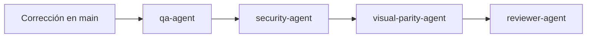

# Patrón: Flujo de revalidación post-merge multi-repo

## Contexto

Workflows que modifican repos productivos (frontend + backend) y mergean a `main` antes de Validation completa. Aplica cuando correcciones iterativas (lint, IAM, rate limit) requieren re-ejecución de validadores contra el estado mergeado.

## Solución

Secuencia validada tras merge a `main`:

1. **qa-agent** — `npm run build` + `npm run lint` en repos productivos; documentar commits evaluados.
2. **security-agent** — Revalidar IAM, CORS, rate limiting y política anti-mock contra `main`.
3. **visual-parity-agent** — Comparación pixel-a-pixel contra referencia Lovable; publicar `visual-parity-result.json` y `gaps-paridad.json`.
4. **reviewer-agent** — Solo tras `visual_exact_parity` PASS.

Documentar en cada informe: commit SHA evaluado, rama y timestamp de revalidación.

## Ejemplo

Corrida novus-intelligence (2026-07-14):
- QA-001 (lint) corregido en `main` @ `eead55f` → qa-agent PASS.
- SEC-001/SEC-002 corregidos en `main` @ `d851201` → security-agent PASS condicional DEV.
- Paridad visual FAIL (0/12) → reviewer-agent bloqueado.
- Evidencia: `artifacts/reflexion-ejecucion.md`, `artifacts/metricas-ejecucion.json`.

## Proyectos donde se usa

- novus-intelligence

## Metadatos

| Campo | Valor |
|-------|-------|
| IDs reflexión | KB-002, PAT-004 |
| Workflow origen | novus-intelligence-lovable-to-web |
| Reusabilidad | high |
| Fecha | 2026-07-14 |
