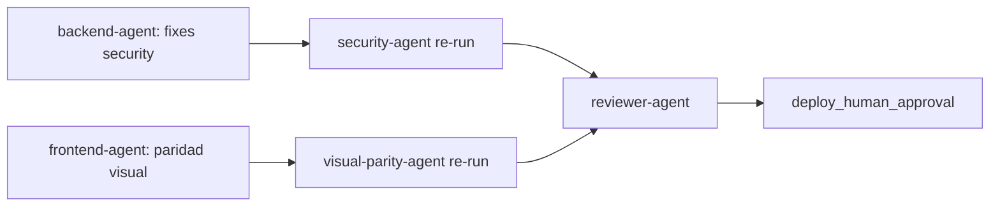

# Patrón: Flujo revalidación post-merge multi-repo

## Contexto

Workflows NADF que modifican múltiples repos productivos (WEB + Back) y mergean a `main` antes de validación completa requieren una secuencia de revalidación documentada. Fixes parciales no garantizan desbloqueo del workflow.

## Solución

### Secuencia de desbloqueo (orden estricto)

| Orden | Agente | Acción |
|-------|--------|--------|
| 1 | backend-agent | Corregir hallazgos security (CORS, IAM, etc.) |
| 2 | security-agent | Re-ejecutar revisión en `main` |
| 3 | frontend-integration-agent | Remediar gaps paridad visual |
| 4 | visual-parity-agent | Ejecutar checker 12 capturas |
| 5 | devops-agent | Completar artefactos omitidos (p. ej. `pipeline-config.md`) |
| 6 | reviewer-agent | Revisión de coherencia y diff |
| 7 | knowledge-base-agent | Consolidar aprendizaje |
| 8 | adr-agent | Evaluar decisiones pendientes |

### Lecciones de novus-intelligence

- Corregir SEC-001/002 **no garantizó** `security_pass` — SEC-CORS-001 apareció en revalidación.
- QA PASS (100) **no desbloqueó** reviewer — security y paridad visual son gates independientes.
- `qualityScore` puede **bajar** tras detectar nuevos bloqueantes (62 → 58).

### Regla operativa

**Nunca asumir PASS por fixes parciales sin revalidación completa de todos los gates bloqueantes.**

## Ejemplo

- Workflow: `novus-intelligence-lovable-to-web`
- Repos mergeados: WEB @ `cdd9f95`, Back @ `bf3bd2b`
- Estado: blocked (SEC-CORS-001, VP-001)

## Proyectos donde se usa

- novus-intelligence

## Referencias

- Recomendación: KB-010 en `artifacts/recomendaciones-kb.json`
- Patrón exitoso: PAT-004 en `artifacts/recomendaciones-kb.json`
- Mejora workflow: WF-004 en `artifacts/recomendaciones-kb.json`
