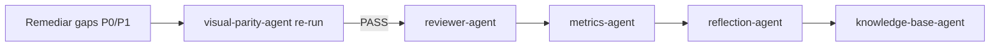

# Patrón: Flujo remediate_frontend_then_recheck

## Contexto

Gate `visual_exact_parity` en FAIL con gaps documentados en `gaps-paridad.json`. Sub-patrón reutilizable para remediación frontend y re-ejecución de la cadena de validación sin reiniciar el workflow completo.

## Solución

Secuencia obligatoria tras FAIL de paridad visual:

| Orden | Agente | Acción |
|-------|--------|--------|
| 1 | frontend-integration-agent | Corregir gaps en `gaps-paridad.json` (prioridad P0 primero) |
| 2 | visual-parity-agent | Re-ejecutar `npm run visual-parity-check` |
| 3 | — | Gate PASS obligatorio: `maxDiffRatio ≤ 0.002` por captura |
| 4 | reviewer-agent | Revisión de coherencia y diff (solo tras paridad PASS) |
| 5 | metrics-agent | Actualizar `metricas-ejecucion.json` |
| 6 | reflection-agent | Reflexión de cierre si workflow desbloqueado |
| 7 | knowledge-base-agent | Consolidar aprendizajes visuales en KB global |

Documentar gaps remediados en `gaps-paridad.json` con campo `status: remediated` y fecha.

## Ejemplo

Corrida novus-intelligence bloqueada por VP-001 (0/12 capturas PASS):
- Gaps P0: logo (GAP-P0-001), tema contacto (GAP-P0-002), testimonios (GAP-P0-003), secciones landing (GAP-P0-004).
- Evidencia: `artifacts/gaps-paridad.json`, `artifacts/reflexion-ejecucion.md`.

## Proyectos donde se usa

- novus-intelligence

## Referencias

- ADR-0006
- `.nadf/global/workflow-library/lovable-to-web.yml`

## Metadatos

| Campo | Valor |
|-------|-------|
| IDs reflexión | KB-010 |
| Workflow origen | novus-intelligence-lovable-to-web |
| Reusabilidad | high |
| Fecha | 2026-07-15 |
