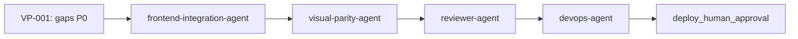

# Patrón: Flujo post-remediación visual

## Contexto

Workflow `lovable-to-web` bloqueado por gate `visual_exact_parity` FAIL (p. ej. VP-001). QA y Security pueden estar en PASS mientras paridad visual impide reviewer-agent, devops-agent y deploy DEV.

## Solución

### Secuencia de desbloqueo

| Orden | Agente | Acción |
|-------|--------|--------|
| 1 | frontend-integration-agent | Remediar gaps P0→P1 según `gaps-paridad.json` (tokens, tipografía, hero móvil, contacto, header) |
| 2 | visual-parity-agent | Re-ejecutar checker 12 capturas; confirmar `maxDiffRatio ≤ 0.002` |
| 3 | reviewer-agent | Revisión coherencia y `no_lovable_code_copy` — solo tras PASS visual |
| 4 | devops-agent | Completar `pipeline-config.md` (DEVOPS-001) |
| 5 | cloud-agent / devops-agent | Deploy DEV solo con `deploy_human_approval` explícita |

### Reglas

- No avanzar a reviewer-agent con `visual_exact_parity` FAIL.
- Actualizar reflexión y KB tras PASS visual (knowledge-base-agent).
- E2E contacto post-deploy queda bloqueado por `NO_DEPLOY` hasta aprobación humana.

## Ejemplo

Corrida **novus-intelligence-lovable-to-web** (2026-07-15):
- QA PASS (100), Security PASS (88); único bloqueante: 0/12 capturas visuales.
- `reviewer-agent` correctamente bloqueado; secuencia documentada en `reflexion-ejecucion.md`.
- Evidencia: `artifacts/metricas-ejecucion.json`, `artifacts/recomendaciones-kb.json`.

## Proyectos donde se usa

- novus-intelligence

## Referencias

- ADR-0006
- `architecture-patterns/visual-parity-pre-merge-checklist.md`
- `common-errors/VP-GAP-HERO-MOBILE.md`

## Metadatos

| Campo | Valor |
|-------|-------|
| IDs reflexión | PAT-007, KB-013 |
| Workflow origen | novus-intelligence-lovable-to-web |
| Reusabilidad | high |
| Fecha | 2026-07-15 |
