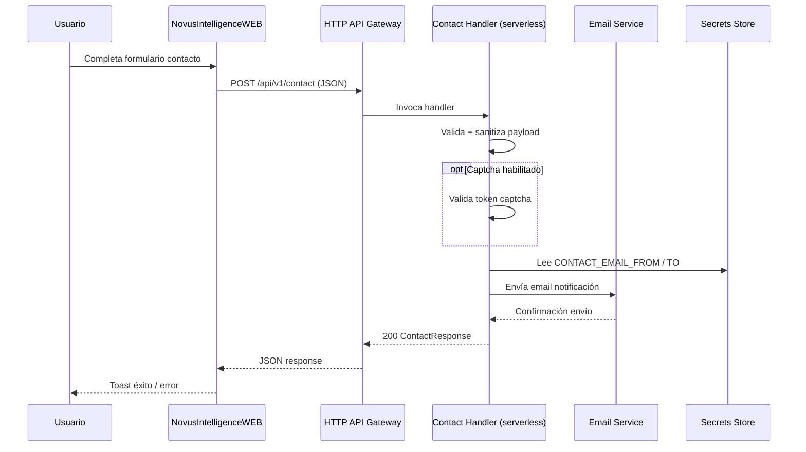

# Especificación Backend — Novus Intelligence Solutions

**Proyecto:** novus-intelligence  
**Workflow:** novus-intelligence-lovable-to-web  
**Paso:** paso-05-evaluar-backend  
**Agente:** backend-impact-agent  
**Fecha:** 2026-07-16  
**Estado:** Especificación de planificación (sin código)  
**Repositorio destino:** NovusIntelligenceBack  
**Target environment:** DEV — AWS `sa-east-1`  
**Condición:** Generado porque `evaluacion-backend.md` → `requires_backend: true`

---

## Resumen

Esta especificación define el contrato, validaciones, integraciones y requisitos de infraestructura para el **único endpoint backend** del alcance actual: recepción del formulario de contacto y notificación por email.

**No incluye código.** La implementación corresponde a `backend-agent`; el despliegue a `cloud-agent` / `devops-agent` con aprobación humana.

---

## Alcance

| Incluido | Excluido |
|----------|----------|
| `POST /api/v1/contact` | CRUD de contenido / CMS |
| Validación y sanitización server-side | Persistencia en base de datos |
| Envío de email de notificación | Autenticación / autorización de usuarios |
| Rate limiting básico | Almacenamiento de archivos adjuntos |
| CORS para orígenes frontend | MultiAgentDemo (frontend only) |
| Preparación validación captcha | Webhook CRM (opcional post-MVP) |
| Observabilidad (logs, alarmas) | Despliegue (prohibido en este paso) |

---

## Arquitectura lógica



---

## Endpoint

### POST /api/v1/contact

| Atributo | Valor |
|----------|-------|
| Método | `POST` |
| Ruta | `/api/v1/contact` |
| Content-Type | `application/json` |
| Autenticación | Ninguna (endpoint público con rate limit) |
| Handler lógico | `novus-contact-handler` |
| Timeout | 10 segundos |
| Idempotencia | No requerida (cada submit genera nuevo `requestId`) |

#### Propósito

Recibir datos del formulario de contacto corporativo, validarlos en servidor, enviar email de notificación al equipo comercial y retornar confirmación estructurada al frontend.

#### Referencia de intención (no código productivo)

- Contrato Lovable: `novus-nexus` → `contact-api.contract.ts`, `reglasInfra/backend-endpoints.yml`
- Traducir intención al stack NovusIntelligenceBack; **prohibida copia directa** de código Lovable

---

## Contrato de request — `ContactRequest`

```json
{
  "name": "string",
  "company": "string",
  "email": "string",
  "phone": "string",
  "message": "string",
  "solutionInterest": "string",
  "captchaToken": "string"
}
```

| Campo | Tipo | Requerido | Restricciones |
|-------|------|-----------|---------------|
| `name` | string | **Sí** | Longitud 2–120; trim; sin caracteres de control |
| `company` | string | No | Máx. 160 caracteres |
| `email` | string | **Sí** | Formato email RFC 5322 simplificado; máx. 254 |
| `phone` | string | No | Máx. 40; permitir `+`, dígitos, espacios, guiones |
| `message` | string | **Sí** | Longitud 5–4000; trim |
| `solutionInterest` | enum string | No | Valores: `ai-agents`, `automation`, `integrations`, `analytics`, `documents-ai`, `customer-ai` |
| `captchaToken` | string | Condicional | Obligatorio cuando `CAPTCHA_ENABLED=true` |

### Ejemplo válido

```json
{
  "name": "María García",
  "company": "Acme Corp",
  "email": "maria@acme.com",
  "phone": "+57 300 123 4567",
  "message": "Quiero conocer más sobre agentes de IA para mi empresa.",
  "solutionInterest": "ai-agents"
}
```

---

## Contrato de response — `ContactResponse`

### Éxito (200)

```json
{
  "ok": true,
  "requestId": "550e8400-e29b-41d4-a716-446655440000",
  "message": "Mensaje recibido. Nos pondremos en contacto pronto."
}
```

| Campo | Tipo | Descripción |
|-------|------|-------------|
| `ok` | boolean | Siempre `true` en 200 |
| `requestId` | string | UUID v4 o identificador único de correlación (nunca prefijo `demo-`) |
| `message` | string | Mensaje amigable para el usuario |

### Error de validación (400)

```json
{
  "ok": false,
  "requestId": "550e8400-e29b-41d4-a716-446655440001",
  "message": "El campo email no tiene un formato válido.",
  "errors": [
    { "field": "email", "code": "invalid_format", "message": "Formato de email inválido" }
  ]
}
```

### Rate limit (429)

```json
{
  "ok": false,
  "requestId": "550e8400-e29b-41d4-a716-446655440002",
  "message": "Demasiadas solicitudes. Intente nuevamente en unos minutos."
}
```

### Error interno (500)

```json
{
  "ok": false,
  "requestId": "550e8400-e29b-41d4-a716-446655440003",
  "message": "No pudimos procesar su mensaje. Intente más tarde."
}
```

> **R-001:** En ningún caso de error o éxito simulado se debe retornar `requestId` con prefijo `demo-` en entornos desplegados.

---

## Códigos HTTP

| Código | Condición | Body |
|--------|-----------|------|
| 200 | Validación OK + email enviado | `ContactResponse` con `ok: true` |
| 400 | Campos inválidos o captcha inválido | `ContactResponse` con `errors[]` |
| 429 | Rate limit excedido | `ContactResponse` sin detalle interno |
| 500 | Fallo email, error interno, secrets no disponibles | `ContactResponse` genérico |
| 405 | Método distinto a POST | Mensaje estándar |

---

## Validaciones server-side (obligatorias)

| # | Validación | Comportamiento si falla |
|---|------------|-------------------------|
| V1 | `name` presente y 2–120 chars | 400, campo `name` |
| V2 | `email` presente y formato válido | 400, campo `email` |
| V3 | `message` presente y 5–4000 chars | 400, campo `message` |
| V4 | `company` ≤ 160 chars si presente | 400, campo `company` |
| V5 | `phone` ≤ 40 chars si presente | 400, campo `phone` |
| V6 | `solutionInterest` en enum si presente | 400, campo `solutionInterest` |
| V7 | Sanitización HTML/script en todos los strings | Strip tags; escape en email body |
| V8 | Content-Type `application/json` | 400 si ausente o inválido |
| V9 | Body JSON parseable | 400 con mensaje genérico |
| V10 | Captcha token válido (si `CAPTCHA_ENABLED`) | 400, campo `captchaToken` |

### Sanitización

- Eliminar tags HTML y scripts de campos de texto.
- Normalizar espacios en blanco (trim).
- No reflejar input sin sanitizar en logs ni en email.
- No incluir stack traces ni detalles internos en respuestas al cliente.

---

## Integración email

| Parámetro | Fuente | Descripción |
|-----------|--------|-------------|
| `CONTACT_EMAIL_FROM` | Secrets / SSM | Dirección remitente verificada en servicio email |
| `CONTACT_EMAIL_TO` | Secrets / SSM | Destinatario notificaciones comerciales |

### Contenido del email

| Sección | Contenido |
|---------|-----------|
| Asunto | `[Novus Intelligence] Nuevo contacto — {name}` |
| Cuerpo | name, company, email, phone, solutionInterest, message, requestId, timestamp UTC |
| Formato | HTML + texto plano (multipart) |

### Comportamiento ante fallo

- Si el servicio email falla → respuesta **500** al cliente.
- Log estructurado con `requestId`, sin datos sensibles completos.
- No reintentos automáticos visibles al usuario en MVP.

### Binding inicial DEV

| Capacidad | Proveedor actual | Región |
|-----------|------------------|--------|
| Email transaccional | AWS SES | `sa-east-1` |
| Alternativa futura | SendGrid, Mailgun, etc. | Configurable |

---

## Captcha (preparación — R-008)

| Variable | Valor por defecto DEV | Descripción |
|----------|----------------------|-------------|
| `CAPTCHA_ENABLED` | `false` | Habilitar validación pre-prod |
| `CAPTCHA_PROVIDER` | `turnstile` o `hcaptcha` | Proveedor seleccionado |
| `CAPTCHA_SECRET` | Secrets / SSM | Secret de verificación server-side |

**Comportamiento:**

- Si `CAPTCHA_ENABLED=false`: `captchaToken` ignorado.
- Si `CAPTCHA_ENABLED=true`: `captchaToken` obligatorio; verificar contra API del proveedor antes de enviar email.
- Obligatorio antes de producción (security-agent TASK-SEC-003).

---

## Rate limiting

| Parámetro | Valor sugerido DEV | Notas |
|-----------|-------------------|-------|
| Límite por IP | 10 requests / 5 minutos | Ajustable vía variable |
| Respuesta | 429 con `ContactResponse` | Sin revelar umbral exacto al cliente |
| Implementación | API Gateway throttling o WAF | cloud-agent define en IaC |

Variable sugerida: `RATE_LIMIT_PER_IP` (requests por ventana).

---

## CORS

| Origen permitido (DEV) | Métodos | Headers |
|------------------------|---------|---------|
| `https://dev.novusintelligence.com` | POST, OPTIONS | `Content-Type` |
| `http://localhost:5173` (solo dev local) | POST, OPTIONS | `Content-Type` |

- Preflight `OPTIONS` debe responder 200.
- No usar `*` en producción.
- Orígenes adicionales vía variable `CORS_ALLOWED_ORIGINS` (lista separada por coma).

---

## Webhook CRM (opcional — post-MVP)

| Variable | Descripción |
|----------|-------------|
| `CRM_WEBHOOK_URL` | URL HTTPS para POST asíncrono tras envío exitoso |

**Comportamiento si configurado:**

1. Tras email enviado con éxito, POST JSON con payload sanitizado a webhook.
2. Timeout webhook: 3s; fallo no afecta respuesta 200 al usuario.
3. Log de fallo webhook con `requestId`.

**Decisión MVP:** No bloqueante. TASK-BE-005 es opcional.

---

## Variables de entorno y secrets

> Solo nombres documentados. **Valores en AWS Secrets Manager / SSM; nunca en repositorio.**

| Nombre | Tipo | Obligatorio | Uso |
|--------|------|-------------|-----|
| `NODE_ENV` | Config | Sí | `development` / `production` |
| `CONTACT_EMAIL_FROM` | Secreto | Sí | Remitente email |
| `CONTACT_EMAIL_TO` | Secreto | Sí | Destinatario notificaciones |
| `CORS_ALLOWED_ORIGINS` | Config | Sí | Orígenes CORS permitidos |
| `RATE_LIMIT_PER_IP` | Config | No | Umbral rate limit |
| `CAPTCHA_ENABLED` | Config | No | Activar validación captcha |
| `CAPTCHA_PROVIDER` | Config | Condicional | Proveedor captcha |
| `CAPTCHA_SECRET` | Secreto | Condicional | Secret verificación captcha |
| `CRM_WEBHOOK_URL` | Secreto | No | Webhook CRM opcional |
| `LOG_LEVEL` | Config | No | `info` por defecto |

### Variables frontend (referencia cruzada)

| Nombre | Valor DEV | Uso |
|--------|-----------|-----|
| `VITE_NOVUS_API_URL` | `https://api-dev.novusintelligence.com` | Base URL para `submitContact()` |
| `VITE_DEMO_MODE` | `false` | **Obligatorio false** en builds desplegados (R-001) |

---

## Permisos y capacidades IAM (lógicas)

| Capacidad | Acción | Recurso |
|-----------|--------|---------|
| Email send | `send_email` | Identidad remitente verificada |
| Logs | `create_log_stream`, `put_log_events` | Grupo de logs del handler |
| Secrets read | `get_secret_value` | Parámetros CONTACT_* y CAPTCHA_SECRET |

**Principio de mínimo privilegio:** El rol del handler solo accede a los secrets y servicios listados.

---

## Observabilidad

| Elemento | Especificación |
|----------|----------------|
| Logs | JSON estructurado: `requestId`, `timestamp`, `status`, `durationMs`, `clientIp` (hash opcional) |
| Métricas | Invocaciones, errores, latencia p95, throttles 429 |
| Alarmas | Lambda errors > 0 en 5 min; API 5xx > umbral |
| Trazabilidad | `requestId` correlaciona frontend ↔ backend ↔ email |

---

## Componentes de despliegue (referencia para cloud-agent)

| Componente lógico | Binding AWS DEV | Nombre sugerido |
|-------------------|-----------------|-----------------|
| HTTP API | API Gateway (REST o HTTP API) | `novus-intelligence-api-dev` |
| Serverless function | Lambda Node.js 20.x | `novus-contact-handler` |
| Email | SES | Dominio verificado `novusintelligence.com` |
| Secrets | Secrets Manager / SSM | Prefijo `/novus-intelligence/dev/` |
| Observabilidad | CloudWatch | Log group `/aws/lambda/novus-contact-handler` |
| IaC | Serverless Framework | Stack `novus-intelligence-back-dev` |

**Región:** `sa-east-1` (`environments/dev.yml` alineado).

**Despliegue:** Solo con aprobación humana explícita (`deploy_human_approval`).

---

## OpenAPI (resumen)

```yaml
openapi: 3.0.3
info:
  title: Novus Intelligence Contact API
  version: 1.0.0
paths:
  /api/v1/contact:
    post:
      summary: Enviar formulario de contacto
      operationId: submitContact
      requestBody:
        required: true
        content:
          application/json:
            schema:
              $ref: '#/components/schemas/ContactRequest'
      responses:
        '200':
          description: Mensaje recibido
          content:
            application/json:
              schema:
                $ref: '#/components/schemas/ContactResponse'
        '400':
          description: Validación fallida
        '429':
          description: Rate limit excedido
        '500':
          description: Error interno
components:
  schemas:
    ContactRequest:
      type: object
      required: [name, email, message]
      properties:
        name: { type: string, minLength: 2, maxLength: 120 }
        company: { type: string, maxLength: 160 }
        email: { type: string, format: email }
        phone: { type: string, maxLength: 40 }
        message: { type: string, minLength: 5, maxLength: 4000 }
        solutionInterest:
          type: string
          enum: [ai-agents, automation, integrations, analytics, documents-ai, customer-ai]
        captchaToken: { type: string }
    ContactResponse:
      type: object
      required: [ok, requestId, message]
      properties:
        ok: { type: boolean }
        requestId: { type: string }
        message: { type: string }
        errors:
          type: array
          items:
            type: object
            properties:
              field: { type: string }
              code: { type: string }
              message: { type: string }
```

---

## Criterios de aceptación (backend-agent)

| ID | Criterio | Verificación |
|----|----------|--------------|
| AC-01 | POST válido retorna 200 con `ok: true` y `requestId` UUID | Test integración DEV |
| AC-02 | Campos inválidos retornan 400 con `errors[]` | Unit + integración |
| AC-03 | Rate limit retorna 429 | Test con burst requests |
| AC-04 | Email enviado a `CONTACT_EMAIL_TO` | Bandeja DEV |
| AC-05 | CORS preflight exitoso desde frontend DEV | Browser / curl |
| AC-06 | Sin secrets en código versionado | security-agent |
| AC-07 | Sin respuestas `demo-*` en entornos desplegados | qa-agent (R-001) |
| AC-08 | Logs contienen `requestId` en cada invocación | CloudWatch |
| AC-09 | Captcha rechaza token inválido cuando habilitado | Test con CAPTCHA_ENABLED=true |

---

## Tareas ejecutor vinculadas

| Tarea | Agente | Dependencia de esta especificación |
|-------|--------|--------------------------------------|
| TASK-BE-001 | backend-agent | Lambda handler |
| TASK-BE-002 | backend-agent | API Gateway |
| TASK-BE-003 | backend-agent | Integración email |
| TASK-BE-004 | backend-agent | Observabilidad |
| TASK-BE-005 | backend-agent | Webhook CRM (opcional) |
| TASK-BE-008 | backend-agent | Captcha |
| TASK-INFRA-002 | cloud-agent | IaC API + Lambda + SES |
| TASK-INFRA-005 | cloud-agent | Secrets |

---

## Restricciones NADF

| Constraint | Cumplimiento |
|------------|--------------|
| `NO_PRODUCTIVE_CODE` | Solo especificación; sin código en repos |
| `NO_LOVABLE_CODE_COPY` | Contrato derivado de intención, no copia |
| `NO_DEPLOY` | Infra descrita, no desplegada |
| `NO_SECRETS_IN_REPO` | Solo nombres de variables |
| `NO_CONTACT_DEMO_MOCK_IN_PROD` | R-001 documentado en contrato de error |
| Provider independence | Capacidades genéricas + binding AWS como inicial |

---

## Próximo agente

**architect-agent** (paso 6) — Plan Review completado (`approved`). Siguiente ejecución: **backend-agent** (Fase 5) y **cloud-agent** (Fase 7) según esta especificación.

---

## Historial

| Fecha | Acción | Agente |
|-------|--------|--------|
| 2026-07-14 | Especificación backend generada (primera ejecución) | backend-impact-agent |
| 2026-07-16 | Revalidación paso-05; coherencia con plan `approved` | backend-impact-agent |
