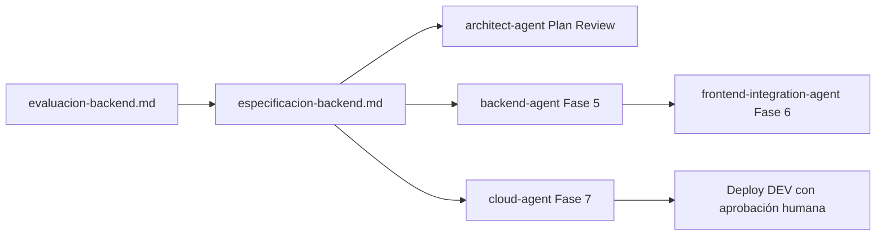

# Evaluación Backend — Novus Intelligence Solutions

**Proyecto:** novus-intelligence  
**Workflow:** novus-intelligence-lovable-to-web  
**Paso:** paso-05-evaluar-backend  
**Agente:** backend-impact-agent  
**Fecha:** 2026-07-14  
**Runtime:** Cursor Cloud Agent (adaptador M6 cursor-cloud)  
**Target environment:** DEV — AWS `sa-east-1`  
**Baseline Lovable:** novus-nexus @ `e3a9819`  
**Plan referenciado:** PLAN-NOVUS-LOVABLE-2026-07-14 (`approved` — architect-agent 2026-07-14)

---

## Flags de evaluación

```yaml
requires_backend: true
requires_database: false
requires_storage: false
requires_email: true
requires_infra: true
```

| Flag | Valor | Justificación breve |
|------|-------|---------------------|
| `requires_backend` | **true** | Formulario de contacto (CHG-008, CHG-011) requiere API real `POST /api/v1/contact` |
| `requires_database` | **false** | Sin persistencia de datos; flujo stateless email + webhook opcional |
| `requires_storage` | **false** | Sin almacenamiento de objetos/archivos en backend; assets son hosting frontend (infra) |
| `requires_email` | **true** | Notificación de contacto vía servicio de email transaccional |
| `requires_infra` | **true** | Despliegue de API serverless, email, observabilidad y secrets en DEV |

---

## Resumen ejecutivo

El snapshot Lovable (13 cambios) **requiere backend** únicamente para el formulario de contacto. El resto del sitio — incluido `MultiAgentDemo`, contenido estático, routing y páginas legales — es **100 % frontend** sin dependencias de API.

La evaluación confirma el plan del planner-agent (`requires_backend: true`, `requires_database: false`, `requires_infra: true`) y alinea con el riesgo **R-001**: el frontend productivo **no debe** replicar el fallback demo de Lovable; la API debe existir antes de habilitar el formulario en entornos no locales.

**Complejidad estimada:** Baja–Media (un endpoint, sin BD, integración email).

---

## Fuentes analizadas

| Artefacto | Uso en evaluación |
|-----------|-------------------|
| `cambios-lovable.json` | Clasificación `requiresBackend` por cambio |
| `backend-impact.md` | Contrato OpenAPI y variables detectadas |
| `frontend-impact.md` | Dependencia contacto → API |
| `riesgos.md` | Mitigación R-001 (no demo) y R-008 (captcha) |
| `plan-implementacion.md` | Fases 5–7 y constraints DEV sa-east-1 |
| `tareas-ejecutor.json` | Tareas TASK-BE-* y TASK-INFRA-* |
| `backend-impact-rules.md` | Alcance Fase 1 y convenciones API |
| `environments/dev.yml` | Capacidades email, API, secrets (reconciliar región) |

---

## Evaluación por cambio funcional

| ID | Componente | Tipo | `requiresBackend` (analyzer) | Evaluación backend-impact | Servicios necesarios |
|----|------------|------|-------------------------------|---------------------------|----------------------|
| CHG-001 | site-architecture | structural | false | **No** | — |
| CHG-002 | design-system | visual | false | **No** | — |
| CHG-003 | layout-Header-Footer | visual | false | **No** | — |
| CHG-004 | Hero | visual | false | **No** | — |
| CHG-005 | content-modules | content | false | **No** | — |
| CHG-006 | sections-landing | visual | false | **No** | — |
| CHG-007 | solutions-detail | functional | false | **No** | — |
| CHG-008 | contact-form | functional | **true** | **Sí** | API + email |
| CHG-009 | MultiAgentDemo | functional | false | **No** | — |
| CHG-010 | routing-stack | structural | false | **No** | — |
| CHG-011 | api-contract | structural | **true** | **Sí** | API + email + infra |
| CHG-012 | legal-pages | content | false | **No** | — |
| CHG-013 | assets-brand | visual | false | **No** (infra hosting) | — |

**Cambios que disparan backend:** 2 de 13 (CHG-008, CHG-011).

---

## Capacidades requeridas (provider-agnostic)

| Capacidad | Requerida | Binding inicial DEV (AWS) | Alternativa futura |
|-----------|-----------|---------------------------|-------------------|
| Serverless compute | Sí | Lambda (Node.js 20) | Azure Functions, Cloud Functions |
| HTTP API | Sí | API Gateway | Azure API Management, Cloud Endpoints |
| Email transaccional | Sí | SES | SendGrid, Mailgun, Azure Communication |
| Secrets management | Sí | Secrets Manager / SSM | Vault, Key Vault, Secret Manager |
| Observabilidad | Sí | CloudWatch | Azure Monitor, Cloud Logging |
| NoSQL database | No | — | — |
| Object storage (backend) | No | — | — |

> **Independencia de proveedor:** La especificación define contratos REST y capacidades, no SDKs ni features propietarias. AWS `sa-east-1` es el binding operativo DEV de esta ejecución; no implica acoplamiento permanente.

---

## Alineación con riesgo R-001 (contacto sin demo)

| Requisito R-001 | Decisión evaluación | Responsable downstream |
|-----------------|---------------------|------------------------|
| No replicar fallback demo de Lovable | API obligatoria para submit productivo | frontend-integration-agent |
| `VITE_DEMO_MODE=false` en builds no locales | Documentado en especificación y plan | devops-agent |
| Submit sin API → error explícito, nunca éxito simulado | Contrato de error 503/500 definido | frontend + qa-agent |
| Backend antes de habilitar formulario en DEV/prod | Fase 5 bloquea Fase 6 | backend-agent, cloud-agent |

**Prohibición explícita:** Ningún `requestId` con prefijo `demo-` en respuestas de entornos desplegados.

---

## Base de datos

**No requerida.**

| Criterio | Evaluación |
|----------|------------|
| Persistencia de mensajes de contacto | No en MVP; email es canal de entrega |
| CMS / blog | Fuera de alcance (futuro: API + DB) |
| Autenticación | Fuera de alcance (futuro: API + identity provider) |
| Auditoría | Logs estructurados en observabilidad; sin tabla dedicada |

El `database-agent` (paso 9) **no aplica** en esta iteración.

---

## Almacenamiento (storage)

**No requerido a nivel backend.**

| Recurso | Capa | Notas |
|---------|------|-------|
| Assets de marca (`logo.jpeg`, `brand-publicidad.png`) | Frontend / CDN | TASK-INFRA-004; no implica endpoint backend |
| Adjuntos en formulario contacto | — | No contemplados en contrato Lovable |
| Almacenamiento de emails enviados | — | No requerido en MVP |

---

## Email

**Requerido.**

| Aspecto | Especificación |
|---------|----------------|
| Propósito | Notificar al equipo comercial cada envío de formulario |
| Trigger | POST exitoso a `/api/v1/contact` tras validación |
| Remitente | Variable `CONTACT_EMAIL_FROM` (DEV: `noreply-dev@novusintelligence.com`) |
| Destinatario | Variable `CONTACT_EMAIL_TO` (valor en Secrets/SSM, no en repo) |
| Formato | Email HTML/texto con campos del formulario sanitizados |
| Fallo de envío | Respuesta 500 al cliente; log estructurado con `requestId` |

---

## Infraestructura

**Requerida** para desplegar y operar la API de contacto en DEV.

| Recurso | Prioridad | Región objetivo |
|---------|-----------|-----------------|
| API Gateway (ruta `/api/v1/contact`) | Alta | `sa-east-1` |
| Lambda `novus-contact-handler` | Alta | `sa-east-1` |
| Servicio email (SES) | Alta | `sa-east-1` |
| Secrets Manager / SSM | Alta | `sa-east-1` |
| CloudWatch (logs + alarmas) | Media | `sa-east-1` |
| Rate limiting (API Gateway o WAF) | Media | `sa-east-1` |

### Nota de reconciliación regional

- `environments/dev.yml` declara `region: sa-east-1` (alineado con **TARGET_DEV_REGION_SA_EAST_1**).
- **Acción downstream:** `cloud-agent` debe verificar que stacks Serverless e IaC en NovusIntelligenceBack usen la misma región antes del despliegue DEV.

### URLs DEV objetivo

| Servicio | URL |
|----------|-----|
| API | `https://api-dev.novusintelligence.com` |
| Frontend (CORS permitido) | `https://dev.novusintelligence.com` |

---

## Decisiones de alcance MVP

| Tema | Decisión | Fase |
|------|----------|------|
| CRM webhook (`CRM_WEBHOOK_URL`) | **Opcional** — fuera de MVP bloqueante; no impide contacto | Post-MVP / TASK-BE-005 |
| Captcha (hCaptcha/Turnstile) | **Preparación en API**; obligatorio pre-prod (R-008) | TASK-BE-008 |
| Persistencia en BD | **Excluido** | — |
| MultiAgentDemo | **Sin backend** | Frontend only |

---

## Estimación de complejidad

| Dimensión | Nivel | Detalle |
|-----------|-------|---------|
| Endpoints nuevos | 1 | `POST /api/v1/contact` |
| Integraciones externas | 1–2 | Email (+ webhook CRM opcional) |
| Modelo de datos | Ninguno | Request/response JSON stateless |
| Seguridad | Media | Validación, sanitización, CORS, rate limit, captcha prep |
| Infra IaC | Media | Lambda + API + SES + secrets + alarmas |
| **Global** | **Baja–Media** | Alcance acotado; sin BD ni storage backend |

---

## Dependencias y secuencia



1. **architect-agent** (paso 6) valida coherencia con `plan-implementacion.md`.
2. **backend-agent** implementa según `especificacion-backend.md` tras plan `approved`.
3. **cloud-agent** propone IaC en `sa-east-1`; despliegue bloqueado sin aprobación humana.
4. **frontend-integration-agent** integra contacto solo tras API DEV disponible (mitigación R-001).

---

## Quality gates aplicables

| Gate | Cumplimiento esperado |
|------|----------------------|
| `no_mock_data_in_production` | API real; sin demo en prod |
| `no_secrets_in_repo` | Solo nombres de variables documentados |
| `deploy_human_approval` | Infra propuesta, no desplegada por este agente |
| `plan_approved` | Requerido antes de Execution |

---

## Handoff

| Paso | Agente | Acción |
|------|--------|--------|
| 5 (completado) | backend-impact-agent | `evaluacion-backend.md` + `especificacion-backend.md` |
| 6 (completado) | architect-agent | Plan Review → `approved`; `impacto-arquitectonico.md` |
| 7+ (siguiente) | backend-agent, frontend-integration-agent, cloud-agent | Execution según plan y especificación |

---

## Referencias

- `artifacts/cambios-lovable.json`
- `artifacts/backend-impact.md`
- `artifacts/plan-implementacion.md`
- `artifacts/riesgos.md` (R-001, R-008)
- `.nadf/projects/novus-intelligence/rules/backend-impact-rules.md`
- `.nadf/global/rules/provider-independence.md`
- `.nadf/projects/novus-intelligence/environments/dev.yml`

---

## Historial

| Fecha | Acción | Agente |
|-------|--------|--------|
| 2026-07-14 | Evaluación backend generada | backend-impact-agent |
| 2026-07-14 | Revalidación paso-05; alineación plan approved y región DEV sa-east-1 | backend-impact-agent |
