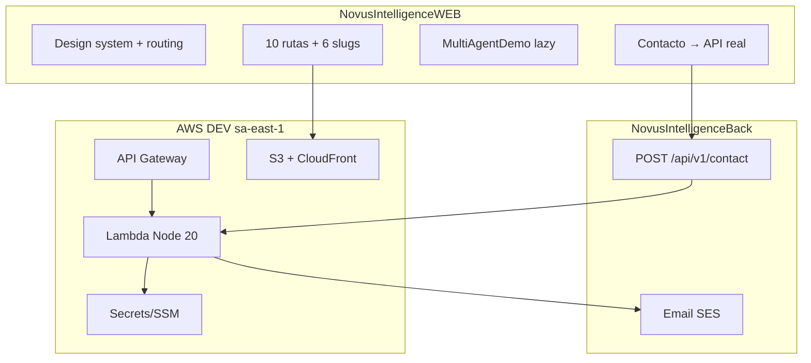

# Impacto Arquitectónico — Novus Intelligence Solutions

**Proyecto:** novus-intelligence  
**Workflow:** novus-intelligence-lovable-to-web  
**Paso:** paso-03-validar-arquitectura  
**Agente:** architect-agent  
**Fecha:** 2026-07-14  
**Runtime:** Cursor Cloud Agent (M6)  
**Target environment:** DEV — AWS `sa-east-1`  
**Plan evaluado:** PLAN-NOVUS-LOVABLE-2026-07-14  
**Baseline Lovable:** novus-nexus @ `e3a9819`

---

## Resumen ejecutivo

El plan de implementación y la evaluación backend (`evaluacion-backend.md`, `especificacion-backend.md`) son **arquitectónicamente coherentes** con el stack productivo, los ADRs vigentes (ADR-0001 a ADR-0006) y el NADF Meta Model v1.0.

**Decisión:** `approved` — Execution puede proceder (frontend + backend contact API) bajo los quality gates NADF documentados, con **normalización de nombres de variables email** como tarea previa de implementación backend.

---

## Alcance de la revisión

| Artefacto | Estado | Rol en revisión |
|-----------|--------|-----------------|
| `plan-implementacion.md` | Revisado | Plan principal |
| `tareas-ejecutor.json` | Revisado | Desglose ejecutable (46 tareas) |
| `evaluacion-backend.md` | Revisado | Flags backend/infra |
| `especificacion-backend.md` | Revisado | Contrato API contacto |
| `cambios-lovable.json` | Revisado | Intención fuente (13 cambios) |
| `frontend-impact.md` | Revisado | Impacto frontend |
| `backend-impact.md` | Revisado | Contrato inicial (paso-01) |
| `riesgos.md` | Revisado | R-001 a R-010 |
| `environments/dev.yml` | Revisado | Config DEV — **región `sa-east-1` confirmada** |
| `project-context.yml` | Revisado | Stack, quality gates, target `sa-east-1` |
| `memory/technical-context.md` | Revisado | Arquitectura productiva |

---

## Hallazgos principales

### Coherencia arquitectónica (positivo)

| Área | Evaluación | Detalle |
|------|------------|---------|
| Separación capas | ✅ Conforme | Planning completado (pasos 1–5) antes de Plan Review (paso 6) |
| Frontend | ✅ Conforme | React Router v6, 10 rutas, contenido estático, MultiAgentDemo sin backend |
| Backend | ✅ Conforme | Un único endpoint `POST /api/v1/contact`; stateless; SES; sin BD |
| Infra | ✅ Conforme | Serverless + API Gateway + SES + Secrets; target `sa-east-1` |
| Lovable → productivo | ✅ Conforme | Intención traducida; prohibición explícita de copia directa |
| R-001 (sin demo) | ✅ Mitigado | Plan, especificación y tareas bloquean fallback demo en prod |
| Meta Model | ✅ Conforme | Intent → Plan → Execution → Validation → Knowledge respetado |
| Región DEV | ✅ Conforme | `environments/dev.yml` declara `region: sa-east-1` |

### Impacto por capa

| Capa | Cambios arquitectónicos | Severidad |
|------|-------------------------|-----------|
| Design Source | Ninguno en repos productivos | — |
| Frontend | Sitio corporativo completo; routing; design tokens; demo interactivo | Alta (alcance, no complejidad infra) |
| Backend | Endpoint contacto + email | Baja–Media |
| Database | No aplica | — |
| Infra | Stack serverless DEV en sa-east-1 | Media |
| Validation | Gates QA, security, reviewer, visual-parity | Estándar NADF + ADR-0006 |

### Desviaciones detectadas

| ID | Desviación | Severidad | Estado | Acción requerida |
|----|------------|-----------|--------|------------------|
| D-001 | ~~`dev.yml` declaraba `us-east-1`~~ | — | **Resuelto** | `environments/dev.yml` ya apunta a `sa-east-1` |
| D-002 | `backend-impact.md` (paso-01) cita `us-east-1` | Baja | Documental | Artefacto histórico; no bloquea Execution |
| D-003 | Nombres email: `CONTACT_SES_*` (plan, tareas) vs `CONTACT_EMAIL_*` (especificación, dev.yml) | Baja | Abierto | Normalizar en backend-agent; canónico: `CONTACT_EMAIL_FROM` / `CONTACT_EMAIL_TO` |
| D-004 | `backend-impact.md` cita URL legacy `dev-api.novusintelligencesolutions.com` | Baja | Documental | Canónica DEV: `https://api-dev.novusintelligence.com` |
| D-005 | Gate `deploy_human_approval` en plan vs auto-deploy DEV (ADR-0006) | Baja | Aclarado | DEV: auto tras gates (`visual_exact_parity` incluido); QA/prod: aprobación humana |

> **Región DEV:** No bloquea aprobación ni Execution. TASK-INFRA-001 queda satisfecha en el estado actual de `dev.yml`. Certificados ACM para CloudFront pueden permanecer en `us-east-1` (requisito AWS); compute/API/SES en `sa-east-1`.

---

## Alineación con ADRs

| ADR | Requisito | Cumplimiento | Evidencia |
|-----|-----------|--------------|-----------|
| **ADR-0001** | Separación Lovable/productivo; sin copia directa; sin mocks en prod | ✅ | Gates `no_lovable_code_copy`, `no_mock_data_in_production`; mitigación R-001 |
| **ADR-0001** | Sin despliegue autónomo a prod | ✅ | QA/prod requieren aprobación; DEV gobernado por ADR-0006 |
| **ADR-0002** | 7 capas; Planner/Executor/Validator; MCP cuando aplique | ✅ | Fases 0–9 con agentes correctos |
| **ADR-0003** | backend-impact en Planning antes de Plan Review y Execution | ✅ | `evaluacion-backend.md` y `especificacion-backend.md` en paso 5 |
| **ADR-0003** | frontend-integration solo tras plan `approved` | ✅ | Tareas FE con `blockedByPlanApproval: true` |
| **ADR-0003** | Workflow 18 pasos / 9 fases | ✅ | Secuencia plan + tareas-ejecutor alineadas |
| **ADR-0004** | Meta Model; Intent → Plan → Execution → Validation → Knowledge | ✅ | Artefactos mapeados; sin entidades ad hoc |
| **ADR-0005** | Runtime bridge M6; Planner ≠ Executor | ✅ | Esta revisión vía Cursor Cloud Agent; sin código productivo |
| **ADR-0006** | Paridad visual + auto-deploy DEV tras gates | ✅ | `visual_exact_parity` en project-context; `dev.yml` auto_after_gates |

**ADR nuevo requerido:** No. El alcance no introduce decisiones arquitectónicas fuera de ADRs aceptados.

---

## Alineación con NADF Meta Model v1.0

| Entidad Meta Model | Artefacto / estado | Conformidad |
|--------------------|-------------------|-------------|
| Intent | `cambios-lovable.json` (13 cambios) | ✅ |
| Plan | `plan-implementacion.md` (`approved`) | ✅ |
| Task | `tareas-ejecutor.json` | ✅ |
| Workflow | `novus-intelligence-lovable-to-web`, paso 6 Plan Review | ✅ |
| Execution | Fases 0–7 post-aprobación | ✅ Pendiente |
| Artifact | Conjunto en `artifacts/` | ✅ |
| Validation | Fase 9 + visual-parity-agent | ✅ Planificada |
| Quality Gate | Gates bloqueantes en plan | ✅ |
| Environment | DEV AWS `sa-east-1` | ✅ |
| Decision (ADR) | Sin conflicto con ADRs aceptados | ✅ |

**Principio «Intención antes que implementación»:** El plan traduce CHG-001 a CHG-013 como intención; prohibe copiar `styles.css`, SVG inline de MultiAgentDemo y fallback demo de contacto.

---

## Verificación de constraints y quality gates

| Verificación | Resultado | Evidencia |
|--------------|-----------|-----------|
| `no_lovable_code_copy` | ✅ Planificado | TASK-REV-001; reimplementación explícita en Fases 0–4 |
| R-001 / `no_mock_data_in_production` | ✅ Planificado | TASK-FE-021, TASK-QA-004; sin `requestId: demo-*` |
| Planning antes de Execution | ✅ Cumplido | Pasos 1–5 completados; Plan Review paso 6 |
| Meta Model | ✅ Conforme | Sin entidades nuevas; flujo Intent → Knowledge |
| `TARGET_DEV_REGION_SA_EAST_1` | ✅ Cumplido | `dev.yml`, plan y project-context alineados |
| `NO_PRODUCTIVE_CODE` | ✅ Cumplido | Solo artefactos de planificación |
| `NO_SECRETS_IN_REPO` | ✅ Planificado | TASK-INFRA-005, TASK-SEC-001 |
| `plan_approved` | ✅ **Cumplido** | Decisión de esta revisión |

---

## Riesgos residuales

| ID | Riesgo | Severidad residual | Mitigación en Execution |
|----|--------|-------------------|-------------------------|
| R-001 | Modo demo contacto | Media | backend-agent + frontend-integration-agent + qa-agent |
| R-002 | Copia código Lovable | Media | reviewer-agent; reimplementación explícita |
| R-003 | Routing TanStack → React Router | Media | TASK-FE-005; QA navegación |
| R-004 | Complejidad MultiAgentDemo | Media | Lazy-load; reduced-motion |
| R-005 | Tokens oklch | Baja | Mapeo semántico, no copia literal |
| R-006 | Contenido vs marca | Baja | Validar contra brand-context.md |
| R-008 | Sin captcha | Media (DEV); Alta (pre-prod) | TASK-BE-008; security-agent bloquea prod sin captcha |
| D-003 | Nombres variables email | Baja | Normalizar a `CONTACT_EMAIL_*` en implementación |

**Blockers para Execution:** Ninguno.  
**Blockers para despliegue DEV:** Gates de Validation (incl. `visual_exact_parity`); API contacto funcional; secrets en AWS.

---

## Coherencia plan ↔ evaluación backend

| Aspecto | Plan | Evaluación / Especificación | Veredicto |
|---------|------|----------------------------|-----------|
| `requires_backend` | true | true | ✅ |
| `requires_database` | false | false | ✅ |
| `requires_infra` | true | true | ✅ |
| Endpoint | POST /api/v1/contact | POST /api/v1/contact | ✅ |
| Email | SES | SES (sa-east-1) | ✅ |
| Captcha | Preparación; obligatorio pre-prod | CAPTCHA_ENABLED=false DEV | ✅ |
| CRM webhook | Opcional (TASK-BE-005) | Opcional post-MVP | ✅ |
| Secuencia | Fase 5 bloquea Fase 6 contacto | API antes de formulario productivo | ✅ |
| MultiAgentDemo | Sin backend | Sin backend | ✅ |

---

## Decisión arquitectónica

| Campo | Valor |
|-------|-------|
| **Decisión** | **APROBADO** |
| **plan_status** | `approved` |
| **approved_by** | architect-agent |
| **approved_at** | 2026-07-14 |
| **Condiciones** | Ver sección «Autorización de Execution» |

### Motivos de aprobación

1. El plan respeta la separación Planning / Plan Review / Execution / Validation (ADR-0002, ADR-0003).
2. La evaluación backend está completa y coherente con el alcance funcional (solo contacto).
3. Las mitigaciones de R-001 (sin demo) y R-002 (sin copia Lovable) son explícitas y verificables.
4. No se requiere base de datos ni nuevas entidades Meta Model.
5. La región DEV `sa-east-1` está reconciliada en `environments/dev.yml`.
6. ADR-0005 (runtime M6) y ADR-0006 (paridad visual + auto-deploy DEV) no entran en conflicto con el plan.

---

## Autorización de Execution

Con `plan_status: approved`, los siguientes agentes **pueden proceder** respetando gates NADF:

| Agente | Fases autorizadas | Restricciones |
|--------|-------------------|--------------|
| **frontend-integration-agent** | Fases 0–4 inmediatas; Fase 6 tras API DEV | `no_lovable_code_copy`; `no_mock_data_in_production`; sin fallback demo |
| **backend-agent** | Fase 5 (`POST /api/v1/contact`) | Seguir `especificacion-backend.md`; normalizar `CONTACT_EMAIL_*` |
| **cloud-agent** | Fase 7 (preparación IaC) | Región `sa-east-1`; sin secrets en repo |
| **devops-agent** | Fase 7 (CI/pipeline) | `VITE_DEMO_MODE=false`; `VITE_NOVUS_API_URL` documentada |
| **database-agent** | No aplica | — |

### Orden de ejecución recomendado (confirmado)

1. **Paralelo:** frontend-integration-agent (Fases 0–4) + backend-agent (Fase 5)
2. **Secuencial:** frontend-integration-agent Fase 6 (integración contacto) tras API DEV disponible
3. **Preparación:** cloud-agent + devops-agent Fase 7 (IaC, pipeline)
4. **Post-ejecución:** qa-agent, security-agent, reviewer-agent, visual-parity-agent
5. **Deploy DEV:** Automático tras gates completos (ADR-0006); QA/prod requieren aprobación humana

### Tareas previas recomendadas (no bloquean inicio de código)

- [ ] Normalizar nombres de variables email a `CONTACT_EMAIL_FROM` / `CONTACT_EMAIL_TO`
- [ ] Verificación dominio SES en sa-east-1
- [ ] Captcha habilitado antes de producción (R-008)

---

## Próximo agente sugerido

**frontend-integration-agent** — Iniciar Fase 0 (design tokens + routing) en paralelo con **backend-agent** Fase 5.

---

## Referencias

- `artifacts/plan-implementacion.md`
- `artifacts/evaluacion-backend.md`
- `artifacts/especificacion-backend.md`
- `artifacts/tareas-ejecutor.json`
- `artifacts/riesgos.md`
- `.nadf/projects/novus-intelligence/project-context.yml`
- `.nadf/projects/novus-intelligence/environments/dev.yml`
- ADR-0001, ADR-0002, ADR-0003, ADR-0004, ADR-0005, ADR-0006

---

## Historial

| Fecha | Acción | Agente |
|-------|--------|--------|
| 2026-07-14 | Plan Review inicial; decisión `approved` | architect-agent |
| 2026-07-14 | Revalidación paso-03; D-001 resuelto; ADR-0005/0006 incorporados | architect-agent |
