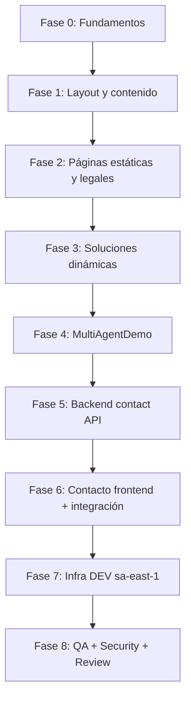

# Plan de Implementación — Novus Intelligence Solutions

**Proyecto:** novus-intelligence  
**Workflow:** novus-intelligence-lovable-to-web  
**Paso:** paso-02-generar-plan  
**Agente:** planner-agent  
**Fecha:** 2026-07-14  
**Status:** `draft`  
**Runtime:** Cursor Cloud Agent (adaptador M6 cursor-cloud)  
**Target environment:** DEV — AWS `sa-east-1`  
**Baseline Lovable:** novus-nexus @ `e3a9819`

---

## Resumen ejecutivo

Este plan traduce la intención visual y funcional del prototipo Lovable (13 cambios detectados, `backendRequired: true`) al stack productivo **NovusIntelligenceWEB** (React + TypeScript + Tailwind + React Router + Vite) y **NovusIntelligenceBack** (Serverless Framework, Node.js 20, AWS).

El alcance cubre un sitio corporativo B2B completo: design system dark-first, 10 rutas navegables, 6 slugs de soluciones, componente interactivo `MultiAgentDemo`, formulario de contacto con API real y páginas legales.

**Delta principal del commit `e3a9819`:** integración condicional de `MultiAgentDemo` en `/solutions/ai-agents`.

---

## Metadatos del plan

| Campo | Valor |
|-------|-------|
| `plan_id` | PLAN-NOVUS-LOVABLE-2026-07-14 |
| `intent_source` | cambios-lovable.json (lovable-analyzer-agent) |
| `status` | **draft** — pendiente aprobación humana / architect-agent |
| `approved_by` | — |
| `approved_at` | — |
| `requires_backend` | true |
| `requires_database` | false |
| `requires_infra` | true |
| `has_frontend_changes` | true |

---

## Restricciones y quality gates (bloqueantes)

| Gate | ID | Descripción | Verificación |
|------|----|-------------|--------------|
| Sin copia Lovable | `no_lovable_code_copy` | Reimplementar intención; prohibido JSX/CSS/utilities literales de novus-nexus | reviewer-agent + diff manual |
| Sin mocks en prod | `no_mock_data_in_production` | Sin fallback demo en contacto; sin datos simulados en rutas productivas | qa-agent + security-agent |
| Deploy con aprobación | `deploy_human_approval` | Ningún despliegue a DEV/QA/prod sin aprobación humana explícita | devops-agent / cloud-agent |
| Sin secrets en repo | `no_secrets_in_repo` | Credenciales solo en AWS Secrets Manager / SSM Parameter Store | security-agent |
| Plan aprobado | `plan_approved` | `status == approved` antes de Execution | architect-agent (paso 6) |

### Constraints adicionales de esta ejecución

- `NO_PRODUCTIVE_CODE` — Este paso solo planifica; no modifica NovusIntelligenceWEB ni NovusIntelligenceBack.
- `NO_DEPLOY` — Infraestructura se propone; despliegue queda bloqueado hasta aprobación.
- `TARGET_DEV_REGION_SA_EAST_1` — Toda propuesta cloud DEV apunta a región **sa-east-1**.

> **Nota de alineación:** `environments/dev.yml` actualmente declara `region: us-east-1`. El target operativo de esta planificación es **sa-east-1** según constraints del workflow. El **backend-impact-agent** y **cloud-agent** deben reconciliar `dev.yml` y stacks Serverless en pasos posteriores.

---

## Mapeo de cambios Lovable → plan

| ID | Componente | Tipo | Prioridad | Capa principal |
|----|------------|------|-----------|----------------|
| CHG-001 | site-architecture | structural | Alta | Frontend |
| CHG-002 | design-system | visual | Alta | Frontend |
| CHG-003 | layout-Header-Footer-PageShell | visual | Alta | Frontend |
| CHG-004 | Hero | visual | Alta | Frontend |
| CHG-005 | content-modules | content | Media | Frontend |
| CHG-006 | sections-landing | visual | Media | Frontend |
| CHG-007 | solutions-detail | functional | Alta | Frontend |
| CHG-008 | contact-form | functional | Alta | Frontend + Backend |
| CHG-009 | MultiAgentDemo | functional | Alta | Frontend |
| CHG-010 | routing-stack | structural | Alta | Frontend |
| CHG-011 | api-contract | structural | Alta | Backend + Infra |
| CHG-012 | legal-pages | content | Media | Frontend |
| CHG-013 | assets-brand | visual | Baja | Frontend + Infra (assets) |

---

## Mapeo de rutas (mitigación R-003)

Convención confirmada por `project-context.yml`: **React Router v6** en NovusIntelligenceWEB.

| Ruta Lovable (TanStack) | Ruta productiva (React Router) | Página | Meta SEO |
|-------------------------|--------------------------------|--------|----------|
| `/` | `/` | Landing | Sí |
| `/services` | `/services` | Servicios (5 pilares) | Sí |
| `/solutions` | `/solutions` | Grid soluciones | Sí |
| `/solutions/$slug` | `/solutions/:slug` | Detalle dinámico | Sí |
| `/solutions/ai-agents` | `/solutions/ai-agents` | Detalle + MultiAgentDemo | Sí |
| `/about` | `/about` | Nosotros | Sí |
| `/cases` | `/cases` | Casos de éxito | Sí |
| `/contact` | `/contact` | Formulario contacto | Sí |
| `/privacy` | `/privacy` | Política privacidad | Sí |
| `/data-treatment` | `/data-treatment` | Tratamiento datos (Ley 1581) | Sí |
| `/terms` | `/terms` | Términos y condiciones | Sí |

**Referencia de traducción:** `novus-nexus/reglasEmpalme/port-map.yml` (adaptar a React Router, no Next.js App Router).

---

## Mitigación de riesgos incorporada

| Riesgo | Severidad | Acción en plan |
|--------|-----------|----------------|
| **R-001** Modo demo contacto | Alta | Tarea explícita: eliminar fallback demo; API obligatoria; `VITE_DEMO_MODE=false` en prod; QA valida error sin API |
| **R-002** Copia código Lovable | Alta | Gate `no_lovable_code_copy`; revisión reviewer en Validation |
| **R-003** Routing TanStack → React Router | Alta | Tabla de mapeo arriba; prueba navegación 10 rutas + 6 slugs |
| **R-004** Complejidad MultiAgentDemo | Media | Componente lazy-loaded; `prefers-reduced-motion`; QA responsive |
| **R-005** Tokens oklch | Media | Mapear tokens semánticos al design system WEB |
| **R-006** Contenido vs marca | Media | Validar copy contra `memory/brand-context.md` |
| **R-008** Sin captcha | Media | Tarea pre-prod; security-agent valida |

---

## Fases de implementación y orden de ejecución

### Dependencias críticas

1. **Design tokens + routing (Fase 0)** bloquean todo el frontend.
2. **Backend `POST /api/v1/contact` (Fase 5)** bloquea habilitación productiva del formulario (CHG-008, CHG-011).
3. **MultiAgentDemo (Fase 4)** es independiente del backend; puede paralelizarse con Fase 5 tras Fase 3.
4. **Infra DEV (Fase 7)** requiere artefactos de backend-impact-agent y especificación backend; **despliegue solo con aprobación humana**.
5. **Validation (Fase 8)** requiere build exitoso y plan `approved`.

---

## Desglose por capa

### Fase 0 — Fundamentos frontend (CHG-002, CHG-010)

**Agente:** frontend-integration-agent  
**Dependencias:** plan approved, evaluacion-backend.md (paso 5)

| # | Tarea | Cambios | Criterios de aceptación |
|---|-------|---------|-------------------------|
| 0.1 | Auditar design system existente en NovusIntelligenceWEB | CHG-002 | Inventario de tokens, fuentes y componentes base documentado |
| 0.2 | Definir tokens semánticos (primary, secondary, navy-deep, surface, gradient-brand, shadow-glow) | CHG-002, R-005 | Variables en Tailwind/CSS del proyecto productivo; sin copiar `styles.css` de Lovable |
| 0.3 | Configurar tipografías Space Grotesk + Inter | CHG-002 | Headings y body renderizan correctamente; sin FOUT crítico |
| 0.4 | Implementar utilities de marca (gradientes, grid-bg, animaciones pulse/float) | CHG-002 | Utilities reutilizables; respetan `prefers-reduced-motion` |
| 0.5 | Configurar React Router con 10 rutas + lazy loading | CHG-001, CHG-010, R-003 | Todas las rutas resuelven; 404 custom para slug inválido |
| 0.6 | Configurar meta tags por ruta (Helmet o equivalente) | CHG-010 | title, description, og:image por página |

---

### Fase 1 — Layout y landing (CHG-003, CHG-004, CHG-006, CHG-013)

**Agente:** frontend-integration-agent  
**Dependencias:** Fase 0

| # | Tarea | Cambios | Criterios de aceptación |
|---|-------|---------|-------------------------|
| 1.1 | Implementar PageShell (layout wrapper + Toaster) | CHG-003 | Layout consistente en todas las rutas |
| 1.2 | Implementar Header sticky (nav 6 ítems, CTA, menú móvil) | CHG-003 | Navegación funcional mobile/desktop; indicador activo |
| 1.3 | Implementar Footer (contacto, redes, legales) | CHG-003, CHG-012 | Enlaces legales correctos |
| 1.4 | Migrar assets de marca a `public/assets/novus/` | CHG-013 | logo.jpeg y brand-publicidad.png disponibles; OG image configurada |
| 1.5 | Implementar Hero landing | CHG-004 | Badge, headline gradiente, dual CTA, stats, logo animado |
| 1.6 | Implementar secciones landing (Partners, ServicesGrid, SolutionsGrid, ImpactStats, Testimonials, CTA) | CHG-006 | 7 secciones renderizan; hover states; responsive sm/md/lg |

---

### Fase 2 — Contenido estático y páginas legales (CHG-005, CHG-012)

**Agente:** frontend-integration-agent  
**Dependencias:** Fase 1

| # | Tarea | Cambios | Criterios de aceptación |
|---|-------|---------|-------------------------|
| 2.1 | Crear módulos de contenido en `src/content/` (site, services, solutions, cases) | CHG-005, R-006 | Datos alineados con brand-context; sin placeholders |
| 2.2 | Implementar página `/services` | CHG-001, CHG-005 | 5 pilares visibles con copy correcto |
| 2.3 | Implementar página `/about` | CHG-001, CHG-005 | Founder, misión, datos corporativos |
| 2.4 | Implementar página `/cases` | CHG-001, CHG-005 | 2 casos (Banco Santa Cruz, doevents.com) |
| 2.5 | Implementar páginas legales (`/privacy`, `/data-treatment`, `/terms`) | CHG-012 | Contenido completo; enlazadas desde footer y contacto |

---

### Fase 3 — Soluciones dinámicas (CHG-007)

**Agente:** frontend-integration-agent  
**Dependencias:** Fase 2

| # | Tarea | Cambios | Criterios de aceptación |
|---|-------|---------|-------------------------|
| 3.1 | Implementar grid `/solutions` (6 productos) | CHG-001, CHG-005 | Cards con hover; links a slugs |
| 3.2 | Implementar detalle `/solutions/:slug` | CHG-007 | Loader por slug; 404 si slug inválido |
| 3.3 | Sección soluciones relacionadas (máx. 3) | CHG-007 | Filtrado correcto excluyendo actual |
| 3.4 | CTA "Solicitar demo" con query `?interest=<slug>` → `/contact` | CHG-007, CHG-008 | Param preservado en formulario contacto |

**Slugs válidos:** `ai-agents`, `automation`, `integrations`, `analytics`, `documents-ai`, `customer-ai`

---

### Fase 4 — MultiAgentDemo (CHG-009, R-004)

**Agente:** frontend-integration-agent  
**Dependencias:** Fase 3 (ruta `/solutions/ai-agents` existente)  
**Paralelizable con:** Fase 5

| # | Tarea | Cambios | Criterios de aceptación |
|---|-------|---------|-------------------------|
| 4.1 | Crear componente `MultiAgentDemo` aislado | CHG-009, R-002, R-004 | Reimplementación de intención; sin copiar SVG inline de Lovable |
| 4.2 | Diagrama 7 nodos + 8 conexiones animadas | CHG-009 | Visualización educativa funcional |
| 4.3 | Timeline 8 pasos con controles play/pause/step | CHG-009 | Auto-advance ~1.8s; controles accesibles |
| 4.4 | Lazy-load en `/solutions/ai-agents` únicamente | CHG-009, R-004 | No impacta bundle de otras rutas |
| 4.5 | Accesibilidad `prefers-reduced-motion` | R-004 | Animaciones pausadas cuando aplica |

---

### Fase 5 — Backend contact API (CHG-008, CHG-011, R-001, R-008)

**Agente:** backend-agent  
**Dependencias:** plan approved, especificacion-backend.md (backend-impact-agent paso 5)

| # | Tarea | Cambios | Criterios de aceptación |
|---|-------|---------|-------------------------|
| 5.1 | Implementar Lambda `novus-contact-handler` | CHG-011 | Handler Node.js 20; timeout 10s |
| 5.2 | Exponer `POST /api/v1/contact` en API Gateway | CHG-011 | Contrato OpenAPI cumplido |
| 5.3 | Validación server-side de ContactRequest | CHG-008, CHG-011 | 400 en campos inválidos |
| 5.4 | Integración AWS SES (email notificación) | CHG-011 | Email enviado a `CONTACT_SES_TO` desde `CONTACT_SES_FROM` |
| 5.5 | Rate limiting (429) | CHG-011, R-008 | Límite configurable documentado |
| 5.6 | Sanitización de inputs | CHG-011 | Sin inyección en email/logs |
| 5.7 | CORS configurado para origen frontend DEV/prod | CHG-011 | Preflight exitoso desde dominio WEB |
| 5.8 | CloudWatch logs y alarmas (errors, 5xx) | CHG-011 | Alarmas definidas en IaC |
| 5.9 | Soporte captcha token (hCaptcha/Turnstile) — preparación | R-008 | Endpoint valida token si presente; obligatorio pre-prod |

**Contrato request/response:** según `backend-impact.md` y `contact-api.contract.ts` (novus-nexus como referencia de intención, no código).

**Variables (nombres únicamente, valores en Secrets/SSM):**

- `CONTACT_SES_FROM`, `CONTACT_SES_TO`, `CRM_WEBHOOK_URL` (opcional)

---

### Fase 6 — Frontend contacto + integración API (CHG-008, R-001)

**Agente:** frontend-integration-agent  
**Dependencias:** Fase 5 completada (API desplegada en DEV) o mock **solo en entorno local explícito** marcado como dev-only (nunca en build prod)

| # | Tarea | Cambios | Criterios de aceptación |
|---|-------|---------|-------------------------|
| 6.1 | Implementar página `/contact` con formulario completo | CHG-008 | Campos: name*, company, email*, phone, solutionInterest, message* |
| 6.2 | Validación client-side | CHG-008 | Errores inline antes de submit |
| 6.3 | Estados idle → submitting → done (+ "enviar otro") | CHG-008 | UX completa con toast/notificación |
| 6.4 | Integrar `submitContact()` contra `VITE_NOVUS_API_URL` | CHG-008, CHG-011, **R-001** | **Sin fallback demo**; sin éxito simulado |
| 6.5 | Pre-llenar `solutionInterest` desde query `interest` | CHG-007, CHG-008 | Param de detalle solución respetado |
| 6.6 | Error claro si API no disponible | **R-001** | Mensaje explícito; `ok: false`; nunca `requestId: demo-*` |
| 6.7 | `VITE_DEMO_MODE=false` en builds productivos | **R-001** | Documentado en pipeline; verificado en CI |

**API DEV esperada:** `https://api-dev.novusintelligence.com` (según `environments/dev.yml`, ajustar región a sa-east-1).

---

### Fase 7 — Infraestructura y DevOps DEV (sa-east-1)

**Agentes:** cloud-agent, devops-agent  
**Dependencias:** Fases 5 y 6 especificadas; backend-impact evaluado  
**Bloqueo:** `deploy_human_approval` — solo preparar artefactos

| # | Tarea | Agente | Criterios de aceptación |
|---|-------|--------|-------------------------|
| 7.1 | Reconciliar `environments/dev.yml` → región `sa-east-1` | cloud-agent | Archivo alineado con target DEV |
| 7.2 | Propuesta IaC: API Gateway + Lambda + SES en sa-east-1 | cloud-agent | `propuesta-infra.md` generado |
| 7.3 | Configurar S3 + CloudFront para frontend DEV | cloud-agent | Bucket `novus-intelligence-web-dev`; CDN habilitado |
| 7.4 | Bucket assets `novus-intelligence-assets-dev` | cloud-agent | Assets de marca servidos |
| 7.5 | Secrets en AWS Secrets Manager / SSM (sin valores en repo) | cloud-agent | Nombres documentados; sin secrets versionados |
| 7.6 | Pipeline CI: lint + build frontend y backend | devops-agent | `pipeline-config.md`; gates no_lovable_code_copy |
| 7.7 | Variables build: `VITE_NOVUS_API_URL`, `VITE_DEMO_MODE=false` | devops-agent | Config DEV documentada |
| 7.8 | **Despliegue DEV** | devops-agent + cloud-agent | **Solo tras aprobación humana explícita** |

**URLs DEV objetivo:**

| Servicio | URL |
|----------|-----|
| Frontend | `https://dev.novusintelligence.com` |
| API | `https://api-dev.novusintelligence.com` |
| Email from | `noreply-dev@novusintelligence.com` |

---

### Fase 8 — Base de datos (no requerida)

**Agente:** database-agent  
**Estado:** **No aplica** en alcance actual.

El formulario de contacto no persiste en BD; usa SES (+ webhook CRM opcional). `requires_database: false`.

---

### Fase 9 — Validación (post-ejecución)

**Agentes:** qa-agent, security-agent, reviewer-agent  
**Dependencias:** Fases 0–7 completadas; plan `approved`

| # | Validación | Criterios |
|---|------------|-----------|
| 9.1 | Build exitoso | `npm run build` frontend y backend sin errores |
| 9.2 | Navegación completa | 10 rutas + 6 slugs sin 404 inesperados |
| 9.3 | Responsive | sm (375px), md (768px), lg (1280px) |
| 9.4 | SEO básico | title, description, og:* por ruta |
| 9.5 | Contacto sin demo (R-001) | Submit sin API → error; con API → 200 + requestId real |
| 9.6 | Sin copia Lovable (R-002) | reviewer-agent confirma reimplementación |
| 9.7 | Seguridad | Sin secrets expuestos; CORS correcto; rate limit activo |
| 9.8 | MultiAgentDemo accesible | reduced-motion; lazy-load; mobile usable |

---

## Criterios de aceptación globales

1. Sitio corporativo B2B navegable con las 10 rutas definidas y 6 slugs de soluciones.
2. Design system dark-first coherente con intención Lovable, implementado en stack productivo.
3. `MultiAgentDemo` funcional en `/solutions/ai-agents` sin dependencia backend.
4. `POST /api/v1/contact` operativo en DEV (sa-east-1) con SES y validación server-side.
5. Formulario de contacto integrado **sin modo demo** en builds productivos (R-001 mitigado).
6. Quality gates `no_lovable_code_copy`, `no_mock_data_in_production`, `deploy_human_approval` verificados.
7. Ningún secret en repositorio; variables sensibles en AWS Secrets/SSM.
8. Plan revisado y aprobado por architect-agent antes de iniciar Execution.

---

## Secuencia recomendada para agentes Executor

| Orden | Agente | Fase plan | Paralelo |
|-------|--------|-----------|----------|
| 1 | frontend-integration-agent | 0 | — |
| 2 | frontend-integration-agent | 1 | — |
| 3 | frontend-integration-agent | 2 | — |
| 4 | frontend-integration-agent | 3 | — |
| 5 | frontend-integration-agent | 4 | Sí, con backend-agent fase 5 |
| 5 | backend-agent | 5 | Sí, con frontend fase 4 |
| 6 | frontend-integration-agent | 6 | Tras backend DEV disponible |
| 7 | cloud-agent + devops-agent | 7 | Tras especificación backend; deploy con aprobación |
| 8 | qa-agent + security-agent + reviewer-agent | 9 | Tras ejecución |

---

## Handoff y próximos pasos del workflow

| Paso | Agente | Acción |
|------|--------|--------|
| 5 (actual siguiente) | **backend-impact-agent** | Generar `evaluacion-backend.md` y `especificacion-backend.md` |
| 6 | architect-agent | Plan Review; actualizar status a `approved` o `rejected` |
| 7+ | Executors | Solo si `status == approved` |

---

## Referencias

- `artifacts/cambios-lovable.json`
- `artifacts/frontend-impact.md`
- `artifacts/backend-impact.md`
- `artifacts/riesgos.md`
- `.nadf/projects/novus-intelligence/project-context.yml`
- `.nadf/projects/novus-intelligence/environments/dev.yml`
- `.nadf/projects/novus-intelligence/memory/brand-context.md`
- `.nadf/projects/novus-intelligence/memory/technical-context.md`
- ADR-0001, ADR-0002, ADR-0003, ADR-0004

---

## Historial

| Fecha | Acción | Agente |
|-------|--------|--------|
| 2026-07-14 | Plan generado en status `draft` | planner-agent |
