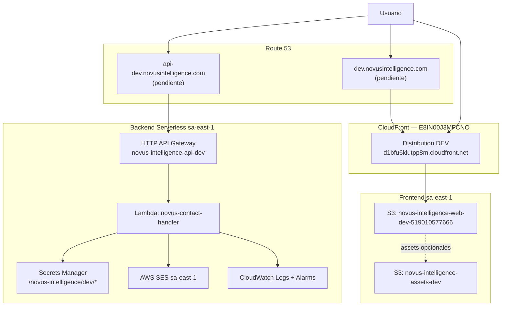

# Propuesta de Infraestructura — Novus Intelligence Solutions (DEV)

**Proyecto:** novus-intelligence  
**Workflow:** novus-intelligence-lovable-to-web  
**Paso:** paso-08-propuesta-infra  
**Agente:** cloud-agent  
**Fecha:** 2026-07-16  
**Runtime:** Cursor Cloud Agent (M6)  
**Target environment:** DEV — AWS `sa-east-1`  
**Plan:** PLAN-NOVUS-LOVABLE-2026-07-14 (`approved`)  
**Estado:** Propuesta IaC — **sin despliegue** (`NO_DEPLOY`)

---

## Resumen ejecutivo

Esta propuesta define la infraestructura AWS DEV para el sitio corporativo Novus Intelligence en la región **sa-east-1**, alineada con `environments/dev.yml` (región ya reconciliada).

**Alcance:**

| Capa | Recursos propuestos | Estado DEV |
|------|---------------------|------------|
| Backend API | HTTP API Gateway + Lambda Node.js 20 + IAM + CloudWatch | Pendiente deploy |
| Email | AWS SES (identidad de dominio y remitente DEV) | Pendiente verificación |
| Frontend hosting | S3 + CloudFront + certificado ACM | **Parcial** — CloudFront activo |
| Assets estáticos | S3 bucket dedicado (marca) | Pendiente |
| Secrets | AWS Secrets Manager / SSM Parameter Store | Pendiente creación |
| DNS | Route 53 (alias a CloudFront y API custom domain) | DNS custom pendiente |

**Restricciones respetadas:** `NO_DEPLOY`, `NO_SECRETS_IN_REPO`, `deploy_human_approval` obligatorio para cualquier apply.

---

## Alineación con `environments/dev.yml`

Fuente canónica: `.nadf/projects/novus-intelligence/environments/dev.yml`

| Campo | Valor en `dev.yml` | Notas |
|-------|-------------------|-------|
| `region` | **`sa-east-1`** | Reconciliado (TASK-INFRA-001 ✅) |
| `backend.stack_name` | `novus-intelligence-back-dev` | Stack Serverless / CloudFormation |
| `backend.api_url` | `https://api-dev.novusintelligence.com` | Custom domain pendiente |
| `backend.runtime` | `nodejs20.x` | Lambda |
| `backend.region` | `sa-east-1` | Explícito |
| `frontend.hosting.bucket_name` | `novus-intelligence-web-dev-519010577666` | Bucket con sufijo account ID |
| `frontend.hosting.cloudfront_distribution_id` | `E8IN00J3MFCNO` | Distribución activa |
| `frontend.url` | `https://d1bfu6klutpp8m.cloudfront.net` | URL CloudFront activa |
| `frontend.url_dns_pending` | `https://dev.novusintelligence.com` | Alias DNS pendiente |
| `services.storage.bucket_name` | `novus-intelligence-assets-dev` | Assets de marca |
| `services.email.from_address` | `noreply-dev@novusintelligence.com` | Remitente SES DEV |
| `services.database.table_prefix` | `novus-intelligence-dev` | **No aplica** (`requires_database: false`) |

> **Nota ACM CloudFront:** Certificados para CloudFront deben residir en **us-east-1** (requisito AWS). Recursos compute/API/SES/S3 regionales en **sa-east-1**.

---

## Arquitectura DEV sa-east-1



---

## Inventario de recursos AWS

### Convenciones de nomenclatura

| Prefijo | Uso |
|---------|-----|
| `novus-intelligence-*-dev` | Recursos de aplicación DEV |
| `/novus-intelligence/dev/` | Prefijo SSM / Secrets Manager |
| Tag `Environment=dev` | Obligatorio en todos los recursos |
| Tag `Project=novus-intelligence` | Trazabilidad NADF |

### Stacks CloudFormation / Serverless

| Stack | Servicio | Región | Estado |
|-------|----------|--------|--------|
| **`novus-intelligence-back-dev`** | NovusIntelligenceBack (Serverless) | sa-east-1 | Pendiente deploy |
| *(frontend)* | S3 + CloudFront (Terraform/CDK o manual) | sa-east-1 / global | Parcial — CDN activo |

---

### Backend — Serverless Framework

| Recurso lógico | Binding AWS | Nombre / identificador | Región |
|----------------|-------------|------------------------|--------|
| Stack IaC | CloudFormation (Serverless) | **`novus-intelligence-back-dev`** | sa-east-1 |
| HTTP API | API Gateway HTTP API | **`novus-intelligence-api-dev`** | sa-east-1 |
| Función | Lambda | **`novus-contact-handler`** | sa-east-1 |
| Rol IAM | IAM Role | `novus-intelligence-back-dev-dev-lambdaRole` | sa-east-1 |
| Log group | CloudWatch Logs | `/aws/lambda/novus-contact-handler` | sa-east-1 |
| Stage | API Gateway stage | `dev` | sa-east-1 |

#### Endpoint expuesto

| Método | Ruta | Integración |
|--------|------|-------------|
| `POST` | `/api/v1/contact` | Lambda `novus-contact-handler` |
| `OPTIONS` | `/api/v1/contact` | CORS preflight (API Gateway) |

#### Configuración Lambda propuesta

| Parámetro | Valor DEV |
|-----------|-----------|
| Runtime | `nodejs20.x` |
| Memory | 256 MB |
| Timeout | 10 s |
| Architecture | `arm64` (Graviton) |
| Reserved concurrency | 10 (opcional) |

#### API Gateway — throttling y CORS

| Parámetro | Valor DEV |
|-----------|-----------|
| Throttle burst | 20 |
| Throttle rate | 10 req/s |
| Rate limit por IP (app) | 10 req / 5 min (`RATE_LIMIT_PER_IP`) |
| CORS origins | `https://dev.novusintelligence.com`, `https://d1bfu6klutpp8m.cloudfront.net`, `http://localhost:5173` |
| CORS methods | `POST`, `OPTIONS` |
| CORS headers | `Content-Type` |

**Custom domain API:**

| Atributo | Valor |
|----------|-------|
| Dominio | `api-dev.novusintelligence.com` |
| Certificado ACM | sa-east-1 (regional para HTTP API) |
| Base path mapping | `/` → stage `dev` |

---

### Email — AWS SES

| Recurso | Nombre / valor | Región |
|---------|----------------|--------|
| Dominio verificado | `novusintelligence.com` | sa-east-1 |
| Identidad remitente | `noreply-dev@novusintelligence.com` | sa-east-1 |
| Configuración salida | Production access o sandbox con destinatarios verificados | sa-east-1 |
| DKIM | Habilitado en dominio | sa-east-1 |

**Permisos IAM Lambda:**

```json
{
  "Effect": "Allow",
  "Action": ["ses:SendEmail", "ses:SendRawEmail"],
  "Resource": "arn:aws:ses:sa-east-1:*:identity/novusintelligence.com"
}
```

> Valores de `CONTACT_EMAIL_FROM` / `CONTACT_EMAIL_TO` **solo en Secrets Manager**, nunca en repositorio.

---

### Frontend — S3 + CloudFront

| Recurso | Nombre / ID | Región | Estado |
|---------|-------------|--------|--------|
| Bucket SPA | **`novus-intelligence-web-dev-519010577666`** | sa-east-1 | Existente |
| Distribución CDN | **`E8IN00J3MFCNO`** | Global (edge) | Activa |
| URL activa | `https://d1bfu6klutpp8m.cloudfront.net` | — | Operativa |
| URL DNS objetivo | `https://dev.novusintelligence.com` | Route 53 | Pendiente alias |
| Certificado ACM | `dev.novusintelligence.com` | **us-east-1** | Pendiente / verificar |

#### Configuración bucket SPA

| Política | Valor |
|----------|-------|
| Block public access | Habilitado |
| Encryption | SSE-S3 (AES-256) |
| Index document | `index.html` |
| Error document | `index.html` (SPA fallback) |
| Acceso | OAC/OAI hacia CloudFront |

#### CloudFront behaviors

| Path pattern | Origin | Cache |
|--------------|--------|-------|
| `/assets/*` | S3 web bucket | Cache largo |
| `/*.js`, `/*.css` | S3 web bucket | Cache largo |
| `/*` | S3 web bucket | No cache index; SPA routing |

---

### Assets de marca — S3

| Recurso | Nombre | Región | Acceso |
|---------|--------|--------|--------|
| Bucket assets | **`novus-intelligence-assets-dev`** | sa-east-1 | Privado; OAC/CloudFront |

**Contenido esperado:** logos, imágenes OG, material de marca (CHG-013).

**Alternativa MVP:** servir assets desde `public/assets/novus/` en el bucket SPA y reservar bucket dedicado para assets compartidos multi-entorno.

---

### Secrets y parámetros (TASK-INFRA-005)

> **Solo nombres.** Valores creados manualmente o vía pipeline con aprobación humana.

#### AWS Secrets Manager (recomendado para secretos)

| Secret name | Variables contenidas | Obligatorio |
|-------------|---------------------|-------------|
| `/novus-intelligence/dev/contact-email` | `CONTACT_EMAIL_FROM`, `CONTACT_EMAIL_TO` | Sí |
| `/novus-intelligence/dev/captcha` | `CAPTCHA_SECRET` | Condicional |
| `/novus-intelligence/dev/crm` | `CRM_WEBHOOK_URL` | No |

#### SSM Parameter Store (config no sensible)

| Parameter name | Tipo | Valor DEV sugerido |
|----------------|------|-------------------|
| `/novus-intelligence/dev/NODE_ENV` | String | `development` |
| `/novus-intelligence/dev/AWS_REGION` | String | `sa-east-1` |
| `/novus-intelligence/dev/CORS_ALLOWED_ORIGINS` | String | `https://dev.novusintelligence.com,https://d1bfu6klutpp8m.cloudfront.net,http://localhost:5173` |
| `/novus-intelligence/dev/RATE_LIMIT_PER_IP` | String | `10` |
| `/novus-intelligence/dev/CAPTCHA_ENABLED` | String | `false` |
| `/novus-intelligence/dev/CAPTCHA_PROVIDER` | String | `turnstile` |
| `/novus-intelligence/dev/LOG_LEVEL` | String | `info` |

#### Variables Lambda (referencia Serverless)

| Variable entorno Lambda | Fuente | Descripción |
|-------------------------|--------|-------------|
| `NODE_ENV` | SSM | Entorno |
| `AWS_REGION` | SSM | Región sa-east-1 |
| `CONTACT_EMAIL_FROM` | Secrets Manager | Remitente SES |
| `CONTACT_EMAIL_TO` | Secrets Manager | Destinatario notificaciones |
| `CORS_ALLOWED_ORIGINS` | SSM | Orígenes CORS |
| `RATE_LIMIT_PER_IP` | SSM | Umbral rate limit |
| `CAPTCHA_ENABLED` | SSM | Flag captcha |
| `CAPTCHA_PROVIDER` | SSM | Proveedor captcha |
| `CAPTCHA_SECRET` | Secrets Manager | Secret verificación |
| `CRM_WEBHOOK_URL` | Secrets Manager | Webhook opcional |
| `LOG_LEVEL` | SSM | Nivel de logs |

> **Normalización D-003:** Usar `CONTACT_EMAIL_FROM` / `CONTACT_EMAIL_TO` como nombres canónicos (coherente con `especificacion-backend.md` y `dev.yml`).

#### Variables frontend (build-time — CI/CD)

| Variable | Valor DEV | Notas |
|----------|-----------|-------|
| `VITE_NOVUS_API_URL` | `https://api-dev.novusintelligence.com` | Sin trailing slash |
| `VITE_DEMO_MODE` | `false` | **Obligatorio** en builds desplegados (R-001) |

---

### Observabilidad

| Recurso | Nombre | Configuración |
|---------|--------|---------------|
| Log group | `/aws/lambda/novus-contact-handler` | Retención 14 días DEV |
| Alarma | `novus-contact-handler-errors-dev` | Errors > 0 en 5 min |
| Alarma | `novus-api-5xx-dev` | API Gateway 5xx > 5 en 5 min |
| Alarma | `novus-api-throttles-dev` | Throttles > 0 (429) |

---

## Propuesta Serverless Framework (NovusIntelligenceBack)

> Template de referencia para **backend-agent** / **devops-agent**. No incluye valores secretos.

```yaml
# serverless.yml — extracto propuesto
service: novus-intelligence-back

frameworkVersion: '3'

provider:
  name: aws
  runtime: nodejs20.x
  architecture: arm64
  region: sa-east-1
  stage: dev
  stackName: novus-intelligence-back-dev
  memorySize: 256
  timeout: 10
  environment:
    NODE_ENV: ${ssm:/novus-intelligence/dev/NODE_ENV}
    AWS_REGION: ${ssm:/novus-intelligence/dev/AWS_REGION}
    CORS_ALLOWED_ORIGINS: ${ssm:/novus-intelligence/dev/CORS_ALLOWED_ORIGINS}
    RATE_LIMIT_PER_IP: ${ssm:/novus-intelligence/dev/RATE_LIMIT_PER_IP}
    CAPTCHA_ENABLED: ${ssm:/novus-intelligence/dev/CAPTCHA_ENABLED}
    CAPTCHA_PROVIDER: ${ssm:/novus-intelligence/dev/CAPTCHA_PROVIDER}
    LOG_LEVEL: ${ssm:/novus-intelligence/dev/LOG_LEVEL}
  iam:
    role:
      statements:
        - Effect: Allow
          Action:
            - ses:SendEmail
            - ses:SendRawEmail
          Resource:
            - arn:aws:ses:sa-east-1:${aws:accountId}:identity/novusintelligence.com
        - Effect: Allow
          Action:
            - secretsmanager:GetSecretValue
          Resource:
            - arn:aws:secretsmanager:sa-east-1:${aws:accountId}:secret:/novus-intelligence/dev/*
        - Effect: Allow
          Action:
            - ssm:GetParameter
            - ssm:GetParameters
          Resource:
            - arn:aws:ssm:sa-east-1:${aws:accountId}:parameter/novus-intelligence/dev/*

functions:
  contactHandler:
    name: novus-contact-handler
    handler: src/handlers/contact.handler
    events:
      - httpApi:
          path: /api/v1/contact
          method: post
      - httpApi:
          path: /api/v1/contact
          method: options

custom:
  httpApi:
    name: novus-intelligence-api-dev
    cors:
      allowedOrigins:
        - https://dev.novusintelligence.com
        - https://d1bfu6klutpp8m.cloudfront.net
        - http://localhost:5173
      allowedHeaders:
        - Content-Type
      allowedMethods:
        - POST
        - OPTIONS
```

**Comando de despliegue (solo humano autorizado):**

```bash
cd NovusIntelligenceBack
npx serverless deploy --stage dev --region sa-east-1
```

---

## DNS y certificados

| Dominio | Tipo registro | Destino | Certificado |
|---------|---------------|---------|-------------|
| `dev.novusintelligence.com` | A/AAAA Alias | CloudFront `E8IN00J3MFCNO` | ACM us-east-1 |
| `api-dev.novusintelligence.com` | A Alias | API Gateway custom domain | ACM sa-east-1 |
| `_amazonses.novusintelligence.com` | TXT | Verificación SES | — |
| DKIM selectors (3) | CNAME | SES DKIM | — |

---

## Checklist de despliegue humano (DEV sa-east-1)

> Ejecutar **solo tras `deploy_human_approval` explícita**. Orden recomendado.

### Fase A — Prerrequisitos

- [x] **A.1** `environments/dev.yml` declara `region: sa-east-1` (TASK-INFRA-001 completado)
- [ ] **A.2** Confirmar cuenta AWS y permisos IAM para sa-east-1
- [ ] **A.3** Verificar plan `approved` y backend implementado (`POST /api/v1/contact`)
- [ ] **A.4** Crear secretos en Secrets Manager (sin commitear valores):
  - [ ] `/novus-intelligence/dev/contact-email`
  - [ ] `/novus-intelligence/dev/captcha` (si aplica)
  - [ ] `/novus-intelligence/dev/crm` (opcional)
- [ ] **A.5** Crear parámetros SSM listados en sección Secrets
- [ ] **A.6** Verificar stacks Serverless NovusIntelligenceBack apuntan a `sa-east-1`

### Fase B — Email (SES)

- [ ] **B.1** Verificar dominio `novusintelligence.com` en SES sa-east-1
- [ ] **B.2** Verificar identidad `noreply-dev@novusintelligence.com`
- [ ] **B.3** Configurar registros DKIM/SPF/DMARC en Route 53
- [ ] **B.4** Solicitar salida de sandbox SES (si aplica)
- [ ] **B.5** Probar envío manual desde consola SES

### Fase C — Backend API

- [ ] **C.1** Revisar `serverless.yml` en NovusIntelligenceBack (región sa-east-1)
- [ ] **C.2** Ejecutar `npm run build` backend sin errores
- [ ] **C.3** Ejecutar `serverless deploy --stage dev --region sa-east-1`
- [ ] **C.4** Verificar stack CloudFormation **`novus-intelligence-back-dev`** en sa-east-1
- [ ] **C.5** Configurar custom domain `api-dev.novusintelligence.com`
- [ ] **C.6** Probar `POST /api/v1/contact` con curl (payload válido → 200)
- [ ] **C.7** Verificar email recibido en bandeja `CONTACT_EMAIL_TO`
- [ ] **C.8** Verificar CORS preflight desde origen DEV / CloudFront
- [ ] **C.9** Confirmar CloudWatch logs con `requestId` (sin prefijo `demo-`)

### Fase D — Frontend hosting

- [x] **D.1** Bucket `novus-intelligence-web-dev-519010577666` existe (sa-east-1)
- [x] **D.2** Distribución CloudFront `E8IN00J3MFCNO` activa
- [ ] **D.3** Configurar alias Route 53 `dev.novusintelligence.com` → CloudFront
- [ ] **D.4** Verificar certificado ACM `dev.novusintelligence.com` en us-east-1
- [ ] **D.5** Build frontend con `VITE_NOVUS_API_URL` y `VITE_DEMO_MODE=false`
- [ ] **D.6** Sync `dist/` a bucket S3
- [ ] **D.7** Invalidar cache CloudFront para `index.html`
- [ ] **D.8** Navegar 10 rutas + formulario contacto end-to-end

### Fase E — Assets (opcional MVP)

- [ ] **E.1** Crear bucket `novus-intelligence-assets-dev` si se usa CDN separado
- [ ] **E.2** Subir assets de marca; configurar política OAC/CloudFront
- [ ] **E.3** Validar OG images y logos en producción DEV

### Fase F — Validación post-deploy

- [ ] **F.1** Rate limit: burst > umbral → 429
- [ ] **F.2** Payload inválido → 400 con `errors[]`
- [ ] **F.3** Sin secrets expuestos en repos ni logs
- [ ] **F.4** Alarmas CloudWatch activas
- [ ] **F.5** Handoff a qa-agent + security-agent (Fase 9)

---

## Estimación de costos DEV (orientativa)

| Servicio | Uso esperado DEV | Costo aprox. mensual |
|----------|------------------|----------------------|
| Lambda | < 10k invocaciones/mes | < USD 1 |
| API Gateway | < 10k requests | < USD 1 |
| SES | < 500 emails | < USD 1 |
| S3 + CloudFront | Tráfico bajo corporativo | USD 1–5 |
| Secrets Manager | 2–3 secrets | USD 1–2 |
| CloudWatch | Logs 14 días | < USD 1 |
| **Total estimado** | | **USD 5–10/mes** |

---

## Tareas NADF cubiertas

| Tarea | Estado en propuesta |
|-------|---------------------|
| TASK-INFRA-001 | ✅ Región sa-east-1 confirmada en `dev.yml` |
| TASK-INFRA-002 | ✅ API Gateway + Lambda + SES + IAM + CloudWatch documentados |
| TASK-INFRA-003 | ✅ S3 + CloudFront frontend DEV (recursos parcialmente existentes) |
| TASK-INFRA-004 | ✅ Bucket assets DEV documentado |
| TASK-INFRA-005 | ✅ Secrets Manager / SSM — nombres documentados |

---

## Riesgos y mitigaciones

| Riesgo | Mitigación |
|--------|------------|
| SES en sandbox | Verificar destinatarios o solicitar production access |
| Certificado CloudFront en región incorrecta | ACM frontend en us-east-1; API en sa-east-1 |
| CORS bloqueado | Incluir URL CloudFront activa en `CORS_ALLOWED_ORIGINS` |
| R-001 demo mode | `VITE_DEMO_MODE=false` en pipeline; QA valida `requestId` real |
| R-008 captcha | `CAPTCHA_ENABLED=false` en DEV; habilitar pre-prod |
| Frontend parcial vs backend pendiente | Desplegar API antes de integración contacto (Fase 6) |

---

## Restricciones NADF

| Constraint | Cumplimiento |
|------------|--------------|
| `NO_DEPLOY` | ✅ Solo propuesta; checklist para humano |
| `NO_SECRETS_IN_REPO` | ✅ Solo nombres de variables y paths |
| `NO_LOVABLE_CODE_COPY` | N/A (infra) |
| `PLAN_MUST_BE_APPROVED` | ✅ Plan status `approved` |
| `TARGET_DEV_REGION_SA_EAST_1` | ✅ Todos los recursos regionales en sa-east-1 |
| Provider independence | Capacidades genéricas + binding AWS documentado |

---

## Referencias

- `artifacts/plan-implementacion.md`
- `artifacts/especificacion-backend.md`
- `artifacts/evaluacion-backend.md`
- `artifacts/impacto-arquitectonico.md`
- `.nadf/projects/novus-intelligence/environments/dev.yml`
- `.nadf/projects/novus-intelligence/project-context.yml`
- `.nadf/global/rules/provider-independence.md`

---

## Historial

| Fecha | Acción | Agente |
|-------|--------|--------|
| 2026-07-14 | Propuesta IaC DEV sa-east-1 generada | cloud-agent |
| 2026-07-16 | Revalidación paso-08; alineación con `dev.yml` reconciliado (bucket, CloudFront, región) | cloud-agent |
