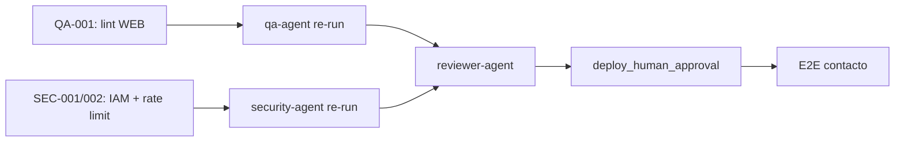

# Reflexión de Ejecución — Novus Intelligence Solutions

**Proyecto:** novus-intelligence  
**Workflow:** novus-intelligence-lovable-to-web  
**Paso:** paso-16-reflexion (fase Reflection)  
**Agente:** reflection-agent  
**Patrón:** Reflection Pattern  
**Fecha:** 2026-07-14  
**Runtime:** Cursor Cloud Agent (M6)  
**Target environment:** DEV — AWS `sa-east-1`  
**Plan:** PLAN-NOVUS-LOVABLE-2026-07-14 (`approved`)  
**Baseline Lovable:** novus-nexus @ `e3a9819`  
**Estado workflow al reflexionar:** **blocked** (qualityScore: 62)

---

## Workflow

| Campo | Valor |
|-------|-------|
| `workflowId` | novus-intelligence-lovable-to-web |
| `runId` | bc-7db90cca-6bbe-4914-bce2-8b237c3cd973 |
| Inicio corrida | 2026-07-14T08:30:00Z |
| Fin corrida (consolidado) | 2026-07-14T11:05:00Z |
| Duración total | ~2 h 35 min (9 300 s) |
| Agentes ejecutados | 13 de 19 habilitados |
| Agentes éxito | 9 |
| Agentes fallo | 3 (devops-agent, qa-agent, security-agent) |
| Agentes omitidos/N/A | 1 (database-agent) |
| Agentes bloqueados/pendientes | 6 (reviewer, reflection→este paso, kb, adr + parciales) |
| PRs Framework abiertos | 8 (draft) |
| Ramas productivas sin merge | 2 (NovusIntelligenceWEB + NovusIntelligenceBack) |

### Agentes involucrados por fase

| Fase | Agentes | Resultado |
|------|---------|-----------|
| Event Trigger | workflow-agent | ✅ |
| Planning | lovable-analyzer-agent, planner-agent, backend-impact-agent | ✅ |
| Plan Review | architect-agent | ✅ — plan `approved` |
| Execution | frontend-integration-agent, backend-agent, cloud-agent | ⚠️ Parcial (lint WEB, SEC-001/002) |
| Execution | devops-agent | ❌ — `pipeline-config.md` ausente |
| Execution | database-agent | ⏭️ N/A |
| Validation | qa-agent, security-agent | ❌ FAIL |
| Validation | reviewer-agent | ⏸️ Bloqueado |
| Documentation | documentation-agent | ✅ |
| Metrics | metrics-agent | ✅ |
| Reflection | reflection-agent | ✅ (este artefacto) |

---

## Qué se hizo

### Planning y Plan Review (exitoso)

1. **lovable-analyzer-agent** detectó 13 cambios (CHG-001–CHG-013) en el commit `e3a9819`, con `backendRequired: true`. Produjo `cambios-lovable.json`, impactos frontend/backend y matriz de riesgos.
2. **planner-agent** generó `plan-implementacion.md` (PLAN-NOVUS-LOVABLE-2026-07-14) con 9 fases, mapeo de rutas TanStack → React Router y mitigaciones R-001 a R-008.
3. **backend-impact-agent** especificó la API de contacto (`POST /api/v1/contact`) sin persistencia en BD.
4. **architect-agent** aprobó el plan y documentó impacto arquitectónico en `impacto-arquitectonico.md`.

### Execution (mayormente completada)

5. **frontend-integration-agent** implementó el sitio corporativo completo en `NovusIntelligenceWEB` (rama `cursor/implement-novus-frontend-2d22`):
   - Fases 0–4 del plan: design system dark-first, 10 rutas, layout, landing, contenido, soluciones dinámicas (6 slugs), `MultiAgentDemo` lazy-loaded.
   - Fase 6 parcial: UI de contacto sin fallback demo (R-001 mitigado).
   - Build Vite exitoso; reimplementación propia sin copia de novus-nexus.

6. **backend-agent** implementó `novus-contact-handler` en `NovusIntelligenceBack` (rama `cursor/implement-contact-api-04c8`):
   - Validación server-side V1–V10, CORS con lista blanca, captcha preparado (deshabilitado en DEV).
   - Build y lint backend sin errores.

7. **cloud-agent** reconcilió `environments/dev.yml` a región `sa-east-1` y generó `propuesta-infra.md` con stacks, secrets paths y checklist de deploy. Sin despliegue (`NO_DEPLOY`).

8. **documentation-agent** consolidó la corrida en `resumen-ejecucion.md`.

9. **metrics-agent** registró métricas en `metricas-ejecucion.json` (qualityScore: 62).

### Constraints respetados

| Constraint | Evidencia |
|------------|-----------|
| `NO_DEPLOY` | Sin apply IaC ni publicación DEV |
| `NO_SECRETS_IN_REPO` | Escaneos QA/Security sin credenciales |
| `NO_LOVABLE_CODE_COPY` | Gates pass; reimplementación verificada |
| `PLAN_MUST_BE_APPROVED` | `status: approved` desde paso 06 |
| `TARGET_DEV_REGION_SA_EAST_1` | `dev.yml` y `propuesta-infra.md` alineados |
| `NO_PRODUCTIVE_CODE` (reflection) | Solo artefactos de conocimiento |

---

## Qué falló

### Gates bloqueantes fallidos

| Gate | ID hallazgo | Descripción | Agente responsable |
|------|-------------|-------------|-------------------|
| `build_success` | QA-001 | 4 errores ESLint `@typescript-eslint/no-empty-object-type` en `Input`, `Label`, `Select`, `Textarea` (WEB) | frontend-integration-agent |
| `security_pass` | SEC-001 | IAM SES con `Resource: '*'` en `serverless.yml` — viola mínimo privilegio | backend-agent |
| `security_pass` | SEC-002 | `rateLimitResponse()` definido pero no invocado; solo throttle global API Gateway | backend-agent |

### Tareas no completadas

| ID | Descripción | Impacto |
|----|-------------|---------|
| DEVOPS-001 | `pipeline-config.md` ausente — TASK-DEVOPS-001 no ejecutada | Sin documentación CI/CD; gate operativo incompleto |
| BE-ART-001 | `resumen-backend.md` en rama remota no mergeado al Framework | Trazabilidad backend incompleta en Blackboard |
| REV-001 | `reviewer-agent` no ejecutado | Bloqueado por QA/Security FAIL |
| E2E-001 | Prueba E2E contacto post-deploy | Bloqueada por `NO_DEPLOY` + API no desplegada |

### Desviaciones plan vs resultado

| Fase plan | Esperado | Real | Gap |
|-----------|----------|------|-----|
| 6 — Contacto integración | E2E con API DEV | UI lista; sin API desplegada | Esperado por `NO_DEPLOY` |
| 7 — Infra/DevOps | Propuesta + pipeline | Propuesta ✅; pipeline ❌ | devops-agent no ejecutó TASK-DEVOPS-001 |
| 9 — Validación | Pass completo | FAIL lint + security | Workflow bloqueado antes de reviewer |

### Efecto en cadena de validación

La política NADF de gates bloqueantes funcionó como diseñado: un fallo en `build_success` (lint) y `security_pass` detuvo **reviewer-agent** y retrasó las fases Knowledge (reflection parcialmente desbloqueada por métricas ya registradas, KB y ADR aún pendientes).

---

## Qué se aprendió

### Patrones exitosos

1. **Separación planificación/ejecución/validación.** El plan `approved` por architect-agent antes de código productivo permitió trazabilidad clara: cada fase de ejecución mapea a tareas del plan con IDs CHG-xxx verificables.

2. **Traducción intención Lovable sin copia directa.** El workflow demostró que es viable implementar un sitio corporativo completo (10 rutas, design system, componente interactivo `MultiAgentDemo`) reimplementando intención visual/funcional en React + Tailwind, sin importar código de novus-nexus. Gates `no_lovable_code_copy` y `no_mock_data_in_production` pasaron en primera validación.

3. **Mitigación R-001 (modo demo) desde diseño.** Tanto frontend (`submitContact()` retorna error sin `VITE_NOVUS_API_URL`) como backend (`randomUUID()` sin prefijo `demo-`) implementaron la política anti-mock de forma coherente. Esto valida el patrón de especificar riesgos en planning y verificarlos en validation.

4. **Reconciliación de región en planning constraints.** La discrepancia `us-east-1` vs `sa-east-1` en `dev.yml` se resolvió en cloud-agent sin bloquear ejecución frontend/backend, demostrando que TASK-INFRA-001 como tarea explícita en el plan es efectiva.

5. **Validación en ramas feature antes de merge.** Mantener implementación en ramas `cursor/*` permitió QA y Security evaluar código sin contaminar `main` (aún en scaffold). Patrón seguro para workflows multi-repo.

6. **Documentación consolidada post-corrida.** `resumen-ejecucion.md` + `metricas-ejecucion.json` proporcionaron insumo suficiente para reflexión aun con workflow bloqueado — el Blackboard cumple su rol de memoria compartida.

### Anti-patrones detectados

1. **Interfaces vacías en componentes UI shadcn-style.** Usar `interface X extends Y {}` sin añadir props dispara `@typescript-eslint/no-empty-object-type`. Preferir `type X = Y` o añadir props explícitas.

2. **Código de seguridad definido pero no conectado.** `rateLimitResponse()` y `RATE_LIMIT_PER_IP` existen en backend pero el handler no los invoca — patrón «dead code security» que pasa revisión superficial pero falla security-agent.

3. **Desalineación IaC implementación vs propuesta.** `serverless.yml` usa `Resource: '*'` para SES mientras `propuesta-infra.md` documenta ARN acotado. El executor no alineó implementación con la propuesta cloud del mismo workflow.

4. **Agente DevOps omitido en corrida.** Sin `pipeline-config.md`, la fase 7 del plan quedó incompleta. El workflow no tiene gate bloqueante explícito para DevOps, lo que permitió avanzar a Validation con gap operativo.

5. **Lint como sub-gate de build_success.** Build Vite exitoso pero lint fallido bloquea todo el workflow. Patrón correcto para calidad, pero requiere que frontend-integration-agent ejecute lint antes de handoff a Validation.

### Aprendizajes operativos del workflow

- **QualityScore 62** refleja ejecución sólida (78% completitud) penalizada por 2 gates bloqueantes (75% gates pass).
- **Validación estática responsive/SEO** fue aceptada por QA sin browser automation — documentar limitación explícitamente en informes.
- **8 PRs draft** en Framework indican necesidad de consolidación/merge strategy antes de que KB Agent procese aprendizajes.

---

## Recomendaciones

### Actualizaciones sugeridas para Knowledge Base

Ver `recomendaciones-kb.json` para estructura machine-readable. Resumen:

1. **Patrón ESLint `no-empty-object-type`** en componentes UI — usar `type` alias.
2. **Checklist IAM least-privilege SES** para Serverless Framework en sa-east-1.
3. **Matriz de decisión rate limiting** — handler in-app (DynamoDB) vs AWS WAF rate-based.
4. **Checklist pre-handoff executor** — lint + alineación serverless.yml vs propuesta-infra.md.
5. **Patrón workflow multi-repo** — ramas feature + validación antes de merge a main.

### ADRs pendientes de registro

| Tema | Justificación | Agente sugerido |
|------|---------------|-----------------|
| Rate limiting por IP en API pública serverless | Decisión arquitectónica no formalizada (DynamoDB vs WAF vs ElastiCache) | adr-agent |
| Gestión secretos SSM/Secrets Manager vs env plano | Desalineación SEC-003 entre implementación y propuesta | adr-agent |

> Nota: ADR-0002, ADR-0003 y ADR-0004 ya cubren arquitectura multiagente, canonicalización Lovable→Web y Meta Model. No se requieren ADRs nuevos para decisiones ya registradas.

### Mejoras de workflow propuestas

1. **Gate explícito `devops_pipeline_documented`** antes de Validation, o incluir TASK-DEVOPS-001 como prerequisito en paso 10.
2. **Pre-check lint en handoff frontend-integration → qa-agent** para reducir ciclos de re-validación.
3. **Checklist de alineación serverless.yml ↔ propuesta-infra.md** como tarea obligatoria backend-agent post cloud-agent.
4. **Ejecutar reviewer-agent en modo «advisory»** cuando QA/Security fallan, para documentar desviaciones de convención sin bloquear reflexión.

---

## Secuencia de desbloqueo recomendada

| Orden | Agente | Acción |
|-------|--------|--------|
| 1 | frontend-integration-agent | Corregir QA-001 (4 errores ESLint) |
| 2 | backend-agent | Corregir SEC-001 (IAM SES) y SEC-002 (rate limit) |
| 3 | devops-agent | Completar TASK-DEVOPS-001 (`pipeline-config.md`) |
| 4 | qa-agent | Re-ejecutar validación |
| 5 | security-agent | Re-ejecutar revisión |
| 6 | reviewer-agent | Revisión de coherencia y diff |
| 7 | knowledge-base-agent | Consolidar `recomendaciones-kb.json` |
| 8 | adr-agent | Registrar ADRs de rate limiting y secretos si aplica |

---

## Métricas de reflexión

| Campo | Valor |
|-------|-------|
| `agentName` | reflection-agent |
| `reflectionSummary` | Primera corrida Lovable→Web completó planning y execution (~78%) con gates críticos de intención (sin copia Lovable, sin mocks, sin secrets) en PASS; bloqueada por lint WEB y seguridad IAM/rate-limit |
| `patternsIdentified` | 6 patrones exitosos, 5 anti-patrones |
| `failuresDocumented` | 3 bloqueantes (QA-001, SEC-001, SEC-002), 4 seguimiento |
| `kbUpdatesRecommended` | 7 entradas en `recomendaciones-kb.json` |

---

## Próximo agente sugerido

**knowledge-base-agent** — Consolidar patrones y anti-patrones de `recomendaciones-kb.json` en `.nadf/global/knowledge-base/`.

> Antes de cerrar el workflow: corregir bloqueantes QA-001, SEC-001, SEC-002 y re-ejecutar cadena de validación.

---

## Referencias

- `artifacts/plan-implementacion.md`
- `artifacts/resumen-ejecucion.md`
- `artifacts/metricas-ejecucion.json`
- `artifacts/informe-qa.md` / `qa-result.json`
- `artifacts/informe-seguridad.md` / `security-result.json`
- `artifacts/resumen-frontend.md`
- `artifacts/resumen-cloud.md`
- `artifacts/propuesta-infra.md`
- `artifacts/recomendaciones-kb.json`
- `docs/reflection-learning.md`
- `docs/meta-model/learning-model.md`

---

## Historial

| Fecha | Acción | Agente |
|-------|--------|--------|
| 2026-07-14 | Reflexión post-ejecución — workflow blocked, qualityScore 62 | reflection-agent |
