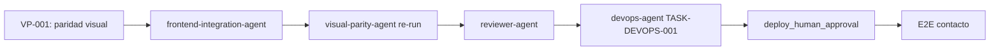

# Reflexión de Ejecución — Novus Intelligence Solutions

**Proyecto:** novus-intelligence  
**Workflow:** novus-intelligence-lovable-to-web  
**Paso:** paso-13-reflexion (fase Reflection)  
**Agente:** reflection-agent  
**Patrón:** Reflection Pattern  
**Fecha:** 2026-07-14  
**Runtime:** Cursor Cloud Agent (M6)  
**Target environment:** DEV — AWS `sa-east-1`  
**Plan:** PLAN-NOVUS-LOVABLE-2026-07-14 (`approved`)  
**Baseline Lovable:** novus-nexus @ `e3a9819` (paridad ref. @ `746c129`)  
**Estado workflow al reflexionar:** **blocked** (qualityScore: 74)

---

## Workflow

| Campo | Valor |
|-------|-------|
| `workflowId` | novus-intelligence-lovable-to-web |
| `runId` | bc-7db90cca-6bbe-4914-bce2-8b237c3cd973 |
| Inicio corrida | 2026-07-14T08:30:00Z |
| Fin corrida (consolidado) | 2026-07-14T21:25:00Z |
| Duración total | ~12 h 55 min (46 500 s) |
| Agentes ejecutados | 17 de 19 habilitados |
| Agentes éxito | 14 |
| Agentes fallo | 2 (devops-agent, visual-parity-agent) |
| Agentes omitidos/N/A | 1 (database-agent) |
| Agentes bloqueados | 1 (reviewer-agent) |
| PRs Framework abiertos | 8 (draft) |
| Repos productivos mergeados | 2 (NovusIntelligenceWEB + NovusIntelligenceBack → `main`) |

### Agentes involucrados por fase

| Fase | Agentes | Resultado |
|------|---------|-----------|
| Event Trigger | workflow-agent | ✅ |
| Planning | lovable-analyzer-agent, planner-agent, backend-impact-agent | ✅ |
| Plan Review | architect-agent | ✅ — plan `approved` |
| Execution | frontend-integration-agent, backend-agent, cloud-agent | ✅ — mergeado en `main` |
| Execution | devops-agent | ❌ — `pipeline-config.md` ausente |
| Execution | database-agent | ⏭️ N/A |
| Validation | qa-agent | ✅ PASS (revalidación post-merge) |
| Validation | security-agent | ✅ PASS condicional DEV (SEC-001/002 remediados) |
| Validation | visual-parity-agent | ❌ FAIL — 0/12 capturas |
| Validation | reviewer-agent | ⏸️ Bloqueado por `visual_exact_parity` |
| Documentation | documentation-agent | ✅ |
| Metrics | metrics-agent | ✅ |
| Reflection | reflection-agent | ✅ (este artefacto) |
| Knowledge | knowledge-base-agent, adr-agent | ✅ (corrida previa; requiere actualización post-paridad) |

---

## Qué se hizo

### Planning y Plan Review (exitoso)

1. **lovable-analyzer-agent** detectó 13 cambios (CHG-001–CHG-013) en el commit `e3a9819`, con `backendRequired: true`. Produjo `cambios-lovable.json`, impactos frontend/backend y matriz de riesgos.
2. **planner-agent** generó `plan-implementacion.md` (PLAN-NOVUS-LOVABLE-2026-07-14) con 9 fases, mapeo de rutas TanStack → React Router y mitigaciones R-001 a R-008.
3. **backend-impact-agent** especificó la API de contacto (`POST /api/v1/contact`) sin persistencia en BD.
4. **architect-agent** aprobó el plan y documentó impacto arquitectónico en `impacto-arquitectonico.md`.

### Execution (completada y mergeada)

5. **frontend-integration-agent** implementó el sitio corporativo completo en **NovusIntelligenceWEB** (`main` @ `cdd9f95`):
   - Fases 0–4: design system dark-first, 10 rutas, layout, landing, contenido, soluciones dinámicas (6 slugs), `MultiAgentDemo` lazy-loaded.
   - Fase 6: UI de contacto sin fallback demo (R-001 mitigado).
   - Build y lint exitosos tras remediación QA-001.

6. **backend-agent** implementó `novus-contact-handler` en **NovusIntelligenceBack** (`main` @ `bf3bd2b`):
   - Validación server-side V1–V10, CORS con lista blanca, captcha preparado (deshabilitado en DEV).
   - SEC-001 (IAM SES) y SEC-002 (rate limit por IP) remediados en `main`.

7. **cloud-agent** reconcilió `environments/dev.yml` a región `sa-east-1` y generó `propuesta-infra.md`. Sin despliegue (`NO_DEPLOY`).

8. **documentation-agent** consolidó la corrida en `resumen-ejecucion.md`.

9. **metrics-agent** registró métricas en `metricas-ejecucion.json` (qualityScore: 74).

### Validation (parcial — bloqueo visual)

10. **qa-agent** — PASS (`qualityScore: 100`): build, lint, gates de intención (sin copia Lovable, sin mocks, sin secrets).
11. **security-agent** — PASS condicional DEV (`securityScore: 86`): sin hallazgos bloqueantes tras remediación.
12. **visual-parity-agent** — FAIL: 0/12 capturas PASS; `maxDiffRatio: 0.234509` (umbral `0.002`).

### Constraints respetados

| Constraint | Evidencia |
|------------|-----------|
| `NO_DEPLOY` | Sin apply IaC ni publicación DEV en esta corrida |
| `NO_SECRETS_IN_REPO` | Escaneos QA/Security sin credenciales |
| `NO_LOVABLE_CODE_COPY` | Gates pass; reimplementación verificada |
| `PLAN_MUST_BE_APPROVED` | `status: approved` desde paso 06 |
| `TARGET_DEV_REGION_SA_EAST_1` | `dev.yml` y `propuesta-infra.md` alineados |
| `NO_PRODUCTIVE_CODE` (reflection) | Solo artefactos de conocimiento |

---

## Qué falló

### Gate bloqueante activo

| Gate | ID hallazgo | Descripción | Agente responsable |
|------|-------------|-------------|-------------------|
| `visual_exact_parity` | VP-001 | 0/12 capturas PASS; `maxDiffRatio` 117× sobre umbral; gaps en Hero, Partners, secciones landing, About, Services, Contact | frontend-integration-agent |

### Tareas no completadas

| ID | Descripción | Impacto |
|----|-------------|---------|
| DEVOPS-001 | `pipeline-config.md` ausente — TASK-DEVOPS-001 no ejecutada | Sin documentación CI/CD consolidada en Blackboard |
| REV-001 | `reviewer-agent` no ejecutado | Bloqueado por `visual_exact_parity` FAIL |
| E2E-001 | Prueba E2E contacto post-deploy | Bloqueada por `NO_DEPLOY` + API no desplegada |

### Fallos remediados en esta corrida

| ID | Gate original | Estado | Evidencia |
|----|---------------|--------|-----------|
| QA-001 | `build_success` | ✅ Resuelto | 4 errores ESLint `no-empty-object-type` corregidos; lint 0 errores en `main` @ `eead55f` |
| SEC-001 | `security_pass` | ✅ Resuelto | IAM SES acotado a `identity/*` en `main` @ `d851201` |
| SEC-002 | `security_pass` | ✅ Resuelto | `isIpRateLimited()` conectado en handler |

### Desviaciones plan vs resultado

| Fase plan | Esperado | Real | Gap |
|-----------|----------|------|-----|
| 6 — Contacto integración | E2E con API DEV | UI lista; sin API desplegada | Esperado por `NO_DEPLOY` |
| 7 — Infra/DevOps | Propuesta + pipeline | Propuesta ✅; pipeline ❌ | devops-agent no ejecutó TASK-DEVOPS-001 |
| 9 — Validación | Pass completo | QA ✅; Security ✅; Paridad ❌ | Workflow bloqueado antes de reviewer |

### Efecto en cadena de validación

La remediación iterativa de QA-001 y SEC-001/002 demostró que los gates de código y seguridad funcionan. El gate `visual_exact_parity` (ADR-0006) actúa como **bloqueante final** antes de reviewer-agent y deploy DEV automático — comportamiento esperado del framework.

---

## Qué se aprendió

### Patrones exitosos

1. **Separación planificación/ejecución/validación.** El plan `approved` por architect-agent antes de código productivo permitió trazabilidad clara: cada fase de ejecución mapea a tareas del plan con IDs CHG-xxx verificables.

2. **Traducción intención Lovable sin copia directa.** El workflow demostró que es viable implementar un sitio corporativo completo (10 rutas, design system, `MultiAgentDemo`) reimplementando intención visual/funcional en React + Tailwind, sin importar código de novus-nexus. Gates `no_lovable_code_copy` y `no_mock_data_in_production` pasaron.

3. **Mitigación R-001 (modo demo) desde diseño.** Frontend (`submitContact()` retorna error sin `VITE_NOVUS_API_URL`) y backend (`randomUUID()` sin prefijo `demo-`) implementaron la política anti-mock de forma coherente.

4. **Reconciliación de región en planning constraints.** La discrepancia `us-east-1` vs `sa-east-1` en `dev.yml` se resolvió en cloud-agent sin bloquear ejecución frontend/backend (TASK-INFRA-001 efectiva).

5. **Remediación iterativa post-validación.** QA-001 y SEC-001/002 se corrigieron en `main` y revalidaron con PASS. Patrón: fallo en Validation → fix en repo productivo → re-run agente Validator → continuar cadena.

6. **Blackboard como insumo de reflexión.** `resumen-ejecucion.md` + `metricas-ejecucion.json` + informes QA/Security/Paridad permiten reflexión consolidada aun con workflow bloqueado.

7. **Gate visual como verificador objetivo.** El checker pixel-a-pixel detectó desalineación que `resumen-frontend.md` declaraba resuelta — valida la necesidad de `visual_exact_parity` como gate independiente del análisis estático.

### Anti-patrones detectados

1. **Interfaces vacías en componentes UI shadcn-style (remediado).** `interface X extends Y {}` dispara `@typescript-eslint/no-empty-object-type`. Preferir `type X = Y`.

2. **Dead code security (remediado).** `rateLimitResponse()` definido pero no invocado — patrón «dead code security» que pasa revisión superficial.

3. **Desalineación serverless.yml vs propuesta-infra.md (remediado parcialmente).** IAM SES corregido; secretos SSM y CORS fallback `*` persisten como observaciones.

4. **Agente DevOps omitido en corrida.** Sin `pipeline-config.md`, la fase 7 del plan quedó incompleta. El workflow carece de gate bloqueante explícito para DevOps.

5. **Handoff executor sin lint local (remediado).** Build Vite exitoso pero lint fallido bloqueó inicialmente el workflow. Requiere pre-check antes de Validation.

6. **Desalineación copy/contenido vs referencia Lovable (activo — VP-001).** El frontend usa copy de `brand-context.md` / `src/content/` propio que diverge de la intención visual actual de novus-nexus (headlines, CTAs, secciones). Funcionalmente correcto; visualmente no alcanza paridad.

7. **Declarar remediación completa sin verificación pixel-diff.** `resumen-frontend.md` indicaba trabajo terminado, pero visual-parity-agent demostró 0/12 PASS. El handoff executor→validator debe incluir evidencia objetiva cuando `visual_exact_parity` está habilitado.

8. **Referencia Lovable no fijada en entorno.** `NADF_LOVABLE_REFERENCE_URL` ausente; se usó novus-nexus local @ `746c129` (distinto al baseline `e3a9819`). Riesgo de drift entre planning y paridad.

### Aprendizajes operativos del workflow

- **QualityScore 74** refleja ejecución sólida (88% completitud) penalizada por paridad visual (0/12) y devops pendiente.
- **Validación estática responsive/SEO** aceptada por QA sin browser automation — limitación documentada.
- **Paridad visual** es el cuello de botella principal: no es problema de código copiado sino de **desalineación visual** en layout, contenido y tokens.
- **8 PRs draft** en Framework indican necesidad de estrategia de consolidación/merge.

---

## Recomendaciones

### Actualizaciones sugeridas para Knowledge Base

Ver `recomendaciones-kb.json` para estructura machine-readable. Resumen:

1. **Checklist pre-paridad visual** — sincronizar copy, tokens y layout con referencia Lovable antes de pixel-diff.
2. **Patrón remediación iterativa QA/Security** — fix en `main` + revalidación documentada.
3. **Fijar `NADF_LOVABLE_REFERENCE_URL`** en entorno de paridad para evitar drift de commit.
4. **Entradas existentes KB-001 a KB-007** — mantener (errores remediados pero reutilizables).
5. **Nueva entrada KB-008** — gaps de paridad visual recurrentes (Hero, Partners, Testimonials).
6. **Nueva entrada KB-009** — no declarar fase frontend completa sin PASS de `visual_exact_parity`.

### ADRs pendientes de registro

| Tema | Justificación | Agente sugerido |
|------|---------------|-----------------|
| Rate limiting por IP en API pública serverless | Decisión no formalizada (DynamoDB vs WAF) — SEC-002 remediado pero ventana 60s vs 5 min spec | adr-agent |
| Gestión secretos SSM/Secrets Manager vs env plano | Desalineación SEC-003 entre implementación y propuesta | adr-agent |

> ADR-0006 ya cubre visual parity gate. No se requiere ADR nuevo para el gate en sí; sí para estrategias de remediación si se adopta tolerancia parcial.

### Mejoras de workflow propuestas

1. **Gate explícito `devops_pipeline_documented`** antes de Validation cuando `requires_infra: true`.
2. **Pre-check lint en handoff executor → qa-agent** (validado como efectivo tras QA-001).
3. **Ejecutar visual-parity-agent antes de declarar fase frontend completa** en `resumen-frontend.md`.
4. **Fijar commit de referencia Lovable** en variable de entorno obligatoria para visual-parity-agent.
5. **Actualizar KB tras reflexión** con aprendizajes de paridad visual (knowledge-base-agent re-run).

---

## Secuencia de desbloqueo recomendada

| Orden | Agente | Acción |
|-------|--------|--------|
| 1 | frontend-integration-agent | Remediar VP-001 según `gaps-paridad.json` (Hero, Partners, secciones, About, Services, Contact) |
| 2 | visual-parity-agent | Re-ejecutar comparación pixel-a-pixel (12 capturas) |
| 3 | reviewer-agent | Revisión de coherencia y diff |
| 4 | devops-agent | Completar TASK-DEVOPS-001 (`pipeline-config.md`) |
| 5 | knowledge-base-agent | Actualizar KB con aprendizajes de paridad visual (KB-008, KB-009) |
| 6 | adr-agent | Registrar ADRs de rate limiting y secretos si aplica |
| 7 | (humano) | Aprobar deploy DEV; luego qa-agent E2E contacto |

---

## Métricas de reflexión

| Campo | Valor |
|-------|-------|
| `agentName` | reflection-agent |
| `reflectionSummary` | Primera corrida Lovable→Web mayormente exitosa: implementación mergeada en main, QA y seguridad PASS tras remediación iterativa, pero paridad visual crítica (0/12) mantiene workflow bloqueado. DevOps pipeline pendiente. |
| `patternsIdentified` | 7 patrones exitosos, 8 anti-patrones (3 remediados, 5 activos/seguimiento) |
| `failuresDocumented` | 1 bloqueante activo (VP-001), 3 seguimiento, 3 remediados (QA-001, SEC-001, SEC-002) |
| `kbUpdatesRecommended` | 9 entradas en `recomendaciones-kb.json` |

---

## Próximo agente sugerido

**knowledge-base-agent** — Actualizar `.nadf/global/knowledge-base/` con aprendizajes de paridad visual (KB-008, KB-009) y estado remediado de QA/SEC.

> Antes de cerrar el workflow: remediar VP-001 con **frontend-integration-agent** y re-ejecutar **visual-parity-agent**.

---

## Referencias

- `artifacts/plan-implementacion.md`
- `artifacts/resumen-ejecucion.md`
- `artifacts/metricas-ejecucion.json`
- `artifacts/informe-qa.md` / `qa-result.json`
- `artifacts/informe-seguridad.md` / `security-result.json`
- `artifacts/informe-paridad-visual.md` / `visual-parity-result.json` / `gaps-paridad.json`
- `artifacts/resumen-frontend.md`
- `artifacts/resumen-cloud.md`
- `artifacts/propuesta-infra.md`
- `artifacts/recomendaciones-kb.json`
- `docs/reflection-learning.md`
- ADR-0006-visual-parity-and-auto-dev-deploy

---

## Historial

| Fecha | Acción | Agente |
|-------|--------|--------|
| 2026-07-14 | Reflexión inicial — workflow blocked por QA/Security, qualityScore 62 | reflection-agent |
| 2026-07-14 | Reflexión consolidada — QA/Security PASS, paridad visual FAIL, qualityScore 74 | reflection-agent |
