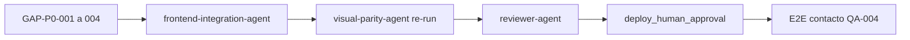

# Reflexión de Ejecución — Novus Intelligence Solutions

**Proyecto:** novus-intelligence  
**Workflow:** novus-intelligence-lovable-to-web  
**Paso:** paso-13-reflexion (fase Reflection)  
**Agente:** reflection-agent  
**Patrón:** Reflection Pattern  
**Fecha:** 2026-07-15  
**Runtime:** Cursor Cloud Agent (M6)  
**Target environment:** DEV — AWS `sa-east-1`  
**Plan:** PLAN-NOVUS-LOVABLE-2026-07-14 (`approved`)  
**Baseline Lovable:** novus-nexus @ `e3a9819`  
**Estado workflow al reflexionar:** **blocked** (qualityScore: 78)

---

## Workflow

| Campo | Valor |
|-------|-------|
| `workflowId` | novus-intelligence-lovable-to-web |
| `runId` | bc-7db90cca-6bbe-4914-bce2-8b237c3cd973 |
| Inicio corrida | 2026-07-14T08:30:00Z |
| Fin corrida (consolidado) | 2026-07-15T20:10:00Z |
| Duración total | ~35 h 40 min (127 200 s) |
| Agentes ejecutados | 17 de 19 habilitados |
| Agentes éxito | 13 |
| Agentes fallo | 2 (devops-agent, visual-parity-agent) |
| Agentes omitidos/N/A | 1 (database-agent) |
| Agentes bloqueados/pendientes | 2 (reviewer-agent, devops parcial) |
| Repos productivos mergeados | 2 (NovusIntelligenceWEB + NovusIntelligenceBack → `main`) |
| PRs Framework abiertos | 14 (draft) |

### Evolución de la corrida

| Fecha | Hito | qualityScore | Bloqueante principal |
|-------|------|--------------|----------------------|
| 2026-07-14 | QA FAIL (lint) + Security FAIL (IAM/rate limit) | 62 | lint WEB, SEC-001/002 |
| 2026-07-15 | Re-validación QA PASS + Security PASS sobre `main` | — | Remediados QA-001, SEC-001, SEC-002 |
| 2026-07-15 | Visual parity FAIL — 0/12 capturas PASS | **78** | **VP-001** (`visual_exact_parity`) |

### Agentes involucrados por fase

| Fase | Agentes | Resultado |
|------|---------|-----------|
| Event Trigger | workflow-agent | ✅ |
| Planning | lovable-analyzer-agent, planner-agent, backend-impact-agent | ✅ |
| Plan Review | architect-agent | ✅ — plan `approved` |
| Execution | frontend-integration-agent, backend-agent, cloud-agent | ✅ Merge a `main`; paridad visual pendiente |
| Execution | devops-agent | ❌ — `pipeline-config.md` ausente |
| Execution | database-agent | ⏭️ N/A |
| Validation | qa-agent | ✅ PASS (re-validación 2026-07-15) |
| Validation | security-agent | ✅ PASS (re-validación 2026-07-15) |
| Validation | visual-parity-agent | ❌ FAIL — 0/12 capturas |
| Validation | reviewer-agent | ⏸️ Bloqueado por paridad visual |
| Documentation | documentation-agent | ✅ |
| Metrics | metrics-agent | ✅ |
| Reflection | reflection-agent | ✅ (este artefacto — re-ejecución post re-validaciones) |
| Knowledge | knowledge-base-agent, adr-agent | ✅ (artefactos 2026-07-14; actualización incremental recomendada) |

---

## Qué se hizo

### Planning y Plan Review (exitoso)

1. **lovable-analyzer-agent** detectó 13 cambios (CHG-001–CHG-013) en el commit `e3a9819`, con `backendRequired: true`.
2. **planner-agent** generó `plan-implementacion.md` con 9 fases, mapeo TanStack → React Router y mitigaciones R-001 a R-008.
3. **backend-impact-agent** especificó `POST /api/v1/contact` sin persistencia en BD.
4. **architect-agent** aprobó el plan (`status: approved`) y documentó impacto en `impacto-arquitectonico.md`.

### Execution (completada en repos productivos)

5. **frontend-integration-agent** implementó el sitio corporativo en **NovusIntelligenceWEB** (`main`):
   - Fases 0–4: design system dark-first, 10 rutas, layout, landing, contenido, 6 slugs, `MultiAgentDemo` lazy-loaded.
   - Fase 6 parcial: UI contacto sin fallback demo (R-001 mitigado).
   - Remediación iterativa de rutas gate (`/`, `/about`, `/services`, `/contact`) documentada en `resumen-frontend.md`.

6. **backend-agent** implementó `novus-contact-handler` en **NovusIntelligenceBack** (`main`):
   - Validación V1–V10, CORS lista blanca, captcha preparado (deshabilitado DEV).
   - Remediación SEC-001 (IAM SES acotado) y SEC-002 (`isIpRateLimited()` activo).

7. **cloud-agent** reconcilió `environments/dev.yml` a `sa-east-1` y generó `propuesta-infra.md`. Sin despliegue (`NO_DEPLOY`).

8. **documentation-agent** y **metrics-agent** consolidaron estado en `resumen-ejecucion.md` y `metricas-ejecucion.json`.

### Validation (parcial — bloqueo visual)

9. **qa-agent** — re-validación 2026-07-15: build + lint PASS en `main`; `qualityScore: 100`.
10. **security-agent** — re-validación 2026-07-15: PASS; `securityScore: 88`; observaciones no bloqueantes SEC-003–007.
11. **visual-parity-agent** — FAIL: 0/12 capturas PASS (4 rutas × 3 viewports); `maxDiffRatio: 0.486653` en `/contact` @ 390×844.

### Constraints respetados

| Constraint | Evidencia |
|------------|-----------|
| `NO_DEPLOY` | Sin apply IaC ni publicación DEV por agentes |
| `NO_SECRETS_IN_REPO` | Escaneos QA/Security sin credenciales |
| `NO_LOVABLE_CODE_COPY` | Gates pass; reimplementación verificada |
| `PLAN_MUST_BE_APPROVED` | `status: approved` desde paso 06 |
| `TARGET_DEV_REGION_SA_EAST_1` | `dev.yml` y `propuesta-infra.md` alineados |
| `NO_PRODUCTIVE_CODE` (reflection) | Solo artefactos de conocimiento |

---

## Qué falló

### Gate bloqueante activo

| Gate | ID | Descripción | Agente responsable |
|------|----|-------------|-------------------|
| `visual_exact_parity` | VP-001 | 0/12 capturas PASS; umbral ≤ 0,2 % no alcanzado; máximo diff 48,7 % en `/contact` móvil (tema claro vs dark-first) | frontend-integration-agent |

**Gaps P0 identificados** (según `resumen-metricas.md`, `resumen-ejecucion.md`):

| ID | Alcance | Causa raíz probable |
|----|---------|---------------------|
| GAP-P0-001 | Global — logo de marca | Assets no integrados en Header/Footer |
| GAP-P0-002 | `/contact` — sección formulario | Fondo claro Lovable vs dark-first global |
| GAP-P0-003 | `/` — testimonios | Bloque con fondo claro y cards blancas ausente |
| GAP-P0-004 | `/` — secciones landing | Copy y estructura divergentes vs referencia |

### Tareas no completadas (seguimiento)

| ID | Descripción | Impacto | Bloqueante |
|----|-------------|---------|------------|
| DEVOPS-001 | `pipeline-config.md` ausente — TASK-DEVOPS-001 | CI/CD no documentado formalmente | No |
| BE-ART-001 | `resumen-backend.md` no mergeado al Framework | Trazabilidad backend incompleta | No |
| REV-001 | `reviewer-agent` no ejecutado | Bloqueado por VP-001 | Sí (cadena) |
| E2E-001 | Prueba E2E contacto post-deploy | Bloqueada por `NO_DEPLOY` | No (esperado) |

### Remediados en esta corrida (ya no bloquean)

| ID | Gate | Descripción | Evidencia remediación |
|----|------|-------------|----------------------|
| QA-001 | `build_success` | 4 errores ESLint `@typescript-eslint/no-empty-object-type` en UI WEB | Re-validación QA 2026-07-15: lint 0 errores en `main` |
| SEC-001 | `security_pass` | IAM SES `Resource: '*'` | Acotado a `identity/*` scoped |
| SEC-002 | `security_pass` | Rate limit por IP no conectado | `isIpRateLimited()` activo en handler |

### Desviaciones plan vs resultado

| Fase plan | Esperado | Real | Gap |
|-----------|----------|------|-----|
| 1–2 — Layout/landing | Paridad visual Lovable | Implementado; diff visual alto | VP-001 |
| 6 — Contacto integración | E2E con API DEV | UI en `main`; API no desplegada | Esperado por `NO_DEPLOY` |
| 7 — Infra/DevOps | Propuesta + pipeline | Propuesta ✅; pipeline ❌ | DEVOPS-001 |
| 9 — Validación | Pass completo | QA ✅ Security ✅; paridad ❌ | reviewer pendiente |

---

## Qué se aprendió

### Patrones exitosos

1. **Separación planificación/ejecución/validación.** Plan `approved` antes de código productivo; trazabilidad CHG-xxx verificable en cada fase.

2. **Reimplementación Lovable sin copia directa.** Sitio completo (10 rutas, design system, `MultiAgentDemo`) traducido a React + Tailwind propio. Gates `no_lovable_code_copy` y `no_mock_data_in_production` en PASS tras re-validación.

3. **Mitigación R-001 anti-demo coherente.** Frontend sin fallback; backend con `randomUUID()` real. Validado en QA y Security.

4. **Re-validación post-merge desbloquea gates técnicos.** Tras merge a `main`, QA y Security remediaron lint, IAM y rate limit independientemente de paridad visual. Patrón: **validar sobre rama definitiva**, no solo feature branches.

5. **Reconciliación región cloud (TASK-INFRA-001).** Discrepancia `us-east-1` vs `sa-east-1` resuelta en cloud-agent sin bloquear frontend/backend.

6. **Blackboard como memoria evolutiva del workflow.** `resumen-ejecucion.md` + `metricas-ejecucion.json` + informes de validación permitieron re-ejecutar reflexión con estado actualizado (+16 puntos qualityScore) sin reiniciar la corrida.

7. **Iteración frontend previa a gate formal.** `resumen-frontend.md` documenta remediaciones proactivas en rutas gate; útil como insumo aunque no sustituye `visual-parity-agent`.

### Anti-patrones detectados

1. **Interface vacía extends en componentes UI shadcn-style (ANTI-001).** Remediado; usar `type X = Y` en futuras iteraciones.

2. **Dead code security — utilidades no invocadas (ANTI-002).** Remediado en SEC-002; validar conexión pre-handoff.

3. **Desalineación serverless.yml vs propuesta-infra.md (ANTI-003).** Remediado en SEC-001; mantener checklist post cloud-agent.

4. **Agente DevOps omitido (ANTI-004).** `pipeline-config.md` ausente; workflow avanzó a Validation sin documentación CI/CD.

5. **Handoff executor sin lint local (ANTI-005).** Evitable con pre-check; remediado tras re-validación.

6. **Dark-first global ignorando alternancia claro/oscuro por sección (ANTI-006 — nuevo).** Lovable usa secciones con fondo claro (contacto, testimonios) dentro de sitio dark-first. Aplicar dark-first de forma global produce diffs >40 % en rutas híbridas.

7. **Activar visual-parity-agent sin checklist previo de assets (ANTI-007 — nuevo).** Logo, OG image y favicon no integrados amplifican diff global (GAP-P0-001) antes de evaluar layout por ruta.

8. **Asumir que build/lint/security PASS implica readiness para deploy (ANTI-008 — nuevo).** Gate `visual_exact_parity` (umbral 0,2 %) es independiente y más estricto; bloquea auto-deploy DEV aun con código funcional correcto.

### Aprendizajes operativos

- **QualityScore 78** (+16 vs registro inicial): ejecución sólida penalizada por un único gate bloqueante visual (88,9 % gates pass).
- **Candidato DEV (CloudFront)** usado por visual-parity-agent es despliegue previo, no de esta corrida — coherente con `NO_DEPLOY`.
- **KB Agent** procesó aprendizajes 2026-07-14 (qualityScore 62); esta re-reflexión recomienda entradas incrementales para paridad visual (ver `recomendaciones-kb.json`).

---

## Recomendaciones

### Actualizaciones sugeridas para Knowledge Base

Ver `recomendaciones-kb.json`. Resumen de entradas nuevas/incrementales:

1. **Checklist assets de marca** antes de visual-parity-agent (logo, OG, favicon).
2. **Patrón alternancia tema claro/oscuro** por sección en páginas híbridas.
3. **Gate visual_exact_parity** desacoplado de build/lint/security — expectativas de workflow.
4. **Flujo `remediate_frontend_then_recheck`** como plantilla reutilizable.
5. Mantener entradas KB-001–KB-007 (lint, IAM, rate limit, handoff, routing, anti-mock, QA estático) — varias ya consolidadas en `.nadf/global/knowledge-base/`.

### ADRs pendientes de registro

| Tema | Justificación | Urgencia |
|------|---------------|----------|
| Rate limiting por IP (ADR-REC-001) | Decisión no formalizada (DynamoDB vs WAF) | before_dev_deploy |
| Gestión secretos SSM vs env (ADR-REC-002) | SEC-003 desalineación | before_prod_deploy |

> ADR-0006 ya cubre paridad visual y auto-deploy DEV. No requiere ADR nuevo para el gate en sí.

### Mejoras de workflow propuestas

1. **Checklist pre-visual-parity** en `tareas-ejecutor.json`: assets de marca + mapeo secciones claro/oscuro por ruta gate.
2. **Gate `devops_pipeline_documented`** antes de Validation cuando `requires_infra: true`.
3. **Re-ejecutar reflection-agent** tras cada cambio de bloqueante dominante (patrón demostrado en esta re-ejecución).
4. **Separar qualityScore de workflowStatus**: score 78 con status blocked es informativo; documentar ambos explícitamente.

---

## Secuencia de desbloqueo recomendada

| Orden | Agente | Acción |
|-------|--------|--------|
| 1 | frontend-integration-agent | Remediar GAP-P0-001 a GAP-P0-004 (assets, tema contacto, testimonios, landing) |
| 2 | visual-parity-agent | Re-ejecutar capturas 4 rutas × 3 viewports |
| 3 | reviewer-agent | Revisión de coherencia y diff |
| 4 | devops-agent | Completar TASK-DEVOPS-001 (`pipeline-config.md`) — paralelizable |
| 5 | knowledge-base-agent | Consolidar KB-008–KB-011 de `recomendaciones-kb.json` |
| 6 | (humano) | `deploy_human_approval` → E2E contacto |

---

## Métricas de reflexión

| Campo | Valor |
|-------|-------|
| `agentName` | reflection-agent |
| `reflectionSummary` | Corrida Lovable→Web avanzó de blocked (62) a blocked (78): QA y Security remediados en main, pero paridad visual exacta falla en 12/12 capturas. Remediación frontend P0 requerida antes de reviewer y deploy. |
| `patternsIdentified` | 7 patrones exitosos, 8 anti-patrones (3 remediados, 5 activos/seguimiento) |
| `failuresDocumented` | 1 bloqueante activo (VP-001), 4 seguimiento, 3 remediados |
| `kbUpdatesRecommended` | 11 entradas en `recomendaciones-kb.json` (4 nuevas post-paridad) |

---

## Próximo agente sugerido

**frontend-integration-agent** — Remediar divergencias de paridad visual (GAP-P0-001 a GAP-P0-004) según `resumen-ejecucion.md` y `resumen-metricas.md`. Tras PASS de visual-parity-agent: **reviewer-agent**.

---

## Referencias

- `artifacts/plan-implementacion.md`
- `artifacts/resumen-ejecucion.md`
- `artifacts/metricas-ejecucion.json`
- `artifacts/resumen-metricas.md`
- `artifacts/informe-qa.md` / `qa-result.json`
- `artifacts/informe-seguridad.md` / `security-result.json`
- `artifacts/resumen-frontend.md`
- `artifacts/resumen-cloud.md`
- `artifacts/propuesta-infra.md`
- `artifacts/recomendaciones-kb.json`
- `docs/reflection-learning.md`
- ADR-0006-visual-parity-and-auto-dev-deploy

---

## Historial

| Fecha | Acción | Agente |
|-------|--------|--------|
| 2026-07-14 | Reflexión inicial — workflow blocked, qualityScore 62 | reflection-agent |
| 2026-07-15 | Re-reflexión post re-validaciones QA/SEC PASS y paridad visual FAIL — qualityScore 78 | reflection-agent |
