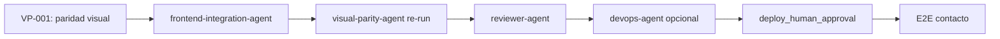

# Reflexión de Ejecución — Novus Intelligence Solutions

**Proyecto:** novus-intelligence  
**Workflow:** novus-intelligence-lovable-to-web  
**Paso:** paso-13-reflexion (fase Reflection)  
**Agente:** reflection-agent  
**Patrón:** Reflection Pattern  
**Fecha:** 2026-07-14  
**Runtime:** Cursor Cloud Agent (M6)  
**Target environment:** DEV — AWS `sa-east-1`  
**Plan:** PLAN-NOVUS-LOVABLE-2026-07-14 (`approved`)  
**Baseline Lovable:** novus-nexus @ `e3a9819` (análisis); referencia paridad @ `746c129`  
**Run ID:** `bc-7db90cca-6bbe-4914-bce2-8b237c3cd973`  
**Estado workflow al reflexionar:** **blocked** (qualityScore: 62)

---

## Workflow

| Campo | Valor |
|-------|-------|
| `workflowId` | novus-intelligence-lovable-to-web |
| `runId` | bc-7db90cca-6bbe-4914-bce2-8b237c3cd973 |
| Inicio corrida | 2026-07-14T08:30:00Z |
| Fin corrida (consolidado) | 2026-07-14T21:00:00Z |
| Duración total | ~12 h 30 min (45 000 s) |
| Agentes ejecutados | 17 de 19 habilitados |
| Agentes éxito | 14 |
| Agentes fallo | 2 (devops-agent, visual-parity-agent) |
| Agentes omitidos/N/A | 1 (database-agent) |
| Agentes bloqueados/pendientes | 1 (reviewer-agent) |
| PRs Framework abiertos | 8 (draft) + ramas revalidación |
| Repos productivos mergeados | 2 (NovusIntelligenceWEB + NovusIntelligenceBack → `main`) |

### Agentes involucrados por fase

| Fase | Agentes | Resultado |
|------|---------|-----------|
| Event Trigger | workflow-agent | ✅ |
| Planning | lovable-analyzer-agent, planner-agent, backend-impact-agent | ✅ |
| Plan Review | architect-agent | ✅ — plan `approved` |
| Execution | frontend-integration-agent, backend-agent, cloud-agent | ✅ — mergeado en `main` |
| Execution | devops-agent | ❌ — `pipeline-config.md` ausente |
| Execution | database-agent | ⏭️ N/A |
| Validation | qa-agent | ✅ PASS (revalidación post-merge) |
| Validation | visual-parity-agent | ❌ FAIL — 0/12 capturas |
| Validation | security-agent | ✅ PASS condicional DEV |
| Validation | reviewer-agent | ⏸️ Bloqueado por `visual_exact_parity` |
| Documentation | documentation-agent | ✅ |
| Metrics | metrics-agent | ✅ |
| Reflection | reflection-agent | ✅ (este artefacto) |

---

## Qué se hizo

### Planning y Plan Review (exitoso)

1. **lovable-analyzer-agent** detectó 13 cambios (CHG-001–CHG-013) en el commit `e3a9819`, con `backendRequired: true`. Produjo `cambios-lovable.json`, impactos frontend/backend y matriz de riesgos.
2. **planner-agent** generó `plan-implementacion.md` (PLAN-NOVUS-LOVABLE-2026-07-14) con 9 fases, mapeo de rutas TanStack → React Router y mitigaciones R-001 a R-008.
3. **backend-impact-agent** especificó la API de contacto (`POST /api/v1/contact`) sin persistencia en BD.
4. **architect-agent** aprobó el plan y documentó impacto arquitectónico en `impacto-arquitectonico.md`.

### Execution (completada y mergeada)

5. **frontend-integration-agent** implementó el sitio corporativo completo en **NovusIntelligenceWEB** (`main` @ `cdd9f95`):
   - Fases 0–4 del plan: design system dark-first, 10 rutas, layout, landing, contenido, soluciones dinámicas (6 slugs), `MultiAgentDemo` lazy-loaded.
   - Fase 6 parcial: UI de contacto sin fallback demo (R-001 mitigado).
   - Build Vite y lint exitosos (QA-001 corregido en `eead55f`).

6. **backend-agent** implementó `novus-contact-handler` en **NovusIntelligenceBack** (`main` @ `bf3bd2b`):
   - Validación server-side V1–V10, CORS con lista blanca, captcha preparado (deshabilitado en DEV).
   - SEC-001 (IAM SES) y SEC-002 (rate limit por IP) corregidos en `d851201`.

7. **cloud-agent** reconcilió `environments/dev.yml` a región `sa-east-1` y generó `propuesta-infra.md` con stacks, secrets paths y checklist de deploy. Sin despliegue (`NO_DEPLOY`).

### Validation (parcial — bloqueo por paridad visual)

8. **qa-agent** revalidó tras merge a `main`: `qualityScore: 100`, todos los gates QA bloqueantes en PASS.
9. **security-agent** revalidó `main`: `securityScore: 82`, PASS condicional DEV (advertencias CORS pre-prod).
10. **visual-parity-agent** ejecutó comparación pixel-a-pixel: **0/12 capturas PASS**, `maxDiffRatio: 0.234509` (117× sobre umbral 0.002).

### Knowledge (documentación y métricas)

11. **documentation-agent** consolidó la corrida en `resumen-ejecucion.md`.
12. **metrics-agent** registró métricas en `metricas-ejecucion.json` (qualityScore: 62).

### Constraints respetados

| Constraint | Evidencia |
|------------|-----------|
| `NO_DEPLOY` | Sin apply IaC ni publicación DEV |
| `NO_SECRETS_IN_REPO` | Escaneos QA/Security sin credenciales |
| `NO_LOVABLE_CODE_COPY` | Gates pass; reimplementación verificada |
| `PLAN_MUST_BE_APPROVED` | `status: approved` desde paso 06 |
| `TARGET_DEV_REGION_SA_EAST_1` | `dev.yml` y `propuesta-infra.md` alineados |
| `NO_PRODUCTIVE_CODE` (reflection) | Solo artefactos de conocimiento |

---

## Qué falló

### Gate bloqueante activo

| Gate | ID hallazgo | Descripción | Agente responsable |
|------|-------------|-------------|-------------------|
| `visual_exact_parity` | VP-001 | 0/12 capturas PASS; `maxDiffRatio: 0.234509` vs umbral `0.002` | frontend-integration-agent |

**Desviaciones materiales:** hero (copy, CTA, visual de marca), partners cloud (texto vs logos), grids landing (3-col vs 5-col), testimonios (fondo oscuro vs blanco), footer (4 vs 5 columnas), header (logo/branding), tokens globales (gradientes, sombras, tipografía). Detalle en `gaps-paridad.json` e `informe-paridad-visual.md`.

### Gates resueltos en esta corrida

| Gate | ID hallazgo | Estado | Evidencia |
|------|-------------|--------|-----------|
| `build_success` | QA-001 | ✅ Resuelto | Lint 0 errores en `main` @ `eead55f` |
| `security_pass` | SEC-001 | ✅ Resuelto | IAM SES acotado a `identity/*` @ `d851201` |
| `security_pass` | SEC-002 | ✅ Resuelto | `isIpRateLimited()` conectado en handler |

### Tareas no completadas

| ID | Descripción | Impacto |
|----|-------------|---------|
| DEVOPS-001 | `pipeline-config.md` ausente — TASK-DEVOPS-001 no ejecutada | Sin documentación CI/CD consolidada en Blackboard |
| BE-ART-001 | `resumen-backend.md` en rama remota no mergeado al Framework | Trazabilidad backend incompleta |
| REV-001 | `reviewer-agent` no ejecutado | Bloqueado por `visual_exact_parity` FAIL |
| E2E-001 | Prueba E2E contacto post-deploy | Bloqueada por `NO_DEPLOY` + API no desplegada |

### Desviaciones plan vs resultado

| Fase plan | Esperado | Real | Gap |
|-----------|----------|------|-----|
| 6 — Contacto integración | E2E con API DEV | UI lista en `main`; sin API desplegada | Esperado por `NO_DEPLOY` |
| 7 — Infra/DevOps | Propuesta + pipeline | Propuesta ✅; pipeline ❌ | devops-agent no ejecutó TASK-DEVOPS-001 |
| 9 — Validación | Pass completo | QA ✅; Security ✅; Paridad ❌; Reviewer pendiente | Bloqueo principal: paridad visual |

### Efecto en cadena de validación

La remediación iterativa de QA-001 y SEC-001/SEC-002 demostró que los gates funcionan como diseñado: correcciones en `main` → revalidación → PASS. Sin embargo, el gate `visual_exact_parity` (ADR-0006) bloquea **reviewer-agent** y el despliegue DEV automático, aunque el código funcional y los gates de intención (sin copia Lovable, sin mocks, sin secrets) ya pasan.

---

## Qué se aprendió

### Patrones exitosos

1. **Separación planificación/ejecución/validación.** El plan `approved` por architect-agent antes de código productivo permitió trazabilidad clara: cada fase de ejecución mapea a tareas del plan con IDs CHG-xxx verificables.

2. **Reimplementación Lovable sin copia directa.** El workflow demostró que es viable implementar un sitio corporativo completo (10 rutas, design system, componente interactivo `MultiAgentDemo`) reimplementando intención visual/funcional en React + Tailwind, sin importar código de novus-nexus. Gates `no_lovable_code_copy` y `no_mock_data_in_production` pasan en validación.

3. **Mitigación R-001 (modo demo) desde diseño.** Tanto frontend (`submitContact()` retorna error sin `VITE_NOVUS_API_URL`) como backend (`randomUUID()` sin prefijo `demo-`) implementaron la política anti-mock de forma coherente.

4. **Remediación iterativa post-merge.** QA-001 (lint) y SEC-001/SEC-002 (IAM + rate limit) se corrigieron en `main` y revalidaron con PASS. Patrón: fallo inicial → corrección en repo productivo → re-ejecución del agente validador → desbloqueo parcial.

5. **Reconciliación de región en planning constraints.** TASK-INFRA-001 alineó `dev.yml` a `sa-east-1` sin bloquear ejecución frontend/backend.

6. **Blackboard como insumo de reflexión.** `resumen-ejecucion.md` + `metricas-ejecucion.json` + informes QA/Security/Paridad permiten reflexión aun con workflow bloqueado.

7. **Gate visual_exact_parity como filtro de calidad visual.** El checker pixel-a-pixel detectó desviaciones sistemáticas (copy, layout, tokens) que QA estático no captura — valida la necesidad de ADR-0006 como gate bloqueante independiente.

### Anti-patrones detectados

1. **Paridad visual diferida hasta Validation.** El frontend se mergeó a `main` sin validación visual previa; el gate `visual_exact_parity` falló con diff > 20 % en todas las capturas. La intención Lovable se tradujo funcionalmente pero no visualmente.

2. **Copy y layout divergentes de la referencia.** Títulos, CTAs y estructura de columnas (3 vs 5) difieren sistemáticamente del prototipo Lovable — sugiere que el executor usó `brand-context.md` o interpretación propia en lugar de alinear con la referencia visual gate.

3. **Candidato DEV desactualizado vs código mergeado.** La paridad se evaluó contra CloudFront (`d1bfu6klutpp8m.cloudfront.net`) que puede no reflejar el `main` más reciente; sin deploy (`NO_DEPLOY`), el candidato queda desalineado del código validado por QA.

4. **Referencia Lovable ad-hoc sin `NADF_LOVABLE_REFERENCE_URL`.** Se usó build local de `novus-nexus` porque la variable de entorno no estaba definida — reproducibilidad limitada entre corridas.

5. **Agente DevOps omitido en corrida.** Sin `pipeline-config.md`, la fase 7 del plan quedó incompleta. El workflow no tiene gate bloqueante explícito para DevOps.

6. **Dead code security (resuelto).** `rateLimitResponse()` definido pero no invocado — patrón corregido en `d851201`, pero ilustra riesgo de «falsa sensación de protección».

### Aprendizajes operativos del workflow

- **QualityScore 62** refleja 9/10 gates bloqueantes en PASS penalizado por paridad visual 0/12.
- **Validación estática responsive/SEO** aceptada por QA sin browser automation — limitación documentada.
- **Paridad visual requiere ciclo dedicado** post-implementación funcional, no puede asumirse por build/lint PASS.

---

## Recomendaciones

### Actualizaciones sugeridas para Knowledge Base

Ver `recomendaciones-kb.json` para estructura machine-readable. Resumen:

1. **Checklist remediación paridad visual** — tokens dark-first, layout 5-col, assets partners, footer 5 columnas.
2. **Flujo revalidación post-merge** — qa-agent → security-agent → visual-parity-agent en secuencia.
3. **Referencia Lovable estandarizada** — preferir `NADF_LOVABLE_REFERENCE_URL` sobre build local ad-hoc.
4. **Patrones ESLint, IAM SES, rate limiting** — ya documentados en KB (KB-001 a KB-003).
5. **Gate visual como fase pre-merge** — ejecutar visual-parity-agent antes de merge a `main`.

### ADRs pendientes de registro

| Tema | Justificación | Agente sugerido |
|------|---------------|-----------------|
| Rate limiting por IP en API pública serverless | Decisión no formalizada (DynamoDB vs WAF) | adr-agent |
| Gestión secretos SSM/Secrets Manager vs env plano | Desalineación SEC-003 | adr-agent |

> ADR-0006 ya cubre paridad visual y auto-deploy DEV. No se requiere ADR nuevo para la decisión de gate bloqueante.

### Mejoras de workflow propuestas

1. **Ejecutar visual-parity-agent en rama feature** antes de merge a `main`, no solo en Validation post-merge.
2. **Gate explícito `devops_pipeline_documented`** antes de Validation cuando `requires_infra: true`.
3. **Variable `NADF_LOVABLE_REFERENCE_URL` obligatoria** en Cloud Agent para corridas de paridad.
4. **Sincronizar candidato DEV** — build local como alternativa cuando `NO_DEPLOY` impide actualizar CloudFront.

---

## Secuencia de desbloqueo recomendada

| Orden | Agente | Acción |
|-------|--------|--------|
| 1 | frontend-integration-agent | Remediar gaps P0/P1 en `gaps-paridad.json` (13 gaps) |
| 2 | visual-parity-agent | Re-ejecutar checker hasta 12/12 PASS |
| 3 | reviewer-agent | Revisión de coherencia y diff |
| 4 | devops-agent | Completar TASK-DEVOPS-001 (`pipeline-config.md`) |
| 5 | knowledge-base-agent | Consolidar nuevas recomendaciones KB de paridad visual |
| 6 | (humano) | Aprobar despliegue DEV si gates PASS |

---

## Métricas de reflexión

| Campo | Valor |
|-------|-------|
| `agentName` | reflection-agent |
| `reflectionSummary` | Primera corrida Lovable→Web mayormente exitosa en planning y execution; QA y seguridad remediados en main; bloqueada por paridad visual (0/12 capturas, maxDiffRatio 0.234509) |
| `patternsIdentified` | 7 patrones exitosos, 6 anti-patrones |
| `failuresDocumented` | 1 bloqueante activo (VP-001), 4 seguimiento |
| `kbUpdatesRecommended` | 10 entradas en `recomendaciones-kb.json` |

---

## Próximo agente sugerido

**frontend-integration-agent** — Remediar paridad visual (VP-001) según `gaps-paridad.json` e `informe-paridad-visual.md`. Tras PASS de `visual_exact_parity`, ejecutar **reviewer-agent**.

---

## Referencias

- `artifacts/plan-implementacion.md`
- `artifacts/resumen-ejecucion.md`
- `artifacts/metricas-ejecucion.json`
- `artifacts/informe-qa.md` / `qa-result.json`
- `artifacts/informe-seguridad.md` / `security-result.json`
- `artifacts/informe-paridad-visual.md` / `visual-parity-result.json` / `gaps-paridad.json`
- `artifacts/resumen-frontend.md`
- `artifacts/resumen-cloud.md`
- `artifacts/propuesta-infra.md`
- `artifacts/recomendaciones-kb.json`
- `docs/reflection-learning.md`

---

## Historial

| Fecha | Acción | Agente |
|-------|--------|--------|
| 2026-07-14 | Reflexión inicial — bloqueo lint + security | reflection-agent |
| 2026-07-14 | Reconsolidación — QA/Security PASS, paridad visual FAIL, productos en main | reflection-agent |
