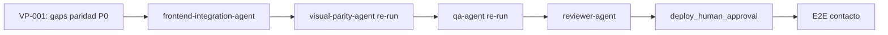

# Reflexión de Ejecución — Novus Intelligence Solutions

**Proyecto:** novus-intelligence  
**Workflow:** novus-intelligence-lovable-to-web  
**Paso:** paso-13-reflexion (fase Reflection)  
**Agente:** reflection-agent  
**Patrón:** Reflection Pattern  
**Fecha:** 2026-07-16  
**Runtime:** Cursor Cloud Agent (M6)  
**Target environment:** DEV — AWS `sa-east-1`  
**Plan:** PLAN-NOVUS-LOVABLE-2026-07-14 (`approved`)  
**Baseline Lovable:** novus-nexus @ `e3a9819`  
**Run ID:** bc-7db90cca-6bbe-4914-bce2-8b237c3cd973  
**Estado workflow al reflexionar:** **blocked** (qualityScore: 61)

---

## Workflow

| Campo | Valor |
|-------|-------|
| `workflowId` | novus-intelligence-lovable-to-web |
| `runId` | bc-7db90cca-6bbe-4914-bce2-8b237c3cd973 |
| Inicio corrida | 2026-07-14T08:30:00Z |
| Fin corrida (consolidado) | 2026-07-16T01:55:00Z |
| Duración total | ~41 h 25 min (149 100 s) |
| Agentes ejecutados | 17 de 19 habilitados |
| Agentes éxito/parcial | 14 |
| Agentes fallo | 2 (devops-agent, visual-parity-agent) |
| Agentes omitidos/N/A | 1 (database-agent) |
| Agentes bloqueados/pendientes | 2 (reviewer-agent, qa-agent re-validación) |
| Repos productivos mergeados | NovusIntelligenceWEB + NovusIntelligenceBack (`main`) |
| PRs Framework abiertos | 8+ (draft) |

### Agentes involucrados por fase

| Fase | Agentes | Resultado |
|------|---------|-----------|
| Event Trigger | workflow-agent | ✅ |
| Planning | lovable-analyzer-agent, planner-agent, backend-impact-agent | ✅ |
| Plan Review | architect-agent | ✅ — plan `approved` |
| Execution | frontend-integration-agent, backend-agent, cloud-agent | ✅ — código en `main` |
| Execution | devops-agent | ❌ — `pipeline-config.md` ausente |
| Execution | database-agent | ⏭️ N/A |
| Validation | security-agent | ✅ PASS (score 88, 2026-07-16) |
| Validation | qa-agent | ⚠️ FAIL inicial; re-validación pendiente |
| Validation | visual-parity-agent | ❌ FAIL — 0/12 capturas |
| Validation | reviewer-agent | ⏸️ Bloqueado por paridad visual |
| Documentation | documentation-agent | ✅ |
| Metrics | metrics-agent | ✅ |
| Reflection | reflection-agent | ✅ (este artefacto) |
| Knowledge | knowledge-base-agent, adr-agent | ✅ (iteración previa) |

---

## Qué se hizo

### Planning y Plan Review (exitoso)

1. **lovable-analyzer-agent** detectó 13 cambios (CHG-001–CHG-013) en el commit `e3a9819`, con `backendRequired: true`.
2. **planner-agent** generó `plan-implementacion.md` (PLAN-NOVUS-LOVABLE-2026-07-14) con 9 fases y mitigaciones R-001 a R-008.
3. **backend-impact-agent** especificó la API de contacto (`POST /api/v1/contact`) sin persistencia en BD.
4. **architect-agent** aprobó el plan y documentó impacto arquitectónico.

### Execution (completada y mergeada)

5. **frontend-integration-agent** implementó el sitio corporativo completo en **NovusIntelligenceWEB** (`main`):
   - Fases 0–4: design system, 10 rutas, layout, landing, contenido, soluciones (6 slugs), `MultiAgentDemo` lazy-loaded.
   - Fase 6 parcial: UI de contacto sin fallback demo (R-001 mitigado).
   - Lint corregido (2026-07-16): 0 errores ESLint tras remediación de interfaces vacías.

6. **backend-agent** implementó `novus-contact-handler` en **NovusIntelligenceBack** (`main`):
   - Validación server-side V1–V10, CORS con lista blanca, captcha preparado.
   - Remediación SEC-001 (IAM SES acotado) y SEC-002 (rate limit por IP conectado) — mergeado en `main`.

7. **cloud-agent** reconcilió `environments/dev.yml` a región `sa-east-1` y generó `propuesta-infra.md`. Sin despliegue (`NO_DEPLOY`).

8. **visual-parity-agent** ejecutó checker pixel-a-pixel (Playwright + pixelmatch): 12 capturas en 4 rutas × 3 viewports. CloudFront DEV = build local (diff 0); el fallo es de implementación frontend, no de despliegue.

9. **security-agent** re-validó (2026-07-16): **PASS** score 88 — SEC-001/SEC-002 resueltos; 6 observaciones no bloqueantes.

10. **documentation-agent** y **metrics-agent** consolidaron corrida en `resumen-ejecucion.md` y `metricas-ejecucion.json`.

### Constraints respetados

| Constraint | Evidencia |
|------------|-----------|
| `NO_DEPLOY` | Sin apply IaC ni publicación DEV autónoma |
| `NO_SECRETS_IN_REPO` | Escaneos QA/Security sin credenciales |
| `NO_LOVABLE_CODE_COPY` | Gates pass; reimplementación verificada |
| `PLAN_MUST_BE_APPROVED` | `status: approved` desde paso-06 |
| `TARGET_DEV_REGION_SA_EAST_1` | `dev.yml` y `propuesta-infra.md` alineados |
| `NO_PRODUCTIVE_CODE` (reflection) | Solo artefactos de conocimiento |

---

## Qué falló

### Gates bloqueantes fallidos o pendientes

| Gate | ID | Descripción | Estado |
|------|-----|-------------|--------|
| `visual_exact_parity` | VP-001 | 0/12 capturas PASS; `maxDiffRatio` 0.096091 (home móvil 390×844) vs umbral 0.002 | ❌ **FAIL** |
| `build_success` | QA-RE | QA inicial FAIL (lint 2026-07-14); remediación reportada sin re-validación formal | ⚠️ **Pendiente** |
| `security_pass` | SEC-001/002 | IAM SES wildcard + rate limit no conectado | ✅ **Resuelto** (2026-07-16) |

### Tareas no completadas

| ID | Descripción | Impacto |
|----|-------------|---------|
| DEVOPS-001 | `pipeline-config.md` ausente — TASK-DEVOPS-001 no ejecutada | Sin documentación CI/CD |
| BE-ART-001 | `resumen-backend.md` en rama remota no mergeado al Framework | Trazabilidad backend incompleta |
| REV-001 | `reviewer-agent` no ejecutado | Bloqueado por `visual_exact_parity` FAIL |
| E2E-001 | Prueba E2E contacto post-deploy | Bloqueada por `NO_DEPLOY` |

### Evolución de bloqueadores (aprendizaje clave)

| Fecha | Bloqueador principal | Acción | Resultado |
|-------|---------------------|--------|-----------|
| 2026-07-14 | QA-001 (lint WEB) + SEC-001/002 | Remediación frontend + backend | Lint corregido; security resuelto en `main` |
| 2026-07-16 | VP-001 (paridad visual) | visual-parity-agent ejecutado | Bloqueo migra a paridad visual — gate independiente de build/security |

### Gaps de paridad visual prioritarios (P0)

| ID | Área | Hallazgo principal |
|----|------|-------------------|
| VP-GAP-001 | design-tokens | Tokens HSL no reproducen oklch/gradientes cyan→púrpura de Lovable |
| VP-GAP-002 | Button | Productivo usa `rounded-full` pill; referencia `rounded-md` compacto |
| VP-GAP-003 | Header | Falta nav item «Registro empresas» (6 vs 7 links) |
| VP-GAP-004 | Hero | Eyebrow, H1, stats row y glow desalineados |
| VP-GAP-005 | ContactForm | Inputs `h-11 rounded-xl` vs referencia `h-9 rounded-md` |
| VP-GAP-006 | Testimonials | Logos, badge flecha y fondo sección clara |

### Desviaciones plan vs resultado

| Fase plan | Esperado | Real | Gap |
|-----------|----------|------|-----|
| 6 — Contacto integración | E2E con API DEV | UI lista; sin API desplegada | Esperado por `NO_DEPLOY` |
| 7 — Infra/DevOps | Propuesta + pipeline | Propuesta ✅; pipeline ❌ | devops-agent omitido |
| 9 — Validación | Pass completo | Paridad visual FAIL; reviewer pendiente | Bloqueo activo |

---

## Qué se aprendió

### Patrones exitosos

1. **Separación planificación/ejecución/validación.** Plan `approved` antes de código productivo; trazabilidad CHG-xxx verificable en cada fase.

2. **Traducción intención Lovable sin copia directa.** Sitio completo (10 rutas, design system, `MultiAgentDemo`) reimplementado en React + Tailwind. Gates `no_lovable_code_copy` y `no_mock_data_in_production` en PASS.

3. **Mitigación R-001 anti-demo desde diseño.** Frontend y backend coherentes: sin fallback demo, sin `requestId: demo-*`.

4. **Remediación iterativa post-merge.** Security FAIL (score 72) → remediación en `main` → PASS (score 88). Demuestra viabilidad de ciclos de corrección sin revertir el workflow completo.

5. **Paridad visual como gate bloqueante independiente.** Aun con build, lint y security resueltos, `visual_exact_parity` impide `reviewer-agent` y cierre del workflow — comportamiento correcto según ADR-0006.

6. **CloudFront como candidato fiable.** Verificación local confirmó diff 0 entre build local y CloudFront DEV; el checker aísla fallos de implementación vs despliegue desactualizado.

7. **Blackboard como insumo de reflexión.** `resumen-ejecucion.md`, `metricas-ejecucion.json`, `gaps-paridad.json` e informes QA/Security permiten reflexión aun con workflow bloqueado.

8. **Reconciliación región cloud.** TASK-INFRA-001 alineó `dev.yml` a `sa-east-1` sin bloquear frontend/backend.

### Anti-patrones detectados

1. **Aproximación HSL vs oklch en design tokens (VP-GAP-001).** Traducir intención visual con valores HSL aproximados produce drift acumulado (ghosting tipográfico, gradientes desalineados). Mapear valores oklch explícitos de la referencia sin copiar `styles.css` literal.

2. **Geometría UI divergente sin validación pixel (VP-GAP-002).** Botones pill (`rounded-full`) vs referencia shadcn (`rounded-md`) impactan Header, Hero, CTA y formulario globalmente.

3. **Paridad visual declarada sin checker automatizado (ANTI-VP-001).** `resumen-frontend.md` reportó paridad ✅ por comparación manual; `visual-parity-agent` demostró FAIL 0/12 con diff hasta 9,6 %. No sustituir pixelmatch por revisión subjetiva.

4. **Dead code security (resuelto).** `rateLimitResponse()` definido pero no invocado — corregido en iteración 2026-07-16; patrón documentado para futuras corridas.

5. **Desalineación serverless.yml vs propuesta-infra.md (resuelto).** IAM SES `Resource: '*'` vs ARN acotado en propuesta — corregido; checklist pre-handoff sigue recomendado.

6. **Agente DevOps omitido.** Sin `pipeline-config.md`, fase 7 incompleta; workflow avanzó a Validation sin gate operativo explícito.

7. **Lint como sub-gate de build_success (resuelto).** Interfaces vacías shadcn-style bloquearon QA; remediado con `type` alias — patrón KB-001 aplicable.

### Aprendizajes operativos

- **QualityScore 61** (v4): ejecución sólida penalizada por paridad visual 0/12 y `build_success` pendiente re-validación.
- **Orden de remediación visual:** tokens → Button → Header → Hero → formulario → secciones landing (P1).
- **Cadena post-remediación:** frontend-integration-agent → visual-parity-agent → qa-agent → reviewer-agent.
- **8+ PRs draft** en Framework requieren estrategia de consolidación antes de promoción DEV.

---

## Recomendaciones

### Actualizaciones sugeridas para Knowledge Base

Ver `recomendaciones-kb.json` para estructura machine-readable. Resumen:

1. **Mapeo oklch → CSS variables** para paridad visual Lovable→Web (VP-GAP-001).
2. **Orden de remediación paridad visual** — tokens globales antes de componentes individuales.
3. **Obligatoriedad visual-parity-agent** — no declarar paridad sin checker pixelmatch.
4. **Flujo revalidación post-remediación** — cadena frontend → visual-parity → qa → reviewer.
5. **Patrones ya documentados** (ESLint shadcn, IAM SES, rate limit, anti-mock) — mantener; SEC-001/002 resueltos.

### ADRs pendientes de registro

| Tema | Justificación | Urgencia |
|------|---------------|----------|
| Gestión secretos SSM/Secrets Manager vs env plano (SEC-003) | Desalineación implementación vs propuesta | before_prod_deploy |
| Captcha obligatorio pre-prod (SEC-006) | Deshabilitado en DEV; requerido pre-prod | before_prod_deploy |

> Rate limiting (ADR-REC-001) queda parcialmente resuelto en implementación actual; adr-agent puede cerrar o actualizar según `informe-seguridad.md`.

### Mejoras de workflow propuestas

1. **Gate `visual_exact_parity` antes de reviewer-agent** — ya operativo; reforzar que frontend-integration-agent no declare paridad sin artefacto `visual-parity-result.json`.
2. **Gate explícito `devops_pipeline_documented`** cuando `requires_infra: true`.
3. **Pre-check lint + visual-parity smoke** en handoff executor → validation.
4. **Actualizar qualityScore** tras re-validación QA y paridad visual PASS.

---

## Secuencia de desbloqueo recomendada

| Orden | Agente | Acción |
|-------|--------|--------|
| 1 | frontend-integration-agent | Remediar VP-GAP-001 a VP-GAP-006 (P0) según `gaps-paridad.json` |
| 2 | visual-parity-agent | Re-ejecutar checker; objetivo 12/12 PASS |
| 3 | qa-agent | Re-validar lint + build en `main` |
| 4 | reviewer-agent | Revisión de coherencia y diff |
| 5 | devops-agent | Completar TASK-DEVOPS-001 (`pipeline-config.md`) |
| 6 | knowledge-base-agent | Incorporar nuevas entradas VP de `recomendaciones-kb.json` |

---

## Métricas de reflexión

| Campo | Valor |
|-------|-------|
| `agentName` | reflection-agent |
| `reflectionSummary` | Corrida Lovable→Web completó planning y execution con código en main; security PASS (88) tras remediación; bloqueada por paridad visual (0/12 capturas, maxDiffRatio 0.096091). QA re-validación pendiente. |
| `patternsIdentified` | 8 patrones exitosos, 7 anti-patrones |
| `failuresDocumented` | 1 bloqueante activo (VP-001), 3 seguimiento, 2 resueltos (SEC-001/002, QA-001 lint) |
| `kbUpdatesRecommended` | 10 entradas en `recomendaciones-kb.json` |

---

## Próximo agente sugerido

**frontend-integration-agent** — Remediar gaps P0 de paridad visual (`gaps-paridad.json` VP-GAP-001 a VP-GAP-006).

---

## Referencias

- `artifacts/plan-implementacion.md`
- `artifacts/resumen-ejecucion.md`
- `artifacts/metricas-ejecucion.json`
- `artifacts/informe-qa.md` / `qa-result.json`
- `artifacts/informe-paridad-visual.md` / `gaps-paridad.json` / `visual-parity-result.json`
- `artifacts/informe-seguridad.md` / `security-result.json`
- `artifacts/resumen-frontend.md`
- `artifacts/recomendaciones-kb.json`
- `docs/reflection-learning.md`

---

## Historial

| Fecha | Acción | Agente |
|-------|--------|--------|
| 2026-07-14 | Reflexión inicial — bloqueado por lint + security, qualityScore 62 | reflection-agent |
| 2026-07-16 | Actualización — security PASS; bloqueo migra a paridad visual; qualityScore 61 | reflection-agent |
