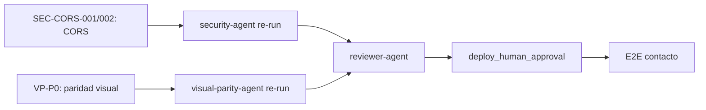

# Reflexión de Ejecución — Novus Intelligence Solutions

**Proyecto:** novus-intelligence  
**Workflow:** novus-intelligence-lovable-to-web  
**Paso:** paso-13-reflexion (fase Reflection)  
**Agente:** reflection-agent  
**Patrón:** Reflection Pattern  
**Fecha:** 2026-07-14  
**Runtime:** Cursor Cloud Agent (M6)  
**Run ID:** `bc-f66454ad-40b7-4fed-bacf-dbaab2ff697c`  
**Target environment:** DEV — AWS `sa-east-1`  
**Plan:** PLAN-NOVUS-LOVABLE-2026-07-14 (`approved`)  
**Baseline Lovable:** novus-nexus @ `e3a9819` (paridad ref. `746c129`)  
**Estado workflow al reflexionar:** **blocked** (qualityScore: 58)

---

## Workflow

| Campo | Valor |
|-------|-------|
| `workflowId` | novus-intelligence-lovable-to-web |
| `runId` (corrida original) | bc-7db90cca-6bbe-4914-bce2-8b237c3cd973 |
| `runId` (documentación) | bc-5b40c47d-2748-4810-a4d2-dc983a3a90fb |
| `runId` (métricas) | bc-a85bee59-d70f-4903-8b51-00283c6cc239 |
| Inicio corrida | 2026-07-14T08:30:00Z |
| Fin corrida (consolidado) | 2026-07-14T22:05:00Z |
| Duración total | ~13 h 35 min (48 900 s) |
| Agentes ejecutados | 17 de 19 habilitados |
| Agentes éxito | 13 |
| Agentes fallo | 3 (devops-agent, security-agent, visual-parity-agent) |
| Agentes omitidos/N/A | 1 (database-agent) |
| Agentes bloqueados | 1 (reviewer-agent) |
| Repos productivos mergeados | 2 (WEB @ cdd9f95, Back @ bf3bd2b) |
| PRs Framework abiertos | 8 (draft) |

### Agentes involucrados por fase

| Fase | Agentes | Resultado |
|------|---------|-----------|
| Event Trigger | workflow-agent | ✅ |
| Planning | lovable-analyzer-agent, planner-agent, backend-impact-agent | ✅ |
| Plan Review | architect-agent | ✅ — plan `approved` |
| Execution | frontend-integration-agent, backend-agent, cloud-agent | ⚠️ Parcial (paridad visual, CORS default) |
| Execution | devops-agent | ❌ — `pipeline-config.md` ausente |
| Execution | database-agent | ⏭️ N/A |
| Validation | qa-agent | ✅ PASS — qualityScore 100 |
| Validation | security-agent | ❌ FAIL — SEC-CORS-001 |
| Validation | visual-parity-agent | ❌ FAIL — 0/12 capturas |
| Validation | reviewer-agent | ⏸️ Bloqueado |
| Documentation | documentation-agent | ✅ |
| Metrics | metrics-agent | ✅ |
| Reflection | reflection-agent | ✅ (este artefacto) |

---

## Qué se hizo

### Planning y Plan Review (exitoso)

1. **lovable-analyzer-agent** detectó 13 cambios (CHG-001–CHG-013) en el commit `e3a9819`, con `backendRequired: true`.
2. **planner-agent** generó el plan PLAN-NOVUS-LOVABLE-2026-07-14 con 9 fases, mapeo TanStack → React Router y mitigaciones R-001 a R-008.
3. **backend-impact-agent** especificó la API de contacto (`POST /api/v1/contact`) sin persistencia en BD.
4. **architect-agent** aprobó el plan (`status: approved`).

### Execution (mayormente completada y mergeada)

5. **frontend-integration-agent** implementó el sitio corporativo completo en **NovusIntelligenceWEB** y lo mergeó a `main` (`cdd9f95`):
   - Fases 0–4: design system dark-first, 10 rutas, landing, contenido, 6 slugs de soluciones, `MultiAgentDemo` lazy-loaded.
   - Fase 6 parcial: UI de contacto sin fallback demo (R-001 mitigado).
   - Build y lint OK en revalidación post-merge.

6. **backend-agent** implementó `novus-contact-handler` en **NovusIntelligenceBack** y lo mergeó a `main` (`bf3bd2b`):
   - Validación server-side V1–V10, rate limit por IP conectado (SEC-002 resuelto), IAM SES acotado a `identity/*` (SEC-001 mitigado).
   - Build y lint backend sin errores.

7. **cloud-agent** reconcilió `environments/dev.yml` a región `sa-east-1` y generó `propuesta-infra.md`. Sin despliegue (`NO_DEPLOY`).

8. **documentation-agent** y **metrics-agent** consolidaron la corrida en `resumen-ejecucion.md` y `metricas-ejecucion.json`.

### Evolución iterativa (re-validación post-merge)

| Iteración | Agente | Resultado previo | Resultado actual | Cambio clave |
|-----------|--------|------------------|------------------|--------------|
| 1 | qa-agent | FAIL — 4 errores ESLint | **PASS** — qualityScore 100 | Interfaces vacías corregidas; merge a `main` |
| 1 | security-agent | FAIL — IAM `*` + rate limit | **FAIL** — CORS wildcard | SEC-002 resuelto; SEC-001 mitigado; nuevo bloqueante SEC-CORS-001 |
| 1 | visual-parity-agent | No formalizado | **FAIL** — 0/12 rutas | Checker Playwright+pixelmatch; maxDiffRatio 23,45% |

### Constraints respetados

| Constraint | Evidencia |
|------------|-----------|
| `NO_DEPLOY` | Sin apply IaC ni publicación DEV |
| `NO_SECRETS_IN_REPO` | Escaneos QA/Security sin credenciales |
| `NO_LOVABLE_CODE_COPY` | Gates pass; reimplementación verificada |
| `PLAN_MUST_BE_APPROVED` | `status: approved` desde paso 06 |
| `TARGET_DEV_REGION_SA_EAST_1` | `dev.yml` y `propuesta-infra.md` alineados |
| `NO_PRODUCTIVE_CODE` (reflection) | Solo artefactos de conocimiento |

---

## Qué falló

### Gates bloqueantes fallidos (estado actual)

| Gate | ID hallazgo | Descripción | Agente responsable |
|------|-------------|-------------|-------------------|
| `security_pass` | SEC-CORS-001 | Fallback `CORS_ALLOWED_ORIGINS` incluye `*` en `serverless.yml`; `corsHeaders()` habilita cualquier origen | backend-agent |
| `visual_exact_parity` | VP-001 | 0/12 capturas PASS; maxDiffRatio 0.234509 (umbral 0.002) | frontend-integration-agent |

### Gates resueltos en iteración

| Gate | ID | Resolución |
|------|-----|------------|
| `build_success` | QA-001 | ESLint corregido; lint 0 errores en `main` |
| (sub-gate security) | SEC-002 | `isIpRateLimited()` conectado en `contact.ts` |
| (sub-gate security) | SEC-001-partial | IAM SES de `Resource: '*'` a `identity/*` |

### Tareas no completadas

| ID | Descripción | Impacto |
|----|-------------|---------|
| DEVOPS-001 | `pipeline-config.md` ausente — TASK-DEVOPS-001 no ejecutada | Sin documentación CI/CD |
| REV-001 | `reviewer-agent` no ejecutado | Bloqueado por security + paridad visual |
| SEC-CORS-002 | Origen CloudFront ausente en CORS API Gateway | Seguimiento backend |
| E2E-001 | Prueba E2E contacto post-deploy | Bloqueada por `NO_DEPLOY` |

### Desviaciones plan vs resultado

| Fase plan | Esperado | Real | Gap |
|-----------|----------|------|-----|
| 1 — Layout y landing | Paridad visual Lovable | Implementada; diff 10,7% en `/` | VP-HOME-01/02 |
| 2 — Contenido estático | Paridad en `/about`, `/services` | Diff 6–12% | VP-ABOUT-01, VP-SERVICES-01 |
| 6 — Contacto integración | UI + E2E | UI en `main`; paridad `/contact` FAIL | VP-CONTACT-01 |
| 7 — Infra/DevOps | Propuesta + pipeline | Propuesta ✅; pipeline ❌ | devops-agent omitido |
| 9 — Validación | Pass completo | Doble FAIL (security + paridad) | reviewer bloqueado |

### Efecto en cadena de validación

El workflow demostró un **doble bloqueo de validación**: aunque QA alcanzó PASS (100) tras merge, `security_pass` y `visual_exact_parity` impiden **reviewer-agent** y cualquier consideración de deploy DEV. La remediación parcial de seguridad (SEC-002, SEC-001) expuso un nuevo hallazgo (SEC-CORS-001) en revalidación — patrón de «whack-a-mole» en configuración serverless.

---

## Qué se aprendió

### Patrones exitosos

1. **Separación planificación/ejecución/validación.** Plan `approved` antes de código productivo; trazabilidad CHG-xxx verificable en cada fase.

2. **Reimplementación Lovable sin copia directa.** Sitio completo (10 rutas, design system, demo interactivo) en React + Tailwind propio. Gates `no_lovable_code_copy` y `no_mock_data_in_production` en PASS.

3. **Remediación iterativa post-merge.** QA-001 (lint) resuelto tras merge a `main`; SEC-002 (rate limit) conectado; SEC-001 (IAM) mitigado. Demuestra que la revalidación en `main` es necesaria y efectiva para detectar regresiones.

4. **Mitigación R-001 anti-demo coherente.** Frontend sin fallback simulado; backend con `randomUUID()` sin prefijo `demo-`. Verificado en QA y Security.

5. **Gate de paridad visual como dimensión independiente.** El checker Playwright+pixelmatch detectó gaps sistemáticos (tokens, layout 5-col, copy, hero) que QA estático no captura — valida la inclusión de `visual-parity-agent` en el workflow.

6. **Blackboard como insumo de reflexión iterativa.** `resumen-ejecucion.md` + `metricas-ejecucion.json` + informes QA/Security permiten reflexión aun con workflow bloqueado.

7. **NO_DEPLOY respetado.** Infraestructura documentada en `sa-east-1` sin apply; E2E contacto correctamente diferido.

### Anti-patrones detectados

1. **CORS wildcard en fallback default.** `httpApi.cors` sin wildcard pero `CORS_ALLOWED_ORIGINS` fallback con `*` — configuración aparentemente segura que falla si no se inyecta env explícito. Anti-patrón «configuración dual inconsistente».

2. **Paridad visual diferida a Validation.** Frontend mergeado sin validación pixel-a-pixel durante Execution; 8 gaps P0/P1 acumulados (tokens oklch, layout 5-col, copy hero, testimonios). Costo de remediación post-merge elevado.

3. **Revalidación security expone nuevos hallazgos.** Corregir SEC-001/002 no garantiza `security_pass`; el fallback CORS pasó desapercibido en iteración 1. Requiere checklist exhaustivo serverless.yml post-cada fix.

4. **Agente DevOps omitido en corrida.** Sin `pipeline-config.md`; workflow avanzó a Validation con gap operativo. Sin gate bloqueante explícito para DevOps.

5. **Desalineación copy/layout acumulada.** CTAs distintos ('Solicita' vs 'Agendar'), grids 3-col vs 5-col, hero sin simulación NADF — traducción de intención incompleta pese a build OK.

6. **QualityScore engañoso post-remediación parcial.** Subió de bloqueo inicial a 62 y bajó a 58 tras detectar CORS — métrica sensible a gates bloqueantes, no solo a progreso de ejecución.

---

## Recomendaciones

### Actualizaciones sugeridas para Knowledge Base

Ver `recomendaciones-kb.json` — 10 entradas KB (4 nuevas respecto a iteración 1):

| ID | Prioridad | Título |
|----|-----------|--------|
| KB-001 | high | ESLint no-empty-object-type en shadcn/ui |
| KB-002 | high | IAM least-privilege SES Serverless |
| KB-003 | high | Rate limiting APIs públicas serverless |
| KB-004 | medium | Checklist pre-handoff executor → validation |
| KB-005 | medium | TanStack Router → React Router v6 |
| KB-006 | medium | Política anti-mock formularios contacto |
| KB-007 | low | Validación responsive/SEO sin browser |
| **KB-008** | **high** | **Checklist CORS: eliminar wildcard de fallbacks** |
| **KB-009** | **high** | **Remediación paridad visual Lovable→Web** |
| **KB-010** | **medium** | **Flujo revalidación post-merge** |

### ADRs pendientes

| Tema | Contexto | Agente sugerido |
|------|----------|-----------------|
| Estrategia rate limiting por IP | SEC-002 resuelto; decisión no formalizada (DynamoDB vs WAF) | adr-agent |
| Gestión secretos SSM vs env | SEC-003 desalineación implementación vs propuesta | adr-agent |
| Umbral y metodología paridad visual | Gate `visual_exact_parity` con umbral 0.002; 0/12 en primera corrida | adr-agent |

> ADR-0002, ADR-0003 y ADR-0004 cubren arquitectura multiagente, canonicalización Lovable→Web y Meta Model. No se requieren ADRs nuevos para decisiones ya registradas.

### Mejoras de workflow propuestas

1. **Checklist CORS obligatorio** en backend-agent: verificar fallbacks env, `httpApi.cors`, `corsHeaders()` y `.env.example` sin wildcard.
2. **Paridad visual incremental** durante Execution (smoke check 1–2 rutas) antes de merge a `main`.
3. **Gate `devops_pipeline_documented`** antes de Validation cuando `requires_infra: true`.
4. **Secuencia de revalidación post-merge** documentada: backend → security → frontend → visual-parity → reviewer.
5. **Reviewer advisory** cuando un solo gate falla, para no bloquear reflexión/KB en iteraciones largas.

---

## Secuencia de desbloqueo recomendada

| Orden | Agente | Acción |
|-------|--------|--------|
| 1 | backend-agent | Corregir SEC-CORS-001 (eliminar `*` fallback) y SEC-CORS-002 (CloudFront) |
| 2 | security-agent | Re-ejecutar revisión en `main` |
| 3 | frontend-integration-agent | Remediar VP-P0-001..008 según gaps-paridad |
| 4 | visual-parity-agent | Re-ejecutar checker 12 capturas |
| 5 | devops-agent | Completar TASK-DEVOPS-001 (`pipeline-config.md`) |
| 6 | reviewer-agent | Revisión de coherencia y diff |
| 7 | knowledge-base-agent | Consolidar `recomendaciones-kb.json` |
| 8 | adr-agent | Evaluar ADRs de rate limiting, secretos y paridad visual |

---

## Métricas de reflexión

| Campo | Valor |
|-------|-------|
| `agentName` | reflection-agent |
| `reflectionSummary` | Corrida Lovable→Web completó planning y execution con código mergeado en main; bloqueada por CORS wildcard (SEC-CORS-001) y paridad visual (0/12). QA PASS (100); securityScore 84; qualityScore 58 |
| `patternsIdentified` | 7 patrones exitosos, 6 anti-patrones |
| `failuresDocumented` | 2 bloqueantes (SEC-CORS-001, VP-001), 4 seguimiento |
| `kbUpdatesRecommended` | 10 entradas en `recomendaciones-kb.json` |

---

## Próximo agente sugerido

**backend-agent** — Corregir SEC-CORS-001 y SEC-CORS-002 en `NovusIntelligenceBack@main`.

Tras corrección: security-agent → frontend-integration-agent (paridad) → visual-parity-agent → reviewer-agent.

Para consolidar aprendizaje en KB global: **knowledge-base-agent** (paso 17).

---

## Referencias

- `artifacts/plan-implementacion.md`
- `artifacts/resumen-ejecucion.md`
- `artifacts/metricas-ejecucion.json` / `resumen-metricas.md`
- `artifacts/informe-qa.md` / `qa-result.json`
- `artifacts/informe-seguridad.md` / `security-result.json`
- `artifacts/informe-paridad-visual.md` / `visual-parity-result.json`
- `artifacts/gaps-paridad.json`
- `artifacts/recomendaciones-kb.json`
- `docs/reflection-learning.md`
- `docs/meta-model/learning-model.md`

---

## Historial

| Fecha | Acción | Agente |
|-------|--------|--------|
| 2026-07-14 | Reflexión iteración 1 — workflow blocked, qualityScore 62 (lint + IAM/rate-limit) | reflection-agent |
| 2026-07-14 | Reflexión iteración 2 — post-merge main, QA PASS, CORS + paridad visual FAIL, qualityScore 58 | reflection-agent |
