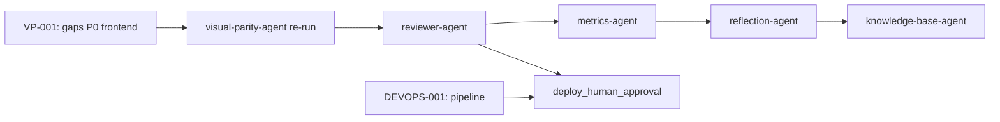

# Reflexión de Ejecución — Novus Intelligence Solutions

**Proyecto:** novus-intelligence  
**Workflow:** novus-intelligence-lovable-to-web  
**Paso:** paso-13-reflexion (fase Reflection)  
**Agente:** reflection-agent  
**Patrón:** Reflection Pattern  
**Fecha:** 2026-07-15  
**Runtime:** Cursor Cloud Agent (M6)  
**Target environment:** DEV — AWS `sa-east-1`  
**Plan:** PLAN-NOVUS-LOVABLE-2026-07-14 (`approved`)  
**Baseline Lovable:** novus-nexus @ `e3a9819`  
**Estado workflow al reflexionar:** **blocked** (qualityScore: 78)

---

## Workflow

| Campo | Valor |
|-------|-------|
| `workflowId` | novus-intelligence-lovable-to-web |
| `runId` | bc-970b4eff-7f7b-45de-b5fe-c69e04622657 |
| Inicio corrida | 2026-07-14T08:30:00Z |
| Fin corrida (consolidado) | 2026-07-15T19:00:00Z |
| Duración total | ~34 h 30 min (124 200 s) |
| Agentes ejecutados | 16 de 19 habilitados |
| Agentes éxito | 12 |
| Agentes fallo | 2 (devops-agent, visual-parity-agent) |
| Agentes omitidos/N/A | 1 (database-agent) |
| Agentes bloqueados/pendientes | 4 (reviewer-agent, reflection→este paso, kb-agent parcial, adr-agent ✅) |
| PRs Framework abiertos | 8+ (draft) |
| Repos productivos mergeados | 2 (NovusIntelligenceWEB + NovusIntelligenceBack → `main`) |

### Agentes involucrados por fase

| Fase | Agentes | Resultado |
|------|---------|-----------|
| Event Trigger | workflow-agent | ✅ |
| Planning | lovable-analyzer-agent, planner-agent, backend-impact-agent | ✅ |
| Plan Review | architect-agent | ✅ — plan `approved` |
| Execution | frontend-integration-agent, backend-agent, cloud-agent | ✅ — merge a `main` |
| Execution | devops-agent | ❌ — `pipeline-config.md` ausente |
| Execution | database-agent | ⏭️ N/A |
| Validation | qa-agent | ✅ PASS (re-validación 2026-07-15) |
| Validation | security-agent | ✅ PASS (re-validación 2026-07-15) |
| Validation | visual-parity-agent | ❌ FAIL — 0/12 capturas |
| Validation | reviewer-agent | ⏸️ Bloqueado por `visual_exact_parity` |
| Documentation | documentation-agent | ✅ |
| Metrics | metrics-agent | ✅ — qualityScore 78 |
| Reflection | reflection-agent | ✅ (este artefacto) |

---

## Qué se hizo

### Planning y Plan Review (exitoso)

1. **lovable-analyzer-agent** detectó 13 cambios (CHG-001–CHG-013) en el commit `e3a9819`, con `backendRequired: true`.
2. **planner-agent** generó `plan-implementacion.md` (PLAN-NOVUS-LOVABLE-2026-07-14) con 9 fases y mitigaciones R-001 a R-008.
3. **backend-impact-agent** especificó la API de contacto sin persistencia en BD.
4. **architect-agent** aprobó el plan y documentó impacto arquitectónico.

### Execution (completada y mergeada)

5. **frontend-integration-agent** implementó el sitio corporativo en **NovusIntelligenceWEB** (`main` @ `2634029`):
   - Fases 0–4: design system dark-first, 10 rutas, layout, landing, soluciones dinámicas (6 slugs), `MultiAgentDemo` lazy-loaded.
   - Fase 6 parcial: UI de contacto sin fallback demo (R-001 mitigado).
   - Build + lint exitosos tras remediación QA-001.

6. **backend-agent** implementó `novus-contact-handler` en **NovusIntelligenceBack** (`main` @ `c929e2b`):
   - Validación server-side V1–V10, CORS lista blanca, captcha preparado (deshabilitado en DEV).
   - SEC-001-v1 (IAM SES) y SEC-002-v1 (rate limit IP) remediados en `main`.

7. **cloud-agent** reconcilió `environments/dev.yml` a `sa-east-1` y generó `propuesta-infra.md`. Sin despliegue (`NO_DEPLOY`).

8. **documentation-agent** consolidó la corrida en `resumen-ejecucion.md` (re-actualizado 2026-07-15).

9. **metrics-agent** actualizó `metricas-ejecucion.json` con qualityScore 78.

### Validation (parcial — bloqueo visual)

10. **qa-agent** re-validó sobre `main` — **PASS** (qualityScore: 100). Gates bloqueantes QA en PASS.
11. **security-agent** re-validó sobre `main` — **PASS** (securityScore: 89). Sin hallazgos bloqueantes.
12. **visual-parity-agent** evaluó 12 capturas (4 rutas × 3 viewports) — **FAIL** (0/12 PASS; maxDiffRatio: 0.449 en `/contact` móvil).

### Constraints respetados

| Constraint | Evidencia |
|------------|-----------|
| `NO_DEPLOY` | Sin apply IaC ni publicación DEV en esta corrida |
| `NO_SECRETS_IN_REPO` | Escaneos QA/Security sin credenciales |
| `NO_LOVABLE_CODE_COPY` | Gates pass; reimplementación verificada |
| `PLAN_MUST_BE_APPROVED` | `status: approved` desde paso 06 |
| `TARGET_DEV_REGION_SA_EAST_1` | `dev.yml` y `propuesta-infra.md` alineados |
| `NO_PRODUCTIVE_CODE` (reflection) | Solo artefactos de conocimiento |

---

## Qué falló

### Gate bloqueante activo

| Gate | ID hallazgo | Descripción | Agente responsable |
|------|-------------|-------------|-------------------|
| `visual_exact_parity` | VP-001 | 0/12 capturas PASS; maxDiffRatio 0.449 en `/contact` 390×844 | frontend-integration-agent |

**Gaps P0 documentados en `gaps-paridad.json`:**

| ID | Título | Impacto |
|----|--------|---------|
| GAP-P0-001 | Logo Novus Intelligence no renderizado (placeholder global) | Transversal en 4 rutas |
| GAP-P0-002 | `/contact` — zona formulario debe usar tema claro | Diff 42–45 % (crítico) |
| GAP-P0-003 | Landing — testimonios con fondo claro ausente | Diff ~18–22 % en `/` |
| GAP-P0-004 | Landing — secciones Solutions, Impact y CTA no coinciden | Copy y estructura distintos |

### Tareas no completadas (no bloqueantes inmediatos)

| ID | Descripción | Impacto |
|----|-------------|---------|
| DEVOPS-001 | `pipeline-config.md` ausente — TASK-DEVOPS-001 no ejecutada | Sin documentación CI/CD formal |
| REV-001 | `reviewer-agent` no ejecutado | Bloqueado por `visual_exact_parity` FAIL |
| E2E-001 | Prueba E2E contacto post-deploy | Bloqueada por `NO_DEPLOY` |
| VP-002 | `NADF_LOVABLE_REFERENCE_URL` no estandarizada en pipeline | Referencia local ad-hoc en paridad visual |

### Gates remediados desde corrida inicial (2026-07-14)

| ID | Gate | Estado | Evidencia |
|----|------|--------|-----------|
| QA-001 | `build_success` | ✅ Remediado | 4 errores ESLint corregidos en `main` |
| SEC-001-v1 | `security_pass` | ✅ Remediado | IAM SES acotado a `identity/*` |
| SEC-002-v1 | `security_pass` | ✅ Remediado | `isIpRateLimited()` conectado en handler |

### Desviaciones plan vs resultado

| Fase plan | Esperado | Real | Gap |
|-----------|----------|------|-----|
| 6 — Contacto integración | E2E con API DEV | UI lista; sin API desplegada | Esperado por `NO_DEPLOY` |
| 7 — Infra/DevOps | Propuesta + pipeline | Propuesta ✅; pipeline ❌ | devops-agent no ejecutó TASK-DEVOPS-001 |
| 9 — Validación | Pass completo | QA ✅ + Security ✅; paridad visual ❌ | Bloqueo dominante: visual_exact_parity |

### Efecto en cadena de validación

La remediación de QA y Security elevó qualityScore de 62 a 78, pero el gate `visual_exact_parity` (threshold 0.2 %) demostró ser el bloqueante dominante: código funcionalmente correcto (build, lint, seguridad, anti-mock) no garantiza paridad visual exacta. **reviewer-agent** permanece bloqueado hasta remediación frontend P0.

---

## Qué se aprendió

### Patrones exitosos

1. **Re-validación post-merge detecta remediaciones efectivas.** Tras merge a `main`, re-ejecutar qa-agent y security-agent confirmó que QA-001, SEC-001-v1 y SEC-002-v1 estaban resueltos. El ciclo «fallo → corrección → re-validación» funciona cuando el Blackboard conserva IDs de hallazgo trazables.

2. **Separación planificación/ejecución/validación respetada.** Plan `approved` antes de código productivo; cada fase mapea a CHG-xxx verificables. Gates de intención (`no_lovable_code_copy`, `no_mock_data_in_production`, `no_secrets_in_repo`) pasaron en ambas corridas de validación.

3. **Traducción intención Lovable sin copia directa viable a escala.** Sitio corporativo completo (10 rutas, design system, `MultiAgentDemo`) reimplementado en React + Tailwind sin imports de novus-nexus. Funcionalidad y seguridad validadas independientemente de paridad visual.

4. **Mitigación R-001 (anti-demo) coherente plan→código→validación.** Frontend y backend implementan política no-mock de forma alineada; gate verificable en QA y Security sin ambigüedad.

5. **Blackboard como memoria compartida para reflexión iterativa.** `resumen-ejecucion.md`, `metricas-ejecucion.json`, informes QA/Security/Visual permitieron actualizar reflexión sin re-ejecutar agentes previos.

6. **NO_DEPLOY como constraint operativo claro.** Infraestructura preparada (propuesta IaC, región reconciliada) sin publicación; candidato DEV evaluado es despliegue previo en CloudFront, no de esta corrida.

### Anti-patrones detectados

1. **Dark-first aplicado uniformemente en páginas híbridas.** `/contact` en Lovable alterna hero oscuro con sección clara (formulario en fondo blanco). Aplicar tema oscuro continuo generó el diff más severo (42–45 %). Las páginas con alternancia claro/oscuro requieren mapeo explícito en planning, no asunción dark-first global.

2. **Assets de marca no conectados antes de validación visual.** Logo placeholder (checkmark) en header/footer indica que `public/assets/novus/` no se integró correctamente en layout, a pesar de estar en el plan (CHG-013, tarea 1.4). Los assets de marca deben ser prerequisito de handoff a visual-parity-agent.

3. **Deriva de copy y estructura de secciones respecto a intención Lovable.** Títulos, bloques de impacto y CTA en landing difieren materialmente de la referencia. La reimplementación funcional no sustituye alineación de contenido con `memory/brand-context.md` y módulos de contenido Lovable.

4. **Gate visual_exact_parity desacoplado de gates técnicos.** Build, lint, seguridad y anti-mock pueden pasar mientras paridad visual falla al 100 %. El threshold 0.2 % es el gate más estricto del workflow y debe ejecutarse antes de declarar «implementación completa».

5. **Agente DevOps omitido en corrida.** Sin `pipeline-config.md`, la fase 7 del plan quedó incompleta. El workflow carece de gate bloqueante explícito para DevOps, permitiendo avanzar a Validation con gap operativo.

6. **Referencia Lovable no estandarizada en runtime.** `NADF_LOVABLE_REFERENCE_URL` ausente obligó a usar novus-nexus local ad-hoc. Reproducibilidad de paridad visual requiere URL de referencia configurada en pipeline Cloud Agent.

### Aprendizajes operativos del workflow

- **QualityScore 78** refleja 8/9 gates bloqueantes en PASS, penalizado por `visual_exact_parity` (0 %) y ejecución parcial (devops pendiente).
- **Re-validación post-merge** es patrón obligatorio cuando la corrida inicial falla en ramas feature y el código se integra después.
- **Paridad visual** detecta gaps que QA estático (responsive/SEO por código) no captura: tema híbrido, assets, copy visual.
- **8+ PRs draft** en Framework indican necesidad de estrategia de consolidación antes de cerrar ciclo Knowledge.

---

## Recomendaciones

### Actualizaciones sugeridas para Knowledge Base

Ver `recomendaciones-kb.json` para estructura machine-readable. Resumen de entradas nuevas/actualizadas:

1. **Checklist assets de marca obligatorios** antes de visual-parity-agent (logo, OG, favicon).
2. **Patrón alternancia tema claro/oscuro** por sección en páginas híbridas (`/contact`, testimonios landing).
3. **Flujo `remediate_frontend_then_recheck`** documentado en `gaps-paridad.json` como plantilla reutilizable.
4. **Gate visual como validación independiente** de build/lint/security — orden de ejecución recomendado.
5. **Re-validación post-merge** como paso explícito tras integración a `main`.
6. Mantener entradas KB previas (ESLint, IAM, rate limit, anti-mock) — varias ya remediadas pero siguen siendo patrones preventivos.

### ADRs pendientes de registro

| Tema | Justificación | Agente sugerido | Urgencia |
|------|---------------|-----------------|----------|
| Rate limiting distribuido en API contacto | SEC-002 observación: ventana 60 s vs 5 min; in-memory no distribuido | adr-agent | before_prod_deploy |
| Gestión secretos SSM/Secrets Manager | SEC-003: desalineación env plano vs propuesta IaC | adr-agent | before_prod_deploy |

> ADR-0006 ya cubre paridad visual y auto-deploy DEV. No se requiere ADR nuevo para el gate en sí.

### Mejoras de workflow propuestas

1. **Prerequisito `brand_assets_wired`** antes de activar visual-parity-agent (verificar logo en Header/Footer).
2. **Gate explícito `devops_pipeline_documented`** cuando `requires_infra: true`.
3. **Configurar `NADF_LOVABLE_REFERENCE_URL`** en pipeline Cloud Agent para reproducibilidad de paridad.
4. **Checklist tema híbrido** en planning: identificar rutas con alternancia claro/oscuro (no asumir dark-first global).
5. **Ejecutar visual-parity-agent en advisory** tras Fase 1 (layout) para detectar gaps tempranos, no solo al final.

---

## Secuencia de desbloqueo recomendada

| Orden | Agente | Acción |
|-------|--------|--------|
| 1 | frontend-integration-agent | Remediar GAP-P0-001 a GAP-P0-004 (+ P1 según capacidad) |
| 2 | visual-parity-agent | Re-ejecutar `visual-parity-check` — gate PASS obligatorio |
| 3 | reviewer-agent | Revisión de coherencia y diff (tras paridad PASS) |
| 4 | devops-agent | Completar TASK-DEVOPS-001 (`pipeline-config.md`) |
| 5 | metrics-agent | Actualizar métricas con estado post-paridad |
| 6 | reflection-agent | Reflexión final de cierre (si workflow desbloqueado) |
| 7 | knowledge-base-agent | Consolidar patrones visuales en KB global |

---

## Métricas de reflexión

| Campo | Valor |
|-------|-------|
| `agentName` | reflection-agent |
| `reflectionSummary` | Corrida Lovable→Web avanzó de blocked (62) a blocked (78): QA y Security remediados en main, pero paridad visual exacta falla en 12/12 capturas; remediación frontend P0 requerida antes de reviewer y deploy |
| `patternsIdentified` | 6 patrones exitosos, 6 anti-patrones |
| `failuresDocumented` | 1 bloqueante activo (VP-001), 4 seguimiento, 3 remediados |
| `kbUpdatesRecommended` | 10 entradas en `recomendaciones-kb.json` |

---

## Próximo agente sugerido

**frontend-integration-agent** — Remediar gaps P0 documentados en `gaps-paridad.json` e `informe-paridad-visual.md` (VP-001).

Secuencia post-corrección: frontend-integration → visual-parity → reviewer → metrics → reflection → knowledge-base.

---

## Referencias

- `artifacts/plan-implementacion.md`
- `artifacts/resumen-ejecucion.md`
- `artifacts/metricas-ejecucion.json`
- `artifacts/informe-qa.md` / `qa-result.json`
- `artifacts/informe-seguridad.md` / `security-result.json`
- `artifacts/informe-paridad-visual.md` / `gaps-paridad.json` / `visual-parity-result.json`
- `artifacts/resumen-frontend.md`
- `artifacts/resumen-cloud.md`
- `artifacts/propuesta-infra.md`
- `artifacts/recomendaciones-kb.json`
- `docs/reflection-learning.md`

---

## Historial

| Fecha | Acción | Agente |
|-------|--------|--------|
| 2026-07-14 | Reflexión post-ejecución — workflow blocked, qualityScore 62 (QA/Security FAIL) | reflection-agent |
| 2026-07-15 | Re-reflexión paso-13 — workflow blocked, qualityScore 78 (paridad visual FAIL dominante) | reflection-agent |
