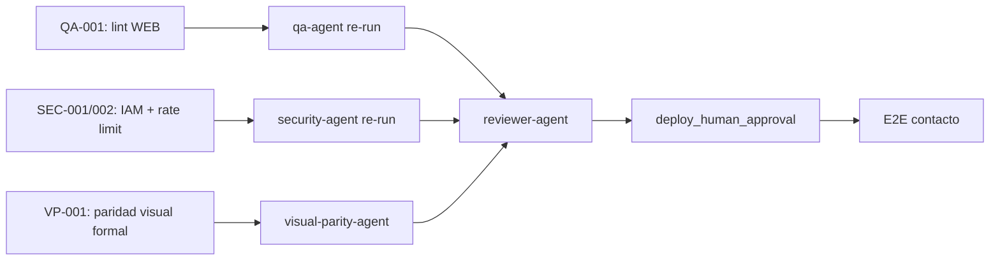

# Reflexión de Ejecución — Novus Intelligence Solutions

**Proyecto:** novus-intelligence  
**Workflow:** novus-intelligence-lovable-to-web  
**Paso:** paso-17-reflexion (fase Reflection)  
**Agente:** reflection-agent  
**Patrón:** Reflection Pattern  
**Fecha:** 2026-07-14  
**Runtime:** Cursor Cloud Agent (M6)  
**Target environment:** DEV — AWS `sa-east-1`  
**Plan:** PLAN-NOVUS-LOVABLE-2026-07-14 (`approved`)  
**Baseline Lovable:** novus-nexus @ `e3a9819`  
**Estado workflow al reflexionar:** **blocked** (qualityScore: 62)

---

## Workflow

| Campo | Valor |
|-------|-------|
| `workflowId` | novus-intelligence-lovable-to-web |
| `runId` | bc-cc30f597-a715-4ebc-9cee-5b65065fa596 |
| `priorRunId` | bc-7db90cca-6bbe-4914-bce2-8b237c3cd973 |
| Inicio corrida | 2026-07-14T08:30:00Z |
| Fin corrida (consolidado) | 2026-07-14T17:54:38Z |
| Duración total | ~9 h 25 min (33 878 s) |
| Agentes ejecutados | 15 de 19 habilitados |
| Agentes éxito | 11 |
| Agentes fallo | 3 (devops-agent, qa-agent, security-agent) |
| Agentes parciales | 2 (frontend-integration-agent, visual-parity-agent) |
| Agentes omitidos/N/A | 1 (database-agent) |
| Agentes bloqueados | 1 (reviewer-agent) |
| PRs Framework mergeados | 13+ |
| Ramas productivas sin merge | 2 (NovusIntelligenceWEB + NovusIntelligenceBack) |

### Agentes involucrados por fase

| Fase | Agentes | Resultado |
|------|---------|-----------|
| Event Trigger | workflow-agent | ✅ |
| Planning | lovable-analyzer-agent, planner-agent, backend-impact-agent | ✅ |
| Plan Review | architect-agent | ✅ — plan `approved` |
| Execution | frontend-integration-agent, backend-agent, cloud-agent | ⚠️ Parcial (lint WEB, SEC-001/002) |
| Execution | devops-agent | ❌ — `pipeline-config.md` ausente |
| Execution | database-agent | ⏭️ N/A |
| Validation | qa-agent, security-agent | ❌ FAIL |
| Validation | visual-parity-agent | ⚠️ Parcial — remediación manual; gate formal pendiente |
| Validation | reviewer-agent | ⏸️ Bloqueado |
| Documentation | documentation-agent | ✅ |
| Metrics | metrics-agent | ✅ |
| Reflection | reflection-agent | ✅ (este artefacto) |
| Knowledge | knowledge-base-agent | ✅ — 12 entradas KB global |
| Knowledge | adr-agent | ✅ — No ADR required |

---

## Qué se hizo

### Planning y Plan Review (exitoso)

1. **lovable-analyzer-agent** detectó 13 cambios (CHG-001–CHG-013) en el commit `e3a9819`, con `backendRequired: true`. Produjo `cambios-lovable.json`, impactos frontend/backend y matriz de riesgos.
2. **planner-agent** generó `plan-implementacion.md` (PLAN-NOVUS-LOVABLE-2026-07-14) con 9 fases, mapeo de rutas TanStack → React Router y mitigaciones R-001 a R-008.
3. **backend-impact-agent** especificó la API de contacto (`POST /api/v1/contact`) sin persistencia en BD.
4. **architect-agent** aprobó el plan y documentó impacto arquitectónico en `impacto-arquitectonico.md`.

### Execution (mayormente completada)

5. **frontend-integration-agent** implementó el sitio corporativo completo en `NovusIntelligenceWEB` (ramas `cursor/implement-novus-frontend-2d22`, `cursor/visual-parity-novus-frontend-9ec7`):
   - Fases 0–4 del plan: design system dark-first, 10 rutas, layout, landing, contenido, soluciones dinámicas (6 slugs), `MultiAgentDemo` lazy-loaded.
   - Fase 6 parcial: UI de contacto sin fallback demo (R-001 mitigado).
   - Build Vite exitoso; reimplementación propia sin copia de novus-nexus.
   - Remediación manual de paridad visual en iteración posterior.

6. **backend-agent** implementó `novus-contact-handler` en `NovusIntelligenceBack` (rama `cursor/implement-contact-api-04c8`):
   - Validación server-side V1–V10, CORS con lista blanca, captcha preparado (deshabilitado en DEV).
   - Build y lint backend sin errores.

7. **cloud-agent** reconcilió `environments/dev.yml` a región `sa-east-1` y generó `propuesta-infra.md` con stacks, secrets paths y checklist de deploy. Sin despliegue (`NO_DEPLOY`).

8. **documentation-agent** consolidó la corrida en `resumen-ejecucion.md`.

9. **metrics-agent** registró métricas en `metricas-ejecucion.json` (qualityScore: 62).

10. **knowledge-base-agent** y **adr-agent** completaron fases Knowledge con 12 entradas KB y evaluación «No ADR required».

### Constraints respetados

| Constraint | Evidencia |
|------------|-----------|
| `NO_DEPLOY` | Sin apply IaC ni publicación DEV |
| `NO_SECRETS_IN_REPO` | Escaneos QA/Security sin credenciales |
| `NO_LOVABLE_CODE_COPY` | Gates pass; reimplementación verificada |
| `PLAN_MUST_BE_APPROVED` | `status: approved` desde paso 06 |
| `TARGET_DEV_REGION_SA_EAST_1` | `dev.yml` y `propuesta-infra.md` alineados |
| `NO_PRODUCTIVE_CODE` (reflection) | Solo artefactos de conocimiento |

---

## Qué falló

### Gates bloqueantes fallidos o pendientes

| Gate | ID hallazgo | Descripción | Agente responsable |
|------|-------------|-------------|-------------------|
| `build_success` | QA-001 | 4 errores ESLint `@typescript-eslint/no-empty-object-type` en `Input`, `Label`, `Select`, `Textarea` (WEB) | frontend-integration-agent |
| `security_pass` | SEC-001 | IAM SES con `Resource: '*'` en `serverless.yml` — viola mínimo privilegio | backend-agent |
| `security_pass` | SEC-002 | `rateLimitResponse()` definido pero no invocado; solo throttle global API Gateway | backend-agent |
| `visual_exact_parity` | VP-001 | `visual-parity-result.json` ausente; remediación manual sin gate formal | visual-parity-agent |

### Tareas no completadas

| ID | Descripción | Impacto |
|----|-------------|---------|
| DEVOPS-001 | `pipeline-config.md` ausente — TASK-DEVOPS-001 no ejecutada | Sin documentación CI/CD; gate operativo incompleto |
| BE-ART-001 | `resumen-backend.md` en rama remota no mergeado al Framework | Trazabilidad backend incompleta en Blackboard |
| REV-001 | `reviewer-agent` no ejecutado | Bloqueado por QA/Security FAIL |
| E2E-001 | Prueba E2E contacto post-deploy | Bloqueada por `NO_DEPLOY` + API no desplegada |

### Desviaciones plan vs resultado

| Fase plan | Esperado | Real | Gap |
|-----------|----------|------|-----|
| 6 — Contacto integración | E2E con API DEV | UI lista; sin API desplegada | Esperado por `NO_DEPLOY` |
| 7 — Infra/DevOps | Propuesta + pipeline | Propuesta ✅; pipeline ❌ | devops-agent no ejecutó TASK-DEVOPS-001 |
| 9 — Validación | Pass completo | FAIL lint + security + VP pendiente | Workflow bloqueado antes de reviewer |

### Efecto en cadena de validación

La política NADF de gates bloqueantes funcionó como diseñado: fallos en `build_success` (lint), `security_pass` (IAM + rate limit) y gate `visual_exact_parity` pendiente detuvieron **reviewer-agent**. Las fases Knowledge (metrics, reflection, KB, ADR) se completaron documentando el estado blocked — el Blackboard cumple su rol de memoria compartida incluso con workflow incompleto operativamente.

---

## Qué se aprendió

### Patrones exitosos

1. **Separación planificación/ejecución/validación.** El plan `approved` por architect-agent antes de código productivo permitió trazabilidad clara: cada fase de ejecución mapea a tareas del plan con IDs CHG-xxx verificables.

2. **Traducción intención Lovable sin copia directa.** El workflow demostró viabilidad de implementar un sitio corporativo completo (10 rutas, design system, `MultiAgentDemo`) reimplementando intención visual/funcional en React + Tailwind, sin importar código de novus-nexus. Gates `no_lovable_code_copy` y `no_mock_data_in_production` pasaron en primera validación.

3. **Mitigación R-001 (modo demo) desde diseño.** Frontend (`submitContact()` retorna error sin `VITE_NOVUS_API_URL`) y backend (`randomUUID()` sin prefijo `demo-`) implementaron la política anti-mock de forma coherente.

4. **Reconciliación de región en planning constraints.** La discrepancia `us-east-1` vs `sa-east-1` en `dev.yml` se resolvió en cloud-agent sin bloquear ejecución frontend/backend (TASK-INFRA-001 efectiva).

5. **Validación en ramas feature multi-repo.** Implementación en ramas `cursor/*` con `main` en scaffold permitió QA y Security evaluar sin merge prematuro.

6. **Blackboard como insumo de reflexión.** `resumen-ejecucion.md` + `metricas-ejecucion.json` + informes QA/Security permitieron reflexión completa aun con workflow blocked.

7. **Fases Knowledge desacopladas de validación operativa.** Metrics, reflection, KB y ADR completaron documentando aprendizajes aunque reviewer-agent no ejecutara — patrón válido para no perder conocimiento en corridas bloqueadas.

### Anti-patrones detectados

1. **Interfaces vacías en componentes UI shadcn-style.** `interface X extends Y {}` dispara `@typescript-eslint/no-empty-object-type`. Preferir `type X = Y`.

2. **Dead code security — utilidades no conectadas.** `rateLimitResponse()` y `RATE_LIMIT_PER_IP` existen pero el handler no los invoca.

3. **Desalineación IaC implementación vs propuesta.** `serverless.yml` usa `Resource: '*'` para SES mientras `propuesta-infra.md` documenta ARN acotado.

4. **Agente DevOps omitido en corrida.** Sin `pipeline-config.md`, fase 7 del plan incompleta; workflow avanzó a Validation sin gate DevOps explícito.

5. **Handoff executor sin lint local.** Build Vite exitoso pero lint FAIL bloquea todo el workflow.

6. **Paridad visual sin artefacto formal.** Remediación manual en frontend sin generar `visual-parity-result.json` — gate `visual_exact_parity` queda pendiente aunque el código haya mejorado.

### Aprendizajes operativos del workflow

- **QualityScore 62** refleja ejecución sólida (~78% completitud) penalizada por 3 gates bloqueantes (7/10 pass).
- **Validación estática responsive/SEO** aceptada por QA sin browser automation — limitación documentada en informes.
- **13+ PRs draft** en Framework indican necesidad de estrategia de consolidación/merge.

---

## Recomendaciones

### Actualizaciones sugeridas para Knowledge Base

Ver `recomendaciones-kb.json` para estructura machine-readable. Resumen:

1. **Patrón ESLint `no-empty-object-type`** en componentes UI — usar `type` alias.
2. **Checklist IAM least-privilege SES** para Serverless Framework en sa-east-1.
3. **Matriz de decisión rate limiting** — handler in-app vs AWS WAF rate-based.
4. **Checklist pre-handoff executor** — lint + alineación serverless.yml vs propuesta-infra.md.
5. **Patrón workflow multi-repo** — ramas feature + validación antes de merge a main.
6. **Gate visual_exact_parity** — requerir `visual-parity-result.json` antes de cerrar validación.

### ADRs pendientes de registro

| Tema | Justificación | Agente sugerido |
|------|---------------|-----------------|
| Rate limiting por IP en API pública serverless | Decisión no formalizada (DynamoDB vs WAF vs ElastiCache) | adr-agent |
| Gestión secretos SSM/Secrets Manager vs env plano | Desalineación SEC-003 entre implementación y propuesta | adr-agent |

> ADR-0002, ADR-0003, ADR-0004 y ADR-0006 ya cubren arquitectura multiagente, canonicalización Lovable→Web, Meta Model y paridad visual. No se requieren ADRs nuevos para decisiones ya registradas en esta corrida.

### Mejoras de workflow propuestas

1. **Gate explícito `devops_pipeline_documented`** antes de Validation cuando `requires_infra: true`.
2. **Pre-check lint en handoff frontend-integration → qa-agent** para reducir ciclos de re-validación.
3. **Checklist de alineación serverless.yml ↔ propuesta-infra.md** post cloud-agent.
4. **Bloquear cierre de paso-12-paridad-visual** sin `visual-parity-result.json` aunque haya remediación manual.

---

## Secuencia de desbloqueo recomendada

| Orden | Agente | Acción |
|-------|--------|--------|
| 1 | frontend-integration-agent | Corregir QA-001 (4 errores ESLint) |
| 2 | backend-agent | Corregir SEC-001 (IAM SES) y SEC-002 (rate limit) |
| 3 | visual-parity-agent | Generar `visual-parity-result.json` (VP-001) |
| 4 | devops-agent | Completar TASK-DEVOPS-001 (`pipeline-config.md`) |
| 5 | qa-agent | Re-ejecutar validación |
| 6 | security-agent | Re-ejecutar revisión |
| 7 | reviewer-agent | Revisión de coherencia y diff |
| 8 | knowledge-base-agent | Incorporar aprendizajes adicionales si aplica |

---

## Métricas de reflexión

| Campo | Valor |
|-------|-------|
| `agentName` | reflection-agent |
| `reflectionSummary` | Primera corrida Lovable→Web completó planning y execution (~78%) con gates de intención (sin copia Lovable, sin mocks, sin secrets) en PASS; bloqueada por lint WEB, seguridad IAM/rate-limit y paridad visual formal pendiente |
| `patternsIdentified` | 7 patrones exitosos, 6 anti-patrones |
| `failuresDocumented` | 4 bloqueantes (QA-001, SEC-001, SEC-002, VP-001), 4 seguimiento |
| `kbUpdatesRecommended` | 8 entradas en `recomendaciones-kb.json` |

---

## Próximo agente sugerido

**frontend-integration-agent** — Corregir bloqueantes QA-001 antes de re-ejecutar cadena de validación.

> Las fases Knowledge (KB, ADR) ya completaron en esta corrida. Tras corrección de bloqueantes, re-ejecutar qa → security → visual-parity → reviewer.

---

## Referencias

- `artifacts/plan-implementacion.md`
- `artifacts/resumen-ejecucion.md`
- `artifacts/metricas-ejecucion.json`
- `artifacts/resumen-metricas.md`
- `artifacts/informe-qa.md` / `qa-result.json`
- `artifacts/informe-seguridad.md` / `security-result.json`
- `artifacts/resumen-frontend.md`
- `artifacts/resumen-cloud.md`
- `artifacts/propuesta-infra.md`
- `artifacts/actualizacion-kb.md`
- `artifacts/registro-adr.md`
- `artifacts/recomendaciones-kb.json`
- `docs/reflection-learning.md`

---

## Historial

| Fecha | Acción | Agente |
|-------|--------|--------|
| 2026-07-14 | Reflexión post-ejecución — workflow blocked, qualityScore 62 | reflection-agent |
| 2026-07-14 | Actualización consolidada con métricas paso-16 y VP-001 | reflection-agent |
