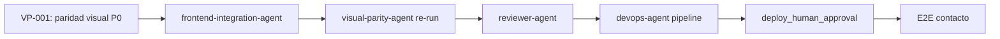

# Reflexión de Ejecución — Novus Intelligence Solutions

**Proyecto:** novus-intelligence  
**Workflow:** novus-intelligence-lovable-to-web  
**Paso:** paso-13-reflexion (fase Reflection)  
**Agente:** reflection-agent  
**Patrón:** Reflection Pattern  
**Fecha:** 2026-07-15  
**Runtime:** Cursor Cloud Agent (M6)  
**Target environment:** DEV — AWS `sa-east-1`  
**Plan:** PLAN-NOVUS-LOVABLE-2026-07-14 (`approved`)  
**Baseline Lovable:** novus-nexus @ `e3a9819`  
**Estado workflow al reflexionar:** **blocked** (qualityScore: 63)

---

## Workflow

| Campo | Valor |
|-------|-------|
| `workflowId` | novus-intelligence-lovable-to-web |
| `runId` | bc-7db90cca-6bbe-4914-bce2-8b237c3cd973 |
| `metricsRunId` | bc-aeb8abe7-3124-4fba-90aa-877763f78d3c |
| Inicio corrida | 2026-07-14T08:30:00Z |
| Fin corrida (consolidado) | 2026-07-15T20:50:00Z |
| Duración total | ~36 h 20 min (130 800 s) |
| Agentes ejecutados | 17 de 19 habilitados |
| Agentes éxito | 14 |
| Agentes fallo | 2 (devops-agent, visual-parity-agent) |
| Agentes omitidos/N/A | 1 (database-agent) |
| Agentes bloqueados/pendientes | 1 (reviewer-agent) |
| PRs Framework mergeados | 11 (#1–#13) |
| Repos productivos en `main` | 2 (NovusIntelligenceWEB @ `783acea`, NovusIntelligenceBack @ `6090f73`) |

### Agentes involucrados por fase

| Fase | Agentes | Resultado |
|------|---------|-----------|
| Event Trigger | workflow-agent | ✅ |
| Planning | lovable-analyzer-agent, planner-agent, backend-impact-agent | ✅ |
| Plan Review | architect-agent | ✅ — plan `approved` |
| Execution | frontend-integration-agent, backend-agent, cloud-agent | ✅ — mergeado en `main` |
| Execution | devops-agent | ❌ — `pipeline-config.md` ausente |
| Execution | database-agent | ⏭️ N/A |
| Validation | qa-agent, security-agent | ✅ PASS (revalidación 2026-07-15) |
| Validation | visual-parity-agent | ❌ FAIL — 0/12 capturas |
| Validation | reviewer-agent | ⏸️ Bloqueado por `visual_exact_parity` |
| Documentation | documentation-agent | ✅ |
| Metrics | metrics-agent | ✅ |
| Reflection | reflection-agent | ✅ (este artefacto — v2) |

---

## Qué se hizo

### Planning y Plan Review (exitoso)

1. **lovable-analyzer-agent** detectó 13 cambios (CHG-001–CHG-013) en el commit `e3a9819`, con `backendRequired: true`.
2. **planner-agent** generó `plan-implementacion.md` (PLAN-NOVUS-LOVABLE-2026-07-14) con 9 fases y mitigaciones R-001 a R-008.
3. **backend-impact-agent** especificó la API de contacto (`POST /api/v1/contact`) sin persistencia en BD.
4. **architect-agent** aprobó el plan y documentó impacto arquitectónico.

### Execution (completada y mergeada)

5. **frontend-integration-agent** implementó el sitio corporativo completo en **NovusIntelligenceWEB** (`main` @ `783acea`):
   - Fases 0–6 del plan: design system dark-first, 10 rutas, layout, landing, contenido, soluciones dinámicas (6 slugs), `MultiAgentDemo` lazy-loaded, formulario de contacto sin fallback demo.
   - Build Vite y lint sin errores (QA-001 remediado).

6. **backend-agent** implementó `novus-contact-handler` en **NovusIntelligenceBack** (`main` @ `6090f73`):
   - Validación server-side V1–V10, CORS lista blanca, rate limit por IP (`isIpRateLimited`), captcha preparado.
   - IAM SES acotado a `identity/*` (remediación SEC-001-prev).

7. **cloud-agent** reconcilió `environments/dev.yml` a región `sa-east-1` y generó `propuesta-infra.md`. Sin despliegue (`NO_DEPLOY`).

### Validation (parcial — evolución 2026-07-14 → 2026-07-15)

8. **qa-agent** — revalidación 2026-07-15: **PASS** (qualityScore 100). Build, lint, audit y gates estáticos cumplen en `main`.
9. **security-agent** — revalidación 2026-07-15: **PASS** (securityScore 88). IAM y rate limit remediados; 8 hallazgos no bloqueantes.
10. **visual-parity-agent** — 12/12 capturas **FAIL** (maxDiffRatio 0,096091 vs umbral 0,002). Único gate bloqueante restante.

### Knowledge (documentado en iteración previa)

11. **documentation-agent**, **metrics-agent**, **knowledge-base-agent** y **adr-agent** completaron sus artefactos en la corrida consolidada.

### Constraints respetados

| Constraint | Evidencia |
|------------|-----------|
| `NO_DEPLOY` | Sin apply IaC ni publicación DEV |
| `NO_SECRETS_IN_REPO` | Escaneos QA/Security sin credenciales |
| `NO_LOVABLE_CODE_COPY` | Gates pass; reimplementación verificada |
| `PLAN_MUST_BE_APPROVED` | `status: approved` desde paso 06 |
| `TARGET_DEV_REGION_SA_EAST_1` | `dev.yml` y `propuesta-infra.md` alineados |
| `NO_PRODUCTIVE_CODE` (reflection) | Solo artefactos de conocimiento |

---

## Qué falló

### Gate bloqueante activo

| Gate | ID hallazgo | Descripción | Agente responsable |
|------|-------------|-------------|-------------------|
| `visual_exact_parity` | VP-001 | 0/12 capturas PASS; maxDiffRatio 0,096091 (`/` @ 390×844) | frontend-integration-agent |

**Gaps P0 documentados en `gaps-paridad.json`:**

- VP-GAP-TOKENS — oklch (Lovable) vs HSL (WEB) en gradientes y colores de marca
- VP-GAP-TYPO — métricas Space Grotesk / Inter distintas
- VP-GAP-HERO-MOBILE — stack hero/demo en landing móvil
- VP-GAP-CONTACT-LAYOUT — grid 2-col formulario/sidebar
- VP-GAP-HEADER-MOBILE — altura y padding header sticky móvil

### Tareas no completadas (no bloqueantes inmediatos)

| ID | Descripción | Impacto |
|----|-------------|---------|
| DEVOPS-001 | `pipeline-config.md` ausente — TASK-DEVOPS-001 no ejecutada | Sin documentación CI/CD |
| BE-ART-001 | `resumen-backend.md` no publicado en Framework | Trazabilidad backend incompleta |
| REV-001 | `reviewer-agent` no ejecutado | Bloqueado por `visual_exact_parity` FAIL |
| E2E-001 | Prueba E2E contacto post-deploy | Bloqueada por `NO_DEPLOY` + API no desplegada |

### Remediados desde reflexión v1 (2026-07-14)

| ID | Gate | Estado | Evidencia |
|----|------|--------|-----------|
| QA-001 | `build_success` | ✅ Remediado | Lint 0 errores en WEB `main` |
| SEC-001-prev | `security_pass` | ✅ Remediado | IAM SES `identity/*` (no `*`) |
| SEC-002-prev | `security_pass` | ✅ Remediado | `isIpRateLimited()` invocado en handler |

### Desviaciones plan vs resultado

| Fase plan | Esperado | Real | Gap |
|-----------|----------|------|-----|
| 6 — Contacto integración | E2E con API DEV | UI lista; sin API desplegada | Esperado por `NO_DEPLOY` |
| 7 — Infra/DevOps | Propuesta + pipeline | Propuesta ✅; pipeline ❌ | devops-agent pendiente |
| 9 — Validación | Pass completo | QA + Security PASS; paridad visual FAIL | Bloqueo en gate visual |

### Efecto en cadena de validación

La remediación iterativa post-merge demostró que los gates QA y Security son recuperables sin re-planificar. El gate `visual_exact_parity` (ADR-0006) actúa ahora como **único bloqueante** antes de reviewer-agent y deploy DEV — comportamiento esperado del workflow canónico.

---

## Qué se aprendió

### Patrones exitosos

1. **Separación planificación/ejecución/validación.** El plan `approved` antes de código productivo mantuvo trazabilidad CHG-xxx a través de dos ciclos de validación.

2. **Reimplementación Lovable sin copia directa.** Sitio corporativo completo (10 rutas, design system, `MultiAgentDemo`) verificado en QA y Security tras merge a `main`.

3. **Remediación iterativa post-merge.** Lint WEB, IAM SES y rate limit corregidos en repos productivos; revalidación QA/Security PASS sin re-ejecutar planning. Patrón: *fix in product repo → re-run validators*.

4. **Mitigación R-001 (modo demo) coherente.** Frontend y backend implementan política anti-mock de forma alineada; gates `no_mock_data_in_production` en PASS.

5. **Reconciliación región cloud (TASK-INFRA-001).** `dev.yml` alineado a `sa-east-1` sin bloquear ejecución frontend/backend.

6. **Blackboard como memoria de corrida multi-día.** `resumen-ejecucion.md` v2 + `metricas-ejecucion.json` permitieron reflexión actualizada 24 h después sin pérdida de contexto.

7. **Gates bloqueantes en cascada funcionan.** reviewer-agent correctamente bloqueado por paridad visual; no se avanzó a deploy con diff visual > 9 %.

### Anti-patrones detectados

1. **Conversión HSL aproximada de tokens oklch.** Mapear intención visual con equivalentes HSL sin verificación pixel produce diff masivo en gradientes y CTA — bloquea `visual_exact_parity` aunque la semántica sea correcta.

2. **Paridad visual como gate tardío.** Los tokens y tipografía se validaron tarde (post-merge); remediar en `main` es más costoso que verificar tokens en Fase 0 con captura piloto.

3. **Agente DevOps omitido en corrida.** Sin `pipeline-config.md`, la fase 7 del plan quedó incompleta; el workflow carece de gate bloqueante explícito para DevOps.

4. **Validación responsive estática insuficiente para paridad.** QA PASS por análisis de clases Tailwind no detecta diff pixel en hero móvil (9,6 %). Complementar con visual-parity-agent antes de merge.

5. **Desalineación IAM implementación vs propuesta (residual).** SES `identity/*` remediado respecto a `*`, pero aún más amplio que dominio específico en `propuesta-infra.md` — observación SEC-001 no bloqueante.

### Aprendizajes operativos del workflow

- **QualityScore 63** (+1 vs iteración previa 62): 9/10 gates bloqueantes PASS; penalización total por `visualParityScore: 0`.
- **Umbral 0,2 %** es estricto pero detectó gaps reales de diseño no visibles en revisión de código.
- **Referencia Lovable local** (`novus-nexus` @ puerto 4173) funcionó cuando `NADF_LOVABLE_REFERENCE_URL` no estaba definida — documentar como fallback operativo.

---

## Recomendaciones

### Actualizaciones sugeridas para Knowledge Base

Ver `recomendaciones-kb.json` (v2) para estructura machine-readable. Resumen:

1. **Patrón mapeo tokens oklch → CSS productivo** sin copiar `styles.css` Lovable.
2. **Checklist paridad visual pre-merge** — captura piloto en Fase 0 antes de layout completo.
3. **Flujo post-remediación visual** — frontend-integration → visual-parity → reviewer → devops.
4. **Actualizar entradas KB existentes** — marcar QA-001, SEC-001-prev, SEC-002-prev como remediados.
5. **Nuevas entradas** — oklch token mapping, visual parity mobile hero, contact layout parity.

### ADRs pendientes de registro

| Tema | Justificación | Urgencia |
|------|---------------|----------|
| Estrategia rate limiting distribuido (DynamoDB/WAF) | SEC-002b — rate limit en memoria Lambda | before_prod_deploy |
| Gestión secretos SSM/Secrets Manager vs env plano | SEC-003 desalineación | before_prod_deploy |

> ADR-0006 ya cubre paridad visual y auto-deploy DEV. No se requiere ADR-0007 para decisiones ya registradas.

### Mejoras de workflow propuestas

1. **Captura piloto visual-parity en Fase 0** (tokens + Hero) antes de merge a `main`.
2. **Gate `devops_pipeline_documented`** cuando `requires_infra: true`.
3. **Actualizar reflexión automáticamente** tras cada revalidación de gates (QA, Security, Visual parity).

---

## Secuencia de desbloqueo recomendada

| Orden | Agente | Acción |
|-------|--------|--------|
| 1 | frontend-integration-agent | Remediar gaps P0 en `gaps-paridad.json` |
| 2 | visual-parity-agent | Re-ejecutar checker 12 capturas |
| 3 | reviewer-agent | Revisión coherencia y `no_lovable_code_copy` |
| 4 | devops-agent | Completar TASK-DEVOPS-001 |
| 5 | knowledge-base-agent | Consolidar recomendaciones v2 (paridad visual) |
| 6 | deploy DEV | Solo con `deploy_human_approval` explícita |

---

## Métricas de reflexión

| Campo | Valor |
|-------|-------|
| `agentName` | reflection-agent |
| `reflectionSummary` | Corrida Lovable→Web completó planning y execution con código mergeado en main; QA PASS (100) y Security PASS (88) tras revalidación 2026-07-15; bloqueada únicamente por paridad visual (0/12). qualityScore 63. |
| `patternsIdentified` | 7 patrones exitosos, 5 anti-patrones |
| `failuresDocumented` | 1 bloqueante (VP-001), 4 seguimiento |
| `kbUpdatesRecommended` | 10 entradas en `recomendaciones-kb.json` v2 |

---

## Próximo agente sugerido

**frontend-integration-agent** — Remediar hallazgos P0 de paridad visual según `gaps-paridad.json`.

Tras PASS visual: **visual-parity-agent** → **reviewer-agent** → **knowledge-base-agent** (actualizar KB con aprendizajes de paridad).

---

## Referencias

- `artifacts/plan-implementacion.md`
- `artifacts/resumen-ejecucion.md`
- `artifacts/metricas-ejecucion.json`
- `artifacts/informe-qa.md` / `qa-result.json`
- `artifacts/informe-seguridad.md` / `security-result.json`
- `artifacts/informe-paridad-visual.md` / `gaps-paridad.json`
- `artifacts/resumen-frontend.md`
- `artifacts/resumen-cloud.md`
- `artifacts/propuesta-infra.md`
- `artifacts/recomendaciones-kb.json`
- `docs/reflection-learning.md`

---

## Historial

| Fecha | Acción | Agente |
|-------|--------|--------|
| 2026-07-14 | Reflexión v1 — workflow blocked por QA/Security FAIL, qualityScore 62 | reflection-agent |
| 2026-07-15 | Reflexión v2 — QA/Security PASS; bloqueado por paridad visual, qualityScore 63 | reflection-agent |
