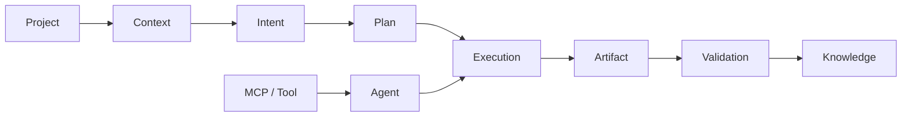

# NovusAIDevelopmentFramework (NADF)

## ¿Qué es NADF?

**NovusAIDevelopmentFramework** es el marco operativo de Novus Intelligence para automatizar el desarrollo de software mediante **agentes de IA especializados** coordinados por patrones arquitectónicos multiagente (Planner, Executor, Validator, Mediator, Blackboard, Event Driven, Reflection).

NADF **no es código productivo** ni es Cursor, Claude Code o Lovable. Es la capa de gobernanza, workflows declarativos, skill registry y conocimiento compartido que guía a los motores de ejecución.

Ver [docs/multiagent-architecture.md](docs/multiagent-architecture.md).

## Objetivo

Automatizar el ciclo de desarrollo con agentes IA, manteniendo:

- **Separación planificación / ejecución / validación**
- **Comunicación mediada** (Orquestador + Blackboard)
- **Integración MCP** con GitHub, AWS, DB, Terraform, Jira
- Calidad verificable mediante gates en cada fase
- Trazabilidad via ADRs, métricas y reflexión
- Independencia de proveedor de nube e IA

## Proyecto inicial

**Novus Intelligence Solutions** — flujo Lovable → Web de **18 pasos** multiagente (canónico global; ver [ADR-0003](.nadf/global/decision-history/adr/ADR-0003-lovable-to-web-canonicalization.md)).

## Repositorios

| Rol | Repositorio |
|-----|-------------|
| Framework | NovusAIDevelopmentFramework |
| Diseño | novus-nexus (Lovable) |
| Frontend | NovusIntelligenceWEB |
| Backend | NovusIntelligenceBack |

## Flujo multiagente

```
Lovable → GitHub → Orquestador → Planning → Execution → Validation
→ Knowledge → PR → Cursor Review → Deployment (aprobado)
```

## Meta Model

El **NADF Meta Model v1.0** es la especificación normativa central del framework: define qué entidades existen (Intent, Plan, Agent, Execution, Artifact, Validation, Knowledge…), cómo se relacionan y cuál es el flujo semántico obligatorio del ciclo de vida.

**Problema que resuelve:** Sin un lenguaje común, agentes, workflows y proyectos divergen en vocabulario, artefactos y flujos. El Meta Model unifica el dominio NADF bajo un contrato conceptual verificable.

**Relación con el ecosistema NADF:**

| Elemento | Relación con Meta Model |
|----------|------------------------|
| **Agentes (19)** | Instancias de `Agent` + `Skill` + `Capability`; operan sobre entidades oficiales |
| **Workflows (8)** | Instancias de `Workflow` + `Task`; flujo Intent → Knowledge |
| **MCP** | `MCP Server` y `Tool` abstraen acceso externo |
| **Proyectos** | `Project` + `Context`; `project-context.yml` declara alcance y gates |



Especificación oficial: [docs/meta-model/specification.md](docs/meta-model/specification.md) · ADR: [ADR-0004](.nadf/global/decision-history/adr/ADR-0004-nadf-meta-model.md)

## 7 capas arquitectónicas

1. Design Source — 2. Planning — 3. Execution — 4. Validation — 5. Knowledge — 6. Tooling (MCP) — 7. Runtime

Detalle: [docs/architecture.md](docs/architecture.md)

## 19 agentes

Planner, Architect, Workflow, Lovable Analyzer, Frontend, Backend Impact, Backend, Database, Cloud, DevOps, QA, Security, Reviewer, Documentation, Metrics, Knowledge Base, ADR, Reflection, Framework Architect.

Catálogo: [docs/agent-model.md](docs/agent-model.md)

## Estructura del framework

```
NovusAIDevelopmentFramework/
├── CLAUDE.md
├── docs/                    # Incluye multiagent-architecture.md, agent-patterns.md, mcp-integration.md
├── .claude/agents/          # 19 definiciones de agentes
├── .claude/commands/
└── .nadf/
    ├── global/
    │   ├── skill-registry/  # YAML por agente
    │   ├── workflow-library/ # 8 workflows, modelo 9 fases
    │   ├── decision-history/adr/
    │   └── metrics/
    └── projects/
```

## Cursor Cloud Agent (runtime M6)

NADF define **roles** (`.claude/agents/`). **Cursor Cloud Agent** es un **motor de ejecución** que interpreta esos roles (no recrees 19 agentes en la UI Cloud).

| Documento | Contenido |
|-----------|-----------|
| [docs/cloud-agent-integration.md](docs/cloud-agent-integration.md) | Guía operativa: onboarding de apps, prompts, anti-patrones |
| [docs/runtime/agent-runtime-contract.md](docs/runtime/agent-runtime-contract.md) | Contrato `AgentRuntime` (M6) |
| [ADR-0005](.nadf/global/decision-history/adr/ADR-0005-agent-runtime-bridge.md) | Decisión de adopción del puente runtime |
| [prototypes/m6-cloud-agent/](prototypes/m6-cloud-agent/) | Prototipo: paso 1 `lovable-analyzer` vía Cloud Agent |

```bash
cd prototypes/m6-cloud-agent
cp .env.example .env   # CURSOR_API_KEY + URLs de repos
npm install
npm run invoke:lovable-analyzer
```

## Cómo empezar

1. Leer `CLAUDE.md`, Meta Model y `docs/multiagent-architecture.md`
2. Revisar `.nadf/projects/novus-intelligence/project-context.yml`
3. Ejecutar `novus-lovable-sync` (18 pasos) **o** el prototipo Cloud Agent del paso 1
4. Consultar `docs/project-onboarding.md` y `docs/cloud-agent-integration.md` para nuevas apps

## Principios fundamentales

- Lovable es intención, no código productivo
- Planner no codea; Executor no cambia arquitectura sin ADR
- Validators no modifican lógica sin autorización
- Todo acceso externo vía MCP cuando aplique
- Sin mocks en producción; sin deploy sin aprobación; sin secrets en código
- Toda decisión arquitectónica → ADR; todo aprendizaje reutilizable → Knowledge Base

## Autenticación GitHub

Este workspace (`NovusAIDevelopmentFramework`) debe autenticarse con la cuenta u organización **arodriguez-novusintelligence**. Otros proyectos Cursor pueden usar **doeventsrepo**; no mezclar credenciales entre workspaces.

Si `git push` falla con **403**, suele deberse a la variable de entorno `GH_TOKEN` apuntando a otra cuenta. Consulta la guía completa: [docs/workspace-github-auth.md](docs/workspace-github-auth.md).

## Licencia

Framework propietario de Novus Intelligence. Uso interno exclusivo.
