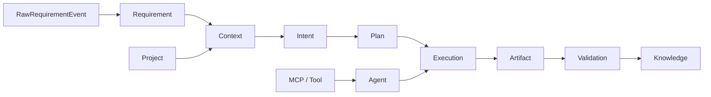

<!-- NADF-GUIDE
Propósito: Documenta NovusAIDevelopmentFramework (NADF).
Configuración: Actualizar contenido, enlaces y ejemplos cuando cambien los contratos relacionados.
-->
# NovusAIDevelopmentFramework (NADF)

**Distribution version:** `1.1.0-rc.1` · **Meta Model:** `1.1.0` · Manifest: [`nadf-manifest.yml`](nadf-manifest.yml)

Validate:

```bash
python tools/nadf-validator/__main__.py repository
```

## ¿Qué es NADF?

**NovusAIDevelopmentFramework** es un **Enterprise Framework for AI-Driven
Software Delivery**: metodología, gobierno, assets y adapters para automatizar
la entrega de software mediante agentes especializados, con control humano,
presupuesto y evidencia auditable.

NADF **no es código productivo** ni es Cursor, Claude Code o Lovable. Es la capa de gobernanza, workflows declarativos, skill registry y conocimiento compartido que guía a los motores de ejecución.

Ver [docs/multiagent-architecture.md](docs/multiagent-architecture.md).

Documentación Enterprise: [Markdown](docs/md/README.md) ·
[HTML](docs/html/index.html) ·
[Customer Distribution](docs/md/02-adopcion-y-distribucion.md) ·
[Human Approval](docs/md/09-aprobaciones-y-responsabilidades.md).

## Producto y adopción

NADF se implanta mediante el **Enterprise Adoption Program**. El cliente recibe
una distribución limpia del Framework y su proyecto configurado en
`.nadf/projects/<su-app>/`, conectado a sus propios repos, CI y cloud. No
recibe el producto vivo de Novus ni datos de otros clientes.

Lovable, GitHub Issues y Manual son adapters reemplazables; ninguno es el
núcleo del Framework.

## Objetivo

Automatizar el ciclo de desarrollo con agentes IA, manteniendo:

- **Separación planificación / ejecución / validación**
- **Comunicación mediada** (Orquestador + Blackboard)
- **Integración MCP** con GitHub, AWS, DB, Terraform, Jira, Slack, Teams y conectores de intake
- Calidad verificable mediante gates en cada fase
- Trazabilidad via ADRs, métricas, reflexión y Requirement Intake (opt-in)
- Independencia de proveedor de nube e IA

## Flujo multiagente

```
Fuente reemplazable → Requirement → Orquestador → Planning → Execution → Validation
→ Knowledge → PR → Cursor Review → Deployment (aprobado)
```

## Meta Model

El **NADF Meta Model v1.1** es la especificación normativa central del framework: define qué entidades existen (Intent, Requirement, Plan, Agent, Execution, Artifact, Validation, Knowledge…), cómo se relacionan y cuál es el flujo semántico obligatorio del ciclo de vida.

**Problema que resuelve:** Sin un lenguaje común, agentes, workflows y proyectos divergen en vocabulario, artefactos y flujos. El Meta Model unifica el dominio NADF bajo un contrato conceptual verificable. La v1.1 añade la **Requirement Intake Layer** (opt-in, ADR-0007) para fuentes empresariales multi-fuente.

**Relación con el ecosistema NADF:**

| Elemento | Relación con Meta Model |
|----------|------------------------|
| **Agentes** | Instancias de `Agent` + `Skill` + `Capability`; operan sobre entidades oficiales (incluye agentes requirement-*) |
| **Workflows** | Instancias de `Workflow` + `Task`; flujo Intent → Knowledge; `requirement-intake` opcional |
| **MCP** | `MCP Server` y `Tool` abstraen acceso externo multi-fuente |
| **Proyectos** | `Project` + `Context`; `requirement-sources/` opt-in |



Especificación oficial: [docs/meta-model/specification.md](docs/meta-model/specification.md) · ADR: [ADR-0004](.nadf/global/decision-history/adr/ADR-0004-nadf-meta-model.md) · Intake: [ADR-0007](.nadf/global/decision-history/adr/ADR-0007-requirement-intake-layer.md) · [requirement-intake-architecture.md](docs/requirement-intake-architecture.md)

## 7 capas arquitectónicas

1. Design Source — 2. Planning — 3. Execution — 4. Validation — 5. Knowledge — 6. Tooling (MCP) — 7. Runtime

Detalle: [docs/architecture.md](docs/architecture.md)

## Agentes

Agentes productivos base (Planner, Architect, Workflow, Lovable Analyzer, Frontend, Backend Impact, Backend, Database, Cloud, DevOps, QA, Security, Reviewer, Documentation, Metrics, Knowledge Base, ADR, Reflection, Framework Architect, Visual Parity) más **7 agentes de Requirement Intake** (ADR-0007).

Catálogo: [docs/agent-model.md](docs/agent-model.md)

## Estructura del framework

```
NovusAIDevelopmentFramework/
├── CLAUDE.md
├── docs/                    # Incluye requirement-intake-architecture.md, mcp-integration.md
├── .claude/agents/          # Definiciones de agentes (base + requirement-*)
├── .claude/commands/
├── tests/requirement-intake/ # Fixtures ADR-0007
├── tools/validators/        # Validadores intake
└── .nadf/
    ├── global/
    │   ├── skill-registry/
    │   ├── workflow-library/ # Incluye requirement-intake.yml
    │   ├── requirement-sources/ # Definiciones + connector-contract
    │   ├── artifact-contracts/
    │   ├── decision-history/adr/
    │   └── metrics/
    └── projects/
        └── <project>/requirement-sources/  # Opt-in
```
## Runtime

NADF define **roles** (`.claude/agents/`, 27 agentes). **Cursor Cloud Agent** es un **motor de ejecución** que interpreta esos roles (no recrees el catálogo completo en la UI Cloud).

| Documento | Contenido |
|-----------|-----------|
| [docs/cloud-agent-integration.md](docs/cloud-agent-integration.md) | Guía neutral de integración |
| [docs/runtime/agent-runtime-contract.md](docs/runtime/agent-runtime-contract.md) | Contrato portable `AgentRuntime` |
| [tools/nadf-parallel-orchestrator/](tools/nadf-parallel-orchestrator/) | Prototipo fan-out/fan-in |

## Cómo empezar

1. Leer `CLAUDE.md`, Meta Model y `docs/multiagent-architecture.md`
2. Copiar un project template a `.nadf/projects/<su-app>/`
3. Elegir adapter de entrada, budget y Human Gates
4. Ejecutar sample1 o sample2 y consultar `docs/project-onboarding.md`

## Principios fundamentales

- Lovable es intención, no código productivo
- Planner no codea; Executor no cambia arquitectura sin ADR
- Validators no modifican lógica sin autorización
- Todo acceso externo vía MCP cuando aplique
- Sin mocks en producción; sin deploy sin aprobación; sin secrets en código
- Toda decisión arquitectónica → ADR; todo aprendizaje reutilizable → Knowledge Base

## Licencia

Framework propietario de Novus Intelligence. Uso interno exclusivo.
