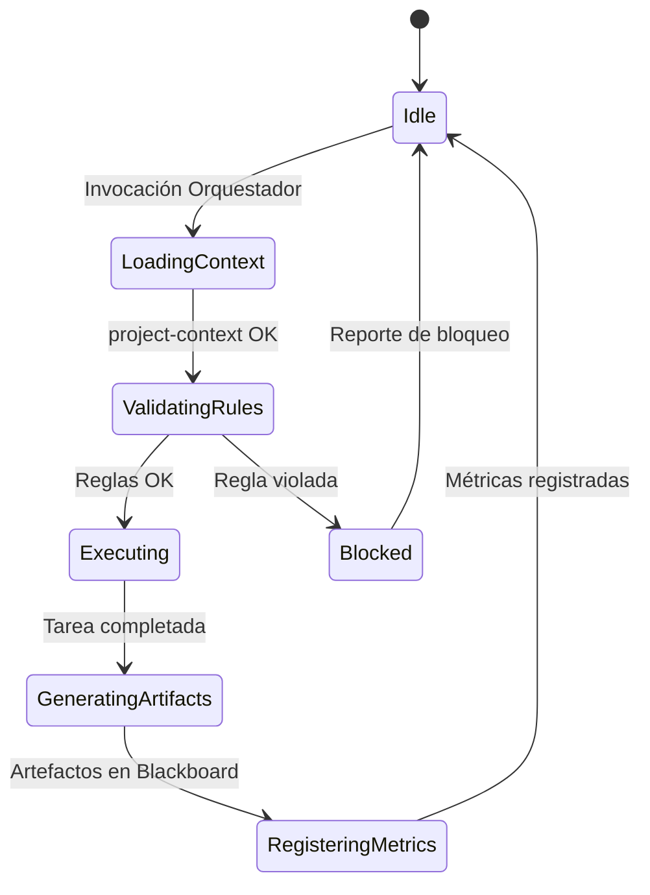

# Modelo de agentes NADF

## Concepto

Un **agente NADF** es una entidad de IA especializada con un **patrón arquitectónico**, una **capa** definida, reglas propias, contratos de entrada/salida y un registro en el skill-registry. Los agentes no operan de forma autónoma sin contexto: siempre leen `project-context.yml` y las reglas aplicables antes de actuar.

Los agentes **no se comunican directamente**. El Orquestador (Mediator) coordina el flujo; el Blackboard (Knowledge Layer) comparte artefactos.

Ver [multiagent-architecture.md](multiagent-architecture.md) y [agent-patterns.md](agent-patterns.md).

## Anatomía de un agente

Cada agente se define en dos ubicaciones complementarias:

| Ubicación | Contenido |
|-----------|-----------|
| `.claude/agents/<nombre>-agent.md` | Definición operativa completa |
| `.nadf/global/skill-registry/<nombre>-agent.yml` | Registro estructurado con patrón, capa, MCP, contratos |

### Secciones obligatorias (.md)

- Identidad (id, nombre, capa, patrón)
- Responsabilidad
- Patrón arquitectónico usado
- Qué puede hacer / qué tiene prohibido hacer
- Entradas / salidas
- Herramientas MCP permitidas
- Archivos de contexto que debe leer
- Criterios de bloqueo
- Artifacts que debe generar

## Catálogo de agentes por capa

### Framework

| Agente | Patrón | Rol |
|--------|--------|-----|
| Framework Architect | Mediator + Blackboard | Evoluciona estructura NADF |

### Design Source Layer

| Agente | Patrón | Rol |
|--------|--------|-----|
| Lovable Analyzer | Event Driven | Analiza cambios en novus-nexus |

### Planning Layer

| Agente | Patrón | Rol |
|--------|--------|-----|
| Planner | Planner | Genera plan de implementación |
| Architect | Planner | Valida impacto arquitectónico |
| Workflow | Event Driven | Selecciona y parametriza workflows |
| Backend Impact | Planner | Evalúa necesidad backend/DB/infra |
| Visual Parity | Validator/Planner | Paridad visual design→productivo |
| Requirement Intake | Event Driven | Coordina recepción segura de RawRequirementEvent |
| Requirement Normalization | Planner | Normaliza payload → Requirement |
| Requirement Classification | Planner | Clasifica tipo/riesgo/workflow candidato |
| Requirement Deduplication | Planner | Detecta duplicados |
| Requirement Approval | Mediator | Prepara aprobación humana |

### Execution Layer

| Agente | Patrón | Rol |
|--------|--------|-----|
| Frontend Integration | Executor | Implementa en NovusIntelligenceWEB |
| Backend | Executor | Implementa en NovusIntelligenceBack |
| Database | Executor | Diseña schemas y migraciones |
| Cloud | Executor | Genera IaC y propuestas cloud |
| DevOps | Executor | Prepara CI/CD y manifiestos |

### Validation Layer

| Agente | Patrón | Rol |
|--------|--------|-----|
| QA | Validator | Build, lint, responsive, SEO, mocks |
| Security | Validator | Secrets, vulnerabilidades, permisos |
| Reviewer | Validator | Coherencia plan vs implementación |
| Requirement Validation | Validator | Completitud y claridad del Requirement |

### Knowledge Layer

| Agente | Patrón | Rol |
|--------|--------|-----|
| Documentation | Blackboard | Docs, memoria, resúmenes |
| Metrics | Blackboard | Registro de métricas |
| Knowledge Base | Blackboard | Patrones y errores frecuentes |
| ADR | Blackboard | Registro de ADRs |
| Reflection | Reflection | Aprendizaje post-ejecución |
| Requirement Traceability | Blackboard | Enlaces Requirement → Intent → … |

## Distinción Architect vs Framework Architect

| Agente | Ámbito |
|--------|--------|
| **Architect Agent** | Arquitectura de proyectos productivos (WEB, Back, infra) |
| **Framework Architect Agent** | Estructura, reglas y evolución de NADF |

## Ciclo de vida de un agente



## Totales (Meta Model v1.1)

| Grupo | Cantidad |
|-------|----------|
| Core / producto | 20 |
| Requirement Intake (ADR-0007, opt-in) | 7 |
| **Total definiciones** | **27** |

Los agentes Intake solo participan cuando el proyecto activa `.nadf/projects/<id>/requirement-sources/` y el workflow `requirement-intake`.

## Principios del modelo

1. **Un agente, un patrón, un rol** — No mezclar Planner con Executor.
2. **Contexto primero** — Siempre leer project-context y reglas.
3. **Artefactos explícitos** — Toda salida en Blackboard (artifacts/).
4. **MCP para acceso externo** — GitHub, AWS, etc. vía MCP.
5. **Métricas y reflexión obligatorias** — En workflows de implementación.
6. **Escalabilidad** — Nuevos agentes = `.md` + `.yml` sin modificar existentes.

## Registro de skills

El skill-registry (`.nadf/global/skill-registry/`) usa esquema unificado:

```yaml
agent:
  name:
  pattern:
  layer:
  description:
  responsibilities:
  forbidden_actions:
  allowed_tools:
  mcp_servers:
  required_context:
  input_contract:
  output_contract:
  quality_gates:
  escalation_rules:
```

## Referencias

- Definiciones: `.claude/agents/`
- Registro: `.nadf/global/skill-registry/`
- [Patrones de agentes](agent-patterns.md)
- [Planificación, ejecución y validación](planning-execution-validation.md)
