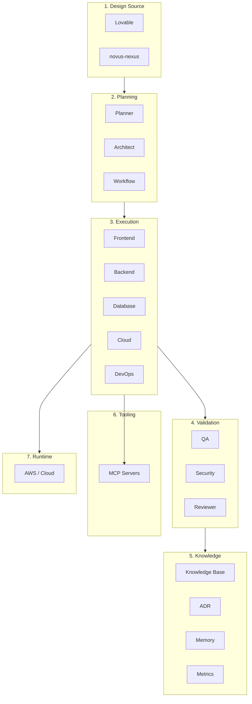
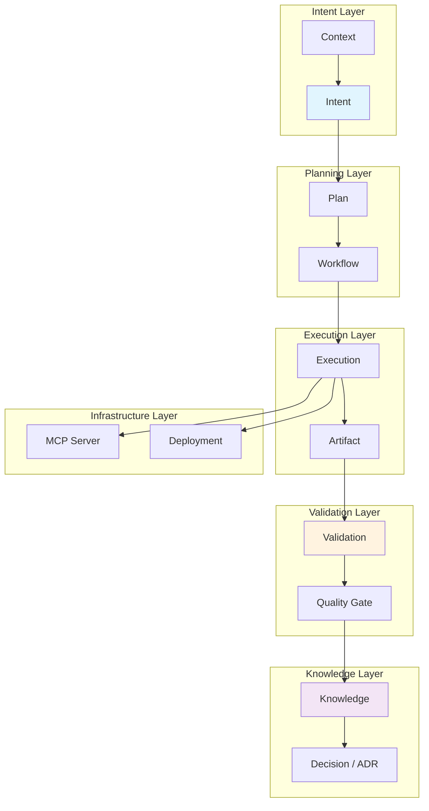

<!-- NADF-GUIDE
Propósito: Documenta Arquitectura del NovusAIDevelopmentFramework.
Configuración: Actualizar contenido, enlaces y ejemplos cuando cambien los contratos relacionados.
-->
# Arquitectura del NovusAIDevelopmentFramework

## Visión general

NADF se organiza en **siete capas** independientes que implementan una arquitectura multiagente con separación formal entre planificación, ejecución, validación y conocimiento. La arquitectura prioriza trazabilidad, extensibilidad e integración MCP con servicios externos.

Ver [multiagent-architecture.md](multiagent-architecture.md) y [ADR-0002](../.nadf/global/decision-history/adr/ADR-0002-multiagent-patterns.md).

## Capas arquitectónicas

### 1. Design Source Layer (Capa de fuente de diseño)

**Responsabilidad:** Capturar la intención visual y funcional del producto.

| Componente | Descripción |
|------------|-------------|
| Lovable | Herramienta de prototipado visual |
| novus-nexus | Repositorio fuente del prototipo Lovable |

**Agente principal:** Lovable Analyzer Agent  
**Regla clave:** Esta capa produce intención, no código productivo.

---

### 2. Planning Layer (Capa de planificación)

**Responsabilidad:** Analizar cambios, generar planes y validar impacto arquitectónico **sin modificar código productivo**.

| Agente | Patrón | Función |
|--------|--------|---------|
| Planner Agent | Planner | Genera plan de implementación |
| Architect Agent | Planner | Valida impacto arquitectónico |
| Workflow Agent | Event Driven | Selecciona y parametriza workflows |
| Backend Impact Agent | Planner | Evalúa necesidad backend/DB/infra |

**Salidas:** `plan-implementacion.md`, `impacto-arquitectonico.md`, artefactos de análisis

---

### 3. Execution Layer (Capa de ejecución)

**Responsabilidad:** Implementar planes aprobados en repositorios productivos e infraestructura.

| Agente | Patrón | Ámbito |
|--------|--------|--------|
| Frontend Integration Agent | Executor | NovusIntelligenceWEB |
| Backend Agent | Executor | NovusIntelligenceBack |
| Database Agent | Executor | Schemas, migraciones |
| Cloud Agent | Executor | IaC, propuestas cloud |
| DevOps Agent | Executor | Pipelines, contenedores |

**Restricción:** No cambiar arquitectura sin ADR.

---

### 4. Validation Layer (Capa de validación)

**Responsabilidad:** Validar calidad, seguridad y cumplimiento; bloquear en fallos críticos.

| Agente | Patrón | Validaciones |
|--------|--------|--------------|
| QA Agent | Validator | Build, lint, responsive, SEO, mocks |
| Security Agent | Validator | Vulnerabilidades, permisos, secrets |
| Reviewer Agent | Validator | Coherencia con plan, convenciones |

---

### 5. Knowledge Layer (Capa de conocimiento)

**Responsabilidad:** Blackboard compartido — artefactos, decisiones, memoria, métricas y aprendizaje.

| Componente | Ubicación |
|------------|-----------|
| Knowledge Base | `.nadf/global/knowledge-base/` |
| Decision History (ADR) | `.nadf/global/decision-history/adr/` |
| Memory Engine | `.nadf/projects/<proyecto>/memory/` |
| Metrics Engine | `.nadf/global/metrics/` |
| Skill Registry | `.nadf/global/skill-registry/` |

| Agente | Patrón | Función |
|--------|--------|---------|
| Documentation Agent | Blackboard | Docs y resúmenes |
| Metrics Agent | Blackboard | Registro de métricas |
| Knowledge Base Agent | Blackboard | Patrones y errores frecuentes |
| ADR Agent | Blackboard | Registro de ADRs |
| Reflection Agent | Reflection | Aprendizaje post-ejecución |

---

### 6. Tooling Layer (Capa de herramientas)

**Responsabilidad:** Conectar agentes con servicios externos vía **MCP**.

| Servidor MCP | Capacidades |
|--------------|-------------|
| GitHub | Repos, PRs, diffs, issues |
| AWS | Lambda, S3, DynamoDB, SES, CloudFront |
| Database | Schemas, consultas |
| Terraform | Planes IaC |
| Jira | Tickets, estados |
| Docker/Kubernetes | Imágenes, manifiestos |

Ver [mcp-integration.md](mcp-integration.md).

---

### 7. Runtime Layer (Capa de runtime)

**Responsabilidad:** Ejecutar la aplicación desplegada en la nube (independiente del framework).

| Componente | Proveedor inicial |
|------------|-------------------|
| Hosting frontend | AWS (S3 + CloudFront) |
| API backend | AWS Lambda + API Gateway |
| Base de datos | AWS DynamoDB |
| Almacenamiento | AWS S3 |
| Auth | Configurable por proyecto |
| Observabilidad | CloudWatch / equivalente |

**Nota:** NADF define templates pero **no despliega** sin aprobación humana.

---

## Diagrama de flujo principal

```mermaid
flowchart LR
    Lovable["Lovable"] --> GitHub["GitHub"]
    GitHub --> Orchestrator["Orquestador"]
    Orchestrator --> Planning["Planning Layer"]
    Planning --> Execution["Execution Layer"]
    Execution --> Validation["Validation Layer"]
    Validation --> Knowledge["Knowledge Layer"]
    Knowledge --> PR["Pull Request"]
    PR --> Cursor["Cursor Review"]
    Cursor --> Deployment["Deployment"]
```



## Diagrama de capas



## Flujo de datos entre capas

```
Design Source → Planning (análisis, plan)
             → Plan Review (validación arquitectónica)
             → Execution (implementación)
             → Validation (QA, security, review)
             → Knowledge (docs, metrics, reflection, KB, ADR)
             → PR → Cursor Review → Deployment (aprobado)
```

## Architecture Layers (Meta Model)

Las capas del Meta Model reconcilian las **7 capas de ADR-0002** en **6 capas semánticas** conectadas por entidades oficiales. No contradicen la arquitectura existente; la refinan desde la perspectiva del dominio conceptual.

| Capa Meta Model | Capas ADR-0002 equivalentes | Entidades principales | Agentes / componentes |
|-----------------|----------------------------|----------------------|----------------------|
| **Intent Layer** | Design Source | Context, Intent, Domain | Lovable Analyzer, fuentes externas |
| **Planning Layer** | Planning | Plan, Workflow, Task | Planner, Architect, Workflow, Backend Impact |
| **Execution Layer** | Execution | Agent, Execution, Artifact | Frontend, Backend, Database, Cloud, DevOps |
| **Validation Layer** | Validation | Validation, Quality Gate | QA, Security, Reviewer |
| **Knowledge Layer** | Knowledge | Knowledge, Memory, Decision, Metric | Documentation, Metrics, KB, ADR, Reflection |
| **Infrastructure Layer** | Tooling + Runtime | Tool, MCP Server, Provider, Deployment, Environment | MCP servers, AWS/cloud, hosting |

### Conexión entre capas vía Meta Model



**Regla transversal:** Todo contexto se transforma en Intent; Planner opera sobre Intent; Execution sobre Plan aprobado; Validation sobre Execution y Artifact; Reflection genera Knowledge.

Ver [meta-model/specification.md](meta-model/specification.md) y [architecture-principles.md](meta-model/architecture-principles.md).

---

## Principios de diseño

1. **Separación planificación / ejecución / validación** — Permisos distintos por capa.
2. **Comunicación mediada** — Orquestador + Blackboard; sin comunicación directa entre agentes.
3. **Unidireccionalidad** — Intención fluye de diseño a implementación, nunca copia directa.
4. **Auditabilidad** — ADRs, métricas, reflexión y decision-log en cada ciclo relevante.
5. **Extensibilidad** — Nuevos agentes, workflows y proyectos sin modificar el núcleo.
6. **MCP first** — Acceso externo vía MCP cuando aplique.

## Referencias

- [Arquitectura multiagente](multiagent-architecture.md)
- [Patrones de agentes](agent-patterns.md)
- [Planificación, ejecución y validación](planning-execution-validation.md)
- [Modelo de agentes](agent-model.md)
- [Modelo de workflows](workflow-model.md)
- [Integración Lovable](lovable-integration.md)
- [Integración MCP](mcp-integration.md)
- [ADR-0001](../.nadf/global/decision-history/adr/ADR-0001-nadf-foundation.md)
- [ADR-0002](../.nadf/global/decision-history/adr/ADR-0002-multiagent-patterns.md)
- [ADR-0004](../.nadf/global/decision-history/adr/ADR-0004-nadf-meta-model.md)
- [NADF Meta Model — Especificación](meta-model/specification.md)
