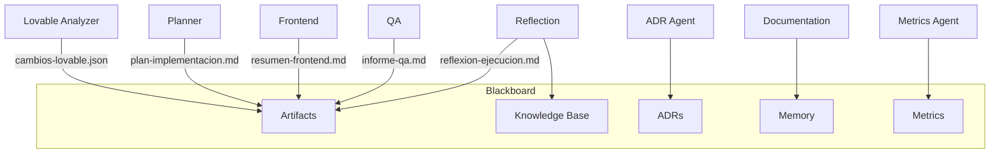

# Patrón Blackboard

## Propósito

El **Blackboard** es el espacio compartido y controlado donde los agentes publican y consumen artefactos, decisiones, métricas y aprendizajes. Implementa el patrón Blackboard de arquitectura multiagente.

## Componentes del Blackboard NADF

| Componente | Ubicación | Contenido |
|------------|-----------|-----------|
| Artifacts | `.nadf/projects/<proyecto>/artifacts/` | Salidas de workflows y agentes |
| Knowledge Base | `.nadf/global/knowledge-base/` | Patrones, errores frecuentes, componentes |
| Decision History (ADR) | `.nadf/global/decision-history/adr/` | Decisiones arquitectónicas |
| Memory Engine | `.nadf/projects/<proyecto>/memory/` | Contexto negocio, marca, técnico |
| Metrics Engine | `.nadf/global/metrics/` | Esquema y registros de métricas |
| Skill Registry | `.nadf/global/skill-registry/` | Definiciones estructuradas de agentes |

## Reglas de acceso

1. **Lectura:** Todo agente lee `project-context.yml` y memoria del proyecto antes de actuar.
2. **Escritura:** Cada agente escribe solo en rutas definidas en su skill registry.
3. **Inmutabilidad parcial:** Artefactos de ejecuciones anteriores no se eliminan; se archivan si es necesario.
4. **Coherencia:** ADR Agent y Knowledge Base Agent mantienen consistencia entre decisiones y patrones.

## Agentes custodios del Blackboard

| Agente | Custodia |
|--------|----------|
| Documentation Agent | Docs, decision-log, resúmenes |
| ADR Agent | Registro formal de ADRs |
| Knowledge Base Agent | Patrones reutilizables y errores frecuentes |
| Metrics Agent | Registros según metrics-schema.json |
| Reflection Agent | Aprendizajes post-ejecución |
| Framework Architect | Estructura global del Blackboard |

## Flujo de artefactos

## Contratos de artefactos

Cada artefacto debe ser:

- **Nombrado** según convención del agente productor
- **Autocontenido** — comprensible sin contexto de sesión
- **Versionado** — incluir fecha ISO-8601 cuando aplique
- **Referenciado** — enlazar ADRs y planes relacionados

## Prohibiciones

- No almacenar secrets ni credenciales en el Blackboard
- No sobrescribir ADRs aceptados (crear nuevo ADR que reemplace)
- No publicar código Lovable como artefacto productivo
- No eliminar métricas históricas

## Referencias

- [Patrones de agentes](agent-patterns.md)
- Knowledge base: `.nadf/global/knowledge-base/README.md`
- [Reflection learning](reflection-learning.md)
