# Integración de Cursor Cloud Agent con NADF

**Versión:** 1.0.0  
**Fecha:** 2026-07-14  
**Estado:** Guía operativa oficial (Fase 1 → puente M6)  
**Referencias:** [ADR-0005](../.nadf/global/decision-history/adr/ADR-0005-agent-runtime-bridge.md), [Meta Model](meta-model/meta-model-overview.md), [Roadmap M6](roadmap.md)

---

## 1. Qué es NADF y dónde entra Cloud Agent

| Concepto | Rol |
|----------|-----|
| **NADF** | Framework de **gobernanza**: Meta Model, agentes, workflows, reglas, quality gates, artefactos |
| **Cursor Cloud Agent** | **Motor de ejecución**: VM en la nube que clona repos y ejecuta un prompt con acceso a herramientas |
| **`cloud-agent` (NADF)** | Rol Executor de **infraestructura/IaC** — distinto del Cloud Agent de Cursor |

```mermaid
flowchart TB
  subgraph NADF["NADF (qué hacer)"]
    MM[Meta Model]
    AG[.claude/agents/*.md]
    WF[Workflows YAML]
    CTX[project-context.yml]
  end

  subgraph RUNTIME["Runtime (quién ejecuta)"]
    CA[Cursor Cloud Agent]
    LC[Cursor Local / IDE]
    CC[Claude Code]
  end

  subgraph PRODUCT["Repos productivos"]
    WEB[NovusIntelligenceWEB]
    BACK[NovusIntelligenceBack]
    LOV[novus-nexus]
  end

  MM --> AG
  AG --> CA
  WF --> CA
  CTX --> CA
  CA -->|Planner: solo artifacts| NADF
  CA -->|Executor: código| WEB
  CA -->|Executor: código| BACK
  CA -->|Analyzer: lee diffs| LOV
```



**Regla de oro:** NADF define identidad, permisos y salidas. Cloud Agent **no** es un agente NADF por sí solo; es el motor que **interpreta** un rol NADF (p. ej. `lovable-analyzer-agent.md`).

---

## 2. Cómo funciona el acoplamiento a un desarrollo real

### 2.1 Anatomía de un proyecto NADF

Para acoplar NADF a una aplicación (piloto `novus-intelligence` o una nueva):

```
.nadf/projects/<tu-proyecto>/
  project-context.yml          ← contrato del producto
  environments/                ← dev / qa / prod (sin secretos)
  rules/                       ← reglas por dominio
  workflows/                   ← extiende workflows globales
  memory/                      ← contexto de negocio, marca, técnico
  artifacts/                   ← Blackboard de ejecución
```

Y repos externos referenciados en `project-context.yml`:

| Rol en el dominio | Repositorio típico |
|-------------------|-------------------|
| Design Source | prototipo Lovable / Figma export |
| Frontend productivo | app React/TS |
| Backend productivo | API serverless/Node |
| Framework NADF | este repo (`NovusAIDevelopmentFramework`) |

### 2.2 Checklist de onboarding de una aplicación

1. **Crear** `.nadf/projects/<id>/` (comando documentado: `setup-project-context`).
2. **Rellenar** `project-context.yml`: repos, stack, quality gates, agentes habilitados.
3. **Escribir memoria**: business, brand, technical context.
4. **Elegir workflow** que extienda uno global (`extends: lovable-to-web`, etc.).
5. **Conectar repos** en GitHub y dar acceso a la cuenta/servicio que lanza Cloud Agents.
6. **Definir secreto** `CURSOR_API_KEY` solo en entorno local/CI (nunca en git).
7. **Primera corrida**: rol Planner/Analyzer (solo lectura + artifacts).
8. **Segunda corrida**: roles Executor sobre branch feature, con PR (no merge a prod).
9. **Cierre**: QA → Security → Reflection → ADR si hubo decisión.

### 2.3 Flujo semántico obligatorio (Meta Model)

```
Context → Intent → Plan → Workflow/Tasks → Execution → Validation → Knowledge
```

Ningún Cloud Agent debería empezar a codear sin **Intent** (y, para cambios arquitectónicos, Plan aprobado).

---

## 3. Cómo “crear” agentes en Cloud Agent

Cloud Agent **no** tiene un catálogo aparte de “agentes NADF”. El patrón correcto es:

1. Tomar la definición canónica en `.claude/agents/<agente>.md`
2. Inyectar en el prompt el **preámbulo normativo** (CLAUDE.md + Meta Model + project-context)
3. Lanzar un Cloud Agent contra el/los repos necesarios
4. Pedir **solo** las salidas permitidas por el patrón del agente

### 3.1 Plantilla de prompt (reutilizable)

```text
Eres el agente NADF: <AGENT_ID>.

ANTES DE CUALQUIER ACCIÓN, LEE EN ESTE ORDEN:
1. CLAUDE.md (raíz del repo framework)
2. docs/meta-model/meta-model-overview.md
3. .nadf/projects/<PROJECT_ID>/project-context.yml
4. .claude/agents/<AGENT_ID>.md

PROYECTO ACTIVO: <PROJECT_ID>
WORKFLOW: <WORKFLOW_ID>
PASO: <STEP_ID>
RUNTIME: Cursor Cloud Agent (adaptador M6)

DEBES:
- Cumplir exactamente responsabilidades, entradas, salidas y bloqueos del agente.
- Escribir artifacts en .nadf/projects/<PROJECT_ID>/artifacts/
- Registrar métricas según metrics-schema.json si aplica.

TIENES PROHIBIDO:
- Todo lo listado en "Qué tiene prohibido hacer" del agente.
- Desplegar a producción.
- Guardar secretos en el repo.
- Copiar código Lovable a repositorios productivos.
- Crear entidades nuevas fuera del Meta Model.

SALIDAS ESPERADAS:
<listar artifacts del .md del agente>

Al terminar, resume: status, filesChanged, blockers, nextAgentSuggested.
```

### 3.2 Mapa: rol NADF → repos que debe clonar Cloud Agent

| Agente NADF | Patrón | Repos típicos en `cloud.repos` |
|-------------|--------|--------------------------------|
| lovable-analyzer-agent | Event Driven | Framework + novus-nexus |
| planner-agent | Planner | Framework |
| architect-agent | Planner | Framework |
| workflow-agent | Event Driven | Framework |
| backend-impact-agent | Planner | Framework |
| frontend-integration-agent | Executor | Framework + NovusIntelligenceWEB (+ nexus solo lectura) |
| backend-agent | Executor | Framework + NovusIntelligenceBack |
| database-agent | Executor | Framework + Back |
| cloud-agent (NADF IaC) | Executor | Framework (+ IaC si existe) |
| devops-agent | Executor | Framework + repos CI |
| qa-agent / security-agent / reviewer-agent | Validator | Framework + repos modificados |
| documentation / metrics / reflection / kb / adr | Knowledge | Framework |

### 3.3 Formas de lanzar

| Método | Cuándo usarlo |
|--------|----------------|
| **UI Cursor Cloud Agents** | Exploración manual, demos, primeras corridas |
| **Cursor SDK `@cursor/sdk` con `cloud:`** | Automatización, CI, prototipo M6 |
| **Cloud Agents REST API** | Lenguajes sin SDK oficial |

Auth mínima:

```bash
export CURSOR_API_KEY="cursor_..."   # Dashboard → Integrations
```

Documentación SDK: [TypeScript](https://cursor.com/docs/sdk/typescript) · [Cloud Agents](https://cursor.com/docs/cloud-agent)

---

## 4. Caso canónico: paso 1 — Lovable Analyzer

### Objetivo

Analizar cambios en `novus-nexus` y generar:

- `artifacts/cambios-lovable.json`
- `artifacts/frontend-impact.md`
- `artifacts/backend-impact.md`
- `artifacts/riesgos.md`

**Sin** modificar código productivo.

### Secuencia operativa

1. Asegurar que `project-context.yml` apunta a los 4 repos.
2. Tener `CURSOR_API_KEY` en el entorno.
3. Ejecutar el prototipo M6:

```bash
cd prototypes/m6-cloud-agent
cp .env.example .env   # editar CURSOR_API_KEY y URLs de repos
npm install
npm run invoke:lovable-analyzer
```

4. Revisar en el dashboard de Cloud Agents el run (`bc-...`).
5. Verificar que los artifacts existen en la branch creada / PR (si `autoCreatePR`).
6. Continuar con Planner (paso 2) solo si el analyzer terminó sin blockers.

### Prompt mínimo del paso 1

Ver: `prototypes/m6-cloud-agent/src/prompts/lovable-analyzer.ts`

---

## 5. Catálogo operativo de los 27 agentes

Para cada agente: leer `.claude/agents/<id>.md` y lanzar Cloud Agent con la plantilla de la §3.1.

| Orden sugerido en `lovable-to-web` | Agente | ¿Escribe código productivo? |
|------------------------------------|--------|-----------------------------|
| 1–2 | workflow / lovable-analyzer | No |
| 3–5 | planner / backend-impact / architect | No |
| 6 | architect (plan review) | No |
| 7–10 | frontend / backend / database / cloud(IaC) | Sí (con plan aprobado) |
| 11–13 | qa / security / reviewer | No (salvo fixes autorizados) |
| 14–18 | docs / metrics / reflection / kb / adr | Solo docs/conocimiento |

---

## 6. Qué contemplar para acoplar NADF a un desarrollo real

### 6.1 Gobernanza (obligatorio)

- [ ] Meta Model v1.0 como lenguaje oficial (ADR-0004)
- [ ] Ningún Executor sin Plan aprobado (ADR-0003)
- [ ] Quality gates del `project-context.yml`
- [ ] ADR para cambios de arquitectura
- [ ] Sin despliegue autónomo a prod

### 6.2 Repos y permisos

- [ ] Cloud Agent / service account con acceso a todos los repos del proyecto
- [ ] Branches de trabajo `feature/*` — nunca push forzado a `main`/`prod`
- [ ] Preferible `autoCreatePR: true` y revisión humana en Cursor

### 6.3 Secretos y entornos

- [ ] `CURSOR_API_KEY` solo en env / secret store
- [ ] Credenciales AWS/Jira vía MCP u OIDC — no en prompts
- [ ] Environments YAML sin secrets literales

### 6.4 Observabilidad

- [ ] Guardar `agentId` (`bc-...`) y `runId` en `artifacts/metricas-ejecucion.json`
- [ ] Reflection post-ejecución → Knowledge Base
- [ ] Dashboard Cursor para auditar corridas cloud

### 6.5 Escalado a varios productos

1. Un `.nadf/projects/<id>/` por producto.
2. Skill registry y workflows globales compartidos.
3. Runtime M6 reutilizable (`AgentRuntime.invoke`).
4. MCP compartido; policies por proyecto.

### 6.6 Anti-patrones

| Anti-patrón | Riesgo | Corrección |
|-------------|--------|------------|
| Pedir a Cloud Agent “implementa el sitio” sin rol NADF | Salta Planning | Usar plantilla §3.1 |
| Un solo Cloud Agent hace 18 pasos | Sin gates ni Reflection | Un rol por invocación (o orchestration M5) |
| Clonar solo WEB sin framework | Pierde Meta Model y reglas | Incluir siempre repo NADF |
| Copiar Lovable | Contaminación productiva | `no_lovable_code_copy` |

---

## 7. Relación con el prototipo M6

| Entregable | Ubicación |
|------------|-----------|
| Contrato `AgentRuntime` | `docs/runtime/agent-runtime-contract.md` |
| ADR M6 | `.nadf/global/decision-history/adr/ADR-0005-agent-runtime-bridge.md` |
| Prototipo SDK (paso 1) | `prototypes/m6-cloud-agent/` |

El prototipo demuestra **una** invocación: `lovable-analyzer-agent` vía Cursor Cloud. No es el orquestador completo (M5).

---

## 8. Preguntas frecuentes

**¿Debo recrear los 27 agentes en la UI de Cloud Agent?**  
No. Los agentes viven en NADF (Markdown + YAML). Cloud Agent es el motor; el prompt carga el rol.

**¿Cursor IDE y Cloud Agent son excluyentes?**  
Complementarios: Cloud ejecuta/automatiza; IDE revisa PRs y edita con humanos.

**¿Cuándo automatizar los 18 pasos?**  
Cuando existan M5 (Workflow Engine) + M6 estable + MCP (M4) + gates en CI (M7).

**¿Puedo usar otro LLM?**  
Sí a nivel de framework (provider independence). Este puente M6 v1 usa Cursor Cloud; otros adaptadores (Claude Code, etc.) se añaden sin cambiar roles NADF.

---

## 9. Próximos pasos recomendados

1. Ejecutar el prototipo `invoke:lovable-analyzer` contra repos reales.
2. Añadir invocaciones Planner → Architect (solo artifacts).
3. Solo entonces Frontend Executor con `autoCreatePR`.
4. Formalizar orquestación en M5 leyendo los mismos contratos M6.
