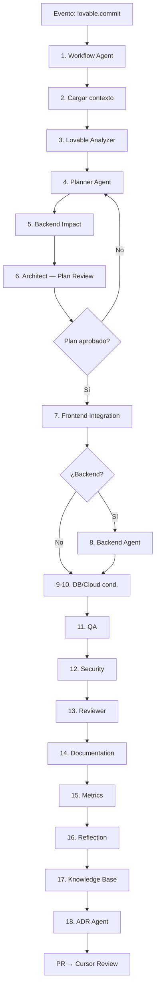

# Integración con Lovable

## Rol de Lovable en NADF

Lovable es la herramienta de prototipado visual y funcional que el equipo de diseño utiliza para definir **cómo debe verse y comportarse** la aplicación. En NADF, Lovable ocupa la **Design Source Layer** y dispara workflows **event-driven** ante cambios en `novus-nexus`.

## Repositorios y responsabilidades

| Repositorio | Rol | Tipo de código |
|-------------|-----|----------------|
| `novus-nexus` | Prototipo Lovable | Intención visual/funcional |
| `NovusIntelligenceWEB` | Frontend productivo | React/TypeScript real |
| `NovusIntelligenceBack` | Backend productivo | API serverless real |

## Flujo multiagente (18 pasos)

Evento: **Cambio detectado en novus-nexus**

Workflow canónico: `.nadf/global/workflow-library/lovable-to-web.yml`  
Workflow de proyecto: `.nadf/projects/novus-intelligence/workflows/lovable-to-web.yml` (extiende el canónico)



## Fases del workflow

| Fase | Pasos | Agentes |
|------|-------|---------|
| Event Trigger | 1-2 | Workflow Agent, cargar contexto |
| Planning | 3-5 | Lovable Analyzer, Planner, Backend Impact |
| Plan Review | 6 | Architect |
| Execution | 7-10 | Frontend, Backend, Database, Cloud |
| Validation | 11-13 | QA, Security, Reviewer |
| Documentation | 14 | Documentation |
| Metrics | 15 | Metrics |
| Reflection | 16 | Reflection |
| KB Update | 17-18 | Knowledge Base, ADR |

**Restricción crítica:** Backend Impact (paso 5) debe completarse en Planning **antes** de Plan Review (paso 6) y **antes** de cualquier paso de Execution (pasos 7-10).

## Qué se extrae de Lovable

El Lovable Analyzer Agent extrae de `novus-nexus` vía MCP GitHub:

- Estructura de layout, componentes, contenido, comportamiento funcional
- Tokens de diseño (como referencia, no CSS literal)

## Qué NO se copia de Lovable

| Prohibido | Motivo |
|-----------|--------|
| Código fuente de componentes | Stack diferente |
| Estilos CSS/Tailwind literales | Design system del proyecto |
| Datos mock / placeholders | Política no-mock |
| Lógica de routing Lovable | React Router del proyecto |
| Dependencias de Lovable | Solo stack productivo |

## Paridad visual exacta (ADR-0006)

Aunque no se copia código, el resultado visual del frontend productivo debe ser **exacto** respecto a Lovable.

- Agente: `visual-parity-agent`
- Checker: `prototypes/m6-cloud-agent/src/visual-parity-check.ts`
- Gate bloqueante: `visual_exact_parity` (maxDiffRatio ≤ 0.002)
- Remediación: `frontend-integration-agent` itera con `gaps-paridad.json`

## Artefactos generados (Planning)

| Artefacto | Productor |
|-----------|-----------|
| cambios-lovable.json | Lovable Analyzer |
| frontend-impact.md | Lovable Analyzer |
| backend-impact.md | Lovable Analyzer |
| riesgos.md | Lovable Analyzer |
| plan-implementacion.md | Planner Agent |
| evaluacion-backend.md | Backend Impact Agent |
| especificacion-backend.md | Backend Impact Agent |
| impacto-arquitectonico.md | Architect Agent (Plan Review) |

## Comando de sincronización

```
.claude/commands/novus-lovable-sync.md
```

Invoca: `.nadf/projects/novus-intelligence/workflows/lovable-to-web.yml`  
Extiende: `.nadf/global/workflow-library/lovable-to-web.yml`

## ADRs relacionados

- [ADR-0001](../.nadf/global/decision-history/adr/ADR-0001-nadf-foundation.md) — Separación Lovable/productivo (Superseded by ADR-0002)
- [ADR-0002](../.nadf/global/decision-history/adr/ADR-0002-multiagent-patterns.md) — Arquitectura multiagente
- [ADR-0003](../.nadf/global/decision-history/adr/ADR-0003-lovable-to-web-canonicalization.md) — Canonicalización workflow lovable-to-web
