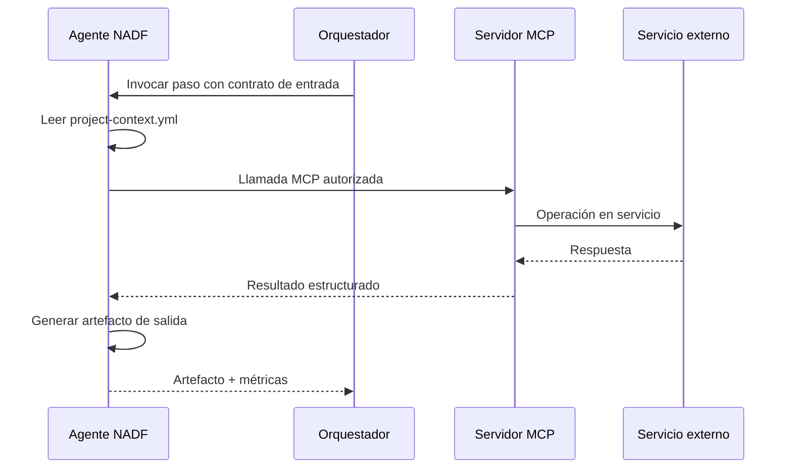

# Integración MCP en NADF

## Propósito

**Model Context Protocol (MCP)** es el mecanismo estándar de NADF para conectar agentes con servicios externos: GitHub, AWS, bases de datos, Terraform, Jira, Docker/Kubernetes y otros. Todo acceso externo debe realizarse vía MCP cuando el servidor correspondiente esté disponible.

## Principios

1. **Abstracción de proveedor** — Los agentes declaran capacidades MCP, no SDKs propietarios directos.
2. **Permisos por agente** — Cada agente tiene `mcp_servers` permitidos en su skill registry.
3. **Sin secrets en código** — Credenciales vía configuración segura del entorno de ejecución, nunca en artefactos.
4. **Trazabilidad** — Operaciones MCP relevantes se registran en métricas y artefactos.

## Servidores MCP previstos

| Servidor MCP | Capacidades | Agentes típicos |
|--------------|-------------|-----------------|
| GitHub | Repos, PRs, issues, diffs | Lovable Analyzer, DevOps, Reviewer |
| AWS | Lambda, S3, DynamoDB, SES, CloudFront | Cloud, Backend, DevOps |
| Database | Consultas schema, migraciones propuestas | Database, Backend |
| Terraform | Planes IaC, validación | Cloud, DevOps |
| Jira | Tickets, estados, vinculación | Workflow, Planner |
| Docker/Kubernetes | Imágenes, manifiestos | DevOps, Cloud |

## Flujo de uso



## Declaración en skill registry

Cada agente declara servidores MCP permitidos:

```yaml
agent:
  mcp_servers:
    - github
    - aws
  allowed_tools:
    - github.get_diff
    - aws.describe_lambda
```

## Restricciones globales

- Agentes **Planner** y **Validator** no deben usar MCP para modificar infraestructura productiva.
- Agentes **Executor** requieren plan aprobado antes de operaciones MCP destructivas.
- Operaciones de despliegue vía MCP están **prohibidas** sin aprobación humana explícita.
- Fallos de autenticación MCP bloquean el paso y escalan al Orquestador.

## Independencia de proveedor

MCP permite cambiar el backend de un servidor (p. ej. AWS → Azure) sin modificar la definición del agente, alineado con `.nadf/global/rules/provider-independence.md`.

## Referencias

- [Patrones de agentes](agent-patterns.md)
- [Reglas de independencia de proveedor](../.nadf/global/rules/provider-independence.md)
- [CLAUDE.md](../CLAUDE.md)
