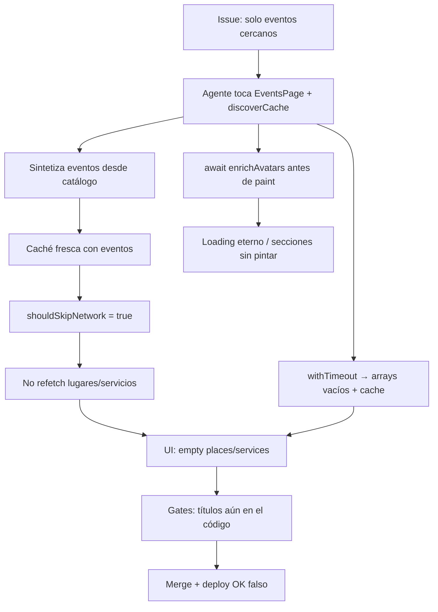

<!-- NADF-GUIDE
Propósito: Lección de blast-radius Descubre — por qué un fix NADF apagó eventos/lugares/servicios.
Configuración: Obligatorio leer antes de tocar EventsPage / discoverCache / skip/loading.
-->
# Blast radius en Descubre — lección operativa NADF

## Qué pasó (síntoma)

Tras ciclos NADF “arreglar eventos cercanos”, Descubre en DEV llegó a:

1. Mostrar solo eventos (lugares/servicios en empty state pese a datos en API).
2. En el peor caso: **no mostrar nada** (loading eterno / caché vacía / skip de red).

La API DEV seguía devolviendo lugares y servicios cerca de Ricaurte. El fallo era de **orquestación FE + gates débiles**, no de “no hay datos”.

## Cadena causal (aprender esto)

| Fallo | Efecto | Por qué el gate viejo no lo pilló |
|-------|--------|-----------------------------------|
| Skip de red si hay eventos | Marketplace no se refresca | Solo miraba strings de títulos |
| `await enrichProviderAvatars` antes del paint | Nada se pinta | Compila y “pasa” UI string-check |
| Timeout → `[]` + cache | Empty permanente | Smoke API no estaba en CI |
| Scope “solo eventos” permite `EventsPage` | Agente rompe lugares en archivo permitido | Path allow ≠ preservación de cableado |

## Principio de producto (vendible)

> **Éxito del pipeline ≠ merge/deploy.**  
> Éxito = el cambio pedido **y** las invariantes de superficie intactas **y** smoke de datos.

Blast radius: un issue de 1 sección no puede apagar N secciones.

## Controles implementados

1. **UI invariants de cableado** (`validate:doevents-ui`): exige `fetchNearbyVenues/Services`, `locationBoundFetched`, orden paint≠enrich bloqueante; detecta eliminaciones en el diff.
2. **Prompt domain scope**: blast-radius explícito en código compartido.
3. **Smoke marketplace** (`scripts/smoke-discover-marketplace.mjs`): post-deploy, job falla si API no trae lugares+servicios.
4. **quality_gates** en `project-context.yml`: `ui_invariants_discover` + `discover_marketplace_smoke`.

## Checklist antes de otro issue Descubre

- [ ] Issue declara entidad(es): eventos | lugares | servicios (y “Fuera de alcance”).
- [ ] Si toca `EventsPage`/`discoverCache`: gate UI PASS en el PR.
- [ ] `npm run test:ui-invariants` y `npm run smoke:discover-marketplace` PASS.
- [ ] Validación humana logueada en `/events` (Playwright sin auth **no** cuenta).
- [ ] No declarar OK solo porque Actions puso ✓ en merge.

## Anti-patrones prohibidos (agentes)

- Vaciar `venues`/`services` con `.catch(() => [])` + cachear el vacío.
- Skip de red sin `locationBoundFetched`.
- “Simplificar” Descubre quitando secciones no pedidas.
- Declarar éxito sin smoke marketplace cuando el PR tocó Descubre.
