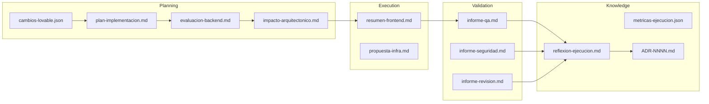

<!-- NADF-GUIDE
Propósito: Documenta NADF Meta Model v1.1 — Modelo de Artefactos.
Configuración: Actualizar contenido, enlaces y ejemplos cuando cambien los contratos relacionados.
-->
# NADF Meta Model v1.1 — Modelo de Artefactos

**Versión:** 1.1  
**Relacionado con:** [entity-model.md](entity-model.md), [blackboard-pattern.md](../blackboard-pattern.md), [requirement-model.md](requirement-model.md)

---

## Propósito

El **Modelo de Artefactos** cataloga todos los artefactos oficiales de NADF — salidas tangibles, versionadas y autocontenidas producidas por agentes durante workflows — y define sus convenciones, contratos y ubicaciones en el Blackboard.

---

## Principios de artefactos

1. **Nombrado convencional** — Cada agente produce artefactos con nombres predecibles.
2. **Autocontenido** — Comprensible sin contexto de sesión.
3. **Versionado** — Incluir fecha ISO-8601 y referencias cruzadas.
4. **Trazabilidad** — Enlazar Intent, Plan, ADR y artefactos relacionados.
5. **Sin secrets** — Prohibido almacenar credenciales en artefactos.

---

## Ubicaciones en Blackboard

| Tipo | Ubicación | Ámbito |
|------|-----------|--------|
| Artefactos de workflow | `.nadf/projects/<proyecto>/artifacts/` | Proyecto |
| Knowledge Base | `.nadf/global/knowledge-base/` | Global |
| ADRs | `.nadf/global/decision-history/adr/` | Global |
| Memoria de proyecto | `.nadf/projects/<proyecto>/memory/` | Proyecto |
| Métricas | `.nadf/global/metrics/` | Global |
| Skill Registry | `.nadf/global/skill-registry/` | Global |
| Workflow Library | `.nadf/global/workflow-library/` | Global |

---

## Catálogo oficial de artefactos

### Design Source Layer

| Artefacto | Productor | Fase | Formato | Descripción |
|-----------|-----------|------|---------|-------------|
| `cambios-lovable.json` | lovable-analyzer-agent | planning | JSON | Análisis estructurado de cambios Lovable |
| `analisis-lovable.md` | lovable-analyzer-agent | planning | Markdown | Informe legible de cambios detectados |

### Planning Layer

| Artefacto | Productor | Fase | Formato | Descripción |
|-----------|-----------|------|---------|-------------|
| `plan-implementacion.md` | planner-agent | planning | Markdown | Plan de implementación detallado |
| `evaluacion-backend.md` | backend-impact-agent | planning | Markdown | Evaluación de necesidad backend/DB/infra |
| `especificacion-backend.md` | backend-impact-agent | planning | Markdown | Especificación backend propuesta |
| `impacto-arquitectonico.md` | architect-agent | plan_review | Markdown | Validación de impacto arquitectónico |
| `workflow-seleccionado.yml` | workflow-agent | event_trigger | YAML | Workflow seleccionado y parametrizado |

### Execution Layer

| Artefacto | Productor | Fase | Formato | Descripción |
|-----------|-----------|------|---------|-------------|
| `resumen-frontend.md` | frontend-integration-agent | execution | Markdown | Resumen de cambios frontend |
| `especificacion-backend.md` | backend-agent | execution | Markdown | Especificación backend implementada |
| `schema-propuesta.md` | database-agent | execution | Markdown | Schemas y migraciones propuestas |
| `propuesta-infra.md` | cloud-agent | execution | Markdown | Propuesta de infraestructura/IaC |
| `pipeline-config.md` | devops-agent | execution | Markdown | Configuración CI/CD propuesta |
| Código productivo | executor agents | execution | Código | Cambios en repos productivos (no en artifacts/) |

### Validation Layer

| Artefacto | Productor | Fase | Formato | Descripción |
|-----------|-----------|------|---------|-------------|
| `informe-qa.md` | qa-agent | validation | Markdown | Informe QA con resultados |
| `qa-result.json` | qa-agent | validation | JSON | Resultados estructurados QA |
| `informe-seguridad.md` | security-agent | validation | Markdown | Informe de seguridad |
| `informe-revision.md` | reviewer-agent | validation | Markdown | Revisión de coherencia plan vs implementación |

### Knowledge Layer

| Artefacto | Productor | Fase | Formato | Descripción |
|-----------|-----------|------|---------|-------------|
| `resumen-ejecucion.md` | documentation-agent | documentation | Markdown | Resumen de la ejecución |
| `reflexion-ejecucion.md` | reflection-agent | reflection | Markdown | Informe de reflexión estructurado |
| `metricas-ejecucion.json` | metrics-agent | metrics | JSON | Métricas según metrics-schema |
| Entradas KB | knowledge-base-agent | knowledge | Markdown | Patrones y errores frecuentes |
| ADR-NNNN-*.md | adr-agent | knowledge | Markdown | Architecture Decision Records |

### Framework

| Artefacto | Productor | Ámbito | Formato | Descripción |
|-----------|-----------|--------|---------|-------------|
| `project-context.yml` | framework-architect-agent | Proyecto | YAML | Configuración del proyecto |
| Skill registry entries | framework-architect-agent | Global | YAML | Definiciones de agentes |
| Workflow definitions | framework-architect-agent | Global/Proyecto | YAML | Definiciones de workflows |

### Requirement Intake (v1.1 / ADR-0007)

| Artefacto | Productor | Fase | Formato | Descripción |
|-----------|-----------|------|---------|-------------|
| `raw-requirement-event.json` | requirement-intake-agent | event_trigger | JSON | Evento crudo persistido |
| `requirement-normalized.yml` | requirement-normalization-agent | planning | YAML | Requirement normalizado |
| `requirement-validation.json` | requirement-validation-agent | planning/validation | JSON | Completitud / ambigüedad |
| `requirement-classification.yml` | requirement-classification-agent | planning | YAML | Clasificación |
| `requirement-deduplication.json` | requirement-deduplication-agent | planning | JSON | Resultado dedup |
| `requirement-approval.yml` | requirement-approval-agent | plan_review | YAML | Aprobación |
| `requirement-to-intent-map.yml` | requirement-traceability-agent | execution | YAML | Requirement ↔ Intent |
| `requirement-traceability.json` | requirement-traceability-agent | execution | JSON | TraceabilityLinks |
| `source-connection-test.json` | requirement-intake-agent | event_trigger | JSON | Health check conector |

Contratos: `.nadf/global/artifact-contracts/requirement-intake/contracts.yml`

---

## Contrato de artefacto (conceptual)

```yaml
artifact:
  id: string
  name: string              # Nombre convencional
  type: enum                # plan, informe, json, code, adr, config
  format: enum              # markdown, json, yaml, code
  producer:
    agent_id: string
    execution_id: string
  path: string              # Ubicación en Blackboard
  created_at: datetime      # ISO-8601
  version: string           # Semver o hash
  status: enum              # draft, final, superseded
  references:
    intent_id: string
    plan_id: string
    adrs: list
    related_artifacts: list
  content_summary: string   # Resumen del contenido
```

---

## Flujo de artefactos en workflow



---

## Convenciones de nomenclatura

| Patrón | Ejemplo | Uso |
|--------|---------|-----|
| `<tipo>-<ámbito>.md` | `plan-implementacion.md` | Documentos de planificación |
| `informe-<dominio>.md` | `informe-qa.md` | Informes de validación |
| `evaluacion-<dominio>.md` | `evaluacion-backend.md` | Evaluaciones |
| `<concepto>.json` | `cambios-lovable.json` | Datos estructurados |
| `ADR-NNNN-<slug>.md` | `ADR-0003-lovable-to-web-canonicalization.md` | ADRs |
| `reflexion-<contexto>.md` | `reflexion-ejecucion.md` | Reflexiones |

---

## Reglas de acceso

| Operación | Regla |
|-----------|-------|
| Lectura | Todo agente del proyecto puede leer artefactos |
| Escritura | Solo el agente productor designado (skill registry) |
| Modificación | Prohibido modificar artefactos `final`; crear nuevo |
| Eliminación | Prohibido eliminar; archivar si es necesario |
| ADR | Inmutable una vez `accepted`; superseder con nuevo ADR |

---

## Artefactos prohibidos

| Prohibición | Razón |
|-------------|-------|
| Código Lovable como artefacto productivo | Regla `no_lovable_code_copy` |
| Secrets/credenciales | Seguridad |
| Mocks en artefactos de producción | Regla `no_mock_data_in_production` |
| Modificación de ADR aceptado | Inmutabilidad de decisiones |

---

## Referencias

- [blackboard-pattern.md](../blackboard-pattern.md)
- [entity-model.md](entity-model.md)
- [memory-model.md](memory-model.md)
- [quality-model.md](quality-model.md)
