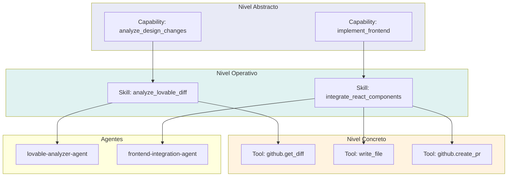

# NADF Meta Model v1.0 — Modelo de Capacidades

**Versión:** 1.0  
**Relacionado con:** [entity-model.md](entity-model.md), [tool-model.md](tool-model.md), [agent-model.md](../agent-model.md)

---

## Propósito

El **Modelo de Capacidades** establece la separación semántica clara entre tres conceptos frecuentemente confundidos: **Capability**, **Skill** y **Tool**. Esta distinción es fundamental para la independencia de proveedor y la extensibilidad del framework.

---

## Jerarquía conceptual

```
Capability (QUÉ puede hacer el framework — abstracto)
    └── Skill (CÓMO lo hace un agente concreto — operativo)
            └── Tool (CON QUÉ lo ejecuta — instrumento)
                    └── MCP Server (conector estandarizado — si aplica)
```

---

## Capability

### Definición
Abstracción funcional de **alto nivel** que describe una capacidad del framework NADF, independiente de agente, proveedor o herramienta.

### Características
- **Proveedor-agnóstica** — No menciona Claude, AWS, Lovable ni Cursor
- **Reutilizable** — Una capability puede ser implementada por múltiples skills
- **Estable** — Cambia raramente; evoluciona con el meta model
- **Catalogable** — Registro global de capabilities del framework

### Ejemplos de Capability

| ID | Nombre | Descripción |
|----|--------|-------------|
| `analyze_design_changes` | Analizar cambios de diseño | Interpretar cambios en fuente visual/funcional |
| `generate_implementation_plan` | Generar plan de implementación | Traducir intención en plan estructurado |
| `validate_architectural_impact` | Validar impacto arquitectónico | Evaluar coherencia con ADRs y arquitectura |
| `implement_frontend` | Implementar frontend | Codificar componentes en repo productivo |
| `implement_backend` | Implementar backend | Codificar APIs y lógica serverless |
| `validate_quality` | Validar calidad | Ejecutar gates de calidad automatizados |
| `validate_security` | Validar seguridad | Detectar vulnerabilidades y exposición |
| `document_execution` | Documentar ejecución | Generar docs y resúmenes |
| `reflect_on_execution` | Reflexionar sobre ejecución | Aprendizaje post-ejecución |
| `manage_knowledge` | Gestionar conocimiento | Actualizar KB con patrones y errores |
| `register_architectural_decision` | Registrar ADR | Formalizar decisiones arquitectónicas |
| `orchestrate_workflow` | Orquestar workflow | Seleccionar y parametrizar workflows |
| `deploy_infrastructure` | Desplegar infraestructura | Proponer y preparar despliegues |
| `integrate_external_service` | Integrar servicio externo | Conectar con servicios vía MCP |

---

## Skill

### Definición
**Especialización operativa** de una Capability asignada a un **Agent concreto**, con contratos de entrada/salida, permisos y registro en skill-registry.

### Características
- **Agente-específica** — Una skill pertenece a un agente
- **Contractual** — Define input_contract y output_contract
- **Registrada** — Vive en `.nadf/global/skill-registry/<agent>.yml`
- **Acotada por patrón** — Respeta Planner/Executor/Validator/Blackboard/Reflection

### Relación Capability → Skill

| Capability | Skill | Agent |
|------------|-------|-------|
| `analyze_design_changes` | `analyze_lovable_diff` | lovable-analyzer-agent |
| `generate_implementation_plan` | `create_plan_document` | planner-agent |
| `validate_architectural_impact` | `review_plan_architecture` | architect-agent |
| `implement_frontend` | `integrate_react_components` | frontend-integration-agent |
| `implement_backend` | `implement_serverless_api` | backend-agent |
| `validate_quality` | `run_qa_gates` | qa-agent |
| `validate_security` | `run_security_scan` | security-agent |
| `reflect_on_execution` | `generate_reflection_report` | reflection-agent |
| `manage_knowledge` | `update_knowledge_patterns` | knowledge-base-agent |
| `register_architectural_decision` | `create_adr_document` | adr-agent |
| `orchestrate_workflow` | `select_and_parametrize_workflow` | workflow-agent |

### Anatomía de una Skill (conceptual)

```yaml
skill:
  id: create_plan_document
  capability: generate_implementation_plan
  agent: planner-agent
  pattern: Planner
  layer: planning
  input_contract:
    - intent_id
    - context_snapshot
    - cambios-lovable.json
  output_contract:
    - plan-implementacion.md
  allowed_tools:
    - read_file
    - write_artifact
  forbidden:
    - modify_productive_code
    - deploy
```

---

## Tool

### Definición
**Instrumento concreto** que un Agent invoca para ejecutar una Skill. Puede ser nativo del motor IA, CLI, API o herramienta expuesta via MCP Server.

### Características
- **Concreta** — Acción específica invocable
- **Tipada** — `native`, `mcp`, `cli`, `api`
- **Permisos** — Declarada en allowed_tools del agente
- **Intercambiable** — Cambiar tool no cambia skill ni capability

### Relación Skill → Tool

| Skill | Tools | Tipo |
|-------|-------|------|
| `analyze_lovable_diff` | `github.get_diff`, `read_file` | mcp, native |
| `create_plan_document` | `write_artifact`, `read_file` | native |
| `integrate_react_components` | `write_file`, `github.create_pr` | native, mcp |
| `run_qa_gates` | `shell.exec`, `read_file` | native |
| `run_security_scan` | `grep`, `read_file` | native |
| `implement_serverless_api` | `write_file`, `aws.describe_lambda` | native, mcp |

Ver [tool-model.md](tool-model.md) y [mcp-model.md](mcp-model.md).

---

## Diagrama de separación



---

## Matriz de comparación

| Dimensión | Capability | Skill | Tool |
|-----------|------------|-------|------|
| **Nivel** | Framework | Agente | Ejecución |
| **Abstracción** | Alta | Media | Baja |
| **Proveedor** | Agnóstico | Agnóstico | Puede ser específico (via MCP) |
| **Registro** | Catálogo global | skill-registry | allowed_tools del agente |
| **Cardinalidad** | 1:N Skills | 1:N Tools | 1:1 invocación |
| **Cambio** | Raro (meta model) | Medio (nuevo agente) | Frecuente (nuevo MCP) |
| **Contrato** | Descripción funcional | input/output contract | Parámetros de invocación |
| **Patrón** | No aplica | Planner/Executor/etc. | No aplica |

---

## Reglas de gobernanza

1. **Toda Skill implementa exactamente una Capability** — No skills huérfanas.
2. **Toda Tool usada debe estar en allowed_tools** — Sin herramientas no declaradas.
3. **Capabilities no mencionan proveedores** — Abstracción pura.
4. **Skills respetan el patrón del Agent** — Planner no implementa skills de Executor.
5. **Tools MCP son preferidas** para acceso externo — Regla `provider_independence`.
6. **Nueva Capability requiere ADR** — Evolución del meta model.

---

## Extensibilidad

### Añadir nueva Capability
1. Registrar en catálogo global de capabilities
2. Documentar en meta model (ADR si significativa)
3. Crear Skills en agentes apropiados

### Añadir nuevo Agent
1. Seleccionar Capabilities a implementar
2. Definir Skills con contratos
3. Declarar Tools y MCP Servers permitidos
4. Registrar en skill-registry

### Añadir nueva Tool (MCP)
1. Exponer via MCP Server
2. Declarar en allowed_tools de agentes autorizados
3. No modificar Skill ni Capability

---

## Referencias

- [entity-model.md](entity-model.md) — Entidades Capability, Skill, Tool
- [tool-model.md](tool-model.md)
- [mcp-model.md](mcp-model.md)
- [agent-model.md](../agent-model.md)
