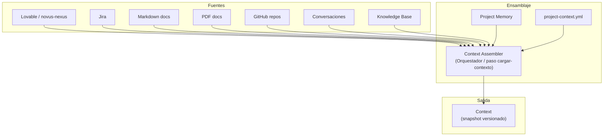
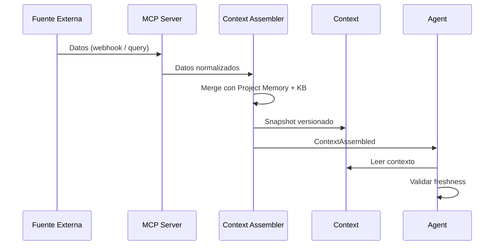

# NADF Meta Model v1.0 — Modelo de Contexto

**Versión:** 1.0  
**Relacionado con:** [entity-model.md](entity-model.md), [memory-model.md](memory-model.md)

---

## Propósito

El **Modelo de Contexto** define cómo NADF ensambla información de múltiples fuentes externas en la entidad `Context`, que alimenta agentes antes de toda acción. El ensamblaje es independiente del proveedor de IA o herramienta de origen.

---

## Fuentes de contexto

| Fuente | Tipo | Contenido típico | Acceso |
|--------|------|------------------|--------|
| **Lovable** | Design Source | Intención visual/funcional, componentes, layouts | GitHub MCP (novus-nexus) |
| **Jira** | Ticketing | Historias, bugs, criterios de aceptación, prioridad | Jira MCP |
| **Markdown** | Documentación | Specs, guías, convenciones | Filesystem / GitHub MCP |
| **PDF** | Documentación | Requisitos, contratos, diseños | Ingesta documental |
| **GitHub** | VCS | Código, diffs, PRs, issues, historial | GitHub MCP |
| **Conversaciones** | Interacción humana | Solicitudes, aclaraciones, decisiones informales | IDE (Cursor, Claude Code) |
| **Knowledge bases** | Conocimiento | Patrones, errores, ADRs, convenciones | `.nadf/global/knowledge-base/` |

---

## Proceso de ensamblaje



---

## Ámbitos de contexto

| Ámbito | Descripción | Duración |
|--------|-------------|----------|
| `global` | Reglas, KB, ADRs, skill registry | Permanente |
| `project` | project-context.yml, memoria de proyecto | Por proyecto |
| `task` | Inputs específicos de la tarea actual | Por Task |
| `session` | Conversación activa, working memory | Por sesión |

---

## Estructura conceptual del Context

```yaml
context:
  id: string
  project_id: string
  scope: enum              # global, project, task, session
  snapshot_at: datetime
  content_hash: string
  sources:
    - source: lovable
      ref: commit_sha
      content_summary: string
    - source: project_context
      ref: project-context.yml
      content_summary: string
    - source: memory
      ref: technical-context.md
      content_summary: string
    - source: knowledge_base
      ref: pattern-id
      content_summary: string
    - source: conversation
      ref: session_id
      content_summary: string
  assembled_for:
    task_id: string
    agent_id: string
  freshness:
    stale: boolean
    stale_sources: list
```

---

## Context por fase del workflow

| Fase | Fuentes prioritarias | Agente consumidor |
|------|---------------------|-------------------|
| Event Trigger | project-context.yml, evento | workflow-agent |
| Planning | Lovable diff, Jira, KB, memoria | lovable-analyzer, planner, backend-impact |
| Plan Review | Plan, evaluacion-backend, ADRs | architect-agent |
| Execution | Plan aprobado, specs, memoria técnica | executor agents |
| Validation | Artefactos producidos, plan original | validator agents |
| Knowledge | Todos los artefactos del ciclo | documentation, reflection, kb, adr |

---

## Regla «Context First»

> **Todo agente debe leer y validar Context antes de actuar.**

Implementación conceptual:

1. Orquestador ensambla Context (paso `cargar-contexto` en workflow)
2. Emite evento `ContextAssembled`
3. Agent recibe Task con referencia a Context snapshot
4. Agent valida que Context no está `stale`
5. Si Context stale → evento `ContextStale` → re-ensamblaje

---

## Fuentes por proyecto (novus-intelligence)

| Fuente | Instancia | Rol |
|--------|-----------|-----|
| Lovable | novus-nexus | Intención visual/funcional |
| GitHub | NovusIntelligenceWEB, NovusIntelligenceBack, NovusAIDevelopmentFramework | Código productivo y framework |
| Markdown | docs/, CLAUDE.md, .nadf/ | Documentación y reglas |
| Conversaciones | Cursor / Claude Code | Solicitudes manuales (novus-lovable-sync) |
| Knowledge Base | `.nadf/global/knowledge-base/` | Patrones (inicialmente vacía) |
| Project Memory | `.nadf/projects/novus-intelligence/memory/` | Contexto técnico y decision-log |

---

## Ingesta de fuentes externas



---

## Context Staleness

Context se marca como `stale` cuando:

| Condición | Acción |
|-----------|--------|
| Nuevo commit en novus-nexus | Re-ensamblar antes de Planning |
| project-context.yml modificado | Re-ensamblar antes de cualquier agente |
| Nuevo ADR aceptado | Re-ensamblar antes de Execution |
| Conversación con decisiones nuevas | Re-ensamblar antes de siguiente Task |

---

## Independencia de proveedor

| Fuente | Abstracción NADF | Proveedores posibles |
|--------|------------------|---------------------|
| Design Source | Intent capture | Lovable, Figma, manual |
| VCS | Context source: vcs | GitHub, GitLab, Bitbucket |
| Ticketing | Context source: ticketing | Jira, Linear, Azure DevOps |
| IDE | Context source: conversation | Cursor, Claude Code, VS Code |
| Cloud docs | Context source: infra | AWS, Azure, GCP docs via MCP |

El meta model define **fuentes semánticas**, no herramientas concretas.

---

## Referencias

- [entity-model.md](entity-model.md)
- [memory-model.md](memory-model.md)
- [intent-model.md](intent-model.md)
- [mcp-model.md](mcp-model.md)
- [project-context.yml](../../.nadf/projects/novus-intelligence/project-context.yml)
