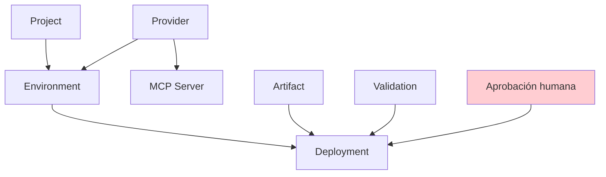
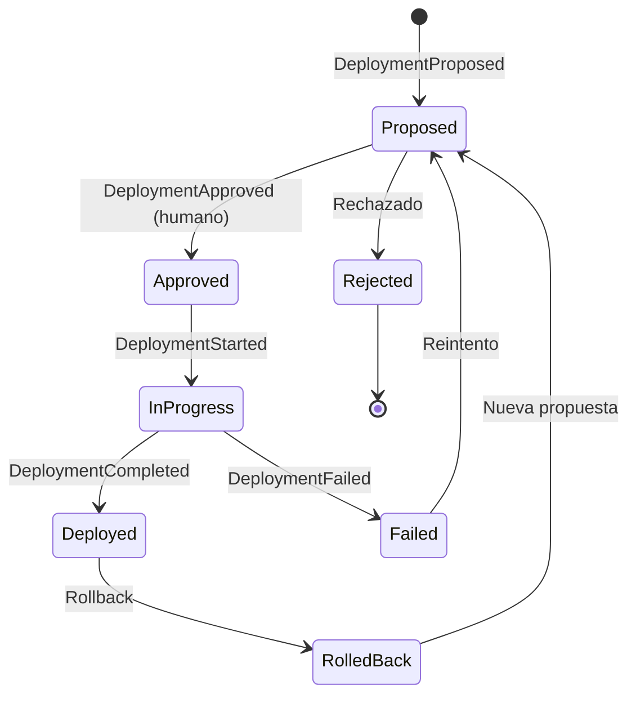
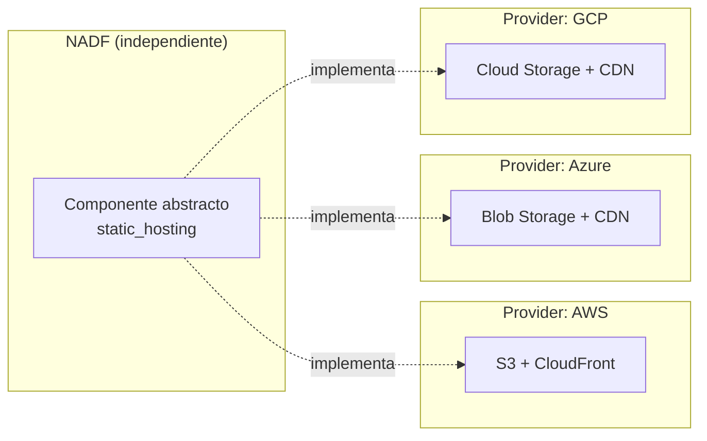
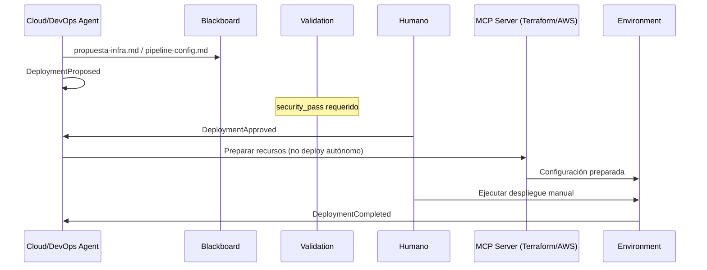

# NADF Meta Model v1.0 — Modelo de Despliegue

**Versión:** 1.0  
**Relacionado con:** [entity-model.md](entity-model.md), [mcp-model.md](mcp-model.md)

---

## Propósito

El **Modelo de Despliegue** define las entidades `Environment`, `Deployment` y `Provider` con abstracción multi-cloud, garantizando que NADF modele despliegues sin acoplarse a un proveedor concreto (AWS, Azure, GCP).

---

## Principios de despliegue

1. **Sin despliegue autónomo** — Agentes preparan; humanos aprueban (ADR-0001).
2. **Abstracción multi-cloud** — Provider intercambiable sin cambiar meta model.
3. **Separación Runtime / Framework** — Runtime Layer (capa 7) es independiente del framework.
4. **Trazabilidad** — Todo Deployment registra qué, dónde, cuándo y quién aprobó.
5. **Validación previa** — Deployment requiere ValidationPassed en gates aplicables.

---

## Entidades del dominio de despliegue

---

## Environment

### Definición
Contexto de ejecución productiva con configuración, región y proveedores asociados.

### Atributos

| Atributo | Tipo | Descripción |
|----------|------|-------------|
| `id` | Identificador | Slug (dev, staging, production) |
| `name` | Texto | Nombre legible |
| `type` | Enum | `development`, `staging`, `production` |
| `project_id` | Referencia | Proyecto asociado |
| `providers` | Lista | Providers configurados |
| `region` | Texto | Región cloud |
| `config` | Mapa | Configuración no secreta |
| `observability` | Mapa | Configuración de observabilidad |

### Ambientes típicos (novus-intelligence)

| Environment | Type | Provider | Región |
|-------------|------|----------|--------|
| `novus-dev` | development | aws | us-east-1 |
| `novus-staging` | staging | aws | us-east-1 |
| `novus-production` | production | aws | us-east-1 |

### Componentes Runtime por Environment

| Componente | Abstracción NADF | Instancia AWS (piloto) |
|------------|------------------|------------------------|
| Hosting frontend | `static_hosting` | S3 + CloudFront |
| API backend | `serverless_api` | Lambda + API Gateway |
| Base de datos | `document_store` | DynamoDB |
| Almacenamiento | `object_storage` | S3 |
| Auth | `authentication` | Configurable por proyecto |
| Observabilidad | `observability` | CloudWatch |

---

## Deployment

### Definición
Instancia concreta de despliegue en un Environment, siempre con aprobación humana explícita.

### Atributos

| Atributo | Tipo | Descripción |
|----------|------|-------------|
| `id` | UUID | Identificador |
| `environment_id` | Referencia | Environment destino |
| `project_id` | Referencia | Proyecto |
| `status` | Enum | Ver ciclo de vida |
| `artifacts` | Lista | Artefactos desplegados |
| `proposed_by` | Referencia | Agent proponente |
| `approved_by` | Referencia | Humano aprobador (obligatorio) |
| `deployed_at` | Timestamp | Fecha de despliegue |
| `rollback_ref` | Referencia | Deployment anterior (rollback) |

### Ciclo de vida

### Reglas

| Regla | Descripción |
|-------|-------------|
| R1 | `approved_by` es **obligatorio** y debe ser humano |
| R2 | Agentes Executor **proponen**, nunca ejecutan despliegue |
| R3 | Workflow `cloud-deployment` prepara, no despliega |
| R4 | Validation `security_pass` requerida antes de proponer |
| R5 | Secrets nunca en artefactos de deployment |

---

## Provider

### Definición
Abstracción de proveedor externo intercambiable.

### Categorías

| Categoría | Ejemplos | Rol en despliegue |
|-----------|----------|-------------------|
| `cloud` | AWS, Azure, GCP | Infraestructura productiva |
| `ai_engine` | Claude, OpenAI, Gemini | Motor de agentes |
| `ide` | Cursor, Claude Code, VS Code | Ejecución humana-asistida |
| `design` | Lovable, Figma | Fuente de intención |
| `vcs` | GitHub, GitLab | Control de versiones |
| `ticketing` | Jira, Linear | Gestión de trabajo |

### Abstracción multi-cloud

### Equivalencias de Provider

| Abstracción NADF | AWS | Azure | GCP |
|------------------|-----|-------|-----|
| `serverless_api` | Lambda + API Gateway | Azure Functions | Cloud Functions |
| `document_store` | DynamoDB | Cosmos DB | Firestore |
| `object_storage` | S3 | Blob Storage | Cloud Storage |
| `static_hosting` | S3 + CloudFront | Blob + CDN | Cloud Storage + CDN |
| `observability` | CloudWatch | Azure Monitor | Cloud Monitoring |

---

## Flujo de despliegue NADF

---

## Workflow cloud-deployment

| Fase | Agente | Acción | Resultado |
|------|--------|--------|-----------|
| Planning | cloud-agent | Evaluar infra necesaria | `propuesta-infra.md` |
| Execution | devops-agent | Preparar CI/CD | `pipeline-config.md` |
| Validation | security-agent | Validar propuesta | informe-seguridad |
| Knowledge | documentation-agent | Documentar propuesta | resumen-ejecucion |
| — | Humano | Aprobar y ejecutar | DeploymentDeployed |

---

## Componentes Runtime Layer (capa 7)

| Componente | Responsabilidad | Entidad meta model |
|------------|-----------------|-------------------|
| Hosting | Servir frontend estático | Environment + Provider |
| APIs | Endpoints serverless | Environment + Provider |
| Database | Persistencia | Environment + Provider |
| Storage | Archivos/objetos | Environment + Provider |
| Auth | Autenticación/autorización | Environment (configurable) |
| Observabilidad | Logs, métricas, alertas | Environment + Metric |

**Nota:** Runtime Layer es independiente del framework NADF; NADF define templates y propuestas, no opera el runtime directamente.

---

## Referencias

- [entity-model.md](entity-model.md)
- [mcp-model.md](mcp-model.md)
- [architecture.md](../architecture.md)
- [ADR-0001](../../.nadf/global/decision-history/adr/ADR-0001-nadf-foundation.md)
- `.nadf/global/rules/provider-independence.md`
