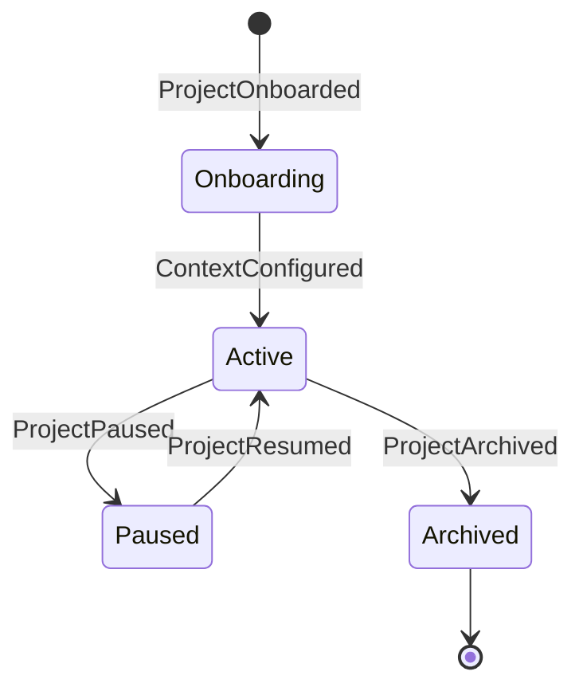

# NADF Meta Model v1.1 — Modelo de Entidades (Core Domain + Intake)

**Versión:** 1.1  
**Entidades:** Core Domain v1.0 + extensión Requirement Intake (ADR-0007)  
**Relacionado con:** [relationship-model.md](relationship-model.md), [requirement-model.md](requirement-model.md), [meta-model-overview.md](meta-model-overview.md)

---

## Propósito

Este documento define las **24 entidades fundamentales** del dominio NADF. Cada entidad incluye propósito, atributos conceptuales, responsabilidades, relaciones (referencia a [relationship-model.md](relationship-model.md)), ciclo de vida y ejemplos en contexto novus-intelligence.

---

## 1. Project

### Propósito
Unidad de trabajo NADF que agrupa contexto, repositorios, workflows, agentes habilitados y políticas de calidad para una aplicación o producto concreto.

### Atributos

| Atributo | Tipo conceptual | Descripción |
|----------|-----------------|-------------|
| `id` | Identificador | Slug único (p. ej. `novus-intelligence`) |
| `name` | Texto | Nombre legible |
| `status` | Enum | `onboarding`, `active`, `paused`, `archived` |
| `domain` | Referencia | Dominio de negocio asociado |
| `repositories` | Mapa | framework, frontend, backend, design_source |
| `agents_enabled` | Lista | Agentes habilitados para el proyecto |
| `primary_workflow` | Referencia | Workflow principal del proyecto |
| `quality_gates` | Lista | Gates aplicables |
| `metadata` | Mapa | Fechas, versión NADF, ADRs de referencia |

### Responsabilidades
- Delimitar el ámbito de operación de agentes y workflows
- Proveer `project-context.yml` como contrato de configuración
- Asociar repositorios productivos y fuente de diseño

### Relaciones
- **Composición:** Context, Memory (por proyecto)
- **Agregación:** Workflow (instancias de proyecto)
- **Asociación:** Domain, Policy, Quality Gate

### Ciclo de vida

### Ejemplo (novus-intelligence)
Proyecto corporativo Novus Intelligence Solutions con agentes core + Intake opt-in (ADR-0007), workflow `lovable-to-web`, repos NovusIntelligenceWEB/Back/novus-nexus.

---

## 2. Domain

### Propósito
Ámbito semántico de negocio o técnico que clasifica proyectos y orienta decisiones de arquitectura y conocimiento.

### Atributos

| Atributo | Tipo conceptual | Descripción |
|----------|-----------------|-------------|
| `id` | Identificador | Slug del dominio |
| `name` | Texto | Nombre del dominio |
| `type` | Enum | `business`, `technical`, `hybrid` |
| `description` | Texto | Descripción del ámbito |
| `parent_domain` | Referencia | Dominio padre (opcional) |

### Responsabilidades
- Clasificar proyectos por área (p. ej. servicios de IA corporativos)
- Orientar selección de patrones y knowledge base

### Relaciones
- **Agregación:** Project (múltiples proyectos por dominio)
- **Asociación:** Knowledge (patrones por dominio)

### Ciclo de vida
`Defined` → `Active` → `Deprecated`

### Ejemplo
Dominio `artificial_intelligence_services` para el sitio corporativo de Novus Intelligence.

---

## 3. Context

### Propósito
Conjunto ensamblado y versionado de información de múltiples fuentes que alimenta la comprensión operativa de agentes antes de actuar.

### Atributos

| Atributo | Tipo conceptual | Descripción |
|----------|-----------------|-------------|
| `id` | Identificador | UUID o slug compuesto |
| `project_id` | Referencia | Proyecto al que pertenece |
| `sources` | Lista | Fuentes ensambladas |
| `snapshot_at` | Timestamp | Momento de ensamblaje |
| `scope` | Enum | `global`, `project`, `task`, `session` |
| `content_hash` | Hash | Integridad del contexto |

### Responsabilidades
- Unificar información dispersa en una vista coherente
- Garantizar que agentes lean contexto antes de ejecutar
- Versionar snapshots para trazabilidad

### Relaciones
- **Composición:** Fuentes de contexto (ver [context-model.md](context-model.md))
- **Dependencia:** Project, Memory, Artifact
- **Asociación:** Intent, Task, Agent

### Ciclo de vida
`Assembling` → `Ready` → `Stale` → `Refreshed` → `Archived`

### Ejemplo
Context ensamblado para paso 2 del workflow lovable-to-web: project-context.yml + technical-context.md + cambios Lovable recientes.

---

## 4. Intent

### Propósito
Representación formal de la intención visual, funcional o de negocio capturada desde fuentes de diseño o solicitudes humanas.

### Atributos

| Atributo | Tipo conceptual | Descripción |
|----------|-----------------|-------------|
| `id` | Identificador | UUID |
| `type` | Enum | `design_change`, `feature`, `bugfix`, `infra`, `documentation` |
| `source` | Referencia | Fuente de origen (Lovable, Jira, etc.) |
| `description` | Texto | Descripción de la intención |
| `scope` | Lista | Componentes/áreas afectados |
| `priority` | Enum | `critical`, `high`, `medium`, `low` |
| `status` | Enum | Ver [intent-model.md](intent-model.md) |
| `event_id` | Referencia | Evento que lo originó |
| `requirement_id` | Referencia | Requirement origen (opcional, v1.1 ADR-0007) |

### Responsabilidades
- Capturar el *qué* y *por qué* sin prescribir implementación
- Servir como referencia de trazabilidad durante todo el ciclo
- Alimentar la generación de Plan
- Cuando nace vía intake, conservar enlace a `Requirement`

### Relaciones
- **Dependencia:** Context, Event
- **Asociación:** Plan (1:N posible por re-planificación)
- Ver [intent-model.md](intent-model.md)

### Ciclo de vida
Ver diagrama completo en [intent-model.md](intent-model.md): `Captured` → `Analyzed` → `Planned` → `Approved` → `InExecution` → `Validated` → `Consolidated`

### Ejemplo
Intent originado por `lovable.commit` en novus-nexus: «Añadir sección de servicios IA en landing page».

---

## 5. Plan

### Propósito
Documento estructurado que traduce Intent en acciones aprobables con evaluación de impacto arquitectónico y backend.

### Atributos

| Atributo | Tipo conceptual | Descripción |
|----------|-----------------|-------------|
| `id` | Identificador | UUID |
| `intent_id` | Referencia | Intent origen |
| `status` | Enum | `draft`, `pending_review`, `approved`, `rejected` |
| `scope_frontend` | Lista | Componentes frontend |
| `scope_backend` | Lista | APIs, schemas |
| `scope_infra` | Lista | Recursos cloud |
| `acceptance_criteria` | Lista | Criterios verificables |
| `constraints` | Lista | Restricciones de Policy/ADR |
| `approved_by` | Referencia | Agent/humano aprobador |
| `approved_at` | Timestamp | Fecha de aprobación |

### Responsabilidades
- Formalizar la traducción Intent → acciones
- Ser aprobado por Architect Agent antes de Execution
- Servir como contrato para Reviewer Agent

### Relaciones
- **Dependencia:** Intent, Context
- **Asociación:** Workflow (instanciación), Artifact (`plan-implementacion.md`)
- **Dependencia:** Decision (ADR) para restricciones

### Ciclo de vida
`Draft` → `PendingReview` → `Approved` | `Rejected` → (re-plan) → `Draft`

### Ejemplo
`plan-implementacion.md` con status `approved` tras Plan Review del Architect Agent.

---

## 6. Workflow

### Propósito
Secuencia declarativa de fases y tareas que coordina agentes siguiendo el modelo obligatorio de 9 fases NADF.

### Atributos

| Atributo | Tipo conceptual | Descripción |
|----------|-----------------|-------------|
| `id` | Identificador | Slug (p. ej. `lovable-to-web`) |
| `name` | Texto | Nombre descriptivo |
| `version` | Semver | Versión del workflow |
| `scope` | Enum | `global`, `project` |
| `extends` | Referencia | Workflow canónico padre |
| `phases` | Lista | 9 fases obligatorias |
| `steps` | Lista | Pasos ordenados con agentes |
| `triggers` | Lista | Eventos/comandos disparadores |
| `quality_gates` | Lista | Gates aplicables |
| `conditions` | Mapa | Ramificaciones condicionales |

### Responsabilidades
- Definir orquestación declarativa de agentes
- Garantizar separación Planning/Execution/Validation
- Ser reutilizable (global) o extensible (proyecto)

### Relaciones
- **Composición:** Task (instancias)
- **Agregación:** Agent (referenciados)
- **Dependencia:** Plan (parametrización), Event (disparo)
- **Asociación:** Quality Gate, Project

### Ciclo de vida
`Defined` → `Triggered` → `Running` → `Completed` | `Failed` | `Blocked`

### Ejemplo
Workflow global `lovable-to-web.yml` (18 pasos); proyecto novus-intelligence lo extiende con mapping local.

---

## 7. Task

### Propósito
Unidad atómica de trabajo dentro de un Workflow, asignada a un Agent con contratos de entrada/salida definidos.

### Atributos

| Atributo | Tipo conceptual | Descripción |
|----------|-----------------|-------------|
| `id` | Identificador | Slug del paso |
| `workflow_id` | Referencia | Workflow contenedor |
| `phase` | Enum | Fase del modelo de 9 |
| `agent_id` | Referencia | Agent asignado |
| `action` | Texto | Descripción de la acción |
| `inputs` | Lista | Artefactos/contexto requeridos |
| `outputs` | Lista | Artefactos esperados |
| `conditions` | Lista | Precondiciones |
| `order` | Entero | Posición en secuencia |

### Responsabilidades
- Descomponer Workflow en unidades ejecutables
- Definir contratos explícitos de entrada/salida
- Permitir condiciones y ramificaciones

### Relaciones
- **Composición:** Execution (instancias)
- **Dependencia:** Workflow, Agent, Artifact (inputs)
- **Asociación:** Context

### Ciclo de vida
`Pending` → `Ready` → `Assigned` → `InProgress` → `Completed` | `Failed` | `Skipped` | `Blocked`

### Ejemplo
Task `implementar-frontend` (paso 7, fase Execution, agent: frontend-integration-agent, condición: plan approved).

---

## 8. Agent

### Propósito
Entidad de IA especializada con patrón arquitectónico, capa, skills, contratos y permisos definidos en skill registry.

### Atributos

| Atributo | Tipo conceptual | Descripción |
|----------|-----------------|-------------|
| `id` | Identificador | Slug (p. ej. `planner-agent`) |
| `name` | Texto | Nombre legible |
| `pattern` | Enum | Planner, Executor, Validator, Blackboard, Event Driven, Reflection, Mediator |
| `layer` | Enum | Capa arquitectónica (1-7) |
| `skills` | Lista | Skills registradas |
| `capabilities` | Lista | Capabilities abstractas |
| `forbidden_actions` | Lista | Acciones prohibidas |
| `mcp_servers` | Lista | MCP permitidos |
| `quality_gates` | Lista | Gates que puede evaluar/producir |

### Responsabilidades
- Ejecutar Tasks dentro de su patrón y capa
- Generar Artifacts según contrato
- Respetar Policy, Rule y permisos MCP

### Relaciones
- **Composición:** Skill
- **Agregación:** Capability
- **Dependencia:** Tool, MCP Server, Context
- Ver [agent-model.md](../agent-model.md)

### Ciclo de vida
`Idle` → `LoadingContext` → `ValidatingRules` → `Executing` → `GeneratingArtifacts` → `Idle` | `Blocked`

### Ejemplo
`planner-agent`: patrón Planner, capa Planning, produce `plan-implementacion.md`.

---

## 9. Capability

### Propósito
Abstracción funcional de alto nivel que describe *qué puede hacer* el framework, independiente del agente o herramienta concreta.

### Atributos

| Atributo | Tipo conceptual | Descripción |
|----------|-----------------|-------------|
| `id` | Identificador | Slug |
| `name` | Texto | Nombre de la capacidad |
| `description` | Texto | Descripción funcional |
| `domain` | Referencia | Dominio aplicable |
| `level` | Enum | `strategic`, `operational`, `technical` |

### Responsabilidades
- Catalogar funcionalidades del framework a nivel abstracto
- Permitir asignación flexible a Skills y Agents
- Facilitar independencia de proveedor

### Relaciones
- **Agregación:** Skill (especializaciones)
- **Asociación:** Agent (posesión)

### Ciclo de vida
`Proposed` → `Registered` → `Active` → `Deprecated`

### Ejemplo
Capability `analyze_design_changes`: analizar cambios en fuente de diseño Lovable.

---

## 10. Skill

### Propósito
Especialización registrada de una Capability asignada a un Agent concreto con contratos operativos.

### Atributos

| Atributo | Tipo conceptual | Descripción |
|----------|-----------------|-------------|
| `id` | Identificador | Slug |
| `capability_id` | Referencia | Capability padre |
| `agent_id` | Referencia | Agent portador |
| `input_contract` | Esquema | Contrato de entrada |
| `output_contract` | Esquema | Contrato de salida |
| `registry_path` | Ruta | Ubicación en skill-registry |

### Responsabilidades
- Concretar Capability en contrato operativo
- Registrar en skill-registry para descubrimiento
- Vincular Agent con Tools permitidas

### Relaciones
- **Dependencia:** Capability, Agent
- **Asociación:** Tool

### Ciclo de vida
`Draft` → `Registered` → `Active` → `Deprecated`

### Ejemplo
Skill `generate_implementation_plan` del planner-agent en `.nadf/global/skill-registry/planner-agent.yml`.

---

## 11. Tool

### Propósito
Instrumento concreto (nativo del motor IA o vía MCP) que un Agent invoca para cumplir una Skill.

### Atributos

| Atributo | Tipo conceptual | Descripción |
|----------|-----------------|-------------|
| `id` | Identificador | Slug |
| `name` | Texto | Nombre |
| `type` | Enum | `native`, `mcp`, `cli`, `api` |
| `provider` | Referencia | Provider asociado |
| `permissions` | Lista | Permisos requeridos |
| `destructive` | Booleano | Si puede modificar estado externo |

### Responsabilidades
- Abstraer mecanismos de acción concretos
- Declarar permisos y restricciones
- Ser intercambiable sin cambiar Skill

### Relaciones
- **Dependencia:** MCP Server (si type=mcp), Provider
- **Asociación:** Skill, Agent

### Ciclo de vida
`Available` → `Invoked` → `Completed` | `Failed` | `Denied`

Ver [tool-model.md](tool-model.md).

---

## 12. MCP Server

### Propósito
Servidor Model Context Protocol que expone herramientas estandarizadas para acceso a servicios externos.

### Atributos

| Atributo | Tipo conceptual | Descripción |
|----------|-----------------|-------------|
| `id` | Identificador | Slug (p. ej. `github`) |
| `name` | Texto | Nombre del servidor |
| `capabilities` | Lista | Operaciones expuestas |
| `provider` | Referencia | Backend subyacente |
| `auth_method` | Enum | Mecanismo de autenticación |
| `agents_allowed` | Lista | Agentes con acceso |

### Responsabilidades
- Estandarizar acceso a servicios externos
- Aplicar permisos por agente
- Abstraer proveedor concreto

### Relaciones
- **Composición:** Tool (herramientas MCP)
- **Dependencia:** Provider
- **Asociación:** Agent

Ver [mcp-model.md](mcp-model.md).

---

## 13. Execution

### Propósito
Instancia concreta de ejecución de una Task por un Agent, con inicio, fin, resultado y métricas asociadas.

### Atributos

| Atributo | Tipo conceptual | Descripción |
|----------|-----------------|-------------|
| `id` | Identificador | UUID |
| `task_id` | Referencia | Task ejecutada |
| `agent_id` | Referencia | Agent ejecutor |
| `workflow_instance_id` | Referencia | Instancia de workflow |
| `status` | Enum | `started`, `running`, `finished`, `failed` |
| `started_at` | Timestamp | Inicio |
| `finished_at` | Timestamp | Fin |
| `duration_ms` | Entero | Duración |
| `result` | Enum | `success`, `failure`, `partial`, `blocked` |

### Responsabilidades
- Registrar instancia de trabajo realizado
- Emitir eventos ExecutionStarted/Finished/Failed
- Vincular Artifacts producidos

### Relaciones
- **Dependencia:** Task, Agent, Workflow
- **Composición:** Artifact (salidas), Metric
- **Asociación:** Validation

### Ciclo de vida
`Started` → `Running` → `Finished` | `Failed` | `Blocked`

### Ejemplo
Execution del paso 4 (planner-agent) en workflow lovable-to-web, duración 120s, result: success.

---

## 14. Artifact

### Propósito
Salida tangible, versionada y autocontenida producida por un Agent o Execution; unidad atómica del Blackboard.

### Atributos

| Atributo | Tipo conceptual | Descripción |
|----------|-----------------|-------------|
| `id` | Identificador | UUID o nombre convencional |
| `name` | Texto | Nombre del artefacto |
| `type` | Enum | Tipo (plan, informe, código, json, etc.) |
| `producer` | Referencia | Agent o Execution |
| `path` | Ruta | Ubicación en Blackboard |
| `version` | Semver/Hash | Versión o hash de contenido |
| `created_at` | Timestamp | Fecha de creación |
| `references` | Lista | ADRs, Plans, Artifacts relacionados |

### Responsabilidades
- Materializar salidas de agentes de forma auditable
- Ser consumible por agentes downstream
- Respetar convenciones de nomenclatura

### Relaciones
- **Dependencia:** Execution, Agent
- **Asociación:** Validation, Knowledge, Plan

Ver [artifact-model.md](artifact-model.md).

---

## 15. Validation

### Propósito
Resultado estructurado de evaluación de calidad, seguridad o coherencia sobre artefactos o ejecuciones.

### Atributos

| Atributo | Tipo conceptual | Descripción |
|----------|-----------------|-------------|
| `id` | Identificador | UUID |
| `target` | Referencia | Artifact o Execution evaluado |
| `validator` | Referencia | Agent validador |
| `gate_id` | Referencia | Quality Gate aplicado |
| `result` | Enum | `pass`, `fail`, `warning`, `skipped` |
| `score` | Decimal | qualityScore (0-100) |
| `findings` | Lista | Hallazgos detallados |
| `blocking` | Booleano | Si bloquea el workflow |

### Responsabilidades
- Evaluar cumplimiento de quality gates
- Bloquear workflow en fallos críticos
- Generar informes pass/fail

### Relaciones
- **Dependencia:** Artifact, Execution, Quality Gate
- **Asociación:** Agent (Validator), Metric

### Ciclo de vida
`Pending` → `InProgress` → `Passed` | `Failed` | `Warning`

### Ejemplo
Validation del gate `security_pass` por security-agent: result pass, score 95.

---

## 16. Decision (ADR)

### Propósito
Registro formal e inmutable (una vez aceptado) de una decisión arquitectónica o de gobernanza.

### Atributos

| Atributo | Tipo conceptual | Descripción |
|----------|-----------------|-------------|
| `id` | Identificador | ADR-NNNN-slug |
| `title` | Texto | Título de la decisión |
| `status` | Enum | `proposed`, `accepted`, `deprecated`, `superseded` |
| `context` | Texto | Contexto de la decisión |
| `decision` | Texto | Decisión tomada |
| `consequences` | Texto | Consecuencias |
| `supersedes` | Referencia | ADR reemplazado |
| `date` | Fecha | Fecha de aceptación |

### Responsabilidades
- Documentar decisiones arquitectónicas trazables
- Restringir acciones de agentes (via Rule)
- Mantener historial inmutable

### Relaciones
- **Asociación:** Plan, Policy, Rule, Knowledge
- **Dependencia:** Project (ámbito)

### Ciclo de vida
`Proposed` → `Accepted` → `Deprecated` | `Superseded`

### Ejemplo
ADR-0003: canonicalización del workflow lovable-to-web.

---

## 17. Knowledge

### Propósito
Conocimiento consolidado, reutilizable y persistente derivado de reflexión, patrones exitosos y decisiones.

### Atributos

| Atributo | Tipo conceptual | Descripción |
|----------|-----------------|-------------|
| `id` | Identificador | UUID o slug |
| `type` | Enum | `pattern`, `anti_pattern`, `error`, `convention`, `component` |
| `title` | Texto | Título |
| `content` | Texto | Contenido estructurado |
| `domain` | Referencia | Dominio aplicable |
| `source_execution` | Referencia | Execution origen |
| `confidence` | Enum | `high`, `medium`, `low` |
| `usage_count` | Entero | Veces referenciado |

### Responsabilidades
- Almacenar aprendizaje reutilizable
- Alimentar futuros Intents y Plans
- Mantener coherencia con ADRs

### Relaciones
- **Dependencia:** Artifact (reflexión), Decision, Metric
- **Asociación:** Domain, Project, Memory

### Ciclo de vida
`Extracted` → `Reviewed` → `Published` → `Updated` → `Archived`

---

## 18. Memory

### Propósito
Almacén de contexto persistente por proyecto o global, complementario a Knowledge Base estructurada.

### Atributos

| Atributo | Tipo conceptual | Descripción |
|----------|-----------------|-------------|
| `id` | Identificador | UUID |
| `type` | Enum | Ver [memory-model.md](memory-model.md) |
| `scope` | Enum | `project`, `global`, `session` |
| `content` | Texto/Mapa | Contenido de memoria |
| `last_updated` | Timestamp | Última actualización |
| `ttl` | Duración | Time-to-live (opcional) |

### Responsabilidades
- Mantener contexto de negocio, marca y técnico
- Alimentar ensamblaje de Context
- Preservar historial de decisiones y reflexiones

### Relaciones
- **Dependencia:** Project
- **Asociación:** Context, Knowledge, Decision

Ver [memory-model.md](memory-model.md).

---

## 19. Metric

### Propósito
Medición cuantitativa o cualitativa registrada durante o tras una ejecución para observabilidad y aprendizaje.

### Atributos

| Atributo | Tipo conceptual | Descripción |
|----------|-----------------|-------------|
| `id` | Identificador | UUID |
| `execution_id` | Referencia | Execution asociada |
| `name` | Texto | Nombre de la métrica |
| `value` | Variante | Valor numérico, texto o booleano |
| `unit` | Texto | Unidad de medida |
| `recorded_at` | Timestamp | Momento de registro |
| `schema_version` | Semver | Versión del esquema |

### Responsabilidades
- Registrar datos de ejecución según metrics-schema
- Incluir campos de reflexión (reflectionSummary, etc.)
- Alimentar dashboards y aprendizaje

### Relaciones
- **Dependencia:** Execution, Workflow
- **Asociación:** Knowledge, Validation

### Ciclo de vida
`Collected` → `Recorded` → `Aggregated` → `Archived`

---

## 20. Environment

### Propósito
Contexto de ejecución productiva (dev, staging, production) con configuración, secrets y proveedores asociados.

### Atributos

| Atributo | Tipo conceptual | Descripción |
|----------|-----------------|-------------|
| `id` | Identificador | Slug |
| `name` | Texto | Nombre |
| `type` | Enum | `development`, `staging`, `production` |
| `providers` | Lista | Providers configurados |
| `region` | Texto | Región cloud |
| `config` | Mapa | Configuración no secreta |

### Responsabilidades
- Delimitar ámbito de despliegue
- Asociar proveedores cloud e IA
- Separar configuraciones por ambiente

### Relaciones
- **Composición:** Deployment
- **Agregación:** Provider
- **Dependencia:** Project

Ver [deployment-model.md](deployment-model.md).

---

## 21. Deployment

### Propósito
Instancia concreta de despliegue de una aplicación en un Environment, siempre sujeta a aprobación humana explícita.

### Atributos

| Atributo | Tipo conceptual | Descripción |
|----------|-----------------|-------------|
| `id` | Identificador | UUID |
| `environment_id` | Referencia | Environment destino |
| `project_id` | Referencia | Proyecto |
| `status` | Enum | `proposed`, `approved`, `in_progress`, `deployed`, `failed`, `rolled_back` |
| `artifacts` | Lista | Artefactos desplegados |
| `approved_by` | Referencia | Aprobador humano |
| `deployed_at` | Timestamp | Fecha de despliegue |

### Responsabilidades
- Modelar propuestas y ejecuciones de despliegue
- Garantizar aprobación humana (regla NADF)
- Trazar qué se desplegó dónde y cuándo

### Relaciones
- **Dependencia:** Environment, Project, Artifact
- **Asociación:** Validation, Metric

### Ciclo de vida
`Proposed` → `Approved` → `InProgress` → `Deployed` | `Failed` → `RolledBack`

---

## 22. Provider

### Propósito
Abstracción de un proveedor externo (IA, cloud, IDE, diseño) intercambiable sin modificar el meta model.

### Atributos

| Atributo | Tipo conceptual | Descripción |
|----------|-----------------|-------------|
| `id` | Identificador | Slug |
| `name` | Texto | Nombre |
| `category` | Enum | `ai_engine`, `cloud`, `ide`, `design`, `vcs`, `ticketing` |
| `capabilities` | Lista | Capacidades del proveedor |
| `substitutable_by` | Lista | Providers alternativos |

### Responsabilidades
- Abstraer backends concretos
- Permitir migración sin ruptura semántica
- Declarar equivalencias entre proveedores

### Relaciones
- **Asociación:** Tool, MCP Server, Environment, Agent (motor de ejecución)

### Ciclo de vida
`Registered` → `Active` → `Deprecated`

### Ejemplo
Provider `aws` (category: cloud), substitutable_by: `azure`, `gcp`.

---

## 23. Quality Gate

### Propósito
Punto de control bloqueante que evalúa criterios de calidad antes de avanzar en un workflow.

### Atributos

| Atributo | Tipo conceptual | Descripción |
|----------|-----------------|-------------|
| `id` | Identificador | Slug |
| `name` | Texto | Nombre |
| `criteria` | Lista | Criterios evaluables |
| `blocking` | Booleano | Si detiene el workflow |
| `evaluator` | Referencia | Agent evaluador |
| `phase` | Enum | Fase donde aplica |

### Responsabilidades
- Definir puntos de control no negociables
- Bloquear avance en fallos críticos
- Ser verificable automática o manualmente

### Relaciones
- **Dependencia:** Policy, Rule
- **Asociación:** Validation, Workflow

Ver [quality-model.md](quality-model.md).

---

## 24. Policy

### Propósito
Directriz de gobernanza de alto nivel aplicable a proyectos, agentes o capas arquitectónicas.

### Atributos

| Atributo | Tipo conceptual | Descripción |
|----------|-----------------|-------------|
| `id` | Identificador | Slug |
| `name` | Texto | Nombre |
| `scope` | Enum | `global`, `project`, `layer`, `agent` |
| `statement` | Texto | Enunciado de la política |
| `enforcement` | Enum | `mandatory`, `recommended`, `informational` |
| `source_adr` | Referencia | ADR origen (opcional) |

### Responsabilidades
- Establecer directrices de gobernanza
- Derivar Rules operativas
- Aplicarse transversalmente al framework

### Relaciones
- **Composición:** Rule
- **Asociación:** Quality Gate, Agent, Project

### Ejemplo
Policy `provider_independence`: todo acceso externo vía MCP; enforcement: mandatory.

---

## 25. Rule

### Propósito
Regla operativa concreta y verificable derivada de una Policy o Decision (ADR).

### Atributos

| Atributo | Tipo conceptual | Descripción |
|----------|-----------------|-------------|
| `id` | Identificador | Slug |
| `policy_id` | Referencia | Policy padre |
| `statement` | Texto | Regla verificable |
| `verification` | Enum | `automated`, `manual`, `agent` |
| `violation_action` | Enum | `block`, `warn`, `escalate` |
| `applies_to` | Lista | Agentes/capas afectados |

### Responsabilidades
- Operacionalizar Policies en reglas verificables
- Ser evaluable por agentes o validadores
- Bloquear ejecución en violación

### Relaciones
- **Dependencia:** Policy, Decision (ADR)
- **Asociación:** Quality Gate, Agent

### Ejemplo
Rule `no_lovable_code_copy`: prohibido copiar código Lovable a repos productivos; violation_action: block.

---

## Índice de entidades

| # | Entidad | Dominio principal |
|---|---------|-------------------|
| 1 | Project | Contexto |
| 2 | Domain | Contexto |
| 3 | Context | Contexto |
| 4 | Intent | Intención |
| 5 | Plan | Intención |
| 6 | Workflow | Intención / Ejecución |
| 7 | Task | Ejecución |
| 8 | Agent | Ejecución |
| 9 | Capability | Ejecución |
| 10 | Skill | Ejecución |
| 11 | Tool | Ejecución |
| 12 | MCP Server | Ejecución |
| 13 | Execution | Ejecución |
| 14 | Artifact | Conocimiento |
| 15 | Validation | Calidad |
| 16 | Decision (ADR) | Conocimiento / Gobernanza |
| 17 | Knowledge | Conocimiento |
| 18 | Memory | Conocimiento |
| 19 | Metric | Conocimiento |
| 20 | Environment | Despliegue |
| 21 | Deployment | Despliegue |
| 22 | Provider | Despliegue / Tooling |
| 23 | Quality Gate | Calidad |
| 24 | Policy | Gobernanza |
| 25 | Rule | Gobernanza |

> **Nota:** Policy y Rule se documentan como entidades 24 y 25 por completitud semántica; el Core Domain NADF las agrupa bajo el dominio de Gobernanza junto con Quality Gate.

---

## Extensión v1.1 — Requirement Intake (ADR-0007)

Entidades adicionales **opt-in** (detalle normativo en [requirement-model.md](requirement-model.md)):

| # | Entidad | Dominio |
|---|---------|---------|
| 26 | RequirementSourceDefinition | Intake |
| 27 | RequirementSourceInstance | Intake |
| 28 | CredentialReference | Seguridad |
| 29 | RawRequirementEvent | Intake / Eventos |
| 30 | Requirement | Intake |
| 31 | RequirementAttachment | Intake |
| 32 | RequirementMapping | Intake |
| 33 | RequirementPolicy | Gobernanza |
| 34 | TraceabilityLink | Relación / Trazabilidad |

Estas entidades **no** invalidan el Core Domain v1.0. Los proyectos sin `requirement-sources/` no las requieren.

---

## Referencias

- [relationship-model.md](relationship-model.md)
- [intent-model.md](intent-model.md)
- [requirement-model.md](requirement-model.md)
- [meta-model-overview.md](meta-model-overview.md)
