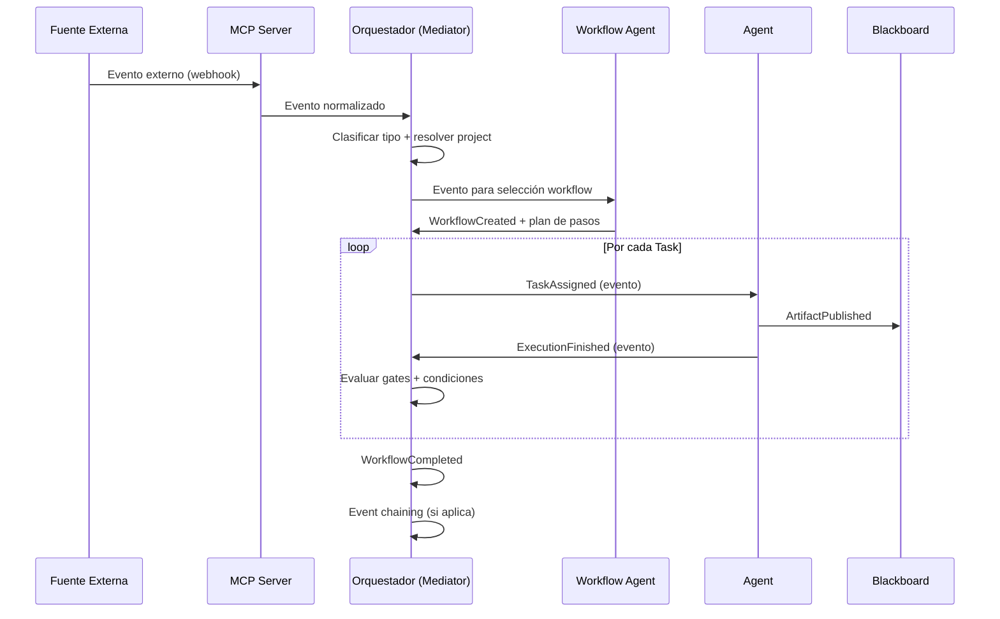
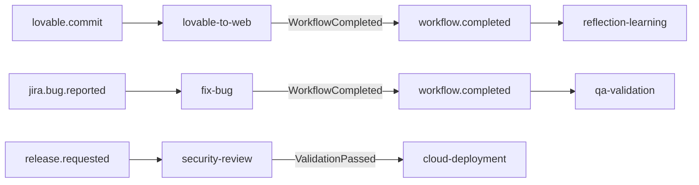
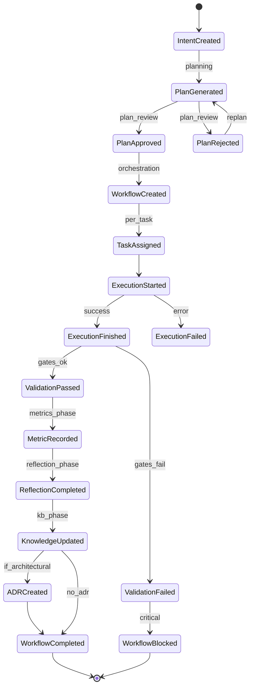

# NADF Meta Model v1.1 — Modelo de Eventos

**Versión:** 1.1  
**Relacionado con:** [intent-model.md](intent-model.md), [requirement-model.md](requirement-model.md), [entity-model.md](entity-model.md)

---

## Propósito

El **Modelo de Eventos** define el catálogo oficial de eventos NADF, su estructura de payload conceptual, tipos, enrutamiento via Orquestador (Mediator) y encadenamiento entre workflows.

Los eventos son el **contrato de comunicación** entre capas, independiente del motor de IA o proveedor cloud.

---

## Principios

1. **Eventos tipados** — Cada evento tiene tipo, origen y payload estructurado.
2. **Trazabilidad** — Todo evento incluye `id`, `timestamp` y referencia a `project`.
3. **Inmutabilidad** — Los eventos emitidos no se modifican; se compensan con eventos correctivos.
4. **Enrutamiento mediado** — El Orquestador recibe, clasifica y enruta; los agentes no se suscriben directamente entre sí.
5. **Idempotencia conceptual** — Eventos duplicados deben ser detectables por `id`.

---

## Estructura conceptual del evento

```yaml
event:
  id: string              # UUID único
  type: string            # Tipo del catálogo oficial
  source: string          # Origen (novus-nexus, github, orchestrator, agent-id...)
  timestamp: datetime     # ISO-8601 UTC
  project: string         # ID del proyecto NADF
  correlation_id: string  # ID de trazabilidad transversal (workflow instance)
  causation_id: string    # ID del evento que causó este (opcional)
  payload: object         # Datos específicos del tipo
  metadata:
    provider: string      # Proveedor de origen (independiente de semántica)
    version: string       # Versión del esquema de evento
```

---

## Catálogo oficial de eventos

### Eventos de intención y planificación

| Evento | Descripción | Emisor típico |
|--------|-------------|---------------|
| `IntentCreated` | Nueva intención capturada | Lovable Analyzer, Orquestador |
| `IntentAnalyzed` | Intención analizada | Lovable Analyzer, Planner |
| `IntentCancelled` | Intención cancelada | Orquestador, humano |
| `PlanGenerated` | Plan de implementación generado | Planner Agent |
| `PlanApproved` | Plan aprobado en Plan Review | Architect Agent |
| `PlanRejected` | Plan rechazado | Architect Agent |
| `ReplanRequested` | Solicitud de re-planificación | Orquestador, Validation |

### Eventos de workflow y tareas

| Evento | Descripción | Emisor típico |
|--------|-------------|---------------|
| `WorkflowCreated` | Instancia de workflow creada | Workflow Agent |
| `WorkflowStarted` | Workflow iniciado | Orquestador |
| `WorkflowCompleted` | Workflow completado exitosamente | Orquestador |
| `WorkflowFailed` | Workflow fallido | Orquestador |
| `WorkflowBlocked` | Workflow bloqueado por gate | Orquestador |
| `TaskAssigned` | Tarea asignada a agente | Orquestador |
| `TaskCompleted` | Tarea completada | Orquestador |
| `TaskSkipped` | Tarea omitida por condición | Orquestador |
| `TaskBlocked` | Tarea bloqueada | Orquestador |

### Eventos de ejecución

| Evento | Descripción | Emisor típico |
|--------|-------------|---------------|
| `ExecutionStarted` | Ejecución de tarea iniciada | Orquestador |
| `ExecutionFinished` | Ejecución completada | Agent / Orquestador |
| `ExecutionFailed` | Ejecución fallida | Agent / Orquestador |
| `ExecutionBlocked` | Ejecución bloqueada por regla | Agent / Orquestador |

### Eventos de validación y calidad

| Evento | Descripción | Emisor típico |
|--------|-------------|---------------|
| `ValidationStarted` | Validación iniciada | Validator Agent |
| `ValidationPassed` | Validación exitosa | QA, Security, Reviewer |
| `ValidationFailed` | Validación fallida | QA, Security, Reviewer |
| `QualityGatePassed` | Gate específico aprobado | Validator Agent |
| `QualityGateFailed` | Gate específico fallido | Validator Agent |

### Eventos de conocimiento y aprendizaje

| Evento | Descripción | Emisor típico |
|--------|-------------|---------------|
| `ArtifactPublished` | Artefacto publicado en Blackboard | Cualquier Agent |
| `KnowledgeUpdated` | Knowledge Base actualizada | Knowledge Base Agent |
| `ADRCreated` | Nuevo ADR registrado | ADR Agent |
| `ADRSuperseded` | ADR reemplazado | ADR Agent |
| `MetricRecorded` | Métrica registrada | Metrics Agent |
| `ReflectionCompleted` | Reflexión post-ejecución completada | Reflection Agent |
| `MemoryUpdated` | Memoria de proyecto actualizada | Documentation Agent |

### Eventos de contexto y proyecto

| Evento | Descripción | Emisor típico |
|--------|-------------|---------------|
| `ContextAssembled` | Context ensamblado | Orquestador |
| `ContextStale` | Context desactualizado | Orquestador |
| `ProjectOnboarded` | Proyecto incorporado a NADF | Framework Architect |
| `ProjectConfigured` | project-context.yml configurado | Framework Architect |

### Eventos de despliegue

| Evento | Descripción | Emisor típico |
|--------|-------------|---------------|
| `DeploymentProposed` | Propuesta de despliegue | Cloud/DevOps Agent |
| `DeploymentApproved` | Despliegue aprobado por humano | Humano |
| `DeploymentStarted` | Despliegue iniciado | DevOps Agent |
| `DeploymentCompleted` | Despliegue exitoso | DevOps Agent |
| `DeploymentFailed` | Despliegue fallido | DevOps Agent |

### Eventos externos (disparadores)

| Evento | Descripción | Origen |
|--------|-------------|--------|
| `lovable.commit` | Commit en novus-nexus | GitHub MCP / webhook |
| `github.pr.opened` | PR creado | GitHub MCP |
| `github.pr.updated` | Push a rama de PR | GitHub MCP |
| `jira.bug.reported` | Bug reportado | Jira MCP |
| `jira.story.created` | Historia creada | Jira MCP |
| `release.requested` | Solicitud de release | Manual / Jira |
| `infra.change` | Cambio de infraestructura | Terraform MCP |
| `project.onboard` | Onboarding de proyecto | Manual |
| `workflow.completed` | Workflow finalizado (chaining) | Orquestador |
| `intent.manual` | Intención manual | IDE / Conversación |
| `requirement.manual.received` | Requerimiento manual (intake) | UI / agente |
| `requirement.jira.received` | Evento Jira intake | Jira connector |
| `requirement.slack.received` | Evento Slack intake | Slack connector |
| `requirement.teams.received` | Evento Teams intake | Teams connector |
| `requirement.github_issue.received` | GitHub issue intake | GitHub connector |
| `requirement.gitlab_issue.received` | GitLab issue intake | GitLab connector |
| `requirement.bitbucket.received` | Bitbucket intake | Bitbucket connector |
| `requirement.email.received` | Correo inbound | Email connector |
| `requirement.webhook.received` | Webhook genérico | Webhook connector |
| `requirement.api.received` | API REST push | REST connector |
| `requirement.file.received` | Archivo subido | File connector |
| `requirement.servicenow.received` | ServiceNow | ServiceNow connector |
| `requirement.form.received` | Formulario empresarial | Form connector |
| `requirement.database.received` | DB/CDC | Database connector |
| `requirement.schedule.received` | Evento programado | Scheduler |

### Eventos Requirement Intake (v1.1 / ADR-0007)

| Evento | Descripción | Emisor típico | Consumidor típico |
|--------|-------------|---------------|-------------------|
| `RequirementSourceConfigured` | Fuente configurada | Framework Architect / humano | Intake agents |
| `RequirementSourceConnectionTested` | Test de conexión | requirement-intake-agent | Orquestador |
| `RawRequirementReceived` | Evento crudo aceptado en recepción | Connector | requirement-intake-agent |
| `RawRequirementRejected` | Rechazo de seguridad/schema | requirement-intake-agent | Orquestador |
| `RequirementNormalized` | Requirement creado | requirement-normalization-agent | classification/dedup |
| `RequirementDuplicateDetected` | Duplicado detectado | requirement-deduplication-agent | Orquestador |
| `RequirementClassified` | Clasificación lista | requirement-classification-agent | validation |
| `RequirementNeedsClarification` | Falta información | requirement-validation-agent | humano |
| `RequirementAwaitingApproval` | Pendiente aprobación | requirement-approval-agent | humano |
| `RequirementApproved` | Aprobado | requirement-approval-agent / humano | traceability |
| `RequirementRejected` | Rechazado | requirement-approval-agent / humano | Orquestador |
| `RequirementConvertedToIntent` | Intent creado | requirement-traceability-agent | workflow-agent |
| `RequirementProcessingFailed` | Fallo de procesamiento | cualquier intake agent | Orquestador |
| `RequirementQuarantined` | Dead-letter | requirement-intake-agent | humano |

#### Payload mínimo común (intake)

```yaml
payload:
  correlation_id: string
  project_id: string
  source_instance_id: string?
  raw_event_id: string?
  requirement_id: string?
  intent_id: string?
  status: string?
```

---

## Payloads conceptuales por evento

### IntentCreated

```yaml
payload:
  intent_id: string
  type: enum           # design_change, feature, bugfix...
  source: string       # lovable, jira, manual...
  description: string
  scope: list
  trigger_event_id: string
```

### WorkflowCreated

```yaml
payload:
  workflow_id: string
  workflow_instance_id: string
  plan_id: string
  intent_id: string
  steps_count: integer
  extends: string      # workflow canónico padre
```

### TaskAssigned

```yaml
payload:
  task_id: string
  workflow_instance_id: string
  agent_id: string
  phase: string
  inputs: list         # referencias a artifacts
  conditions_met: boolean
```

### ExecutionStarted / ExecutionFinished / ExecutionFailed

```yaml
payload:
  execution_id: string
  task_id: string
  agent_id: string
  started_at: datetime       # Started
  finished_at: datetime      # Finished/Failed
  duration_ms: integer       # Finished/Failed
  result: enum               # success, failure, blocked
  artifacts_produced: list   # Finished
  error: string              # Failed
```

### ValidationPassed / ValidationFailed

```yaml
payload:
  validation_id: string
  target_artifact_id: string
  gate_id: string
  validator_agent: string
  result: enum         # pass, fail, warning
  score: number        # 0-100
  findings: list
  blocking: boolean
```

### KnowledgeUpdated

```yaml
payload:
  knowledge_entries: list
  source_reflection_id: string
  patterns_added: list
  anti_patterns_added: list
  errors_documented: list
```

### ADRCreated

```yaml
payload:
  adr_id: string       # ADR-NNNN-slug
  title: string
  status: enum         # proposed, accepted
  supersedes: string   # opcional
  triggered_by: string # execution o decision context
```

### MetricRecorded

```yaml
payload:
  metric_id: string
  execution_id: string
  metrics: object      # según metrics-schema.json
  reflectionSummary: string
  patternsIdentified: list
  failuresDocumented: list
  kbUpdatesRecommended: list
```

### ReflectionCompleted

```yaml
payload:
  reflection_artifact_id: string
  workflow_instance_id: string
  summary: string
  kb_recommendations: list
  adr_recommendations: list
  workflow_improvements: list
```

---

## Enrutamiento de eventos (Mediator / Orquestador)



### Reglas de enrutamiento

| Regla | Descripción |
|-------|-------------|
| R1 | Eventos externos se normalizan antes de enrutar |
| R2 | El Orquestador es el único receptor de eventos de agentes |
| R3 | `WorkflowBlocked` detiene el enrutamiento hasta resolución |
| R4 | `ValidationFailed` (blocking) emite `WorkflowBlocked` |
| R5 | `WorkflowCompleted` puede emitir eventos de chaining |
| R6 | Todo evento se correlaciona con `correlation_id` del workflow instance |

---

## Event chaining



| Evento origen | Evento destino | Workflow destino |
|---------------|----------------|------------------|
| `workflow.completed` (lovable-to-web) | `workflow.completed` | reflection-learning |
| `workflow.completed` (fix-bug) | `workflow.completed` | qa-validation |
| `release.requested` | encadenado | security-review → cloud-deployment |
| `github.pr.opened` | directo | qa-validation, security-review |

---

## Diagrama de eventos del ciclo principal



---

## Referencias

- [intent-model.md](intent-model.md)
- [event-driven-workflows.md](../event-driven-workflows.md)
- [orchestrator-pattern.md](../orchestrator-pattern.md)
- [entity-model.md](entity-model.md)
