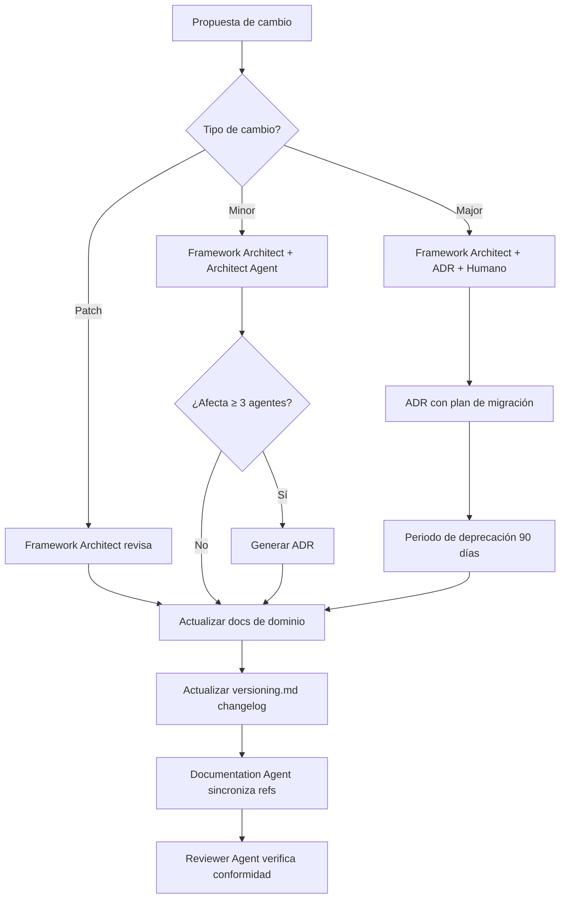

# NADF Meta Model — Gobernanza

**Versión del documento:** 1.0  
**Estado:** Normativo  
**Autoridad:** ADR-0004

---

## Propósito

Este documento define **cómo se modifica**, **quién aprueba** y **cuándo se requiere ADR o nueva versión** del NADF Meta Model. Garantiza que la evolución del lenguaje central del framework sea controlada, trazable y compatible con agentes, workflows y proyectos existentes.

---

## Principios de gobernanza

1. **El Meta Model es propiedad del framework**, no de un proyecto individual.
2. **Toda modificación es documentada** — cambios implícitos o no registrados están prohibidos.
3. **La extensión prevalece sobre la ruptura** — preferir Minor compatible antes que Major incompatible.
4. **Los ADRs registran decisiones irreversibles** — toda modificación Major genera ADR.
5. **Framework Architect Agent es custodio** del meta model y del proceso de evolución.

---

## Roles y responsabilidades

| Rol | Agente / Actor | Responsabilidad |
|-----|----------------|-----------------|
| **Custodio** | Framework Architect Agent | Propone, revisa y mantiene coherencia del meta model |
| **Validador arquitectónico** | Architect Agent | Evalúa impacto en proyectos productivos |
| **Registrador** | ADR Agent | Registra ADRs de evolución del meta model |
| **Documentador** | Documentation Agent | Actualiza docs afectados tras aprobación |
| **Revisor de conformidad** | Reviewer Agent | Verifica alineación agentes/workflows ↔ meta model |
| **Aprobador final** | Equipo humano (Enterprise Architect) | Aprueba cambios Major y deprecaciones |

---

## Tipos de modificación

### Tipo A — Clarificación (Patch)

| Atributo | Detalle |
|----------|---------|
| **Alcance** | Correcciones, ejemplos, diagramas, glosario |
| **Aprobación** | Framework Architect Agent |
| **ADR** | No requerido |
| **Nueva versión** | Patch (v1.0.x) |
| **Ejemplo** | Corregir definición de `Intent` en entity-model.md |

### Tipo B — Extensión compatible (Minor)

| Atributo | Detalle |
|----------|---------|
| **Alcance** | Nueva entidad, atributo opcional, evento, artefacto, tipo de memoria |
| **Aprobación** | Framework Architect Agent + revisión Architect Agent |
| **ADR** | Recomendado; **obligatorio** si afecta ≥ 3 agentes o workflows |
| **Nueva versión** | Minor (v1.x) |
| **Ejemplo** | Añadir entidad `Requirement` como extensión de Intent |

### Tipo C — Cambio incompatible (Major)

| Atributo | Detalle |
|----------|---------|
| **Alcance** | Eliminar entidad, redefinir relación obligatoria, alterar flujo semántico core |
| **Aprobación** | Framework Architect Agent + aprobación humana explícita |
| **ADR** | **Obligatorio** (ADR dedicado con plan de migración) |
| **Nueva versión** | Major (vX.0) |
| **Deprecación** | Periodo mínimo 90 días antes de retirada |
| **Ejemplo** | Fusionar `Task` y `Execution` en una sola entidad |

### Tipo D — Supersión de ADR

| Atributo | Detalle |
|----------|---------|
| **Alcance** | ADR previo contradice evolución necesaria del meta model |
| **Aprobación** | Framework Architect Agent + ADR Agent + aprobación humana |
| **ADR** | Nuevo ADR que declara supersión explícita del ADR anterior |
| **Nueva versión** | Según impacto (Minor o Major) |

---

## Proceso de modificación

### Pasos detallados

1. **Propuesta** — El custodio (Framework Architect) o cualquier agente identifica necesidad de cambio. La propuesta incluye: entidad/flujo afectado, tipo de cambio (A/B/C), impacto en agentes y workflows.
2. **Evaluación de impacto** — Revisar los 27 agentes, workflows globales, skill registry y proyectos activos.
3. **Aprobación** — Según tipo de cambio (ver tabla anterior).
4. **Registro** — ADR si aplica; entrada en changelog de versioning.md.
5. **Implementación documental** — Actualizar documentos de dominio afectados en `docs/meta-model/`.
6. **Sincronización** — Actualizar CLAUDE.md, agentes, skill registry y project-context si aplica.
7. **Verificación** — Reviewer Agent confirma conformidad (manual en M0; automatizado en M7).

---

## Cuándo se requiere ADR

| Situación | ADR |
|-----------|-----|
| Adopción inicial del meta model (v1.0) | ✅ ADR-0004 |
| Cambio Major (Tipo C) | ✅ Obligatorio |
| Extensión Minor que afecta ≥ 3 agentes/workflows | ✅ Obligatorio |
| Extensión Minor localizada (1-2 agentes) | ⚠️ Recomendado |
| Patch / clarificación (Tipo A) | ❌ No requerido |
| Nueva entidad que altera flujo Intent → Knowledge | ✅ Obligatorio |
| Deprecación de entidad del Core Domain | ✅ Obligatorio |

---

## Cuándo se incrementa la versión

| Acción | Versión |
|--------|---------|
| Corrección tipográfica o ejemplo nuevo | Patch (1.0.x) |
| Nueva entidad compatible, nuevo evento, nuevo artefacto | Minor (1.x) |
| Eliminar entidad, cambiar flujo semántico core | Major (X.0) |
| ADR-0004 (adopción v1.0) | Major 1.0.0 |

Ver reglas completas en [versioning.md](versioning.md).

---

## Qué no puede modificarse sin Major + ADR

- Flujo semántico principal: `Context → Intent → Plan → Execution → Validation → Knowledge`
- Separación planificación / ejecución / validación (permisos por capa)
- Comunicación mediada (sin comunicación directa entre agentes)
- Entidades core: Intent, Plan, Workflow, Agent, Execution, Artifact, Validation, Knowledge
- Patrón Reflection como fase obligatoria post-implementación
- MCP como mecanismo estándar de acceso externo

---

## Conformidad y auditoría

### Verificación manual (M0 — actual)

- Framework Architect Agent revisa periódicamente alineación docs ↔ agentes ↔ skill registry.
- Reviewer Agent valida conformidad en workflows de implementación.

### Verificación automatizada (M7 — futuro)

- Validador CI verificará: entidades referenciadas existen en entity-model.md, artefactos mapeados en artifact-model.md, agentes declaran entidades de entrada/salida válidas.

### Indicadores de drift

- Agente referencia entidad no definida en meta model
- Workflow produce artefacto no catalogado en artifact-model.md
- Nuevo tipo de evento sin registro en event-model.md
- Skill registry desalineado con capability-model.md

---

## Referencias

- [Especificación oficial](specification.md)
- [Versionado](versioning.md)
- [Principios arquitectónicos](architecture-principles.md)
- [ADR-0004](../../.nadf/global/decision-history/adr/ADR-0004-nadf-meta-model.md)
