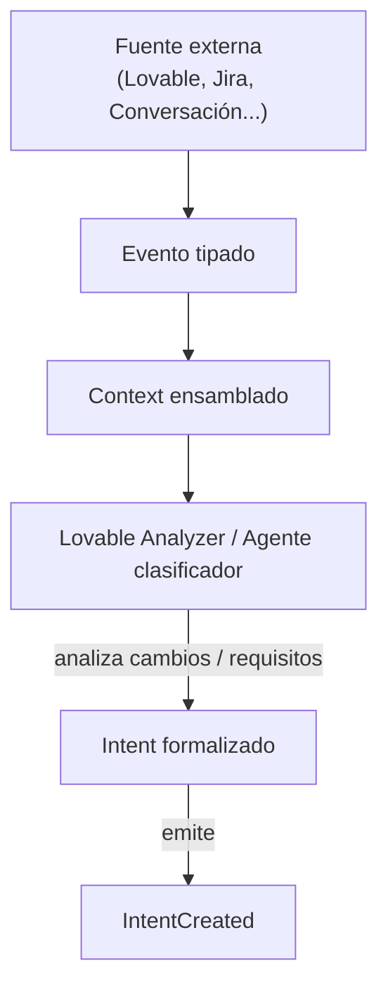
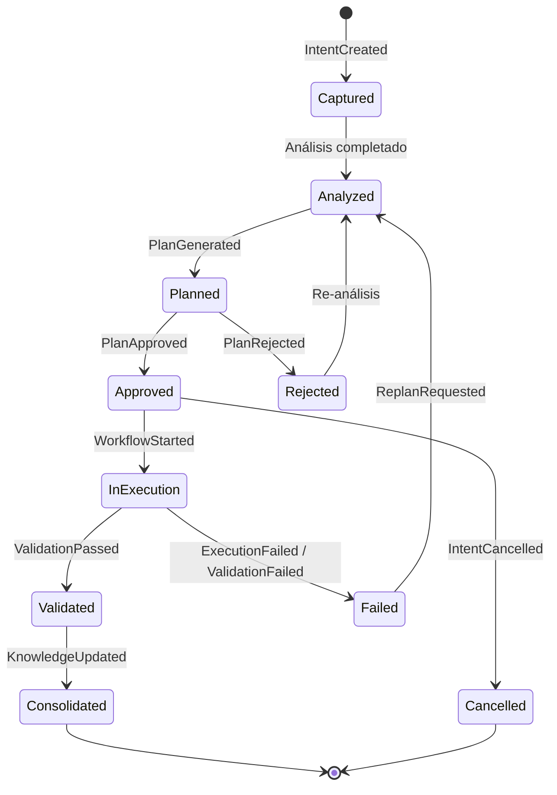
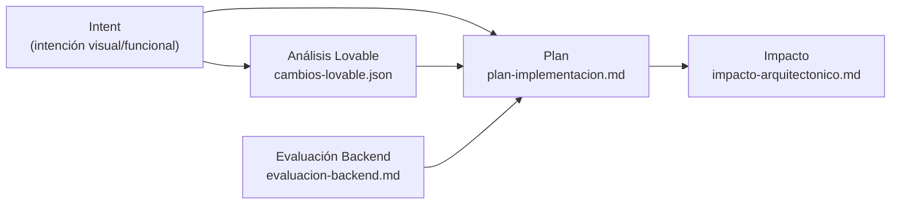
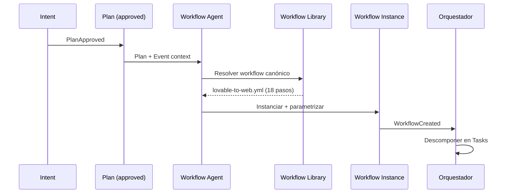
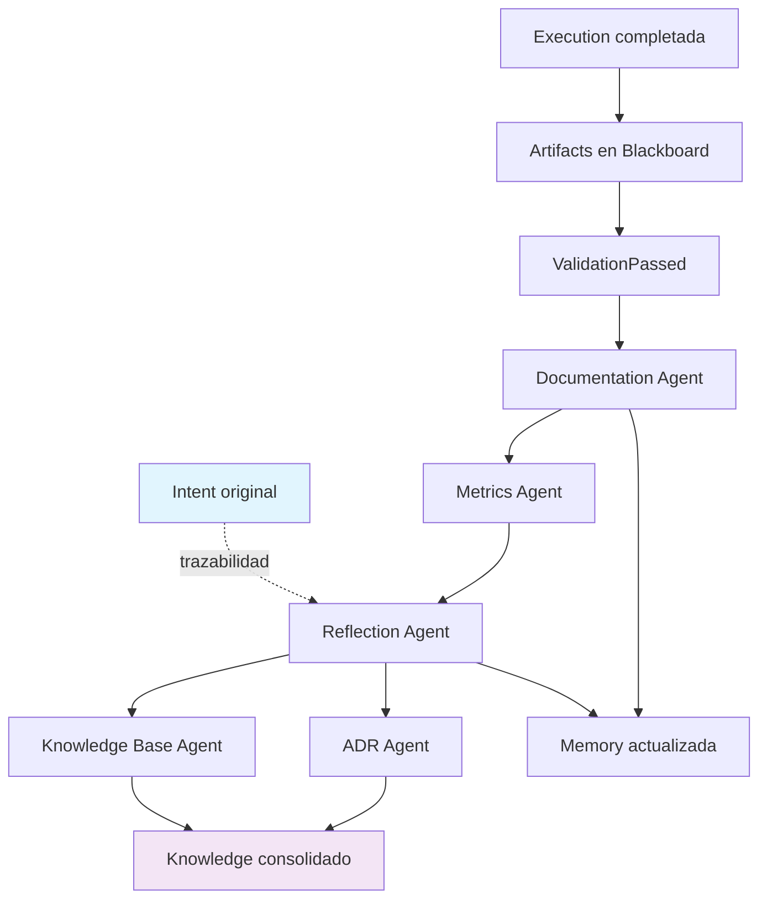
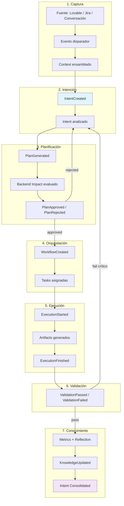

<!-- NADF-GUIDE
Propósito: Documenta NADF Meta Model v1.1 — Modelo de Intención.
Configuración: Actualizar contenido, enlaces y ejemplos cuando cambien los contratos relacionados.
-->
# NADF Meta Model v1.1 — Modelo de Intención

**Versión:** 1.1  
**Prioridad:** Crítica — documento más importante del meta model  
**Relacionado con:** [entity-model.md](entity-model.md), [context-model.md](context-model.md), [event-model.md](event-model.md), [requirement-model.md](requirement-model.md)

---

## Propósito

El **Modelo de Intención** define el flujo semántico completo desde la captura de intención de diseño/negocio hasta su consolidación como conocimiento reutilizable. Es el eje central de NADF: garantiza que la intención fluye de forma **unidireccional** (diseño → plan → ejecución → conocimiento) sin copia directa de código ni pérdida de trazabilidad.

---

## Principios del flujo de intención

1. **Intención ≠ Implementación** — `Intent` captura el *qué* y *por qué*; `Execution` produce el *cómo* productivo.
2. **Trazabilidad de origen** — Todo `Intent` registra su fuente (`Context`) y evento disparador.
3. **Aprobación explícita** — Ningún `Intent` avanza a `Execution` sin `Plan` aprobado en Plan Review.
4. **Cierre en Knowledge** — Todo ciclo de intención debe terminar en actualización de `Knowledge`, `Memory` o `Decision (ADR)`.
5. **Independencia de proveedor** — La intención se modela igual independientemente de Lovable, Cursor, Claude u otro motor.

---

## Nacimiento del Intent

### Fuentes de origen

| Fuente | Mecanismo | Evento típico |
|--------|-----------|---------------|
| Lovable / novus-nexus | Commit en repositorio de diseño | `lovable.commit` |
| Conversación humana | Solicitud explícita en IDE | `intent.manual` |
| Jira | Ticket de feature/bug | `jira.story.created`, `jira.bug.reported` |
| GitHub | Issue o PR | `github.issue.opened` |
| Markdown / PDF | Documento de requisitos | `context.document.ingested` |
| Knowledge Base | Patrón reutilizable | `knowledge.pattern.requested` |
| Requirement Intake (v1.1) | Requirement aprobado multi-fuente | `RequirementConvertedToIntent` |

> **v1.1:** Cuando el proyecto tiene intake habilitado, Jira/Slack/GitHub/etc. deben producir `Requirement` antes de `Intent`. Sin intake, el nacimiento directo Event → Intent (v1.0) permanece válido.

### Proceso de nacimiento



### Atributos iniciales del Intent

Al nacer, un `Intent` contiene como mínimo:

- `id`, `source`, `type`, `scope`, `priority`
- Referencia al `Context` ensamblado
- Referencia al `Event` disparador
- `requirement_id` (opcional, ADR-0007)
- `status: captured`

---

## Evolución del Intent

### Estados del ciclo de vida



### Transiciones y eventos asociados

| Transición | Evento | Agente responsable |
|------------|--------|-------------------|
| Captured → Analyzed | `IntentAnalyzed` | Lovable Analyzer, Planner |
| Analyzed → Planned | `PlanGenerated` | Planner Agent |
| Planned → Approved | `PlanApproved` | Architect Agent |
| Planned → Rejected | `PlanRejected` | Architect Agent |
| Approved → InExecution | `WorkflowStarted` | Workflow Agent, Orquestador |
| InExecution → Validated | `ValidationPassed` | QA, Security, Reviewer |
| Validated → Consolidated | `KnowledgeUpdated` | Reflection, KB, ADR Agents |

---

## Transformación Intent → Plan

### Semántica de la transformación

El `Plan` es la **traducción estructurada** del `Intent` en acciones concretas, evaluaciones de impacto y criterios de aceptación. No es código; es un artefacto de planificación aprobable.



### Contenido conceptual del Plan

| Sección | Origen | Propósito |
|---------|--------|-----------|
| Resumen de intención | Intent | Trazabilidad al origen |
| Alcance frontend | Intent + Context | Componentes afectados |
| Alcance backend | Backend Impact Agent | APIs, schemas, infra |
| Criterios de aceptación | Intent + Quality Gates | Condiciones de cierre |
| Restricciones | Policy, Rule, ADR | Límites no negociables |
| Status | Architect Agent | `draft` → `approved` / `rejected` |

### Precondiciones

- `Intent.status >= analyzed`
- `Context` cargado (project-context.yml + memoria)
- `Backend Impact` completado **antes** de Plan Review (ADR-0003)

---

## Generación de Workflows

### Selección de workflow

El **Workflow Agent** transforma un `Plan` aprobado en una instancia de `Workflow` parametrizada:



### Reglas de instanciación

1. El workflow global en `.nadf/global/workflow-library/` es **canónico** (ADR-0003).
2. El workflow de proyecto **extiende** el global; no puede invertir fases.
3. Cada fase del modelo de 9 fases genera uno o más `Task`.
4. Condiciones del Plan determinan ramificaciones (p. ej. `requires_backend == true`).

### Mapeo Plan → Workflow (novus-intelligence)

| Elemento del Plan | Parámetro del Workflow |
|-------------------|------------------------|
| Componentes frontend | `mapping.components` |
| Requiere backend | `conditions.requires_backend` |
| Cambio infra | `conditions.requires_cloud` |
| Severidad | `priority`, gates adicionales |

---

## Ejecución y validación

Durante la ejecución, el `Intent` permanece como **referencia de trazabilidad** en cada `Task` y `Execution`:

```
Intent (ref) → Task → Execution → Artifact → Validation
```

Los agentes Executor consultan el Plan aprobado, no el Intent crudo. El Intent sirve para:

- Coherencia en Reviewer Agent (plan vs implementación vs intención original)
- Reflexión post-ejecución (¿se cumplió la intención?)
- Métricas de alineación intención-resultado

---

## Cierre en Knowledge

### Flujo final: Intent → Knowledge



### Artefactos de cierre

| Artefacto | Agente | Contribución a Knowledge |
|-----------|--------|--------------------------|
| `reflexion-ejecucion.md` | Reflection | Aprendizajes, anti-patrones |
| Patrones en KB | Knowledge Base | Reutilización futura |
| ADR | ADR Agent | Decisiones arquitectónicas |
| `decision-log.md` | Documentation | Historial de decisiones |
| Métricas | Metrics | Datos cuantitativos del ciclo |

### Criterios de cierre del Intent

Un `Intent` alcanza estado `Consolidated` cuando:

1. Todos los quality gates aplicables han pasado
2. `ReflectionCompleted` registrado
3. `KnowledgeUpdated` o justificación documentada de no actualización
4. ADR creado si hubo decisión arquitectónica (gate `adr_if_architectural`)
5. `Intent.status = consolidated`

---

## Diagrama de flujo completo



---

## Ejemplo: novus-intelligence / lovable-to-web

| Fase del flujo | Instancia concreta |
|----------------|-------------------|
| Fuente | Commit en `novus-nexus` (Lovable) |
| Evento | `lovable.commit` |
| Intent | «Actualizar landing page con nueva sección de servicios» |
| Plan | `plan-implementacion.md` (status: approved) |
| Workflow | `lovable-to-web` (18 pasos, extends canónico) |
| Execution | Frontend Integration en NovusIntelligenceWEB |
| Validation | QA + Security + Reviewer pass |
| Knowledge | Patrón «sección servicios responsive» en KB |

---

## Referencias

- [entity-model.md](entity-model.md) — Entidades Intent, Plan, Workflow
- [context-model.md](context-model.md) — Fuentes de contexto
- [event-model.md](event-model.md) — IntentCreated, PlanApproved, KnowledgeUpdated
- [learning-model.md](learning-model.md) — Reflection y cierre
- [artifact-model.md](artifact-model.md) — Artefactos del flujo
- [planning-execution-validation.md](../planning-execution-validation.md)
