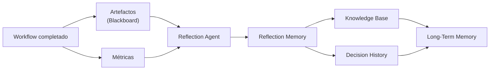
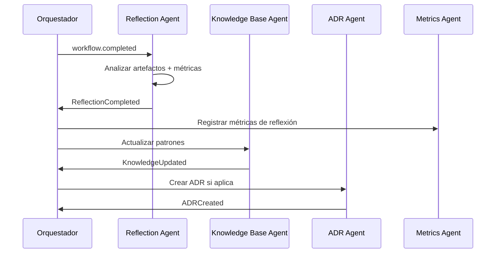

# NADF Meta Model v1.0 — Modelo de Aprendizaje

**Versión:** 1.0  
**Relacionado con:** [memory-model.md](memory-model.md), [intent-model.md](intent-model.md), [reflection-learning.md](../reflection-learning.md)

---

## Propósito

El **Modelo de Aprendizaje** define el ciclo de aprendizaje post-ejecución basado en el **Reflection Pattern**, que transforma experiencias de workflow en conocimiento reutilizable.

---

## Reflection Pattern

### Definición
Patrón arquitectónico (7º patrón NADF) que cierra cada ciclo de workflow documentando qué ocurrió, qué falló, qué se aprendió y qué debe incorporarse al ecosistema de conocimiento.

### Agente responsable
**Reflection Agent** — Knowledge Layer, patrón Reflection, fase 8 de todo workflow.

---

## Ciclo de aprendizaje



---

## Fases del aprendizaje

| Fase | Agente | Entrada | Salida |
|------|--------|---------|--------|
| 1. Recopilación | Reflection Agent | Artefactos + Métricas + Plan original | Análisis interno |
| 2. Análisis | Reflection Agent | Informes QA/Security/Reviewer | Identificación de patrones |
| 3. Documentación | Reflection Agent | Análisis | `reflexion-ejecucion.md` |
| 4. Recomendación KB | Reflection Agent | Aprendizajes | Recomendaciones para KB Agent |
| 5. Recomendación ADR | Reflection Agent | Decisiones no registradas | Recomendaciones para ADR Agent |
| 6. Consolidación KB | Knowledge Base Agent | Recomendaciones aprobadas | Entradas en Knowledge Base |
| 7. Consolidación ADR | ADR Agent | Decisiones arquitectónicas | Nuevo ADR |
| 8. Métricas de reflexión | Metrics Agent | Campos de reflexión | metrics-schema actualizado |

---

## Entradas del Reflection Agent

| Entrada | Fuente | Propósito |
|---------|--------|-----------|
| Artefactos del workflow | `.nadf/projects/<proyecto>/artifacts/` | Qué se produjo |
| Métricas registradas | Metrics Agent | Datos cuantitativos |
| Informes de validación | QA, Security, Reviewer | Calidad y hallazgos |
| Plan original | `plan-implementacion.md` | Comparar intención vs resultado |
| Intent origen | Referencia en Plan | Trazabilidad de intención |

---

## Salidas del Reflection Agent

### Artefacto principal: reflexion-ejecucion.md

```markdown
# Reflexión de ejecución

## Workflow
- ID, fecha, agentes involucrados, duración

## Qué se hizo
- Acciones completadas por fase

## Qué falló
- Gates fallidos, errores, bloqueos, reintentos

## Qué se aprendió
- Patrones exitosos identificados
- Anti-patrones detectados
- Desviaciones plan vs implementación

## Recomendaciones
- Actualizaciones sugeridas para Knowledge Base
- ADRs pendientes de registro
- Mejoras de workflow propuestas
```

### Campos en metrics-schema.json

| Campo | Tipo | Descripción |
|-------|------|-------------|
| `reflectionSummary` | string | Resumen breve del aprendizaje |
| `patternsIdentified` | list | Patrones detectados |
| `failuresDocumented` | list | Fallos documentados |
| `kbUpdatesRecommended` | list | Actualizaciones KB sugeridas |

---

## Criterios de actualización de Knowledge Base

Actualizar KB cuando:

| Criterio | Ejemplo |
|----------|---------|
| Error repetido en >1 workflow | «Intento de copia Lovable» detectado 2 veces |
| Patrón exitoso identificado | «Sección servicios responsive con Tailwind grid» |
| Anti-patrón detectado | «Mock data en componente de producción» |
| Cambio de convención acordado | «Nuevo patrón de routing en React Router v6» |
| Desviación significativa plan vs resultado | «Backend no necesario pero evaluado como requerido» |

---

## Eventos de aprendizaje

| Evento | Emisor | Significado |
|--------|--------|-------------|
| `ReflectionCompleted` | Reflection Agent | Reflexión documentada |
| `KnowledgeUpdated` | Knowledge Base Agent | KB actualizada |
| `ADRCreated` | ADR Agent | Decisión formalizada |
| `MetricRecorded` | Metrics Agent | Métricas con campos de reflexión |

Ver [event-model.md](event-model.md).

---

## Workflow dedicado

El workflow `reflection-learning.yml` puede ejecutarse de forma independiente tras cualquier workflow de implementación, activado por evento `workflow.completed`.



---

## Relación con Intent → Knowledge

El aprendizaje es la **fase final** del flujo Intent → Knowledge:

```
Intent → ... → Execution → Validation → Reflection → Knowledge
```

Un Intent alcanza estado `Consolidated` solo cuando el ciclo de aprendizaje ha completado (gate `reflection_generated`).

Ver [intent-model.md](intent-model.md).

---

## Tipos de aprendizaje

| Tipo | Descripción | Destino |
|------|-------------|---------|
| **Operativo** | Mejoras de workflow, condiciones, gates | Workflow library |
| **Técnico** | Patrones de implementación, convenciones | Knowledge Base |
| **Arquitectónico** | Decisiones de diseño, trade-offs | Decision History (ADR) |
| **Proceso** | Eficiencia de agentes, duraciones | Metrics + Long-Term Memory |
| **Anti-patrón** | Errores a evitar | Knowledge Base (type: anti_pattern) |

---

## Reglas de gobernanza

1. **Reflection obligatoria** — Todo workflow de implementación incluye fase Reflection (gate `reflection_generated`).
2. **No auto-modificación** — Reflection Agent recomienda; KB Agent y ADR Agent consolidan.
3. **Trazabilidad** — Todo aprendizaje referencia el workflow instance origen.
4. **No secrets en aprendizaje** — Prohibido incluir credenciales en reflexiones o KB.
5. **Independencia de proveedor** — Aprendizajes no dependen del motor IA usado.

---

## Referencias

- [reflection-learning.md](../reflection-learning.md)
- [memory-model.md](memory-model.md)
- [artifact-model.md](artifact-model.md)
- [event-model.md](event-model.md)
