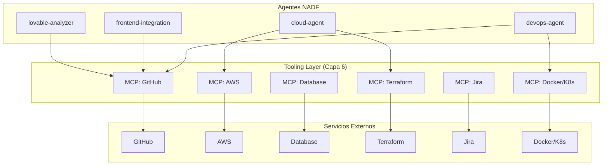
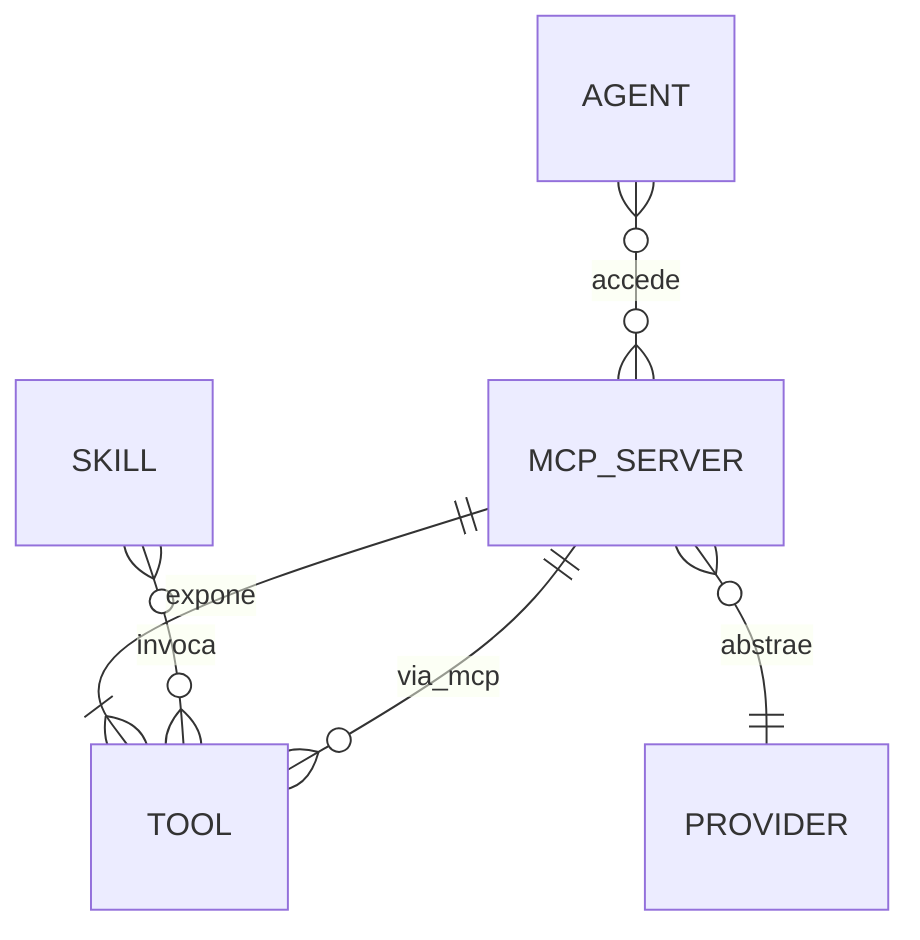
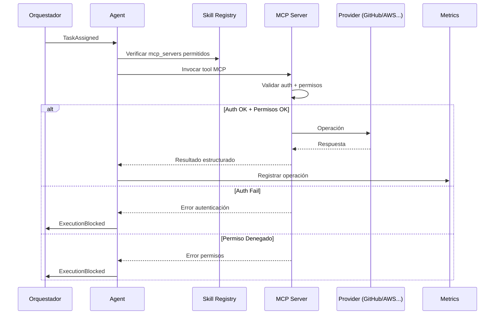

<!-- NADF-GUIDE
Propósito: Documenta NADF Meta Model v1.0 — Modelo MCP.
Configuración: Actualizar contenido, enlaces y ejemplos cuando cambien los contratos relacionados.
-->
# NADF Meta Model v1.0 — Modelo MCP

**Versión:** 1.0  
**Relacionado con:** [tool-model.md](tool-model.md), [deployment-model.md](deployment-model.md)

---

## Propósito

El **Modelo MCP** define `MCP Server` como conector estándar NADF para acceso a servicios externos, implementando la abstracción de proveedor y garantizando independencia de Claude, Cursor, OpenAI, AWS, Azure, GCP y otras plataformas.

---

## MCP en la arquitectura NADF



---

## Principios MCP NADF

1. **MCP first** — Acceso externo vía MCP cuando el servidor esté disponible.
2. **Permisos por agente** — Cada agente declara `mcp_servers` en skill registry.
3. **Sin secrets en artefactos** — Credenciales via configuración segura del entorno.
4. **Trazabilidad** — Operaciones MCP relevantes se registran en métricas.
5. **Abstracción de proveedor** — Cambiar backend (AWS → Azure) sin modificar agente.
6. **No destructivo autónomo** — Operaciones destructivas prohibidas sin aprobación humana.

---

## Servidores MCP oficiales

| MCP Server | ID | Capacidades | Provider | Agentes típicos |
|------------|----|-------------|----------|-----------------|
| GitHub | `github` | Repos, PRs, issues, diffs, workflows | GitHub | lovable-analyzer, devops, reviewer, frontend |
| AWS | `aws` | Lambda, S3, DynamoDB, SES, CloudFront | AWS | cloud, backend, devops |
| Database | `database` | Schemas, consultas, migraciones propuestas | Multi-DB | database, backend |
| Terraform | `terraform` | Planes IaC, validación | Terraform | cloud, devops |
| Jira | `jira` | Tickets, estados, vinculación | Atlassian | workflow, planner |
| Docker/Kubernetes | `docker-k8s` | Imágenes, manifiestos | Docker/K8s | devops, cloud |

---

## Anatomía conceptual de MCP Server

```yaml
mcp_server:
  id: string                    # github
  name: string                  # GitHub MCP Server
  version: string               # Semver del servidor
  provider:
    id: string                  # github
    category: enum              # vcs
  capabilities:
    - id: get_diff
      description: "Obtener diff de commit"
      destructive: false
    - id: create_pr
      description: "Crear pull request"
      destructive: true
      requires_approval: true
  auth:
    method: enum                # token, oauth, env_var
    config_key: string          # GITHUB_TOKEN (no en artefactos)
  agents_allowed:
    - lovable-analyzer-agent
    - frontend-integration-agent
    - devops-agent
    - reviewer-agent
  health:
    status: enum                # available, degraded, unavailable
    last_check: datetime
```

---

## MCP Server como entidad meta model

### Relación con otras entidades



| Relación | Tipo | Descripción |
|----------|------|-------------|
| MCP Server → Tool | Composición | Servidor expone tools |
| MCP Server → Provider | Dependencia | Abstrae proveedor concreto |
| Agent → MCP Server | Asociación | Agente accede a servidores permitidos |
| Tool → MCP Server | Dependencia | Tool MCP depende del servidor |

---

## Flujo de operación MCP



---

## Restricciones por patrón de agente

| Patrón | MCP permitido | MCP prohibido |
|--------|---------------|---------------|
| Planner | github (read), jira (read) | aws (write), terraform (apply) |
| Executor | github (read/write), aws (read/describe) | aws (deploy), terraform (apply) |
| Validator | github (read), shell via native | Cualquier write/destructivo |
| Blackboard | Ninguno requerido | Destructivos |
| Reflection | Ninguno | Todos |

---

## Eventos MCP

| Evento | Descripción |
|--------|-------------|
| `mcp.server.available` | Servidor MCP disponible |
| `mcp.server.unavailable` | Servidor MCP caído |
| `mcp.auth.failed` | Fallo de autenticación |
| `mcp.operation.completed` | Operación MCP exitosa |
| `mcp.operation.failed` | Operación MCP fallida |
| `mcp.permission.denied` | Permiso denegado |

Fallos de autenticación o permisos emiten `ExecutionBlocked` via Orquestador.

---

## Abstracción multi-proveedor via MCP

| Capacidad MCP | AWS (piloto) | Azure (futuro) | GCP (futuro) |
|---------------|--------------|----------------|--------------|
| `cloud.serverless` | Lambda | Azure Functions | Cloud Functions |
| `cloud.storage` | S3 | Blob Storage | Cloud Storage |
| `cloud.database` | DynamoDB | Cosmos DB | Firestore |
| `cloud.cdn` | CloudFront | Azure CDN | Cloud CDN |
| `vcs.repository` | GitHub | GitHub/Azure Repos | GitHub/Cloud Source |

El agente invoca `mcp.aws.describe_lambda` o `mcp.cloud.serverless.describe` (abstracción futura) sin conocer el backend.

---

## Configuración por proyecto

```yaml
# project-context.yml (extracto)
multiagent:
  mcp_servers:
    - github
    - aws
```

Cada agente declara subset en skill registry:

```yaml
agent:
  id: cloud-agent
  mcp_servers:
    - aws
    - terraform
  allowed_tools:
    - aws.describe_lambda
    - aws.describe_resources
    - terraform.plan
  forbidden_tools:
    - aws.deploy_*
    - terraform.apply
```

---

## Integración con eventos externos

MCP Servers pueden originar eventos del ecosistema:

| MCP Server | Evento originado | Workflow disparado |
|------------|------------------|-------------------|
| GitHub | `lovable.commit`, `github.pr.opened` | lovable-to-web, qa-validation |
| Jira | `jira.bug.reported` | fix-bug |
| Terraform | `infra.change` | cloud-deployment, security-review |

Ver [event-model.md](event-model.md).

---

## Roadmap MCP (alineado con roadmap NADF)

| Fase | Objetivo MCP |
|------|-------------|
| Fase 1 (actual) | MCP documentado, no operacionalizado |
| Fase 3 | GitHub + AWS MCP mínimos operativos |
| Fase 4+ | Terraform, Jira, Docker/K8s MCP |
| Largo plazo | Abstracción multi-cloud via MCP unificado |

---

## Referencias

- [mcp-integration.md](../mcp-integration.md)
- [tool-model.md](tool-model.md)
- [deployment-model.md](deployment-model.md)
- [capability-model.md](capability-model.md)
- `.nadf/global/rules/provider-independence.md`
