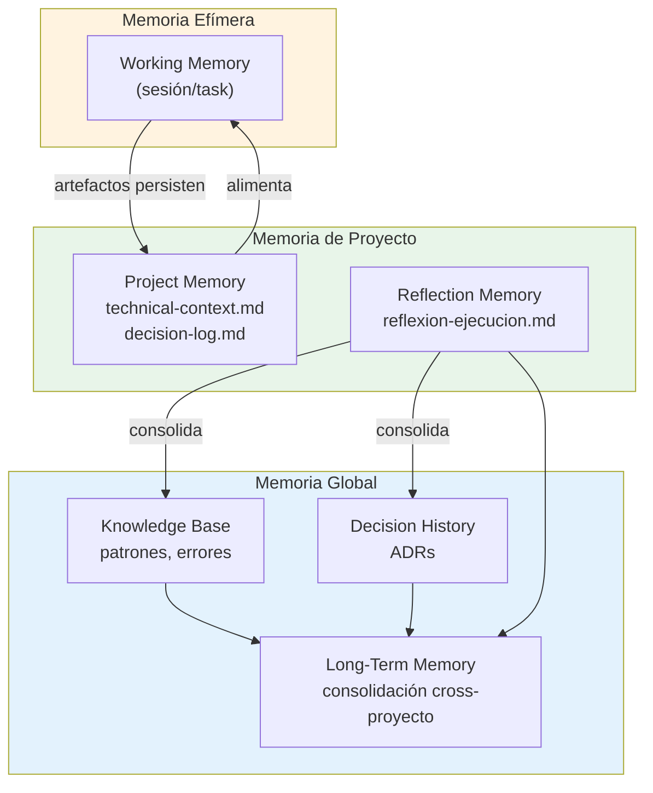
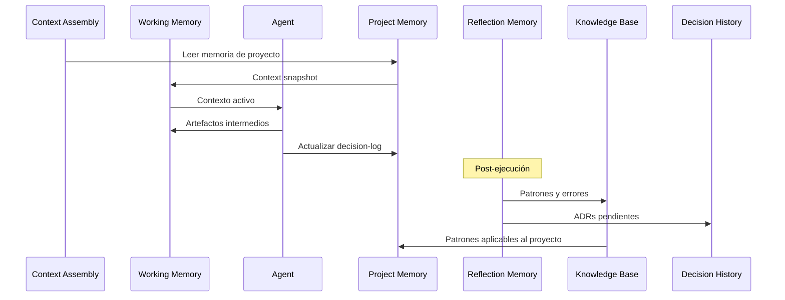

<!-- NADF-GUIDE
Propósito: Documenta NADF Meta Model v1.0 — Modelo de Memoria.
Configuración: Actualizar contenido, enlaces y ejemplos cuando cambien los contratos relacionados.
-->
# NADF Meta Model v1.0 — Modelo de Memoria

**Versión:** 1.0  
**Relacionado con:** [entity-model.md](entity-model.md), [context-model.md](context-model.md), [learning-model.md](learning-model.md)

---

## Propósito

El **Modelo de Memoria** define los seis tipos de memoria NADF, sus ámbitos, responsabilidades, ubicaciones conceptuales y relación con el Blackboard y la Knowledge Base.

---

## Tipos de memoria

| Tipo | Ámbito | Persistencia | Propósito |
|------|--------|--------------|-----------|
| **Working Memory** | Sesión / Task | Efímera | Contexto activo durante ejecución |
| **Project Memory** | Proyecto | Persistente | Contexto de negocio, marca y técnico del proyecto |
| **Knowledge Base** | Global | Persistente | Patrones, errores frecuentes, componentes reutilizables |
| **Decision History** | Global | Persistente | ADRs y registro formal de decisiones |
| **Reflection Memory** | Proyecto / Global | Persistente | Aprendizajes post-ejecución |
| **Long-Term Memory** | Global | Persistente | Conocimiento consolidado cross-proyecto |

---

## 1. Working Memory

### Definición
Memoria **efímera** que mantiene el contexto activo durante la ejecución de una Task o sesión de agente.

### Atributos conceptuales

| Atributo | Tipo | Descripción |
|----------|------|-------------|
| `session_id` | UUID | Identificador de sesión |
| `task_id` | Referencia | Task activa |
| `agent_id` | Referencia | Agent en ejecución |
| `context_snapshot` | Objeto | Context ensamblado |
| `intermediate_artifacts` | Lista | Artefactos en progreso |
| `ttl` | Duración | Expira al finalizar Execution |

### Responsabilidades
- Mantener estado transitorio durante ejecución
- Evitar re-lectura repetida de fuentes
- Descartarse al completar Execution (artefactos persisten en Blackboard)

### Ciclo de vida
`Created` → `Active` → `Discarded` (al finalizar Execution)

---

## 2. Project Memory

### Definición
Memoria **persistente por proyecto** que almacena contexto de negocio, identidad de marca, convenciones técnicas y historial operativo.

### Ubicación conceptual
`.nadf/projects/<proyecto>/memory/`

### Artefactos típicos

| Archivo | Contenido |
|---------|-----------|
| `technical-context.md` | Stack, repos, convenciones técnicas |
| `decision-log.md` | Log operativo de decisiones (no ADR formal) |
| `brand-guidelines.md` | Identidad visual y de marca |
| `business-context.md` | Contexto de negocio |

### Atributos conceptuales

| Atributo | Tipo | Descripción |
|----------|------|-------------|
| `project_id` | Referencia | Proyecto propietario |
| `type` | Enum | `technical`, `business`, `brand`, `operational` |
| `content` | Texto | Contenido de memoria |
| `last_updated` | Timestamp | Última modificación |
| `updated_by` | Referencia | Agent o humano |

### Responsabilidades
- Alimentar ensamblaje de Context
- Preservar convenciones del proyecto
- Registrar decisiones operativas (complemento de ADR)

### Ciclo de vida
`Initialized` → `Active` → `Updated` (continuo) → `Archived` (proyecto archivado)

### Ejemplo (novus-intelligence)
`technical-context.md` con stack React/TypeScript/Tailwind, repos NovusIntelligenceWEB/Back.

---

## 3. Knowledge Base

### Definición
Repositorio **global persistente** de patrones exitosos, anti-patrones, errores frecuentes y componentes reutilizables.

### Ubicación conceptual
`.nadf/global/knowledge-base/`

### Atributos conceptuales

| Atributo | Tipo | Descripción |
|----------|------|-------------|
| `id` | Identificador | Slug del entry |
| `type` | Enum | `pattern`, `anti_pattern`, `error`, `convention`, `component` |
| `domain` | Referencia | Dominio aplicable |
| `content` | Texto | Descripción estructurada |
| `source_workflow` | Referencia | Workflow origen |
| `confidence` | Enum | `high`, `medium`, `low` |
| `usage_count` | Entero | Referencias en workflows futuros |

### Responsabilidades
- Almacenar aprendizaje reutilizable cross-workflow
- Alimentar Planner y Architect con patrones conocidos
- Detectar errores recurrentes

### Relación con entidad Knowledge
Knowledge Base es la **implementación persistente** de la entidad `Knowledge` del Core Domain.

### Ciclo de vida
`Extracted` (Reflection) → `Reviewed` (KB Agent) → `Published` → `Updated` → `Deprecated`

---

## 4. Decision History

### Definición
Registro **global persistente** de decisiones arquitectónicas formales (ADRs) e inmutables una vez aceptadas.

### Ubicación conceptual
`.nadf/global/decision-history/adr/`

### Atributos conceptuales

| Atributo | Tipo | Descripción |
|----------|------|-------------|
| `id` | Identificador | ADR-NNNN-slug |
| `status` | Enum | `proposed`, `accepted`, `deprecated`, `superseded` |
| `context` | Texto | Contexto de la decisión |
| `decision` | Texto | Decisión tomada |
| `consequences` | Texto | Consecuencias positivas/negativas |
| `supersedes` | Referencia | ADR reemplazado |

### Responsabilidades
- Formalizar decisiones arquitectónicas
- Restringir acciones de agentes via Rules derivadas
- Mantener historial inmutable

### Relación con entidad Decision
Decision History es la **implementación persistente** de la entidad `Decision (ADR)`.

### Reglas
- ADR aceptado **no se modifica** — se supersede con nuevo ADR
- Toda decisión arquitectónica genera ADR (gate `adr_if_architectural`)

---

## 5. Reflection Memory

### Definición
Memoria de **aprendizajes post-ejecución** generada por Reflection Agent, que alimenta KB y Decision History.

### Ubicación conceptual
- Artefactos: `.nadf/projects/<proyecto>/artifacts/reflexion-ejecucion.md`
- Consolidación: Knowledge Base + Decision History

### Atributos conceptuales

| Atributo | Tipo | Descripción |
|----------|------|-------------|
| `workflow_instance_id` | Referencia | Workflow reflexionado |
| `summary` | Texto | Resumen de la ejecución |
| `successes` | Lista | Acciones exitosas |
| `failures` | Lista | Fallos y bloqueos |
| `learnings` | Lista | Aprendizajes identificados |
| `kb_recommendations` | Lista | Actualizaciones sugeridas para KB |
| `adr_recommendations` | Lista | ADRs pendientes |

### Responsabilidades
- Documentar qué ocurrió en cada ciclo
- Identificar patrones y anti-patrones
- Recomendar actualizaciones a KB y ADR

### Ciclo de vida
`Generated` (Reflection Agent) → `Reviewed` → `Consolidated` (KB/ADR) → `Archived`

Ver [learning-model.md](learning-model.md).

---

## 6. Long-Term Memory

### Definición
Memoria **global consolidada** cross-proyecto que integra Knowledge Base, Decision History y Reflection Memory en conocimiento de largo plazo.

### Características
- Agregación de aprendizajes de múltiples proyectos
- Patrones transversales al framework
- Métricas históricas agregadas
- Evolución del framework (Framework Architect)

### Atributos conceptuales

| Atributo | Tipo | Descripción |
|----------|------|-------------|
| `scope` | Enum | `framework`, `cross_project`, `domain` |
| `entries` | Lista | Referencias a Knowledge + Decision |
| `aggregated_metrics` | Objeto | Métricas históricas |
| `last_consolidation` | Timestamp | Última consolidación |

### Responsabilidades
- Preservar evolución del framework
- Informar roadmap y evolución de agentes
- Detectar tendencias cross-proyecto

---

## Diagrama de memoria

---

## Flujo de memoria en el ciclo NADF

---

## Reglas de acceso (Blackboard)

| Tipo de memoria | Lectura | Escritura |
|-----------------|---------|-----------|
| Working Memory | Agent activo | Agent activo |
| Project Memory | Todos los agentes del proyecto | Documentation, Reflection |
| Knowledge Base | Todos los agentes | Knowledge Base Agent |
| Decision History | Todos los agentes | ADR Agent |
| Reflection Memory | Reflection, KB, ADR Agents | Reflection Agent |
| Long-Term Memory | Framework Architect | Framework Architect, KB Agent |

---

## Referencias

- [blackboard-pattern.md](../blackboard-pattern.md)
- [learning-model.md](learning-model.md)
- [context-model.md](context-model.md)
- [entity-model.md](entity-model.md)
