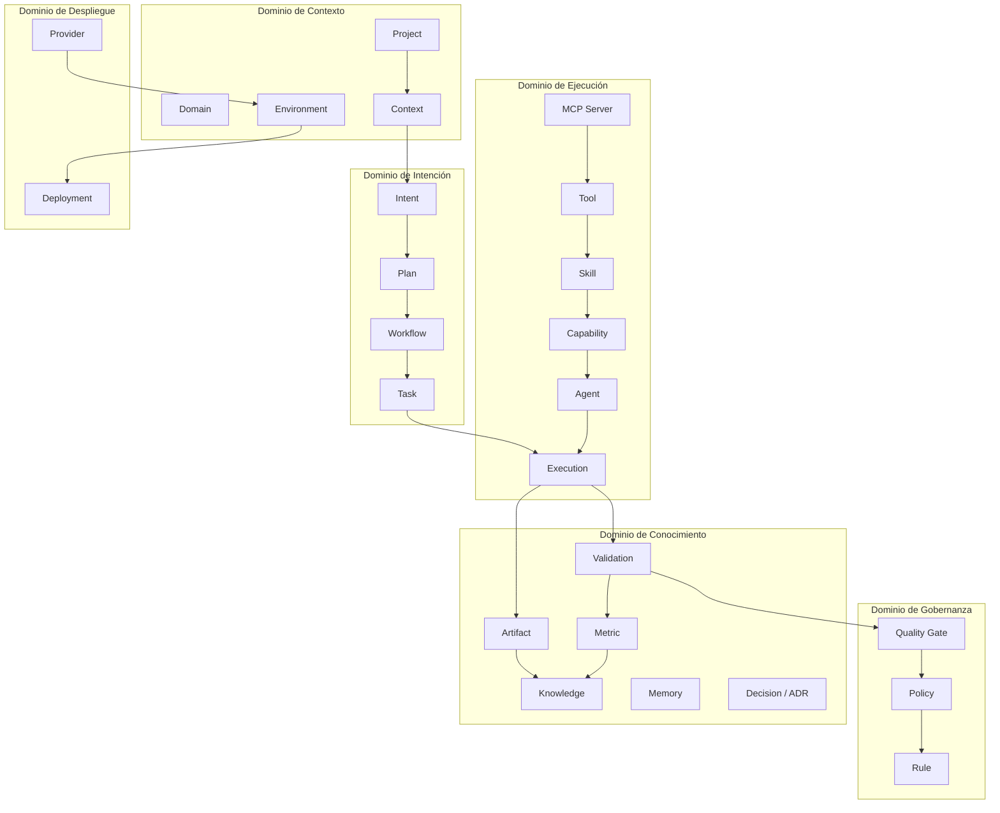
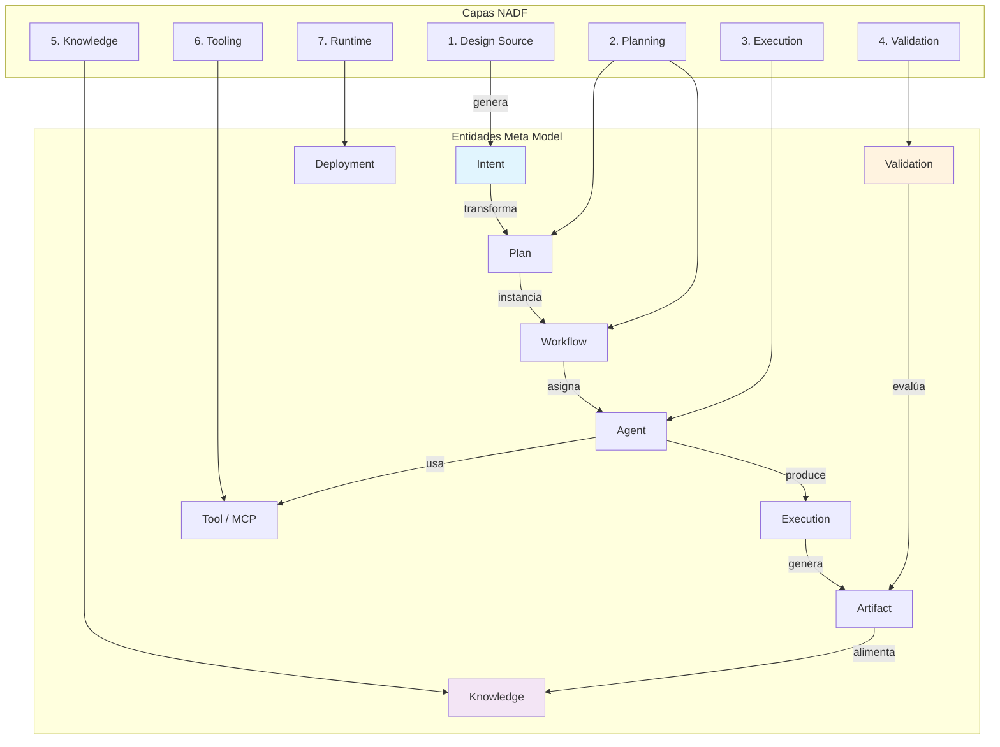
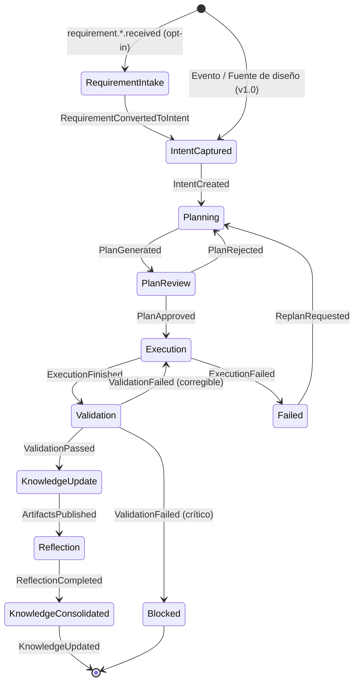

<!-- NADF-GUIDE
Propósito: Documenta NADF Meta Model v1.1 — Visión General.
Configuración: Actualizar contenido, enlaces y ejemplos cuando cambien los contratos relacionados.
-->
# NADF Meta Model v1.1 — Visión General

**Versión:** 1.1 (especificación oficial; compatible con v1.0)  
**Estado:** Aceptado  
**Fecha:** 2026-07-04 (v1.0) · 2026-07-14 (v1.1 Intake)  
**Ámbito:** NovusAIDevelopmentFramework (NADF)  
**Independencia de proveedor:** Claude, Cursor, OpenAI, Gemini, AWS, Azure, GCP, Lovable  
**ADR extensión:** ADR-0007

---

## Resumen ejecutivo

El **Meta Model v1.1** de NADF es la especificación conceptual canónica que unifica todas las entidades, relaciones, eventos, ciclos de vida y flujos semánticos del framework multiagente. Define **qué existe** en el dominio NADF y **cómo se relaciona**, sin prescribir implementación técnica, código ni lógica de runtime.

La v1.1 añade de forma **opt-in** la **Requirement Intake Layer**: entidades `Requirement*`, conectores multi-fuente y trazabilidad `RawRequirementEvent → Requirement → Intent`, sin romper proyectos ni workflows v1.0.

Este meta model es la **referencia obligatoria** para todos los agentes, workflows, ADRs y evoluciones futuras del framework. Cualquier extensión (nuevo agente, workflow, integración MCP o despliegue cloud) debe ser coherente con las entidades y relaciones aquí definidas.

NADF opera sobre **7 capas arquitectónicas**, **7 patrones** (Planner, Executor, Validator, Mediator, Blackboard, Event Driven, Reflection), **27 agentes** especializados (20 core + 7 Requirement Intake opt-in, ADR-0007) y workflows canónicos de **9 fases** (p. ej. `lovable-to-web` 18 pasos; `requirement-intake` multi-fuente). El meta model abstrae estos elementos en un dominio unificado independiente del motor de IA o proveedor cloud subyacente.

---

## Principios del Meta Model v1.0

| # | Principio | Descripción |
|---|-----------|-------------|
| 1 | **Separación semántica** | Planificación, ejecución, validación y conocimiento son dominios distintos con entidades y permisos diferenciados. |
| 2 | **Intención antes que implementación** | La entidad `Intent` precede a `Plan`, `Workflow` y `Execution`; nunca se copia diseño como código productivo. |
| 3 | **Comunicación mediada** | Los agentes no se comunican directamente; el Orquestador (Mediator) y el Blackboard (Knowledge) median todas las interacciones. |
| 4 | **Eventos como contrato** | Todo cambio significativo se modela como evento tipado con payload estructurado y trazabilidad. |
| 5 | **Artefactos explícitos** | Toda salida de agente es un `Artifact` versionado en el Blackboard. |
| 6 | **Calidad gobernada** | `Quality Gate`, `Policy` y `Rule` son entidades de primera clase, no metadatos opcionales. |
| 7 | **Aprendizaje acumulativo** | Todo ciclo termina en `Knowledge` vía Reflection; la memoria evoluciona, no se descarta. |
| 8 | **Independencia de proveedor** | `Provider`, `Tool` y `MCP Server` abstraen backends concretos (IA, cloud, IDE). |
| 9 | **Trazabilidad total** | `Metric`, `Decision (ADR)`, `Validation` y eventos forman una cadena auditable. |
| 10 | **Extensibilidad declarativa** | Nuevas entidades se añaden por extensión del meta model, no por ruptura de contratos existentes. |

---

## Mapa de dominios



---

## Arquitectura general del Meta Model

Diagrama que conecta los **7 dominios conceptuales** con las **7 capas arquitectónicas** de NADF:



---

## Modelo de ciclo de vida transversal

El ciclo de vida NADF atraviesa múltiples entidades. Esta sección define el **macro-ciclo** que conecta intención y conocimiento.

### Fases del macro-ciclo

| Fase | Entidades activas | Transición |
|------|-------------------|------------|
| **Ingesta (opt-in v1.1)** | RawRequirementEvent, Requirement | Fuente externa → Requirement aprobado |
| **Captura** | Intent, Context | Fuentes / Requirement → Intent formalizado |
| **Planificación** | Plan, Workflow, Task | Intent → Plan aprobado |
| **Orquestación** | Workflow, Task, Agent | Plan → instancia de ejecución |
| **Ejecución** | Execution, Tool, MCP Server | Task → Artifact |
| **Validación** | Validation, Quality Gate | Artifact → resultado pass/fail |
| **Documentación** | Artifact, Memory | Resultados → memoria de proyecto |
| **Medición** | Metric | Execution → métricas registradas |
| **Reflexión** | Memory, Knowledge | Métricas + artefactos → aprendizaje |
| **Consolidación** | Knowledge, Decision (ADR) | Aprendizaje → base de conocimiento permanente |

### Diagrama de estado del macro-ciclo


### Ciclo de vida por entidad

Los ciclos de vida detallados de cada una de las **24 entidades del Core Domain** se documentan en [entity-model.md](entity-model.md). Este overview establece el macro-ciclo transversal; la entidad-model profundiza en estados, transiciones y precondiciones por entidad.

---

## Flujo semántico principal: Intent → Knowledge

El flujo más crítico del meta model conecta la intención de diseño con el conocimiento acumulado:

```
Context (fuentes) → Intent → Plan → Workflow → Task → Execution → Artifact
    → Validation → Metric → Reflection → Knowledge + Decision (ADR)
```

Ver especificación completa en [intent-model.md](intent-model.md).

---

## Documentos del Meta Model v1.0

### Documentos normativos

| Documento | Rol |
|-----------|-----|
| [specification.md](specification.md) | **Especificación oficial v1.0** — Autoridad, alcance y requisitos de cumplimiento |
| [governance.md](governance.md) | Proceso de modificación, aprobación y registro |
| [versioning.md](versioning.md) | Reglas de versionado Major / Minor / Patch |
| [architecture-principles.md](architecture-principles.md) | 10 principios arquitectónicos oficiales |
| [meta-model-overview.md](meta-model-overview.md) | Este documento — Visión general y mapa de dominios |

### Documentos de dominio

| Documento | Dominio | Contenido |
|-----------|---------|-----------|
| [entity-model.md](entity-model.md) | Core Domain | 24 entidades con atributos, responsabilidades, relaciones y ciclo de vida |
| [relationship-model.md](relationship-model.md) | Relaciones | Composición, agregación, dependencia, asociación |
| [event-model.md](event-model.md) | Eventos | Catálogo oficial, payloads, enrutamiento |
| [intent-model.md](intent-model.md) | Intención | Flujo Intent → Knowledge (documento crítico) |
| [capability-model.md](capability-model.md) | Capacidades | Capability vs Skill vs Tool |
| [memory-model.md](memory-model.md) | Memoria | 6 tipos de memoria NADF |
| [quality-model.md](quality-model.md) | Calidad | Gates, policies, rules, validaciones |
| [learning-model.md](learning-model.md) | Aprendizaje | Reflection pattern post-ejecución |
| [artifact-model.md](artifact-model.md) | Artefactos | Catálogo oficial de artefactos |
| [context-model.md](context-model.md) | Contexto | Fuentes y ensamblaje de contexto |
| [deployment-model.md](deployment-model.md) | Despliegue | Environment, Deployment, multi-cloud |
| [tool-model.md](tool-model.md) | Herramientas | Abstracción de Tool |
| [mcp-model.md](mcp-model.md) | MCP | MCP Server como conector estándar |

---

## Glosario oficial NADF

Términos ordenados alfabéticamente. Definiciones vinculadas al meta model v1.0.

| Término | Definición |
|---------|------------|
| **ADR** | Architecture Decision Record; entidad `Decision` que registra decisiones arquitectónicas formales e inmutables una vez aceptadas. |
| **Agent** | Entidad de IA especializada con patrón arquitectónico, capa, skill y contratos de entrada/salida definidos. |
| **Artifact** | Salida tangible y versionada producida por un agente o ejecución; unidad atómica del Blackboard. |
| **Blackboard** | Patrón y espacio compartido (Knowledge Layer) donde se publican artefactos, decisiones, métricas y aprendizajes. |
| **Capability** | Abstracción funcional de alto nivel que un agente puede poseer (p. ej. «analizar diseño Lovable»). |
| **Context** | Conjunto ensamblado de información de múltiples fuentes que alimenta la comprensión de un proyecto o tarea. |
| **Decision** | Registro formal de una decisión arquitectónica o de gobernanza; sinónimo operativo de ADR. |
| **Deployment** | Instancia concreta de despliegue de una aplicación en un `Environment`, sujeta a aprobación humana. |
| **Domain** | Ámbito semántico de negocio o técnico al que pertenece un proyecto (p. ej. servicios de IA corporativos). |
| **Environment** | Contexto de ejecución productiva (dev, staging, production) con configuración y proveedores asociados. |
| **Event** | Ocurrencia tipada y trazable que dispara o registra transiciones en el framework. |
| **Execution** | Instancia de ejecución de una `Task` por un `Agent`, con inicio, fin y resultado medible. |
| **Intent** | Representación formal de la intención visual, funcional o de negocio capturada desde fuentes de diseño. |
| **Knowledge** | Conocimiento consolidado, reutilizable y persistente derivado de reflexión, patrones y decisiones. |
| **MCP Server** | Servidor Model Context Protocol que expone herramientas estandarizadas para acceso a servicios externos. |
| **Memory** | Almacén de contexto persistente por proyecto o global, distinto de Knowledge Base estructurada. |
| **Metric** | Medición cuantitativa o cualitativa registrada durante o tras una ejecución. |
| **Meta Model** | Especificación conceptual canónica de entidades, relaciones y flujos de NADF (este documento y sus complementos). |
| **Orchestrator** | Componente Mediator que coordina agentes, enruta eventos y aplica condiciones de workflow sin comunicación directa entre agentes. |
| **Plan** | Documento estructurado que traduce `Intent` en acciones aprobables con evaluación de impacto. |
| **Policy** | Directriz de gobernanza de alto nivel aplicable a proyectos, agentes o capas. |
| **Project** | Unidad de trabajo NADF con contexto, workflows, agentes habilitados y repositorios asociados. |
| **Provider** | Abstracción de un proveedor externo (IA, cloud, IDE, diseño) intercambiable sin cambiar el meta model. |
| **Quality Gate** | Punto de control bloqueante que evalúa criterios de calidad antes de avanzar en un workflow. |
| **Reflection** | Patrón y fase de aprendizaje post-ejecución que alimenta Knowledge y Memory. |
| **Rule** | Regla operativa concreta y verificable derivada de una Policy o ADR. |
| **Skill** | Especialización registrada de una Capability asignada a un Agent concreto. |
| **Task** | Unidad atómica de trabajo dentro de un Workflow, asignada a un Agent. |
| **Tool** | Instrumento concreto (nativo o MCP) que un Agent invoca para cumplir una Skill. |
| **Validation** | Resultado estructurado de evaluación de calidad, seguridad o coherencia sobre artefactos o ejecuciones. |
| **Workflow** | Secuencia declarativa de fases y tareas que coordina agentes siguiendo el modelo de 9 fases. |

---

## Alineación con la arquitectura NADF existente

| Elemento NADF | Referencia | Entidades Meta Model |
|---------------|------------|---------------------|
| 7 capas | [architecture.md](../architecture.md) | Context, Agent, Execution, Validation, Knowledge, Tool, Deployment |
| 7 patrones | [agent-patterns.md](../agent-patterns.md) | Agent (patrón), Workflow (Event Driven), Knowledge (Blackboard) |
| 27 agentes | [agent-model.md](../agent-model.md) | Agent, Skill, Capability (+ Intake) |
| 18 pasos / 9 fases | [workflow-model.md](../workflow-model.md) | Workflow, Task, Execution |
| 10 quality gates | `project-context.yml` | Quality Gate, Validation, Policy |
| Blackboard | [blackboard-pattern.md](../blackboard-pattern.md) | Artifact, Knowledge, Memory, Decision, Metric |
| MCP | [mcp-integration.md](../mcp-integration.md) | MCP Server, Tool, Provider |
| Reflection | [reflection-learning.md](../reflection-learning.md) | Learning Model, Memory, Knowledge |

---

## Referencia obligatoria

> **Declaración oficial:** El NADF Meta Model v1.0 es la especificación normativa central del framework, adoptada formalmente en [ADR-0004](../../.nadf/global/decision-history/adr/ADR-0004-nadf-meta-model.md). La autoridad completa está en [specification.md](specification.md).

---

## Referencias cruzadas

- [architecture.md](../architecture.md)
- [multiagent-architecture.md](../multiagent-architecture.md)
- [agent-model.md](../agent-model.md)
- [workflow-model.md](../workflow-model.md)
- [planning-execution-validation.md](../planning-execution-validation.md)
- [ADR-0001](../../.nadf/global/decision-history/adr/ADR-0001-nadf-foundation.md)
- [ADR-0002](../../.nadf/global/decision-history/adr/ADR-0002-multiagent-patterns.md)
- [ADR-0003](../../.nadf/global/decision-history/adr/ADR-0003-lovable-to-web-canonicalization.md)
- [ADR-0004](../../.nadf/global/decision-history/adr/ADR-0004-nadf-meta-model.md)
- [specification.md](specification.md)
- [governance.md](governance.md)
- [versioning.md](versioning.md)
- [roadmap.md](../roadmap.md)
