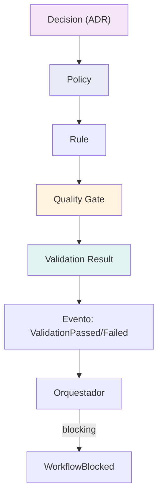
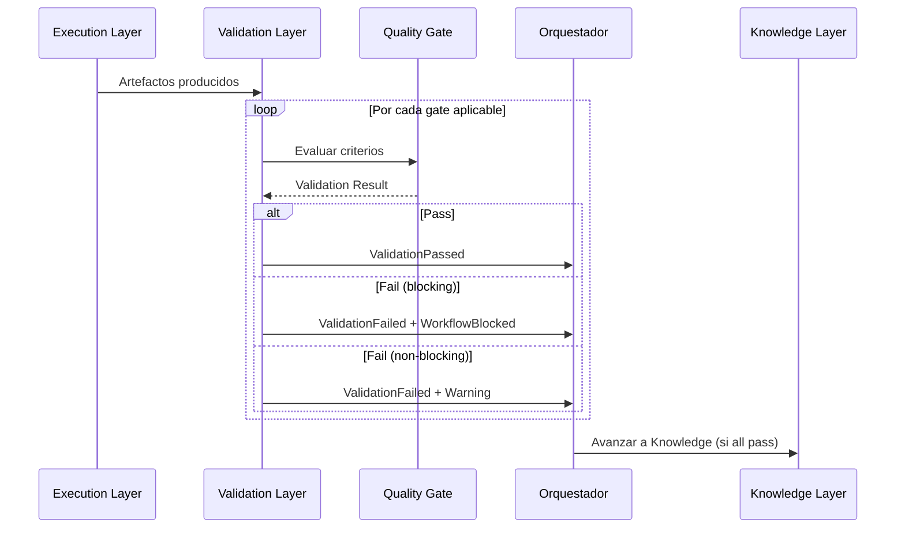

# NADF Meta Model v1.0 — Modelo de Calidad

**Versión:** 1.0  
**Relacionado con:** [entity-model.md](entity-model.md), [event-model.md](event-model.md)

---

## Propósito

El **Modelo de Calidad** define la gobernanza de calidad NADF mediante tres entidades interrelacionadas — **Quality Gate**, **Policy** y **Rule** — y su materialización en **Validation Results**.

---

## Arquitectura de calidad



---

## Policy (Política)

### Definición
Directriz de **gobernanza de alto nivel** aplicable transversalmente a proyectos, capas o agentes.

### Atributos

| Atributo | Tipo | Descripción |
|----------|------|-------------|
| `id` | Identificador | Slug |
| `name` | Texto | Nombre |
| `scope` | Enum | `global`, `project`, `layer`, `agent` |
| `statement` | Texto | Enunciado de la política |
| `enforcement` | Enum | `mandatory`, `recommended`, `informational` |
| `source_adr` | Referencia | ADR que la fundamenta |

### Políticas globales NADF

| ID | Política | Enforcement | ADR |
|----|----------|-------------|-----|
| `separation_planning_execution` | Planner/Architect no modifican código productivo | mandatory | ADR-0002 |
| `no_autonomous_deployment` | Agentes no despliegan sin aprobación humana | mandatory | ADR-0001 |
| `provider_independence` | Acceso externo vía MCP | mandatory | ADR-0002 |
| `intent_not_implementation` | Lovable es intención, no código productivo | mandatory | ADR-0001 |
| `adr_for_architecture` | Cambios arquitectónicos requieren ADR | mandatory | ADR-0002 |
| `metrics_and_reflection` | Todo workflow genera métricas y reflexión | mandatory | ADR-0002 |
| `context_first` | Agentes leen contexto antes de actuar | mandatory | CLAUDE.md |

---

## Rule (Regla)

### Definición
Regla **operativa y verificable** derivada de una Policy o Decision (ADR).

### Atributos

| Atributo | Tipo | Descripción |
|----------|------|-------------|
| `id` | Identificador | Slug |
| `policy_id` | Referencia | Policy padre |
| `statement` | Texto | Regla verificable |
| `verification` | Enum | `automated`, `manual`, `agent` |
| `violation_action` | Enum | `block`, `warn`, `escalate` |
| `applies_to` | Lista | Agentes/capas afectados |

### Reglas globales NADF

| ID | Regla | Policy | Violation |
|----|-------|--------|-----------|
| `no_lovable_code_copy` | Prohibido copiar código Lovable a repos productivos | intent_not_implementation | block |
| `no_mock_data_in_production` | Prohibido mocks en producción | intent_not_implementation | block |
| `planner_no_code_changes` | Planner no modifica repos productivos | separation_planning_execution | block |
| `executor_no_architecture_change` | Executor no cambia arquitectura sin ADR | adr_for_architecture | block |
| `validator_no_logic_change` | Validator no modifica lógica productiva | separation_planning_execution | block |
| `mcp_for_external_access` | Acceso externo vía MCP cuando aplique | provider_independence | block |
| `human_approval_for_deploy` | Despliegue requiere aprobación humana | no_autonomous_deployment | block |
| `read_context_before_action` | Leer project-context.yml antes de actuar | context_first | block |

---

## Quality Gate

### Definición
Punto de control **bloqueante o informativo** que evalúa criterios de calidad en un punto específico del workflow.

### Atributos

| Atributo | Tipo | Descripción |
|----------|------|-------------|
| `id` | Identificador | Slug |
| `name` | Texto | Nombre |
| `criteria` | Lista | Criterios evaluables |
| `blocking` | Booleano | Si detiene el workflow |
| `evaluator` | Referencia | Agent evaluador |
| `phase` | Enum | Fase del workflow donde aplica |
| `rules` | Lista | Rules que evalúa |

### Quality Gates oficiales (novus-intelligence)

| Gate ID | Criterio | Evaluador | Fase | Blocking |
|---------|----------|-----------|------|----------|
| `plan_approved` | Plan con status `approved` | architect-agent | plan_review | ✅ |
| `no_lovable_code_copy` | Sin copia de código Lovable | reviewer-agent | validation | ✅ |
| `no_mock_data_in_production` | Sin mocks en prod | qa-agent | validation | ✅ |
| `build_success` | Build exitoso | qa-agent | validation | ✅ |
| `responsive_validation` | Diseño responsive OK | qa-agent | validation | ✅ |
| `seo_basic_validation` | SEO básico OK | qa-agent | validation | ✅ |
| `security_pass` | Security Agent pass | security-agent | validation | ✅ |
| `metrics_registered` | Métricas registradas | metrics-agent | metrics | ✅ |
| `reflection_generated` | Reflexión generada | reflection-agent | reflection | ✅ |
| `adr_if_architectural` | ADR si decisión arquitectónica | adr-agent | knowledge | ⚠️ condicional |

---

## Validation Result

### Definición
Resultado estructurado de evaluación de un Quality Gate sobre un Artifact o Execution.

### Atributos

| Atributo | Tipo | Descripción |
|----------|------|-------------|
| `id` | UUID | Identificador |
| `gate_id` | Referencia | Quality Gate evaluado |
| `target` | Referencia | Artifact o Execution |
| `validator` | Referencia | Agent validador |
| `result` | Enum | `pass`, `fail`, `warning`, `skipped` |
| `score` | Decimal | qualityScore (0-100) |
| `findings` | Lista | Hallazgos detallados |
| `blocking` | Booleano | Si bloquea workflow |
| `evaluated_at` | Timestamp | Momento de evaluación |

### Estructura de findings

```yaml
findings:
  - id: finding-001
    severity: critical | high | medium | low | info
    rule_id: no_lovable_code_copy
    description: "Descripción del hallazgo"
    location: "ruta/archivo:linea"
    remediation: "Acción sugerida"
```

---

## Flujo de validación



---

## Matriz Policy → Rule → Gate

| Policy | Rule | Gate |
|--------|------|------|
| intent_not_implementation | no_lovable_code_copy | no_lovable_code_copy |
| intent_not_implementation | no_mock_data_in_production | no_mock_data_in_production |
| separation_planning_execution | planner_no_code_changes | plan_approved |
| adr_for_architecture | executor_no_architecture_change | plan_approved |
| metrics_and_reflection | (implícita) | metrics_registered, reflection_generated |
| adr_for_architecture | (implícita) | adr_if_architectural |

---

## Quality Score

Concepto agregado calculado por Validator Agents:

| Rango | Interpretación |
|-------|----------------|
| 90-100 | Excelente — listo para PR |
| 70-89 | Aceptable — observaciones menores |
| 50-69 | Deficiente — correcciones requeridas |
| 0-49 | Crítico — workflow bloqueado |

---

## Referencias

- [entity-model.md](entity-model.md)
- [event-model.md](event-model.md)
- [planning-execution-validation.md](../planning-execution-validation.md)
- `.nadf/global/rules/`
