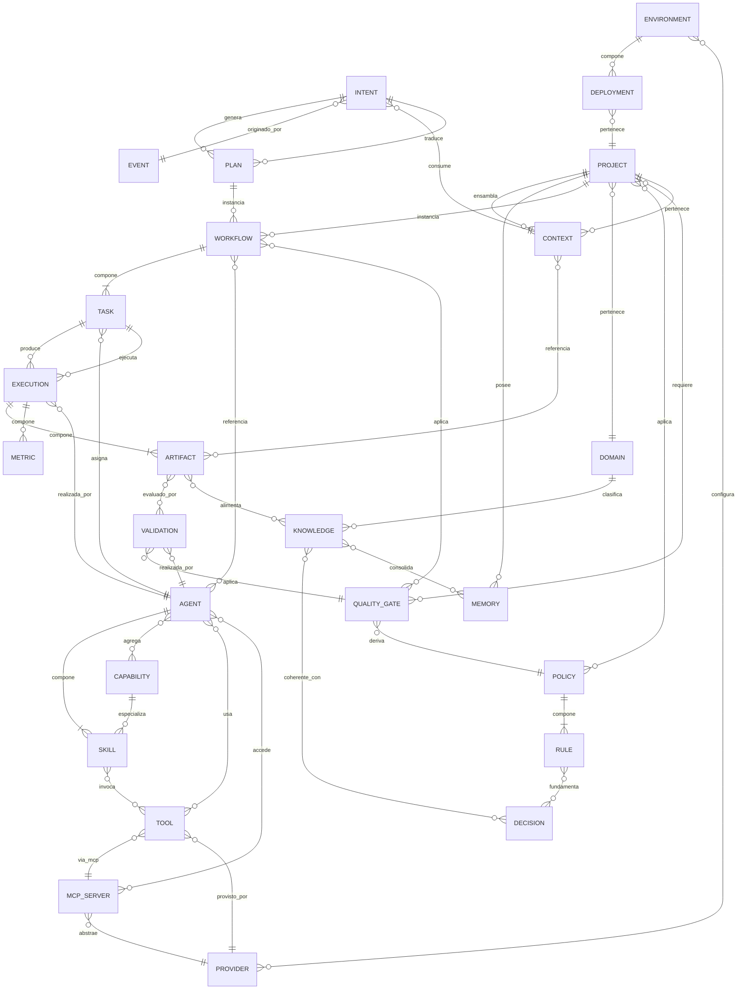
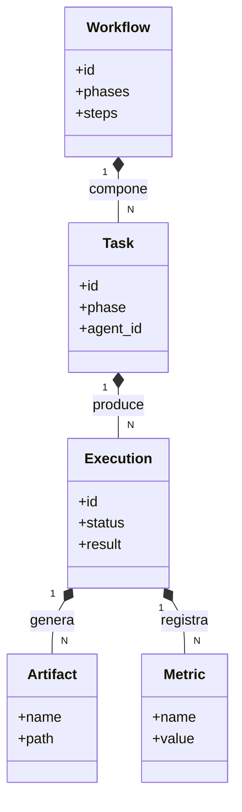
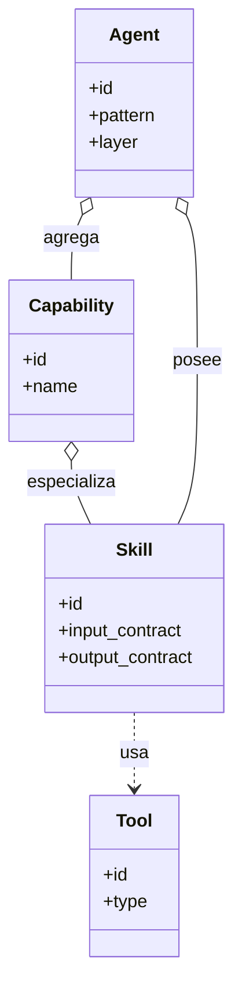
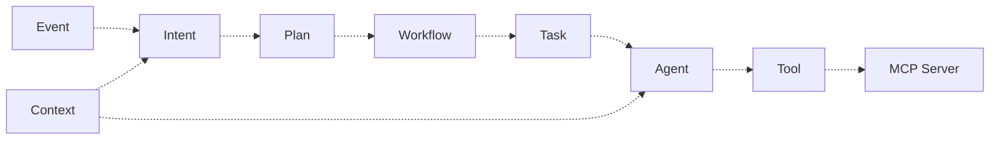
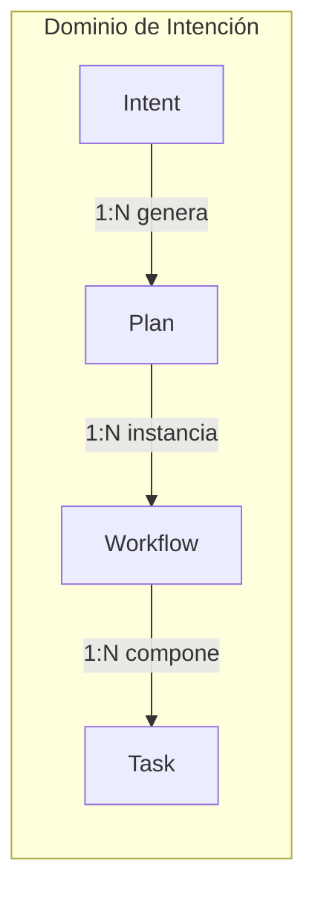
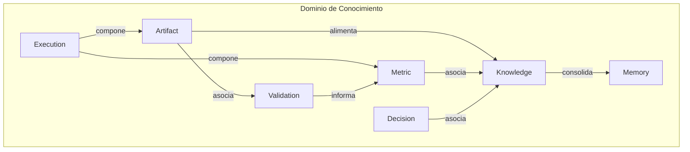
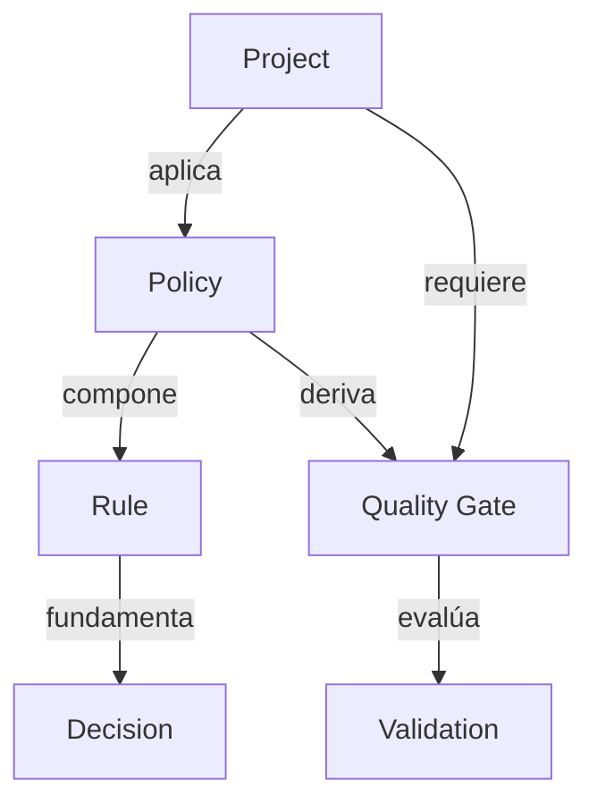

# NADF Meta Model v1.0 — Modelo de Relaciones

**Versión:** 1.0  
**Relacionado con:** [entity-model.md](entity-model.md), [meta-model-overview.md](meta-model-overview.md)

---

## Propósito

Este documento define las **relaciones formales** entre las entidades del Core Domain NADF, clasificadas en cuatro tipos UML: **composición**, **agregación**, **dependencia** y **asociación**. Las relaciones son independientes del proveedor de IA o cloud.

---

## Tipos de relación

| Tipo | Símbolo | Semántica NADF |
|------|---------|----------------|
| **Composición** | ◆—— | La entidad hija no existe sin la padre; ciclo de vida acoplado |
| **Agregación** | ◇—— | Relación «tiene»; la hija puede existir independientemente |
| **Dependencia** | - - → | La entidad origen requiere la destino para operar |
| **Asociación** | ——— | Relación estructural sin propiedad de ciclo de vida |

---

## Diagrama general de relaciones

---

## Composición (◆——)

Relaciones de propiedad fuerte; eliminación de la entidad padre implica eliminación lógica de las hijas.

| Padre | Hijo | Cardinalidad | Descripción |
|-------|------|--------------|-------------|
| Workflow | Task | 1:N | Un workflow se compone de tareas ordenadas |
| Task | Execution | 1:N | Una tarea puede tener múltiples ejecuciones (reintentos) |
| Execution | Artifact | 1:N | Una ejecución produce uno o más artefactos |
| Execution | Metric | 1:N | Una ejecución registra múltiples métricas |
| Agent | Skill | 1:N | Un agente se compone de skills registradas |
| Policy | Rule | 1:N | Una política se operacionaliza en reglas |
| Environment | Deployment | 1:N | Un ambiente contiene despliegues |
| MCP Server | Tool (MCP) | 1:N | Un servidor MCP expone herramientas |

### Diagrama de composición — Ejecución

---

## Agregación (◇——)

Relaciones «tiene» sin acoplamiento de ciclo de vida.

| Contenedor | Contenido | Cardinalidad | Descripción |
|------------|-----------|--------------|-------------|
| Project | Workflow | 1:N | Proyecto agrega instancias de workflow |
| Project | Memory | 1:N | Proyecto agrega memorias |
| Domain | Project | 1:N | Dominio agrupa proyectos |
| Agent | Capability | N:M | Agente agrega capacidades abstractas |
| Capability | Skill | 1:N | Capability se concreta en skills |
| Environment | Provider | N:M | Ambiente configura proveedores |
| Project | Quality Gate | N:M | Proyecto adopta gates |

### Diagrama de agregación — Agente

---

## Dependencia (- - →)

Relaciones de uso; la entidad origen necesita la destino para completar su función.

| Origen | Destino | Descripción |
|--------|---------|-------------|
| Intent | Context | Intent requiere contexto ensamblado |
| Intent | Event | Intent depende del evento disparador |
| Plan | Intent | Plan traduce un Intent |
| Workflow | Plan | Workflow se parametriza desde Plan aprobado |
| Task | Agent | Task depende de Agent asignado |
| Task | Artifact (input) | Task consume artefactos previos |
| Agent | Context | Agent lee contexto antes de actuar |
| Agent | Tool | Agent invoca tools para actuar |
| Tool | MCP Server | Tool MCP depende del servidor |
| Tool | Provider | Tool depende del proveedor subyacente |
| Validation | Quality Gate | Validation evalúa un gate |
| Validation | Artifact | Validation evalúa un artefacto |
| Rule | Policy | Rule deriva de Policy |
| Rule | Decision | Rule puede fundamentarse en ADR |
| Deployment | Environment | Deployment requiere ambiente destino |
| Deployment | Project | Deployment pertenece a proyecto |
| Knowledge | Artifact | Knowledge se extrae de artefactos |

### Diagrama de dependencia — Flujo Intent

---

## Asociación (———)

Relaciones estructurales sin propiedad de ciclo de vida.

| Entidad A | Entidad B | Cardinalidad | Descripción |
|-----------|-----------|--------------|-------------|
| Project | Policy | N:M | Proyecto asociado a políticas |
| Project | Domain | N:1 | Proyecto clasificado en dominio |
| Artifact | Knowledge | N:M | Artefactos alimentan conocimiento |
| Artifact | Validation | 1:N | Artefacto evaluado múltiples veces |
| Knowledge | Decision | N:M | Coherencia entre KB y ADRs |
| Knowledge | Memory | N:M | Conocimiento consolidado en memoria |
| Agent | MCP Server | N:M | Agentes acceden a servidores MCP |
| Workflow | Quality Gate | N:M | Workflow aplica gates |
| Metric | Knowledge | N:1 | Métricas informan aprendizaje |

---

## Relaciones por dominio

### Dominio de Intención

### Dominio de Conocimiento

### Dominio de Gobernanza

---

## Matriz de relaciones críticas

| Relación | Tipo | Regla NADF |
|----------|------|------------|
| Intent → Plan | Dependencia | Un Plan siempre referencia su Intent origen |
| Plan → Workflow | Dependencia | Workflow requiere Plan con status `approved` |
| Workflow → Task | Composición | Orden de fases inmutable (ADR-0003) |
| Task → Agent | Dependencia | Agent debe estar en `agents_enabled` del proyecto |
| Agent → Tool | Dependencia | Solo tools declaradas en skill registry |
| Execution → Artifact | Composición | Todo Execution produce ≥1 Artifact |
| Validation → Quality Gate | Dependencia | Validation siempre referencia un gate |
| Policy → Rule | Composición | Toda Rule pertenece a una Policy |
| Environment → Deployment | Composición | Deployment siempre en un Environment |
| MCP Server → Provider | Dependencia | MCP abstrae un Provider concreto |

---

## Restricciones de integridad

1. **No comunicación directa Agent ↔ Agent** — Solo via Orquestador (Mediator) y Blackboard (Artifact/Knowledge).
2. **Plan antes de Execution** — No existe relación Task(Execution) → Plan(approved) invertida.
3. **Backend Impact antes de Plan Review** — Task(backend-impact) precede Task(architect) en composición de Workflow.
4. **ADR inmutable** — Decision(Accepted) no se modifica; se supersede con nuevo ADR.
5. **Deployment con aprobación** — Relación Deployment → approved_by es obligatoria.
6. **MCP first** — Relación Agent → Tool externa debe pasar por MCP Server cuando aplique.

---

## Referencias

- [entity-model.md](entity-model.md)
- [intent-model.md](intent-model.md)
- [event-model.md](event-model.md)
- [ADR-0003](../../.nadf/global/decision-history/adr/ADR-0003-lovable-to-web-canonicalization.md)
