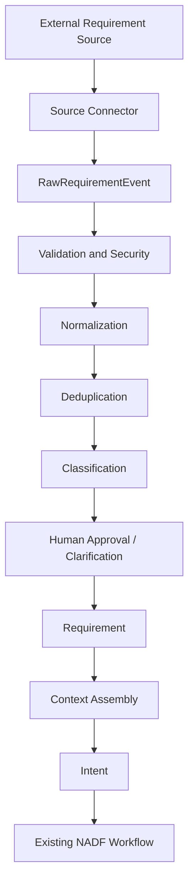

<!-- NADF-GUIDE
Propósito: Documenta NADF Meta Model v1.1 — Modelo de Requerimientos (Requirement Intake).
Configuración: Actualizar contenido, enlaces y ejemplos cuando cambien los contratos relacionados.
-->
# NADF Meta Model v1.1 — Modelo de Requerimientos (Requirement Intake)

**Versión:** 1.1  
**Estado:** Normativo  
**Autoridad:** ADR-0007  
**Meta Model vigente:** v1.1  
**Relacionado con:** [intent-model.md](intent-model.md), [event-model.md](event-model.md), [context-model.md](context-model.md), [entity-model.md](entity-model.md)

---

## Propósito

Definir las entidades de la **Requirement Intake Layer**: recepción, validación, normalización, deduplicación, clasificación, aprobación y conversión a `Intent` de entradas externas multi-fuente, sin acoplar el núcleo NADF a un proveedor.

---

## Principios

1. **Requirement ≠ Intent** — Requirement captura el pedido externo normalizado; Intent es la intención NADF formalizada.
2. **Ninguna fuente ejecuta** — Un evento externo nunca crea Plan ni código directamente.
3. **Opt-in** — Sin `requirement-sources/` el proyecto opera en semántica v1.0.
4. **Provider independence** — Misma semántica vía MCP o adapter HTTP.
5. **Credential by reference** — Nunca secretos en entidades o artefactos.
6. **Trazabilidad obligatoria** — `TraceabilityLink` desde RawRequirementEvent hasta Deployment cuando el ciclo avanza.

---

## Flujo



---

## Entidades

### 1. RequirementSourceDefinition

Tipo reutilizable de fuente.

```yaml
id: jira
name: Jira Issues
type: ticketing
provider: atlassian
description: Ingesta de issues/stories/bugs desde Jira
supported_events:
  - issue_created
  - issue_updated
authentication_modes:
  - oauth2
  - api_token_reference
capabilities:
  - webhook
  - polling
  - fetch_attachments
  - update_external_status
configuration_schema: docs/meta-model/schemas/jira-config.json
payload_schema: docs/meta-model/schemas/jira-payload.json
status: active
version: "1.0.0"
```

### 2. RequirementSourceInstance

Conexión configurada por proyecto/workspace.

```yaml
id: jira-main
definition_id: jira
project_id: novus-intelligence
workspace_id: default
display_name: Jira NOVUS
credential_reference: secret://nadf/dev/jira-main
configuration:
  ingestion_mode: WEBHOOK
  project_keys: [NOVUS]
enabled: true
environment: development
health_status: unknown
last_sync_at: null
created_at: "2026-07-14T00:00:00Z"
updated_at: "2026-07-14T00:00:00Z"
```

### 3. CredentialReference

```yaml
id: jira-main-cred
provider: atlassian
secret_manager: env|aws_secrets_manager|vault
secret_path: secret://nadf/dev/jira-main
credential_type: api_token
environment: development
status: active
expires_at: null
# NUNCA: token, password, api_key values
```

### 4. RawRequirementEvent

```yaml
id: raw-uuid
source_instance_id: jira-main
external_id: NOVUS-123
event_type: issue_created
received_at: "2026-07-14T12:00:00Z"
payload_reference: artifacts/raw-requirement-event.json#payload
payload_hash: sha256:...
signature_valid: true
correlation_id: corr-uuid
deduplication_key: jira|NOVUS-123|issue_created|<hash>
processing_status: RECEIVED
```

#### Estados

```text
RECEIVED → AUTHENTICATING → VALIDATING
  → REJECTED | NORMALIZING
  → DUPLICATE | ACCEPTED | FAILED | QUARANTINED
```

### 5. Requirement

```yaml
id: req-uuid
source_event_id: raw-uuid
source_type: jira
external_reference: NOVUS-123
title: "..."
description: "..."
requester: user@example.com
priority: high
labels: [feature]
acceptance_criteria: []
attachments: []
project_reference: novus-intelligence
repository_references: []
environment_reference: development
business_context: {}
technical_context: {}
risk: medium
status: RECEIVED
created_at: "2026-07-14T12:00:00Z"
updated_at: "2026-07-14T12:00:00Z"
```

#### Estados

```text
RECEIVED → CLASSIFYING → NEEDS_CLARIFICATION | AWAITING_APPROVAL
  → APPROVED | REJECTED
  → CONVERTED_TO_INTENT → IN_EXECUTION → VALIDATING
  → COMPLETED | BLOCKED | CANCELLED
```

### 6. RequirementAttachment

```yaml
id: att-uuid
requirement_id: req-uuid
name: spec.pdf
mime_type: application/pdf
size: 102400
storage_reference: storage://quarantine/...
checksum: sha256:...
security_status: pending|clean|quarantined|rejected
```

### 7. RequirementMapping

```yaml
id: jira-default-mapping
source_definition_id: jira
version: "1.0.0"
field_mappings:
  title: summary
  description: description
  external_reference: key
  priority: priority.name
  labels: labels
transformations: []
defaults:
  source_type: jira
validation_rules:
  - title_required
  - description_required
```

### 8. RequirementPolicy

```yaml
id: jira-approval-policy
source_type: jira
allowed_projects: [novus-intelligence]
allowed_users: []
auto_approval: false
requires_human_approval: true
max_attachment_size: 10485760
allowed_file_types: [md, txt, json, yaml, csv, pdf]
deduplication_window: PT24H
rate_limit:
  max_events_per_minute: 30
risk_rules:
  - code_change_requires_human_approval
  - infra_change_requires_human_approval
  - production_requires_human_approval
```

### 9. TraceabilityLink

```yaml
id: link-uuid
from_entity_type: Requirement
from_entity_id: req-uuid
to_entity_type: Intent
to_entity_id: intent-uuid
relation: converted_to
created_at: "2026-07-14T12:30:00Z"
correlation_id: corr-uuid
```

Cadena esperada:

```text
RawRequirementEvent → Requirement → Context → Intent → Plan
  → Execution → Artifact → Validation → Deployment
```

---

## Relación con Intent

| Aspecto | Requirement | Intent |
|---------|-------------|--------|
| Origen | Payload externo normalizado | Intención NADF formal |
| Puede crear código | No | No (solo vía Plan aprobado) |
| Aprobación | RequirementPolicy | Plan Review (Architect) |
| Obligatorio v1.1 | Solo si intake habilitado | Sí en flujos de implementación |

Atributo nuevo en Intent (opcional):

```yaml
requirement_id: req-uuid  # null si Intent nace sin intake
```

---

## Catálogo de fuentes iniciales

`manual`, `jira`, `slack`, `microsoft-teams`, `github-issue`, `gitlab-issue`, `bitbucket`, `email`, `generic-webhook`, `rest-api`, `file-upload`, `servicenow`, `enterprise-form`, `database`, `scheduled-event`

Definiciones: `.nadf/global/requirement-sources/definitions/`

---

## Referencias

- [ADR-0007](../../.nadf/global/decision-history/adr/ADR-0007-requirement-intake-layer.md)
- [requirement-intake-architecture.md](../requirement-intake-architecture.md)
- [requirement-normalization.md](../requirement-normalization.md)
- [requirement-traceability.md](../requirement-traceability.md)
