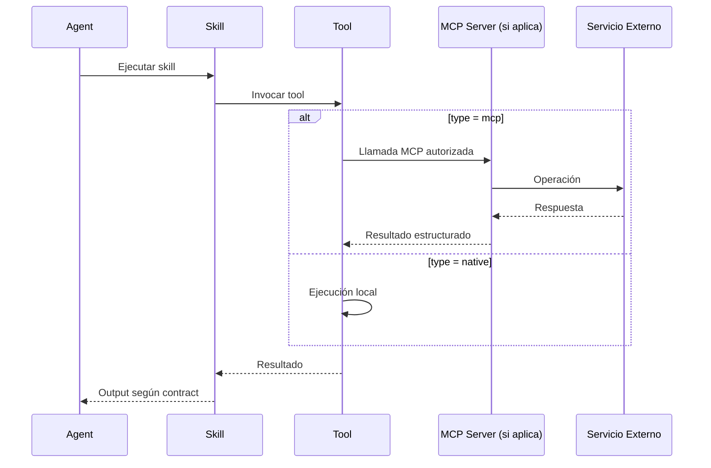

<!-- NADF-GUIDE
Propósito: Documenta NADF Meta Model v1.0 — Modelo de Herramientas (Tool).
Configuración: Actualizar contenido, enlaces y ejemplos cuando cambien los contratos relacionados.
-->
# NADF Meta Model v1.0 — Modelo de Herramientas (Tool)

**Versión:** 1.0  
**Relacionado con:** [capability-model.md](capability-model.md), [mcp-model.md](mcp-model.md)

---

## Propósito

El **Modelo de Herramientas** define la abstracción `Tool` como instrumento concreto invocado por agentes para cumplir Skills, distinguiendo herramientas nativas, MCP, CLI y API.

---

## Jerarquía Tool en NADF

```
Capability → Skill → Tool → (MCP Server → Provider)
```

Ver [capability-model.md](capability-model.md) para la separación completa.

---

## Tipos de Tool

| Tipo | Descripción | Ejemplo | Acceso |
|------|-------------|---------|--------|
| `native` | Herramienta del motor IA / IDE | read_file, write_file, shell.exec | Motor (Cursor, Claude) |
| `mcp` | Herramienta expuesta via MCP Server | github.get_diff, aws.describe_lambda | MCP Server |
| `cli` | Comando de línea de comandos | npm run build, terraform plan | Shell |
| `api` | Llamada REST/GraphQL directa | (solo si no hay MCP disponible) | HTTP |

### Prioridad de selección

1. **MCP** — Preferido para acceso externo (regla `provider_independence`)
2. **Native** — Para operaciones locales (filesystem, shell)
3. **CLI** — Para build tools y utilidades
4. **API** — Solo como último recurso sin MCP disponible

---

## Anatomía conceptual de Tool

```yaml
tool:
  id: string                    # github.get_diff
  name: string                  # Get Git Diff
  type: enum                    # native, mcp, cli, api
  provider: string              # github (si mcp)
  mcp_server: string            # github (si type=mcp)
  description: string
  parameters:
    - name: repository
      type: string
      required: true
    - name: ref
      type: string
      required: true
  permissions:
    - read_repository
  destructive: false              # Si modifica estado externo
  requires_approval: false        # Si requiere aprobación humana
  output_schema: object           # Esquema de respuesta
```

---

## Catálogo de Tools por agente (extracto)

### lovable-analyzer-agent

| Tool | Tipo | Descripción |
|------|------|-------------|
| `github.get_diff` | mcp | Obtener diff de commit |
| `github.get_file` | mcp | Leer archivo del repo |
| `read_file` | native | Leer archivo local |
| `write_artifact` | native | Escribir en Blackboard |

### planner-agent

| Tool | Tipo | Descripción |
|------|------|-------------|
| `read_file` | native | Leer contexto y artefactos |
| `write_artifact` | native | Generar plan-implementacion.md |
| `grep` | native | Buscar en codebase |

### frontend-integration-agent

| Tool | Tipo | Descripción |
|------|------|-------------|
| `write_file` | native | Modificar código productivo |
| `read_file` | native | Leer código existente |
| `github.create_branch` | mcp | Crear rama |
| `github.create_pr` | mcp | Crear pull request |
| `shell.exec` | native | npm run build |

### backend-agent

| Tool | Tipo | Descripción |
|------|------|-------------|
| `write_file` | native | Modificar backend |
| `aws.describe_lambda` | mcp | Consultar Lambda existente |
| `database.get_schema` | mcp | Consultar schema |

### qa-agent

| Tool | Tipo | Descripción |
|------|------|-------------|
| `shell.exec` | native | npm run build, lint |
| `read_file` | native | Inspeccionar código |
| `grep` | native | Buscar mocks, secrets |

### cloud-agent

| Tool | Tipo | Descripción |
|------|------|-------------|
| `aws.describe_resources` | mcp | Inventariar recursos |
| `terraform.plan` | mcp | Plan de infraestructura |
| `write_artifact` | native | Generar propuesta-infra.md |

### devops-agent

| Tool | Tipo | Descripción |
|------|------|-------------|
| `github.get_workflows` | mcp | Consultar CI existente |
| `docker.build` | mcp | Construir imagen |
| `write_artifact` | native | Generar pipeline-config.md |

---

## Permisos por patrón de agente

| Patrón | Tools permitidas | Tools prohibidas |
|--------|------------------|------------------|
| Planner | read_*, write_artifact, grep | write_file (productivo), deploy_*, delete_* |
| Executor | read_*, write_file, shell.exec, mcp (no destructivo) | deploy_*, delete_production_* |
| Validator | read_*, shell.exec (build/test), grep | write_file (salvo autorización) |
| Blackboard | read_*, write_artifact | write_file (productivo) |
| Reflection | read_*, write_artifact | write_file (productivo), mcp destructivo |
| Event Driven | read_*, write_artifact | write_file (productivo) |

---

## Tools destructivas

Tools que modifican estado externo requieren controles adicionales:

| Tool | Destructiva | Requisito |
|------|-------------|-----------|
| `write_file` (repo productivo) | ✅ | Plan aprobado |
| `github.create_pr` | ⚠️ | Plan aprobado + validation |
| `aws.deploy_*` | ✅ | Aprobación humana (prohibido autónomo) |
| `terraform.apply` | ✅ | Aprobación humana (prohibido autónomo) |
| `database.migrate` | ✅ | Plan aprobado + ADR si schema change |
| `docker.push` | ⚠️ | Aprobación humana |

---

## Flujo de invocación



---

## Declaración en skill registry

```yaml
agent:
  id: frontend-integration-agent
  allowed_tools:
    - write_file
    - read_file
    - github.create_branch
    - github.create_pr
    - shell.exec
  mcp_servers:
    - github
  forbidden_tools:
    - aws.deploy_*
    - terraform.apply
```

---

## Extensibilidad

### Añadir nueva Tool nativa
1. Verificar que no existe Tool MCP equivalente
2. Declarar en allowed_tools del agente
3. Documentar parámetros y permisos

### Añadir nueva Tool MCP
1. Exponer via MCP Server (ver [mcp-model.md](mcp-model.md))
2. Declarar en allowed_tools y mcp_servers del agente
3. No modificar Skill ni Capability

---

## Referencias

- [capability-model.md](capability-model.md)
- [mcp-model.md](mcp-model.md)
- [entity-model.md](entity-model.md)
- [mcp-integration.md](../mcp-integration.md)
