# Arquitectura multiagente NADF

## Propósito

NADF coordina agentes de IA especializados mediante patrones arquitectónicos formales que separan **planificación**, **ejecución** y **validación**. Los agentes no se comunican directamente entre sí: un **Orquestador (Mediator)** coordina el flujo y un **Blackboard (Knowledge Layer)** comparte artefactos, decisiones y aprendizajes de forma controlada.

## Principios fundamentales

1. **Separación planificación / ejecución / validación** — Cada fase tiene agentes dedicados con permisos distintos.
2. **Comunicación mediada** — Los agentes interactúan solo a través del Orquestador y el Blackboard.
3. **Acceso externo vía MCP** — GitHub, AWS, bases de datos, Jira, Terraform y otros servicios se consumen mediante MCP.
4. **Trazabilidad completa** — Métricas, ADRs, reflexión y knowledge base en cada ciclo relevante.
5. **Eventos como disparadores** — Los workflows se activan por eventos (commit Lovable, PR, bug, release, cambio infra).

## Capas arquitectónicas

| Capa | Agentes principales | Patrón |
|------|---------------------|--------|
| Design Source | Lovable Analyzer | Event Driven |
| Planning | Planner, Architect, Workflow | Planner |
| Execution | Frontend, Backend, Database, Cloud, DevOps | Executor |
| Validation | QA, Security, Reviewer | Validator |
| Knowledge | KB, ADR, Memory, Metrics, Skills | Blackboard |
| Tooling | MCP (GitHub, AWS, DB, Terraform, Jira) | Integración |
| Runtime | Hosting, APIs, DB, Auth, Observability | Infraestructura productiva |

Ver detalle completo en [architecture.md](architecture.md).

## Patrones adoptados

| Patrón | Descripción | Documento |
|--------|-------------|-----------|
| Planner | Analiza y diseña sin modificar código | [agent-patterns.md](agent-patterns.md) |
| Executor | Implementa planes aprobados | [agent-patterns.md](agent-patterns.md) |
| Validator | Valida y bloquea en fallos | [agent-patterns.md](agent-patterns.md) |
| Mediator | Orquestador coordina agentes | [orchestrator-pattern.md](orchestrator-pattern.md) |
| Blackboard | Espacio compartido de conocimiento | [blackboard-pattern.md](blackboard-pattern.md) |
| Event Driven | Workflows disparados por eventos | [event-driven-workflows.md](event-driven-workflows.md) |
| Reflection | Aprendizaje post-ejecución | [reflection-learning.md](reflection-learning.md) |

## Flujo end-to-end

```mermaid
flowchart LR
    Lovable["Lovable / novus-nexus"] --> GitHub["GitHub"]
    GitHub --> Orchestrator["Orquestador"]
    Orchestrator --> Planning["Planning Layer"]
    Planning --> Execution["Execution Layer"]
    Execution --> Validation["Validation Layer"]
    Validation --> Knowledge["Knowledge Layer"]
    Knowledge --> PR["Pull Request"]
    PR --> Cursor["Cursor Review"]
    Cursor --> Deploy["Deployment aprobado"]
```

## Herramientas externas y su rol

| Herramienta | Rol en NADF |
|-------------|-------------|
| **Cursor** | IDE para revisión humana y edición asistida |
| **Claude Code / Cloud Agent** | Motor de ejecución autónoma de agentes |
| **MCP** | Conexión estándar con servicios externos |
| **Lovable** | Fuente de intención visual/funcional |
| **NovusIntelligenceWEB** | Frontend productivo |
| **NovusIntelligenceBack** | Backend productivo |

NADF **no es** Cursor, Claude Code ni Lovable. NADF es el framework que define reglas, agentes y workflows que esos motores ejecutan.

## Modelo de workflow estándar

Todo workflow NADF sigue nueve fases:

1. **Event Trigger** — Disparador del flujo
2. **Planning** — Análisis y plan de implementación
3. **Plan Review** — Validación arquitectónica del plan
4. **Execution** — Implementación en repos productivos
5. **Validation** — QA, seguridad y revisión
6. **Documentation** — Actualización documental
7. **Metrics** — Registro de métricas
8. **Reflection** — Aprendizaje del ciclo
9. **Knowledge Base Update** — Patrones y errores frecuentes

Ver [planning-execution-validation.md](planning-execution-validation.md) y [workflow-model.md](workflow-model.md).

## Integración MCP

Todos los accesos a servicios externos (GitHub, AWS, bases de datos, Terraform, Jira, Docker/Kubernetes) deben realizarse mediante servidores MCP cuando estén disponibles. Ver [mcp-integration.md](mcp-integration.md).

## Referencias

- [Arquitectura en capas](architecture.md)
- [Modelo de agentes](agent-model.md)
- [Patrones de agentes](agent-patterns.md)
- [ADR-0002](../.nadf/global/decision-history/adr/ADR-0002-multiagent-patterns.md)
