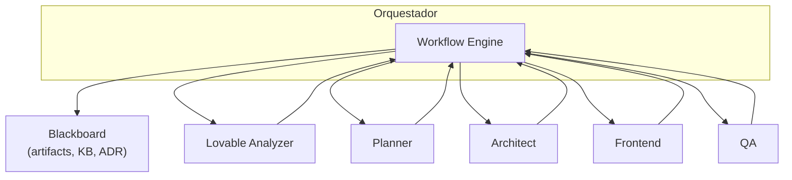

<!-- NADF-GUIDE
Propósito: Documenta Patrón Orquestador (Mediator).
Configuración: Actualizar contenido, enlaces y ejemplos cuando cambien los contratos relacionados.
-->
# Patrón Orquestador (Mediator)

## Propósito

El **Orquestador** es el mediador central de NADF. Coordina la ejecución de workflows, enruta artefactos entre agentes y aplica condiciones sin permitir comunicación directa agente-a-agente.

> **Nota Fase 1:** El Orquestador es un patrón documentado y workflows declarativos en YAML. La implementación automática del orquestador queda para fases posteriores. Hoy los workflows se ejecutan manualmente o vía comandos (p. ej. `novus-lovable-sync`).

## Responsabilidades

1. Recibir eventos disparadores (commit Lovable, PR, bug, release, infra)
2. Seleccionar workflow apropiado de la workflow-library
3. Cargar `project-context.yml` y reglas aplicables
4. Ejecutar pasos en orden, respetando condiciones y ramificaciones
5. Pasar artefactos de salida de un paso como entrada del siguiente
6. Detener el flujo ante bloqueos de validators
7. Registrar métricas por paso y workflow completo

## Lo que NO hace

- No implementa lógica de negocio
- No modifica repositorios productivos directamente
- No sustituye el rol de ningún agente especializado
- No despliega a entornos remotos

## Comunicación mediada

Los agentes **nunca** invocan directamente a otro agente. Solo leen/escriben en el Blackboard y responden al Orquestador.

## Selección de workflow

| Evento | Workflow |
|--------|----------|
| Cambio en novus-nexus | `lovable-to-web` |
| Nueva funcionalidad | `modify-feature` |
| Bug reportado | `fix-bug` |
| Nuevo proyecto | `create-project` |
| Despliegue cloud | `cloud-deployment` |
| Revisión seguridad | `security-review` |
| Validación QA | `qa-validation` |
| Post-ejecución | `reflection-learning` |

## Estados del workflow

| Estado | Descripción |
|--------|-------------|
| `pending` | Workflow iniciado, contexto cargando |
| `planning` | Fase de planificación activa |
| `plan_review` | Revisión de plan en curso |
| `executing` | Agentes executor activos |
| `validating` | Validators evaluando |
| `documenting` | Documentación y métricas |
| `reflecting` | Reflection y KB update |
| `blocked` | Gate crítico fallido |
| `completed` | Workflow finalizado con éxito |
| `failed` | Error irrecuperable |

## Escalación

El Orquestador escala a revisión humana (Cursor) cuando:

- Riesgo alto detectado por Lovable Analyzer
- Plan rechazado repetidamente
- Validator bloquea en gate crítico
- Conflicto arquitectónico sin ADR previo

## Referencias

- [Workflow model](workflow-model.md)
- [Event driven workflows](event-driven-workflows.md)
- Workflow library: `.nadf/global/workflow-library/`
