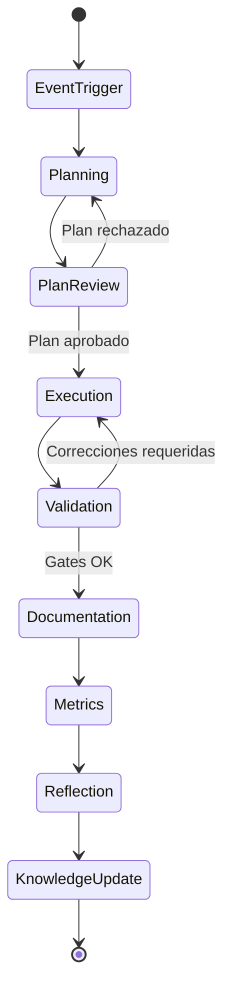

# Separación planificación, ejecución y validación

## Principio rector

NADF separa formalmente tres fases en todo workflow de implementación. Ningún agente puede saltarse fases ni asumir roles de otra capa sin autorización explícita del Orquestador.

## Fase 1: Planificación (Planning Layer)

**Objetivo:** Entender el cambio, evaluar impacto y producir un plan aprobable.

| Agente | Responsabilidad |
|--------|-----------------|
| Lovable Analyzer | Analizar cambios en fuente de diseño |
| Planner Agent | Generar plan de implementación detallado |
| Architect Agent | Validar impacto arquitectónico del plan |
| Backend Impact Agent | Decidir si se requiere backend/DB/infra |
| Workflow Agent | Seleccionar y parametrizar workflow |

**Salidas:** `plan-implementacion.md`, `impacto-arquitectonico.md`, artefactos de análisis Lovable

**Restricción:** **Prohibido modificar código productivo** en esta fase.

## Fase 2: Revisión de plan (Plan Review)

**Objetivo:** Confirmar que el plan es coherente con arquitectura, reglas y ADRs existentes.

- Architect Agent valida alineación arquitectónica
- Backend Impact confirma alcance backend/DB/cloud
- Workflow Agent verifica que el workflow seleccionado es el correcto

**Criterio de avance:** Plan marcado como `approved` en artefacto `plan-implementacion.md`.

## Fase 3: Ejecución (Execution Layer)

**Objetivo:** Implementar el plan aprobado en repositorios productivos.

| Agente | Ámbito |
|--------|--------|
| Frontend Integration | NovusIntelligenceWEB |
| Backend Agent | NovusIntelligenceBack |
| Database Agent | Schemas, migraciones propuestas |
| Cloud Agent | IaC, propuestas cloud |
| DevOps Agent | Pipelines, contenedores, manifiestos |

**Restricción:** **Prohibido cambiar arquitectura sin ADR**. Cambios arquitectónicos requieren escalación al Architect Agent y registro ADR.

## Fase 4: Validación (Validation Layer)

**Objetivo:** Verificar calidad, seguridad y cumplimiento antes de PR.

| Agente | Validaciones |
|--------|--------------|
| QA Agent | Build, lint, responsive, SEO, mocks, secrets |
| Security Agent | Vulnerabilidades, permisos, exposición de datos |
| Reviewer Agent | Coherencia con plan, convenciones, diff review |

**Restricción:** Validators **no modifican lógica productiva** salvo autorización explícita para correcciones menores documentadas.

**Bloqueo:** Gates críticos fallidos detienen el workflow.

## Fases posteriores (Knowledge Layer)

| Fase | Agente | Salida |
|------|--------|--------|
| Documentation | Documentation Agent | Docs y resumen de ejecución |
| Metrics | Metrics Agent | Registro en metrics-schema |
| Reflection | Reflection Agent | `reflexion-ejecucion.md` |
| Knowledge Base | Knowledge Base Agent | Patrones y errores frecuentes |
| ADR | ADR Agent | ADRs de decisiones relevantes |

## Diagrama de fases

## Reglas globales (CLAUDE.md)

- Todo agente lee `project-context.yml` antes de actuar
- Planner/Architect no modifican código
- Executors no cambian arquitectura sin ADR
- Validators no modifican lógica productiva sin autorización
- Todo cambio relevante genera métricas
- Toda decisión arquitectónica genera ADR
- Todo aprendizaje reutilizable actualiza Knowledge Base

## Referencias

- [Modelo de workflows](workflow-model.md)
- [Patrones de agentes](agent-patterns.md)
- [Arquitectura multiagente](multiagent-architecture.md)
