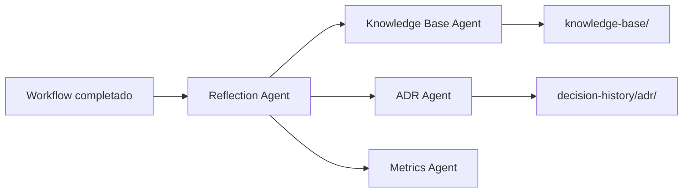

# Reflexión y aprendizaje

## Propósito

El **Reflection Pattern** cierra cada ciclo de workflow documentando qué ocurrió, qué falló, qué se aprendió y qué debe incorporarse a la Knowledge Base para mejorar ejecuciones futuras.

## Reflection Agent

**Capa:** Knowledge Layer  
**Patrón:** Reflection  
**Momento:** Fase 8 de todo workflow (antes de KB update)

### Entradas

- Artefactos del workflow en `artifacts/`
- Métricas registradas por Metrics Agent
- Informes de QA, Security y Reviewer
- Plan de implementación original

### Salidas

- `reflexion-ejecucion.md` — Informe de reflexión estructurado
- Recomendaciones para Knowledge Base Agent
- Recomendaciones para ADR Agent (si hubo decisiones no registradas)

## Estructura de reflexion-ejecucion.md

```markdown
# Reflexión de ejecución

## Workflow
- ID, fecha, agentes involucrados

## Qué se hizo
- Resumen de acciones completadas

## Qué falló
- Gates fallidos, errores, bloqueos

## Qué se aprendió
- Patrones exitosos, anti-patrones detectados

## Recomendaciones
- Actualizaciones sugeridas para KB
- ADRs pendientes
- Mejoras de workflow
```

## Campos en metrics-schema.json

Las métricas incluyen campos de reflexión:

- `reflectionSummary` — Resumen breve del aprendizaje
- `patternsIdentified` — Patrones detectados
- `failuresDocumented` — Fallos documentados
- `kbUpdatesRecommended` — Actualizaciones KB sugeridas

## Flujo de aprendizaje



## Criterios de actualización KB

Actualizar Knowledge Base cuando:

- Se repite un error en más de un workflow
- Se identifica un patrón de implementación exitoso
- Se detecta anti-patrón (p. ej. intento de copia Lovable)
- Cambio de convención acordado en el proyecto

## Workflow dedicado

El workflow `reflection-learning.yml` puede ejecutarse de forma independiente tras cualquier workflow de implementación.

## Referencias

- Reflection Agent: `.claude/agents/reflection-agent.md`
- Workflow: `.nadf/global/workflow-library/reflection-learning.yml`
- [Blackboard pattern](blackboard-pattern.md)
