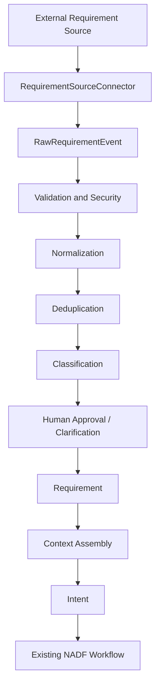

<!-- NADF-GUIDE
Propósito: Documenta Requirement Intake Architecture.
Configuración: Actualizar contenido, enlaces y ejemplos cuando cambien los contratos relacionados.
-->
# Requirement Intake Architecture

**Versión:** 1.0  
**Meta Model:** v1.1  
**Autoridad:** ADR-0007

---

## Propósito

La **Requirement Intake Layer** permite recibir requerimientos empresariales multi-fuente de forma uniforme, segura y trazable, convirtiéndolos en `Intent` NADF solo tras normalización, deduplicación, clasificación y aprobación.

No sustituye Planning/Execution/Validation. Se inserta **antes** del flujo canónico.

---

## Arquitectura

---

## Principios

1. Everything starts with Intent — pero el Intent nace de un Requirement aprobado cuando intake está activo.
2. Event-driven: triggers `requirement.*.received`.
3. MCP First + adapters HTTP con el mismo contrato.
4. Provider independence.
5. Human approval for critical operations.
6. Opt-in por proyecto.

---

## Componentes

| Componente | Ubicación |
|------------|-----------|
| Definiciones de fuente | `.nadf/global/requirement-sources/definitions/` |
| Contrato conector | `.nadf/global/requirement-sources/connector-contract.yml` |
| Workflow | `.nadf/global/workflow-library/requirement-intake.yml` |
| Agentes | `.claude/agents/requirement-*-agent.md` |
| Config proyecto | `.nadf/projects/
/requirement-sources/` |
| Contratos artefactos | `.nadf/global/artifact-contracts/requirement-intake/` |

---

## Separación Requirement vs Intent

| | Requirement | Intent |
|--|-------------|--------|
| Qué es | Pedido externo normalizado | Intención formal NADF |
| Crea código | Nunca | Nunca directamente |
| Aprobación | RequirementPolicy | Plan Review |

---

## Referencias

- [requirement-source-connectors.md](requirement-source-connectors.md)
- [requirement-normalization.md](requirement-normalization.md)
- [requirement-security.md](requirement-security.md)
- [requirement-traceability.md](requirement-traceability.md)
- [meta-model/requirement-model.md](meta-model/requirement-model.md)
- ADR-0007
