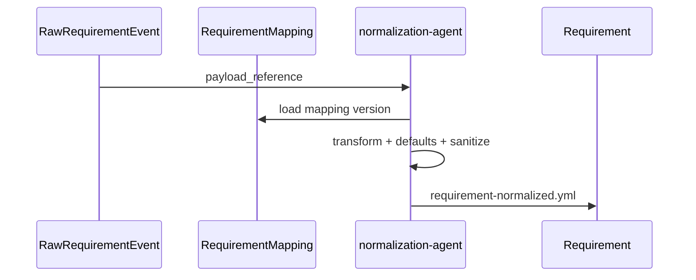

# Requirement Normalization

**Autoridad:** ADR-0007

---

## Objetivo

Transformar `RawRequirementEvent` en `Requirement` mediante `RequirementMapping`, sin acoplar el modelo a un proveedor.

## Proceso

## Reglas por fuente (resumen)

| Fuente | Campos clave | Notas |
|--------|--------------|-------|
| Jira | key, summary, description, priority, labels, AC, attachments | Ver mapping jira |
| Slack | workspace, channel, thread, user, message | Solo con gate autorizado |
| Teams | tenant, team, channel, adaptive card | Idem |
| GitHub/GitLab/Bitbucket | repo, issue id, title, body, labels | |
| Email | message id, sender, subject, text body | Allowlist dominio |
| Webhook/API | versioned payload, idempotency, correlation | Schema validation |
| File | md/txt/json/yaml/csv/pdf | Sin ejecutar macros |
| ServiceNow | number, short_description, priority, state | |
| Form | schema configurable | |
| Database | vista/CDC/query parametrizada | Sin SQL arbitrario |
| Scheduled | plantilla | Nunca Execution directa |

## Agente

`requirement-normalization-agent` — no aprueba, no crea Intent, no ejecuta código.
