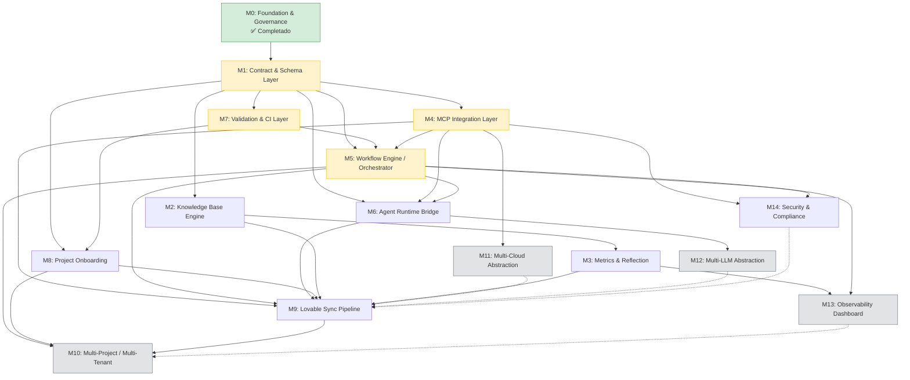

# Roadmap de implementación — NovusAIDevelopmentFramework (NADF 2.0.0)

**Versión del documento:** 1.0.0  
**Fecha:** 2026-07-04  
**Autor:** Chief Software Architect  
**Estado del framework:** Fase 1 (documentación + orquestación manual) — puntuación arquitectónica ~7.8/10  
**Proyecto piloto:** `novus-intelligence` (NovusIntelligenceWEB, NovusIntelligenceBack, novus-nexus)

---

## 1. Resumen ejecutivo del roadmap

NADF 2.0.0 es un **framework declarativo de gobernanza multiagente** (Markdown + YAML) que coordina 19 agentes especializados en 7 capas y 7 patrones arquitectónicos, con un workflow canónico `lovable-to-web` de 18 pasos y 9 fases. Tras las correcciones críticas documentadas en [architecture-review-final.md](architecture-review-final.md) y [ADR-0003](../.nadf/global/decision-history/adr/ADR-0003-lovable-to-web-canonicalization.md), el framework es **coherente y operable como guía manual**, pero no autónomo.

Este roadmap define **15 módulos independientes** (M0–M14) con interfaces claras, prioridades y dependencias explícitas. La estrategia es **incremental y reversible**: cada módulo entrega valor verificable sin bloquear el uso manual del framework mientras avanzan los módulos de automatización.

**Horizonte estimado:**

| Horizonte | Objetivo principal |
|-----------|-------------------|
| **Corto plazo (Q3 2026)** | Contratos formales (M1), validación CI (M7), MCP mínimo operativo (M4) |
| **Medio plazo (Q4 2026 – Q1 2027)** | Orquestador ejecutable (M5), puente runtime (M6), pipeline Lovable semi-automático (M9) |
| **Largo plazo (2027+)** | Multi-proyecto/tenant (M10), multi-cloud (M11), multi-LLM (M12), observabilidad y hardening (M13–M14) |

**Meta de madurez:** pasar de **7.8/10** (guía manual coherente) a **≥9.0/10** (orquestación semi-autónoma con gates bloqueantes, trazabilidad completa y abstracción de proveedores verificable).

---

## 2. Principios de implementación incremental

1. **Documentación primero, código después** — Ningún módulo de runtime contradice lo ya canonizado en YAML, ADRs y `CLAUDE.md`. Los contratos (M1) preceden a la ejecución automatizada (M5, M6).

2. **Interfaces estables, implementaciones intercambiables** — Cada módulo expone contratos (schemas, APIs, manifests) que otros consumen sin acoplarse a la implementación interna.

3. **Valor incremental por módulo** — Cada entrega debe ser utilizable de forma aislada. Ejemplo: M7 (CI) aporta valor aunque M5 (orquestador) no exista.

4. **Orquestación manual como fallback permanente** — `orchestrator_mode: manual` y el comando `novus-lovable-sync` siguen siendo válidos hasta que M5 demuestre paridad funcional en el piloto.

5. **Piloto antes de generalizar** — Todo módulo de ejecución se valida contra `novus-intelligence` antes de habilitar multi-proyecto (M10).

6. **MCP como única vía externa** — Integraciones con GitHub, AWS, DB, Terraform, Jira y K8s pasan por M4; sin bypass directo en agentes.

7. **Gates bloqueantes no negociables** — Los 10 quality gates de `project-context.yml` y las reglas de `CLAUDE.md` se convierten en validaciones ejecutables progresivamente (M7 → M5).

8. **Separación planificación / ejecución / validación** — Ningún módulo de runtime permite que agentes Planner modifiquen código productivo ni que Executors cambien arquitectura sin ADR.

9. **Trazabilidad obligatoria** — Métricas (M3), reflexión, ADRs y KB (M2) son requisitos de cierre, no opcionales.

10. **Independencia de proveedor declarada y verificada** — Abstracciones multi-cloud (M11) y multi-LLM (M12) se prueban con al menos dos backends antes de declararse estables.

---

## 3. Visión por fases

### Fase 0 — Fundación declarativa ✅ **Completada**

**Alcance:** Gobernanza, arquitectura multiagente, skill registry, workflow library, ADRs base, proyecto piloto configurado.

**Entregables completados:**
- 19 agentes definidos (`.claude/agents/` + skill registry)
- 8 workflows globales + workflow de proyecto reconciliado (18 pasos)
- ADR-0001 (superseded), ADR-0002, ADR-0003
- `project-context.yml` completo (19/19 agentes, 10 quality gates)
- Documentación arquitectónica (`docs/`, `CLAUDE.md`)
- Comandos manuales: `novus-lovable-sync`, `setup-project-context`

**Módulo principal:** M0 (Foundation & Governance)

---

### Fase 1 — Operación manual guiada 🔄 **En curso (estable)**

**Alcance:** Ejecución humana del workflow canónico vía Cursor / Claude Code con supervisión; sin motor de orquestación productivo.

**Estado actual:**
- Orquestador conceptual; `orchestrator_mode: manual`
- Métricas parcialmente definidas (`metrics-schema.json` existe)
- MCP documentado, no operacionalizado en repo
- Knowledge Base vacía
- Sin validador estático ni CI de coherencia

**Criterio de cierre Fase 1:** Primera ejecución end-to-end manual completa del piloto `novus-intelligence` (landing page) con todos los gates documentados cumplidos y artefactos en Blackboard.

**Módulos activos:** M0 (mantenimiento), preparación M1

---

### Fase 2 — Contratos y validación estática

**Alcance:** JSON Schemas, contratos de artefactos, linter de coherencia, CI en GitHub Actions.

**Módulos:** M1 (Contract & Schema Layer), M7 (Validation & CI Layer)

**Resultado esperado:** Deriva docs ↔ YAML detectada automáticamente en PR; schemas versionados como fuente de verdad contractual.

---

### Fase 3 — Integración MCP y conocimiento operativo

**Alcance:** Servidores MCP mínimos (GitHub, AWS), manifests en repo, KB poblada desde reflexión.

**Módulos:** M4 (MCP Integration Layer), M2 (Knowledge Base Engine), M3 (Metrics & Reflection Pipeline)

**Resultado esperado:** Agentes Executor acceden a GitHub/AWS vía MCP con trazabilidad; aprendizajes persisten en KB.

---

### Fase 4 — Motor de workflows y puente runtime

**Alcance:** Intérprete YAML de workflows, gates bloqueantes, abstracción Claude Code / Cloud Agent / Cursor SDK.

**Módulos:** M5 (Workflow Engine / Orchestrator), M6 (Agent Runtime Bridge)

**Resultado esperado:** `novus-lovable-sync` ejecutable con estado de workflow persistido y gates enforced.

---

### Fase 5 — Automatización Lovable → Web (piloto)

**Alcance:** Pipeline end-to-end semi-automático para `novus-intelligence`; onboarding automatizado de proyectos.

**Módulos:** M9 (Lovable Sync Pipeline), M8 (Project Onboarding Automation)

**Resultado esperado:** Evento `lovable.commit` → PR listo en < 2 horas (métrica de visión).

---

### Fase 6 — Escala operacional

**Alcance:** Multi-proyecto, dashboard de observabilidad, hardening de seguridad.

**Módulos:** M10 (Multi-Project & Multi-Tenant), M13 (Observability & Dashboard), M14 (Security & Compliance Hardening)

---

### Fase 7 — Abstracción de proveedores

**Alcance:** Runtime desacoplado de AWS y de un único LLM; verificación con segundo proveedor.

**Módulos:** M11 (Multi-Cloud Provider Abstraction), M12 (Multi-LLM Provider Abstraction)

**Resultado esperado:** Cambio de proveedor cloud o LLM sin modificar definiciones de agentes ni workflows.

---

## 4. Módulos independientes

### M0: Foundation & Governance

| Atributo | Detalle |
|----------|---------|
| **Estado** | ✅ ~95% completado (Fase 0) |
| **Objetivo** | Mantener la capa declarativa de gobernanza: reglas globales, ADRs, arquitectura multiagente, skill registry, workflow library y documentación canónica. |
| **Dependencias** | Ninguna (módulo raíz) |
| **Prioridad** | P0 (mantenimiento continuo) |
| **Complejidad** | Media |
| **Agentes involucrados** | Framework Architect, ADR Agent, Workflow Agent, Documentation Agent |
| **Entregables** | `CLAUDE.md`, `docs/*`, `.nadf/global/rules/`, skill registry (19 YAML), workflow library (8 YAML), ADRs, comandos `.claude/commands/`, **NADF Meta Model v1.0 normativo** (ADR-0004) |
| **Criterios de finalización** | ✅ 19 agentes alineados MD↔YAML; ✅ workflow canónico 18 pasos; ✅ ADR-0003 aplicado; ✅ ADR-0004 Meta Model adoptado; ✅ project-context piloto completo; mantenimiento: zero drift entre docs y YAML verificado por M7 |

**Trabajo pendiente en M0:** Sincronización continua con validador CI (M7); ADRs para cada módulo nuevo del roadmap.

---

### M1: Contract & Schema Layer

| Atributo | Detalle |
|----------|---------|
| **Estado** | ⏳ Pendiente |
| **Objetivo** | Definir contratos formales (JSON Schema) para todos los artefactos declarativos NADF y establecer reglas de versionado de contratos. |
| **Dependencias** | M0 |
| **Prioridad** | P0 |
| **Complejidad** | Media |
| **Agentes involucrados** | Framework Architect, Architect Agent, ADR Agent |
| **Entregables** | JSON Schemas: `project-context`, `skill-registry`, `workflow`, `quality-gates`, `artifact-contracts`; catálogo de artefactos Blackboard (`plan-implementacion.md`, `evaluacion-backend.md`, etc.); `docs/contract-catalog.md`; ADR de versionado de schemas |
| **Criterios de finalización** | 100% de YAML NADF validables contra schema; contratos de entrada/salida por paso de workflow documentados; semver de schemas definido; `metrics-schema.json` integrado al catálogo |

**Interfaces expuestas:**
- `schemas/v1/*.schema.json` — validación estática
- `ArtifactContract` — tipo, ruta, productor, consumidor, schema

---

### M2: Knowledge Base Engine

| Atributo | Detalle |
|----------|---------|
| **Estado** | ⏳ Pendiente (KB vacía) |
| **Objetivo** | Operacionalizar el Blackboard de conocimiento reutilizable: indexación, búsqueda, ciclo de vida de entradas y vinculación con reflexión y ADRs. |
| **Dependencias** | M0, M1 (contratos de artefactos KB) |
| **Prioridad** | P1 |
| **Complejidad** | Media |
| **Agentes involucrados** | Knowledge Base Agent, Reflection Agent, ADR Agent, Documentation Agent |
| **Entregables** | Estructura operativa `.nadf/global/knowledge-base/` (categorías: patterns, failures, decisions); API/CLI de consulta e ingesta; plantillas de entrada KB; integración con salida de Reflection Agent |
| **Criterios de finalización** | ≥10 entradas KB pobladas desde ejecuciones piloto; búsqueda por tag/patrón/proyecto funcional; cada workflow de implementación genera ≥1 actualización KB recomendada y trazable |

**Interfaces expuestas:**
- `KBStore.query(filters)` — lectura
- `KBStore.ingest(entry)` — escritura (solo agentes Blackboard autorizados)

---

### M3: Metrics & Reflection Pipeline

| Atributo | Detalle |
|----------|---------|
| **Estado** | ⏳ Parcial (`metrics-schema.json` existe) |
| **Objetivo** | Pipeline end-to-end de captura, almacenamiento, agregación y reflexión post-workflow con campos obligatorios de aprendizaje. |
| **Dependencias** | M1, M2 |
| **Prioridad** | P1 |
| **Complejidad** | Media |
| **Agentes involucrados** | Metrics Agent, Reflection Agent, Knowledge Base Agent |
| **Entregables** | Almacén de métricas por proyecto (`.nadf/projects/
/metrics/`); validador contra `metrics-schema.json`; plantilla de reflexión; pipeline Reflection → KB; reportes agregados por workflow/agente |
| **Criterios de finalización** | 100% de ejecuciones piloto registran métricas válidas; reflexión generada en workflows de implementación; campos `reflectionSummary`, `patternsIdentified`, `failuresDocumented`, `kbUpdatesRecommended` poblados |

**Interfaces expuestas:**
- `MetricsCollector.record(event)` — ingesta
- `ReflectionPipeline.run(workflowRunId)` — generación reflexión + recomendaciones KB

---

### M4: MCP Integration Layer

| Atributo | Detalle |
|----------|---------|
| **Estado** | ⏳ Documentado, no operacional |
| **Objetivo** | Operacionalizar la capa MCP: manifests, configuración por proyecto, permisos por agente y servidores mínimos (GitHub, AWS) con trazabilidad. |
| **Dependencias** | M0, M1 (schema de permisos MCP) |
| **Prioridad** | P0 |
| **Complejidad** | Alta |
| **Agentes involucrados** | Cloud Agent, DevOps Agent, Backend Agent, Database Agent, Lovable Analyzer Agent, Reviewer Agent |
| **Entregables** | `.nadf/global/mcp/` (manifests, capability matrix); configuración MCP por proyecto; integración GitHub (repos, PRs, diffs); integración AWS (Lambda, S3, DynamoDB — lectura/describe); logging de operaciones MCP en métricas; `docs/mcp-integration.md` actualizado con manifests |
| **Criterios de finalización** | GitHub y AWS operativos en piloto; permisos enforced por skill registry; cero bypass documentado; fallos MCP bloquean paso y escalan al orquestador |

**Interfaces expuestas:**
- `MCPGateway.invoke(server, tool, params, agentContext)` — abstracción única
- `MCPCapabilityMatrix` — servidor × agente × operación

**Servidores planificados (fases):**

| Fase | Servidores |
|------|------------|
| 4.1 | GitHub |
| 4.2 | AWS |
| 4.3 | Database, Terraform |
| 4.4 | Jira, Docker/Kubernetes |

---

### M5: Workflow Engine / Orchestrator

| Atributo | Detalle |
|----------|---------|
| **Estado** | ⏳ Conceptual/manual |
| **Objetivo** | Transformar workflows YAML declarativos en ejecución con estado, transiciones de fase, condiciones, gates bloqueantes y semántica `extends:` enforced en runtime. |
| **Dependencias** | M1, M4 (parcial), M7 (validación previa de YAML) |
| **Prioridad** | P0 |
| **Complejidad** | Muy alta |
| **Agentes involucrados** | Workflow Agent (orquestador lógico), todos los agentes como participantes |
| **Entregables** | Motor de interpretación YAML; modelo de estado (pending → running → blocked → completed/failed); enforcement de 9 fases y orden canónico ADR-0003; evaluador de condiciones (`plan-implementacion.md:status == approved`); gate checker integrado; persistencia de ejecución; API `WorkflowRun` |
| **Criterios de finalización** | Workflow `lovable-to-web` ejecutable end-to-end en piloto; gates bloqueantes detienen flujo; merge `extends:` verificado en runtime; paridad funcional con guía manual de 18 pasos |

**Interfaces expuestas:**
- `Orchestrator.start(workflowId, projectId, trigger)` → `WorkflowRun`
- `Orchestrator.advance(runId)` — siguiente paso elegible
- `Orchestrator.getStatus(runId)` — estado + artefactos

---

### M6: Agent Runtime Bridge

| Atributo | Detalle |
|----------|---------|
| **Estado** | ⏳ Acoplado a `.claude/` |
| **Objetivo** | Abstraer la invocación de agentes sobre motores de ejecución externos (Claude Code, Cloud Agent, Cursor SDK) con contrato uniforme de prompt, contexto y artefactos. |
| **Dependencias** | M1, M4, M5 (parcial) |
| **Prioridad** | P1 |
| **Complejidad** | Muy alta |
| **Agentes involucrados** | Todos (como unidades invocables); Framework Architect (diseño) |
| **Entregables** | `AgentRuntime` interface; adaptadores: Claude Code, Cloud Agent, Cursor SDK; inyección de `project-context.yml`, reglas y memoria; restricciones por patrón (Planner/Executor/Validator); registro de invocaciones en métricas |
| **Criterios de finalización** | ≥2 runtimes soportados; invocación de agente desde M5 sin acoplamiento directo a `.claude/`; permisos de patrón enforced (Planner no escribe código productivo) |

**Interfaces expuestas:**
- `AgentRuntime.invoke(agentId, stepContract, context)` → `AgentResult`
- `RuntimeAdapter` — plugin por motor externo

---

### M7: Validation & CI Layer

| Atributo | Detalle |
|----------|---------|
| **Estado** | ⏳ Pendiente |
| **Objetivo** | Validación estática de coherencia NADF en CI: schemas, alineación agente↔registry↔workflow, semántica `extends:`, quality gates declarados. |
| **Dependencias** | M1 |
| **Prioridad** | P0 |
| **Complejidad** | Media |
| **Agentes involucrados** | Framework Architect, QA Agent, Reviewer Agent |
| **Entregables** | CLI `nadf-validate`; GitHub Action `nadf-coherence-check`; reglas: 19 agentes en registry, fases inmutables, backend-impact antes de Plan Review, reviewer en Validation; reporte de drift docs↔YAML |
| **Criterios de finalización** | CI bloquea PR con YAML inválido o incoherente; tiempo de validación < 2 min; integrado en repo framework y documentado en `docs/` |

**Interfaces expuestas:**
- `nadf-validate --project <id> --strict` — exit code 0/1
- `CoherenceReport` — findings categorizados (error/warning)

---

### M8: Project Onboarding Automation

| Atributo | Detalle |
|----------|---------|
| **Estado** | ⏳ Manual (`setup-project-context` documentado) |
| **Objetivo** | Automatizar la incorporación de nuevos proyectos: estructura `.nadf/projects/`, `project-context.yml`, workflows que extienden globales, ADR de onboarding. |
| **Dependencias** | M1, M7 |
| **Prioridad** | P1 |
| **Complejidad** | Media |
| **Agentes involucrados** | Framework Architect, Planner Agent, Architect Agent, ADR Agent, Workflow Agent |
| **Entregables** | Comando/script `setup-project-context` ejecutable; plantillas parametrizadas; workflow `create-project.yml` invocable desde M5; checklist automatizado de validación post-onboarding |
| **Criterios de finalización** | Nuevo proyecto onboarded en < 30 min; pasa `nadf-validate` sin errores; ADR de onboarding generado automáticamente |

**Interfaces expuestas:**
- `Onboarder.create(config)` → estructura de proyecto + ADR draft
- Plantillas en `.nadf/templates/project/`

---

### M9: Lovable Sync Pipeline

| Atributo | Detalle |
|----------|---------|
| **Estado** | ⏳ Manual vía `novus-lovable-sync` |
| **Objetivo** | Automatizar el flujo end-to-end Lovable → Web: detección de evento, 18 pasos, artefactos, PR y preparación para revisión Cursor. |
| **Dependencias** | M4, M5, M6, M8; M3 y M2 para cierre de ciclo |
| **Prioridad** | P1 |
| **Complejidad** | Muy alta |
| **Agentes involucrados** | Los 19 agentes del workflow canónico |
| **Entregables** | Pipeline event-driven (`lovable.commit`); integración GitHub MCP (detección commit novus-nexus); ejecución orquestada de 18 pasos; generación de PR en NovusIntelligenceWEB/Back; verificación de gates (no copia Lovable, no mocks prod); comando `novus-lovable-sync` wired al motor M5 |
| **Criterios de finalización** | Piloto completo: commit Lovable → PR listo; tiempo < 2 h; 0 copia directa Lovable; 100% gates pass; métricas + reflexión + KB update generados |

**Interfaces expuestas:**
- `LovableSyncPipeline.run(projectId, event)` → `PipelineResult`
- Evento: `lovable.commit` en repo design_source

---

### M10: Multi-Project & Multi-Tenant Support

| Atributo | Detalle |
|----------|---------|
| **Estado** | ⏳ Diseño declarativo (estructura `.nadf/projects/`) |
| **Objetivo** | Ejecutar y aislar múltiples proyectos NADF simultáneamente con contextos, reglas, métricas y KB segregados. |
| **Dependencias** | M5, M8, M2, M3 |
| **Prioridad** | P2 |
| **Complejidad** | Alta |
| **Agentes involucrados** | Framework Architect, Workflow Agent |
| **Entregables** | Resolución de proyecto activo; aislamiento de artefactos/métricas/KB; registry de proyectos; política de recursos compartidos vs. segregados; documentación multi-tenant |
| **Criterios de finalización** | ≥2 proyectos activos sin interferencia; `extends:` y workflows globales compartidos sin deriva; validación CI por proyecto |

---

### M11: Multi-Cloud Provider Abstraction

| Atributo | Detalle |
|----------|---------|
| **Estado** | ⏳ Declarado en `provider-independence.md` |
| **Objetivo** | Desacoplar operaciones cloud de AWS mediante capa de abstracción sobre MCP y contratos de capacidad, permitiendo segundo proveedor (Azure/GCP). |
| **Dependencias** | M4 |
| **Prioridad** | P2 |
| **Complejidad** | Alta |
| **Agentes involucrados** | Cloud Agent, DevOps Agent, Backend Agent |
| **Entregables** | `CloudProvider` interface; adaptador AWS (actual); adaptador secundario (PoC); mapping de capacidades (Lambda↔Functions, S3↔Blob, etc.); ADR de estrategia multi-cloud |
| **Criterios de finalización** | Cloud Agent opera con ≥2 proveedores en escenario de prueba; cambio de proveedor sin modificar skill registry ni workflows |

---

### M12: Multi-LLM Provider Abstraction

| Atributo | Detalle |
|----------|---------|
| **Estado** | ⏳ Acoplado a Claude/Cursor |
| **Objetivo** | Permitir intercambio de proveedor LLM en M6 sin alterar definiciones de agentes, prompts base ni contratos de artefactos. |
| **Dependencias** | M6 |
| **Prioridad** | P2 |
| **Complejidad** | Alta |
| **Agentes involucrados** | Framework Architect; todos vía M6 |
| **Entregables** | `LLMProvider` interface; configuración por proyecto (`llm_provider`, `model`); adaptadores múltiples; política de fallback y límites de costo |
| **Criterios de finalización** | Mismo workflow ejecutado con ≥2 proveedores LLM; paridad de gates y artefactos; ADR de selección de modelo por tipo de agente |

---

### M13: Observability & Dashboard

| Atributo | Detalle |
|----------|---------|
| **Estado** | ⏳ Pendiente |
| **Objetivo** | Visibilidad operacional: estado de workflows, métricas agregadas, reflexiones, ADRs y salud MCP en un dashboard consumible por humanos. |
| **Dependencias** | M3, M5; M4 para telemetría MCP |
| **Prioridad** | P2 |
| **Complejidad** | Alta |
| **Agentes involucrados** | Metrics Agent, Documentation Agent; consumo humano (Cursor, web interna) |
| **Entregables** | Dashboard (web o integrado); vistas: workflows activos/histórico, KPIs de visión, gates fallidos, timeline ADR; export CSV/JSON; alertas básicas (gate fail, MCP down) |
| **Criterios de finalización** | Dashboard refleja ejecuciones piloto en tiempo diferido < 5 min; KPIs de `vision.md` visualizados; acceso role-based |

---

### M14: Security & Compliance Hardening

| Atributo | Detalle |
|----------|---------|
| **Estado** | ⏳ Reglas declarativas (`security-rules.md`) |
| **Objetivo** | Endurecer seguridad operativa: secrets scanning, permisos MCP, audit trail, compliance con políticas Novus (no deploy sin aprobación, no secrets en código). |
| **Dependencias** | M4, M5, M7; M6 para restricciones runtime |
| **Prioridad** | P1 (continuo), P0 para controles bloqueantes |
| **Complejidad** | Alta |
| **Agentes involucrados** | Security Agent, Reviewer Agent, ADR Agent |
| **Entregables** | Scanner de secrets en CI; audit log de operaciones MCP y despliegues; enforcement de `no deploy without approval`; revisión periódica de permisos por agente; runbook de incidentes; integración con Security Agent en Validation |
| **Criterios de finalización** | Cero secrets en PRs (CI block); audit trail completo por workflow run; operaciones destructivas MCP requieren aprobación humana registrada; Security Agent pass obligatorio antes de merge |

---

## 5. Diagrama de dependencias entre módulos

**Leyenda:** línea sólida = dependencia dura; línea punteada = dependencia opcional o de refuerzo transversal.

---

## 6. Orden de implementación recomendado

Secuencia optimizada para **máximo valor temprano** y **mínimo rework**, con hitos verificables:

| Orden | Módulo | Fase | Justificación |
|-------|--------|------|---------------|
| **0** | M0 | 0 | ✅ Base completada; mantener sincronizado |
| **1** | M1 | 2 | Desbloquea validación, orquestador y contratos de artefactos |
| **2** | M7 | 2 | CI inmediato; previene regresión post ADR-0003 |
| **3** | M4.1 (GitHub) | 3 | Prerrequisito para detección Lovable y PRs automatizados |
| **4** | M2 | 3 | Destino operativo para reflexión antes de escalar automatización |
| **5** | M3 | 3 | Trazabilidad de ejecuciones manuales y futuras automáticas |
| **6** | M4.2 (AWS) | 3 | Cloud/Backend agents en piloto |
| **7** | M5 | 4 | Núcleo de automatización; depende de M1, M7, M4 parcial |
| **8** | M6 | 4 | En paralelo parcial con M5 una vez contratos M1 estables |
| **9** | M14 (core) | 4 | Gates de seguridad en CI y MCP antes de pipeline completo |
| **10** | M8 | 5 | Replicabilidad más allá del piloto |
| **11** | M9 | 5 | Objetivo de negocio: Lovable → PR |
| **12** | M13 | 6 | Visibilidad para operación multi-workflow |
| **13** | M10 | 6 | Escala a múltiples productos Novus |
| **14** | M11 | 7 | Tras estabilizar piloto AWS |
| **15** | M12 | 7 | Tras estabilizar M6 |
| **16** | M14 (completo) | 6–7 | Hardening continuo |
| **17** | M4.3–4.4 | 6+ | Database, Terraform, Jira, K8s según demanda |

### Hitos (milestones)

| Hito | Módulos | Fecha orientativa | Señal de éxito |
|------|---------|-------------------|----------------|
| **H1 — Contratos firmes** | M1 + M7 | Q3 2026 | CI verde en framework; cero drift YAML |
| **H2 — MCP mínimo** | M4.1 + M4.2 | Q3–Q4 2026 | Agentes acceden GitHub/AWS vía gateway |
| **H3 — Conocimiento vivo** | M2 + M3 | Q4 2026 | KB poblada; métricas por ejecución piloto |
| **H4 — Orquestador MVP** | M5 + M6 | Q1 2027 | Un workflow ejecutable con gates enforced |
| **H5 — Lovable automático** | M9 | Q1–Q2 2027 | PR desde commit Lovable en piloto |
| **H6 — Escala** | M10 + M13 + M14 | Q2–Q3 2027 | Multi-proyecto con dashboard y audit |
| **H7 — Proveedores** | M11 + M12 | Q4 2027 | Segundo cloud + segundo LLM verificados |

---

## 7. Riesgos del roadmap y mitigaciones

| Riesgo | Prob. | Impacto | Mitigación |
|--------|-------|---------|------------|
| **Sobre-ingeniería del orquestador (M5)** antes de contratos estables | Media | Alto | M1 + M7 obligatorios antes de M5; MVP con un solo workflow (`lovable-to-web`) |
| **Deriva docs ↔ YAML** tras Fase 0 | Alta | Medio | M7 en CI; ADR obligatorio por cambio de workflow; revisión Framework Architect |
| **Acoplamiento persistente a `.claude/`** | Media | Alto | M6 como capa obligatoria; prohibir invocación directa desde M5 |
| **MCP no disponible o inestable** | Media | Alto | Fallback manual documentado; M5 debe soportar `step_mode: manual_override` |
| **Scope creep en M9** (automatizar 18 pasos a la vez) | Alta | Alto | Entregas incrementales por fase (Planning automático primero, luego Execution) |
| **KB vacía → reflexión sin valor** | Media | Medio | M2 antes de escalar M9; plantillas KB mínimas desde día 1 |
| **Bypass de MCP por agentes** | Media | Alto | M14 audit + M4 gateway único; CI detecta SDK directo en prompts/skills |
| **Multi-cloud/LLM prematuro** | Media | Medio | M11/M12 en Fase 7; AWS + Claude como baseline hasta H5 |
| **Costo LLM en pipeline completo** | Alta | Medio | M12 límites de costo; pasos condicionales ya definidos en YAML |
| **Regresión de orden Planning/Execution** | Baja | Crítico | M7 regla ADR-0003; tests de orden de pasos en CI |
| **Secrets en artefactos generados** | Media | Crítico | M14 scanner; Security Agent gate; revisión humana pre-merge |
| **Dependencia de aprobación humana mal modelada** | Media | Alto | M5 estado `awaiting_human_approval`; audit en M14 |

---

## 8. Métricas de progreso

### 8.1 Métricas de madurez del framework

| Métrica | Baseline (Fase 1) | Objetivo H4 | Objetivo H7 |
|---------|-------------------|-------------|-------------|
| Puntuación arquitectónica | 7.8/10 | 8.5/10 | ≥9.0/10 |
| Módulos completados (M0–M14) | 1/15 (~95% M0) | 9/15 | 15/15 |
| YAML validado por schema | 0% | 100% | 100% |
| Workflows con CI coherence check | 0% | 100% | 100% |
| Servidores MCP operativos | 0 | 2 (GitHub, AWS) | ≥6 |
| Ejecuciones con métricas registradas | 0% | 80% | 100% |
| Workflows con reflexión + KB update | 0% | 80% | 100% |
| Gates enforced automáticamente | 0% | 70% | 100% |
| Tiempo Lovable → PR listo (piloto) | Manual (horas) | < 4 h | < 2 h |
| Proyectos onboarded vía M8 | 1 (manual) | 2 | ≥5 |

### 8.2 KPIs operativos (alineados a `vision.md`)

| KPI | Objetivo |
|-----|----------|
| Tasa de rechazo QA | < 15% |
| Decisiones arquitectónicas documentadas (ADR) | 100% |
| Copia directa de Lovable | 0% |
| Mocks en producción | 0% |
| Planes aprobados antes de ejecución | 100% |
| Workflows de implementación con reflexión | 100% |

### 8.3 Seguimiento por módulo

Cada módulo reporta estado en escala:

| Estado | Significado |
|--------|-------------|
| **No iniciado** | Sin entregables |
| **En diseño** | ADR o contrato en progreso |
| **En desarrollo** | Implementación activa |
| **En piloto** | Validación con `novus-intelligence` |
| **Completo** | Criterios de finalización cumplidos |
| **Estable** | Operando en ≥2 proyectos o ≥3 meses sin regresión crítica |

**Cadencia de revisión:** quincenal (Framework Architect + stakeholders); actualización de este documento en cada hito H1–H7.

### 8.4 Definition of Done (DoD) global del roadmap

El roadmap se considerará **materializado** cuando:

1. M0–M9 estén en estado **Completo** o **Estable** en el piloto.
2. CI (M7) bloquee incoherencias en todos los PRs del framework.
3. Al menos una ejecución end-to-end M9 demuestre paridad con el flujo manual de 18 pasos.
4. Puntuación arquitectónica ≥ 9.0 en revisión tipo `architecture-review-final.md`.
5. ADR por módulo mayor (M1, M4, M5, M6, M9) registrado en `.nadf/global/decision-history/adr/`.

---

## Referencias

- [Visión NADF](vision.md)
- [Arquitectura multiagente](multiagent-architecture.md)
- [Modelo de workflows](workflow-model.md)
- [Integración MCP](mcp-integration.md)
- [Revisión arquitectónica final](architecture-review-final.md)
- [ADR-0002](../.nadf/global/decision-history/adr/ADR-0002-multiagent-patterns.md)
- [ADR-0003](../.nadf/global/decision-history/adr/ADR-0003-lovable-to-web-canonicalization.md)
- [Project context piloto](../.nadf/projects/novus-intelligence/project-context.yml)
- [CLAUDE.md](../CLAUDE.md)

---

*Documento de arquitectura — solo planificación. No implica implementación de código. Versión 1.0.0 — 2026-07-04.*
